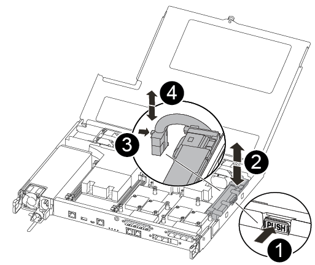

= Fase 1: Rimuovere il modulo controller
:allow-uri-read: 

Per sostituire l'hardware del modulo controller, è necessario rimuovere il controller guasto, spostare i componenti FRU nel modulo controller sostitutivo, installare il modulo controller sostitutivo nel telaio e avviare il sistema in modalità manutenzione.

== Fase 1: Rimuovere il modulo controller

È necessario rimuovere il modulo controller dallo chassis quando si sostituisce un componente all'interno del modulo controller.

Assicurarsi di etichettare i cavi in modo da conoscerne la provenienza.

Per sostituire un modulo controller, fare riferimento al seguente video o alla tabella:

.Animazione - sostituire un modulo controller
video::ab0ebe6b-e891-489c-aab4-ac5b015c8f01[panopto]
. Se non si è già collegati a terra, mettere a terra l'utente.
. Scollegare gli alimentatori del modulo controller dalla fonte di alimentazione.
. Rilasciare i fermi dei cavi di alimentazione, quindi scollegare i cavi dagli alimentatori.
. Inserire l'indice nel meccanismo di blocco su entrambi i lati del modulo controller, premere la leva con il pollice ed estrarre delicatamente il controller dal telaio.
+

NOTE: In caso di difficoltà nella rimozione del modulo controller, posizionare le dita di riferimento attraverso i fori all'interno (incrociando le braccia).

+
image::../media/drw_a250_pcm_remove_install.png[Apertura del meccanismo di chiusura]

+
[cols="1,3"]
|===

 a| 
image:../media/legend_icon_01.png["Numero di didascalia 1"]
| Leva 

 a| 
image:../media/legend_icon_02.png["Numero di didascalia 2"]
 a| 
Meccanismo di blocco

|===
. Con entrambe le mani, afferrare i lati del modulo controller ed estrarlo delicatamente dallo chassis e posizionare il modulo su una superficie piana e stabile.
. Ruotare la vite a testa zigrinata sulla parte anteriore del modulo controller in senso antiorario e aprire il coperchio del modulo controller.
+
image::../media/drw_a250_open_controller_module_cover.png[Apertura del coperchio del modulo controller]

+
[cols="1,3"]
|===

 a| 
image:../media/legend_icon_01.png["Numero di didascalia 1"]
| Vite a testa zigrinata 

 a| 
image:../media/legend_icon_02.png["Numero di didascalia 2"]
 a| 
Coperchio del modulo controller.

|===
. Estrarre il coperchio del condotto dell'aria.
+
image::../media/drw_a250_remove_airduct_cover.png[Sollevare il coperchio del condotto dell'aria]

== Fase 2: Spostare l'alimentatore

Quando si sostituisce un modulo controller, è necessario spostare l'alimentatore dal modulo controller guasto al modulo controller sostitutivo.

. Scollegare l'alimentatore.
. Aprire il fermo del cavo di alimentazione, quindi scollegare il cavo di alimentazione dall'alimentatore.
. Scollegare il cavo di alimentazione dalla fonte di alimentazione.
. Ruotare la maniglia della camma in modo che possa essere utilizzata per estrarre l'alimentatore dal modulo controller premendo la linguetta di bloccaggio.
+

CAUTION: Non esercitare una forza eccessiva quando si fa scorrere il modulo controller nel telaio per evitare di danneggiare i connettori.

+
L'alimentazione è in corto. Utilizzare sempre due mani per sostenerlo durante la rimozione dal modulo controller in modo che non si sposti improvvisamente dal modulo controller e non causi lesioni.

+
image::../media/drw_a250_replace_psu.png[Rimozione dell'alimentatore]

+
[cols="1,3"]
|===

 a| 
image:../media/legend_icon_01.png["Numero di didascalia 1"]
| Linguetta blu di bloccaggio dell'alimentatore 

 a| 
image:../media/legend_icon_02.png["Numero di didascalia 2"]
 a| 
Alimentatore

|===
. Spostare l'alimentatore sul nuovo modulo controller, quindi installarlo.
. Con entrambe le mani, sostenere e allineare i bordi dell'alimentatore con l'apertura nel modulo controller, quindi spingere delicatamente l'alimentatore nel modulo controller fino a quando la linguetta di blocco non scatta in posizione.
+
Gli alimentatori si innestano correttamente solo con il connettore interno e si bloccano in un modo.

+

CAUTION: Per evitare di danneggiare il connettore interno, non esercitare una forza eccessiva quando si inserisce l'alimentatore nel sistema.

== Fase 3: Spostare le ventole

Quando si sostituisce un modulo controller guasto, è necessario spostare le ventole dal modulo controller danneggiato al modulo sostitutivo.

. Rimuovere il modulo della ventola pizzicando il lato del modulo della ventola, quindi sollevandolo per estrarlo dal modulo del controller.
+
image::../media/drw_a250_replace_fan.png[Rimozione del modulo della ventola]

+
[cols="1,3"]
|===

 a| 
image:../media/legend_icon_01.png["Numero di didascalia 1"]
| Modulo della ventola 
|===
. Spostare il modulo della ventola sul modulo controller sostitutivo e allineare i bordi del modulo della ventola con l'apertura del modulo controller, quindi far scorrere il modulo della ventola verso l'interno.
. Ripetere questa procedura per i moduli ventola rimanenti.

== Fase 4: Spostare il supporto di avvio

È necessario spostare il dispositivo multimediale di avvio dal modulo controller danneggiato al modulo controller sostitutivo.

Per rimuovere la vite che tiene in posizione il supporto di avvio, è necessario un cacciavite a croce magnetico n. 1. A causa dei limiti di spazio all'interno del modulo controller, è necessario disporre anche di un magnete per trasferire la vite in modo da non perderla.

. Individuare e spostare il supporto di avvio dal modulo controller guasto al modulo controller sostitutivo.
+
Il supporto di avvio si trova sotto il coperchio del condotto dell'aria precedentemente rimosso in questa procedura.

+
image::../media/drw_a250_replace_boot_media.png[Sostituzione del supporto di avvio]

+
[cols="1,3"]
|===

 a| 
image:../media/legend_icon_01.png["Numero di didascalia 1"]
| Rimuovere la vite che fissa il supporto di avvio alla scheda madre nel modulo controller guasto. 

 a| 
image:../media/legend_icon_02.png["Numero di didascalia 2"]
 a| 
Estrarre il supporto di avvio dal modulo controller compromesso.

|===
. Utilizzando il cacciavite magnetico n. 1, rimuovere la vite dal supporto di avvio e metterla da parte in modo sicuro sul magnete.
. Sollevare delicatamente il supporto di avvio direttamente dallo zoccolo e allinearlo in posizione nel modulo controller sostitutivo.
. Utilizzando il cacciavite magnetico n. 1, inserire e serrare la vite sul supporto di avvio.
+

NOTE: Non esercitare forza durante il serraggio della vite sul supporto di avvio, poiché potrebbe rompersi.

== Fase 5: Spostamento dei DIMM

Per spostare i moduli DIMM, individuarli e spostarli dal controller compromesso al controller sostitutivo e seguire la sequenza specifica dei passaggi.

image::../media/drw_a250_dimm_replace.png[Sostituzione dei moduli DIMM]

NOTE: Installare ciascun DIMM nello stesso slot occupato nel modulo controller guasto.

. Spingere lentamente le linguette di espulsione dei moduli DIMM su entrambi i lati del modulo DIMM ed estrarre il modulo DIMM dallo slot.
+

NOTE: Tenere il modulo DIMM per i bordi per evitare di esercitare pressione sui componenti della scheda a circuiti stampati del modulo DIMM.

. Individuare lo slot DIMM corrispondente sul modulo controller sostitutivo.
. Assicurarsi che le linguette di espulsione del DIMM sullo zoccolo DIMM siano aperte, quindi inserire il DIMM correttamente nello zoccolo.
+
I DIMM sono inseriti saldamente nello zoccolo. In caso contrario, reinserire il DIMM per riallinearlo con lo zoccolo.

. Esaminare visivamente il modulo DIMM per verificare che sia allineato in modo uniforme e inserito completamente nello zoccolo.
. Ripetere questa procedura per il DIMM rimanente.

== Fase 6: Spostamento di una scheda mezzanine

Per spostare una scheda mezzanine, è necessario rimuovere il cablaggio e gli eventuali QSFP e SFP dalle porte, spostare la scheda mezzanine nel controller sostitutivo, reinstallare eventuali QSFP e SFP sulle porte e cablare le porte.

. Individuare e spostare le schede mezzanine dal modulo controller compromesso.
+
image::../media/drw_a250_replace_mezz_card.png[Rimozione della scheda mezzanine]

+
[cols="1,3"]
|===

 a| 
image:../media/legend_icon_01.png["Numero di didascalia 1"]
| Rimuovere le viti sulla parte anteriore del modulo controller. 

 a| 
image:../media/legend_icon_02.png["Numero di didascalia 2"]
 a| 
Allentare la vite nel modulo controller.

 a| 
image:../media/legend_icon_03.png["Numero di didascalia 3"]
 a| 
Spostare la scheda mezzanine.

|===
. Scollegare i cavi associati alla scheda mezzanine.
+
Assicurarsi di etichettare i cavi in modo da conoscerne la provenienza.

+
.. Rimuovere eventuali moduli SFP o QSFP presenti nella scheda mezzanine e metterli da parte.
.. Utilizzando il cacciavite magnetico n. 1, rimuovere le viti dalla parte anteriore del modulo controller guasto e dalla scheda mezzanine e metterle da parte in modo sicuro sul magnete.
.. Estrarre delicatamente la scheda mezzanine dallo zoccolo e spostarla nella stessa posizione nel controller sostitutivo.
.. Allineare delicatamente la scheda mezzanine in posizione nel controller sostitutivo.
.. Utilizzando il cacciavite magnetico n. 1, inserire e serrare le viti sulla parte anteriore del modulo controller sostitutivo e sulla scheda mezzanine.
+

NOTE: Non esercitare una forza durante il serraggio della vite sulla scheda mezzanino, poiché potrebbe rompersi.

. Ripetere questa procedura se nel modulo controller è presente un'altra scheda mezzanine.
. Inserire i moduli SFP o QSFP rimossi nella scheda mezzanine.

== Fase 7: Spostare la batteria NV

Quando si sostituisce il modulo controller, è necessario spostare la batteria NV dal modulo controller guasto al modulo controller sostitutivo.

. Individuare e spostare la batteria NVMEM dal modulo controller guasto al modulo controller sostitutivo.
+

+
[cols="1,3"]
|===

 a| 
image:../media/legend_icon_01.png["Numero di didascalia 1"]
| Premere il fermaglio sulla parte anteriore della spina della batteria. 

 a| 
image:../media/legend_icon_02.png["Numero di didascalia 2"]
 a| 
Scollegare il cavo della batteria dalla presa.

 a| 
image:../media/legend_icon_03.png["Numero di didascalia 3"]
 a| 
Afferrare la batteria e premere la linguetta blu contrassegnata CON PUSH.

 a| 
image:../media/legend_icon_04.png["Numero di didascalia 4"]
 a| 
Estrarre la batteria dal supporto e dal modulo controller.

|===
. Individuare la spina della batteria e premere il fermaglio sulla parte anteriore della spina per sganciarla dalla presa.
. Afferrare la batteria e premere la linguetta di bloccaggio blu contrassegnata CON PUSH, quindi estrarre la batteria dal supporto e dal modulo del controller.
. Individuare il supporto della batteria NV corrispondente sul modulo controller sostitutivo e allineare la batteria NV al supporto della batteria.
. Inserire la spina della batteria NV nella presa.
. Far scorrere la batteria verso il basso lungo la parete laterale in lamiera fino a quando le linguette di supporto sulla parete laterale non si agganciano agli slot della batteria e il dispositivo di chiusura della batteria si aggancia e scatta nell'apertura sulla parete laterale.
. Premere con decisione la batteria per assicurarsi che sia bloccata in posizione.

== Fase 8: Installare il modulo controller

Dopo aver spostato tutti i componenti dal modulo controller guasto al modulo controller sostitutivo, è necessario installare il modulo controller sostitutivo nel telaio e avviarlo in modalità manutenzione.

Per installare il modulo controller sostitutivo nel telaio, è possibile utilizzare le seguenti illustrazioni o i passaggi scritti.

. Se non è già stato fatto, installare il condotto dell'aria.
+
image::../media/drw_a250_install_airduct_cover.png[Installazione del condotto dell'aria]

. Chiudere il coperchio del modulo controller e serrare la vite a testa zigrinata.
+
image::../media/drw_a250_close_controller_module_cover.png[Chiusura del coperchio del modulo controller]

+
[cols="1,3"]
|===

 a| 
image:../media/legend_icon_01.png["Numero di didascalia 1"]
| Coperchio del modulo controller 

 a| 
image:../media/legend_icon_02.png["Numero di didascalia 2"]
 a| 
Vite a testa zigrinata

|===
. Allineare l'estremità del modulo controller con l'apertura dello chassis, quindi spingere delicatamente il modulo controller a metà nel sistema.
+

NOTE: Non inserire completamente il modulo controller nel telaio fino a quando non viene richiesto.

. Cablare solo le porte di gestione e console, in modo da poter accedere al sistema per eseguire le attività descritte nelle sezioni seguenti.
+

NOTE: I cavi rimanenti verranno collegati al modulo controller più avanti in questa procedura.

. Inserire il modulo controller nel telaio:
. Assicurarsi che i bracci del meccanismo di chiusura siano bloccati in posizione completamente estesa.
. Con entrambe le mani, allineare e far scorrere delicatamente il modulo controller nei bracci del meccanismo di chiusura fino a quando non si arresta.
. Posizionare le dita di riferimento attraverso i fori per le dita dall'interno del meccanismo di blocco.
. Premere i pollici verso il basso sulle linguette arancioni sulla parte superiore del meccanismo di blocco e spingere delicatamente il modulo controller oltre il fermo.
. Rilasciare i pollici dalla parte superiore dei meccanismi di blocco e continuare a spingere fino a quando i meccanismi di blocco non scattano in posizione.
+
Il modulo controller inizia ad avviarsi non appena viene inserito completamente nello chassis. Prepararsi ad interrompere il processo di avvio.

+
Il modulo controller deve essere inserito completamente e a filo con i bordi dello chassis.

