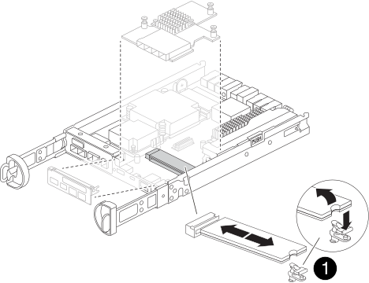

= 
:allow-uri-read: 

Il supporto di avvio si trova all'interno del modulo controller ed è accessibile rimuovendo il modulo controller dallo chassis e rimuovendo il coperchio del modulo controller dal sistema.

.Fasi
. Se non si è già collegati a terra, mettere a terra l'utente.
. Allentare il gancio e la fascetta che fissano i cavi al dispositivo di gestione dei cavi, quindi scollegare i cavi di sistema e gli SFP (se necessario) dal modulo controller, tenendo traccia del punto in cui sono stati collegati i cavi.
. Premere il dispositivo di chiusura sulla maniglia della camma fino al rilascio, aprire completamente la maniglia della camma per rilasciare il modulo controller dalla scheda intermedia, quindi estrarre il modulo controller dallo chassis con due mani.
+
image::../media/drw_2850_pcm_remove_install_IEOPS-694.svg[Rimuovere il controller]

. Capovolgere il modulo controller e posizionarlo su una superficie piana e stabile.
. Aprire il coperchio premendo i pulsanti blu sui lati del modulo controller per rilasciare il coperchio, quindi ruotare il coperchio verso l'alto e verso l'esterno del modulo controller.
+
image::../media/drw_2850_open_controller_module_cover_IEOPS-695.svg[Aprire il controller]

+
[cols="1,2"]
|===

 a| 
image::../media/icon_round_1.png[Numero di didascalia 1]
 a| 
Pulsante di rilascio del coperchio del modulo controller

|===
. Individuare il supporto di avvio nel modulo controller, situato sotto la scheda mezzanine e seguire le istruzioni per sostituirlo.
+

+
[cols="1,2"]
|===

 a| 
image::../media/icon_round_1.png[Numero di didascalia 1]
 a| 
Linguetta di blocco dei supporti di avvio

|===
. Rimuovere la scheda mezzanine utilizzando la seguente illustrazione o la mappa FRU sul modulo controller:
+
.. Rimuovere la piastra io facendola scorrere verso l'esterno dal modulo controller.
.. Allentare le viti a testa zigrinata sulla scheda mezzanino.
+

NOTE: È possibile allentare le viti a testa zigrinata con le dita o con un cacciavite. Se si utilizzano le dita, potrebbe essere necessario ruotare la batteria NV verso l'alto per un migliore acquisto con le dita sulla vite a testa zigrinata accanto ad essa.

.. Sollevare la scheda mezzanine.

. Sostituire il supporto di avvio:
+
.. Premere il pulsante blu sull'alloggiamento del supporto di avvio per rilasciare il supporto di avvio dall'alloggiamento, ruotare il supporto di avvio verso l'alto, quindi estrarlo delicatamente dalla presa del supporto di avvio.
+

NOTE: Non attorcigliare o tirare il supporto di avvio verso l'alto, in quanto potrebbe danneggiare la presa o il supporto di avvio.

.. Allineare i bordi del supporto di avvio sostitutivo con lo zoccolo del supporto di avvio, quindi spingerlo delicatamente nello zoccolo.
Controllare il supporto di avvio per assicurarsi che sia inserito correttamente e completamente nella presa e, se necessario, rimuovere il supporto di avvio e reinserirlo nella presa.
.. Premere il pulsante di blocco blu, ruotare il supporto di avvio completamente verso il basso, quindi rilasciare il pulsante di blocco per bloccare il supporto di avvio in posizione.

. Reinstallare la scheda mezzanine:
+
.. Allineare lo zoccolo della scheda madre allo zoccolo della scheda mezzanine, quindi inserire delicatamente la scheda nello zoccolo.
.. Serrare le tre viti a testa zigrinata sulla scheda mezzanino.
.. Rimontare la piastra io.

. Reinstallare il coperchio del modulo controller e bloccarlo in posizione.
. Installare il modulo controller:
+
.. Allineare l'estremità del modulo controller con l'apertura nello chassis, quindi spingere delicatamente il modulo controller fino a metà nel sistema.
.. Ricollegare il controller, spingere con decisione la maniglia della camma per completare l'inserimento del modulo del controller, spingere la maniglia della camma in posizione chiusa e quindi stringere la vite a testa zigrinata.
+
Il controller inizia l'avvio e si arresta al prompt LOADER.

