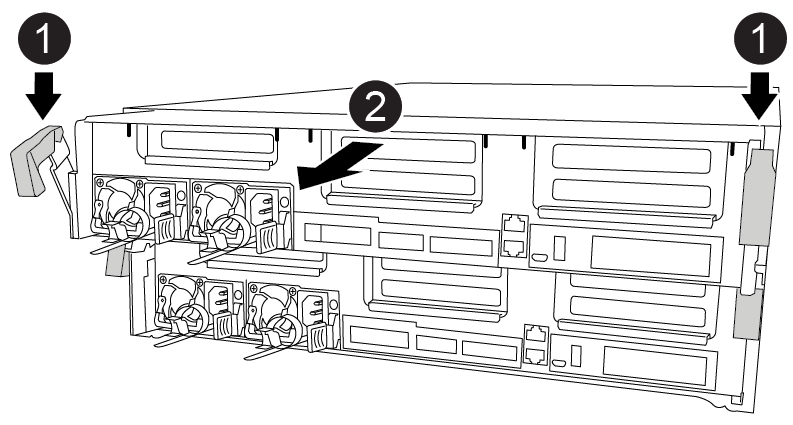
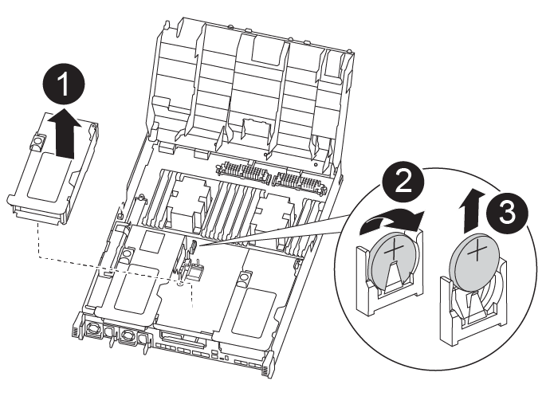

= Fase 1: Spegnere il controller compromesso
:allow-uri-read: 

Si sostituisce la batteria dell'orologio in tempo reale (RTC) nel modulo controller in modo che i servizi e le applicazioni del sistema che dipendono dalla sincronizzazione dell'ora accurata continuino a funzionare.

* È possibile utilizzare questa procedura con tutte le versioni di ONTAP supportate dal sistema
* Tutti gli altri componenti del sistema devono funzionare correttamente; in caso contrario, contattare il supporto tecnico.

== Fase 1: Spegnere il controller compromesso

È possibile arrestare o sostituire il controller compromesso utilizzando procedure diverse, a seconda della configurazione hardware del sistema di storage.

[role="tabbed-block"]
====
.Opzione 1: La maggior parte delle configurazioni
--
Per spegnere il controller compromesso, è necessario determinare lo stato del controller e, se necessario, assumere il controllo del controller in modo che il controller integro continui a servire i dati provenienti dallo storage del controller compromesso.

.A proposito di questa attività
* Se si utilizza NetApp Storage Encryption, è necessario reimpostare il MSID seguendo le istruzioni riportate in link:https://docs.netapp.com/us-en/ontap/encryption-at-rest/return-seds-unprotected-mode-task.html["Ripristino dei SED in modalità non protetta"].
* Se si dispone di un sistema SAN, è necessario controllare i messaggi di evento  `cluster kernel-service show`) Per blade SCSI del controller deteriorati. Il `cluster kernel-service show` command visualizza il nome del nodo, lo stato del quorum di quel nodo, lo stato di disponibilità di quel nodo e lo stato operativo di quel nodo.
+
Ogni processo SCSI-blade deve essere in quorum con gli altri nodi del cluster. Eventuali problemi devono essere risolti prima di procedere con la sostituzione.

* Se si dispone di un cluster con più di due nodi, questo deve trovarsi in quorum. Se il cluster non è in quorum o un controller integro mostra false per idoneità e salute, è necessario correggere il problema prima di spegnere il controller compromesso; vedere link:https://docs.netapp.com/us-en/ontap/system-admin/synchronize-node-cluster-task.html?q=Quorum["Sincronizzare un nodo con il cluster"^].

.Fasi
. Se AutoSupport è attivato, eliminare la creazione automatica del caso richiamando un messaggio AutoSupport: `system node autosupport invoke -node * -type all -message MAINT=number_of_hours_downh`
+
Il seguente messaggio AutoSupport elimina la creazione automatica del caso per due ore: `cluster1:> system node autosupport invoke -node * -type all -message MAINT=2h`

. Disattivare il giveback automatico dalla console del controller integro: `storage failover modify –node local -auto-giveback false`
+

NOTE: Quando viene visualizzato _Vuoi disattivare il giveback automatico?_, inserisci `y`.

. Portare la centralina danneggiata al prompt DEL CARICATORE:
+
[cols="1,2"]
|===
| Se il controller non utilizzato visualizza... | Quindi... 

 a| 
Il prompt DEL CARICATORE
 a| 
Passare alla fase successiva.

 a| 
In attesa di un giveback...
 a| 
Premere Ctrl-C, quindi rispondere `y` quando richiesto.

 a| 
Prompt di sistema o prompt della password
 a| 
Assumere il controllo o arrestare il controller compromesso dal controller integro: `storage failover takeover -ofnode _impaired_node_name_`

Quando il controller non utilizzato visualizza Waiting for giveback... (in attesa di giveback...), premere Ctrl-C e rispondere `y`.

|===

--
.Opzione 2: Controller in un MetroCluster a due nodi
--
Per spegnere il controller compromesso, è necessario determinare lo stato del controller e, se necessario, sostituirlo in modo che il controller integro continui a servire i dati provenienti dallo storage del controller compromesso.

.A proposito di questa attività
* Se si utilizza NetApp Storage Encryption, è necessario reimpostare il MSID seguendo le istruzioni riportate nella sezione "Restituisci un'unità FIPS o SED in modalità non protetta" di link:https://docs.netapp.com/us-en/ontap/encryption-at-rest/return-seds-unprotected-mode-task.html["Panoramica di NetApp Encryption con CLI"^].
* Al termine di questa procedura, è necessario lasciare accesi gli alimentatori per alimentare il controller integro.

.Fasi
. Controllare lo stato MetroCluster per determinare se il controller compromesso è passato automaticamente al controller integro: `metrocluster show`
. A seconda che si sia verificato uno switchover automatico, procedere come indicato nella seguente tabella:
+
[cols="1,2"]
|===
| Se il controller è compromesso... | Quindi... 

 a| 
Si è attivata automaticamente
 a| 
Passare alla fase successiva.

 a| 
Non si è attivato automaticamente
 a| 
Eseguire un'operazione di switchover pianificata dal controller integro: `metrocluster switchover`

 a| 
Non è stato attivato automaticamente, si è tentato di eseguire lo switchover con `metrocluster switchover` e lo switchover è stato vetoed
 a| 
Esaminare i messaggi di veto e, se possibile, risolvere il problema e riprovare. Se non si riesce a risolvere il problema, contattare il supporto tecnico.

|===
. Risincronizzare gli aggregati di dati eseguendo `metrocluster heal -phase aggregates` dal cluster esistente.
+
[listing]
----
controller_A_1::> metrocluster heal -phase aggregates
[Job 130] Job succeeded: Heal Aggregates is successful.
----
+
Se la riparazione è vetoed, si ha la possibilità di riemettere il `metrocluster heal` con il `-override-vetoes` parametro. Se si utilizza questo parametro opzionale, il sistema sovrascrive qualsiasi veto soft che impedisca l'operazione di riparazione.

. Verificare che l'operazione sia stata completata utilizzando il comando MetroCluster Operation show.
+
[listing]
----
controller_A_1::> metrocluster operation show
    Operation: heal-aggregates
      State: successful
Start Time: 7/25/2016 18:45:55
   End Time: 7/25/2016 18:45:56
     Errors: -
----
. Controllare lo stato degli aggregati utilizzando `storage aggregate show` comando.
+
[listing]
----
controller_A_1::> storage aggregate show
Aggregate     Size Available Used% State   #Vols  Nodes            RAID Status
--------- -------- --------- ----- ------- ------ ---------------- ------------
...
aggr_b2    227.1GB   227.1GB    0% online       0 mcc1-a2          raid_dp, mirrored, normal...
----
. Riparare gli aggregati root utilizzando `metrocluster heal -phase root-aggregates` comando.
+
[listing]
----
mcc1A::> metrocluster heal -phase root-aggregates
[Job 137] Job succeeded: Heal Root Aggregates is successful
----
+
Se la riparazione è vetoed, si ha la possibilità di riemettere il `metrocluster heal` comando con il parametro -override-vetoes. Se si utilizza questo parametro opzionale, il sistema sovrascrive qualsiasi veto soft che impedisca l'operazione di riparazione.

. Verificare che l'operazione di riparazione sia completa utilizzando `metrocluster operation show` sul cluster di destinazione:
+
[listing]
----

mcc1A::> metrocluster operation show
  Operation: heal-root-aggregates
      State: successful
 Start Time: 7/29/2016 20:54:41
   End Time: 7/29/2016 20:54:42
     Errors: -
----
. Sul modulo controller guasto, scollegare gli alimentatori.

--
====

== Fase 2: Rimuovere il modulo controller

Per accedere ai componenti all'interno del modulo controller, è necessario rimuovere il modulo controller dallo chassis.

. Se non si è già collegati a terra, mettere a terra l'utente.
. Rilasciare i fermi dei cavi di alimentazione, quindi scollegare i cavi dagli alimentatori.
. Allentare il gancio e la fascetta che fissano i cavi al dispositivo di gestione dei cavi, quindi scollegare i cavi di sistema e gli SFP (se necessario) dal modulo controller, tenendo traccia del punto in cui sono stati collegati i cavi.
+
Lasciare i cavi nel dispositivo di gestione dei cavi in modo che quando si reinstalla il dispositivo di gestione dei cavi, i cavi siano organizzati.

. Rimuovere il dispositivo di gestione dei cavi dal modulo controller e metterlo da parte.
. Premere verso il basso entrambi i fermi di bloccaggio, quindi ruotare entrambi i fermi verso il basso contemporaneamente.
+
Il modulo controller si sposta leggermente fuori dallo chassis.

+

+
[cols="10,90"]
|===

 a| 
image:../media/legend_icon_01.png["Numero di didascalia 1"]
 a| 
Fermi di bloccaggio

 a| 
image:../media/legend_icon_02.png["Numero di didascalia 2"]
 a| 
Il controller si sposta leggermente fuori dallo chassis

|===
. Estrarre il modulo controller dal telaio.
+
Assicurarsi di sostenere la parte inferiore del modulo controller mentre lo si sposta fuori dallo chassis.

. Posizionare il modulo controller su una superficie piana e stabile.

== Fase 3: Sostituire la batteria RTC

È necessario individuare la batteria RTC all'interno del modulo del controller, quindi seguire la sequenza specifica di passaggi. Consultare la mappa FRU all'interno del modulo controller per individuare la posizione della batteria RTC.

Per sostituire la batteria RTC, è possibile utilizzare la seguente animazione, illustrazione o procedura scritta.

.Animazione - sostituire la batteria RTC
video::80fe7a9b-de6f-46e0-a18b-aadb0157263d[panopto]

[cols="10,90"]
|===

 a| 
image:../media/legend_icon_01.png["Numero di didascalia 1"]
 a| 
Montante centrale

 a| 
image:../media/legend_icon_02.png["Numero di didascalia 2"]
 a| 
Rimuovere la batteria RTC

 a| 
image:../media/legend_icon_03.png["Numero di didascalia 3"]
 a| 
Batteria RTC del sedile

|===
. Se non si è già collegati a terra, mettere a terra l'utente.
. Aprire il condotto dell'aria:
+
.. Premere le linguette di bloccaggio sui lati del condotto dell'aria verso il centro del modulo controller.
.. Far scorrere il condotto dell'aria verso la parte posteriore del modulo controller, quindi ruotarlo verso l'alto fino a portarlo in posizione completamente aperta.

. Individuare, rimuovere e sostituire la batteria RTC:
+
.. Utilizzando la mappa FRU, individuare la batteria RTC sul modulo controller.
.. Estrarre delicatamente la batteria dal supporto, ruotarla verso l'esterno, quindi estrarla dal supporto.
+

NOTE: Prendere nota della polarità della batteria mentre viene rimossa dal supporto. La batteria è contrassegnata con un segno più e deve essere posizionata correttamente nel supporto. Un segno più vicino al supporto indica come posizionare la batteria.

.. Rimuovere la batteria di ricambio dalla confezione antistatica per la spedizione.
.. Prendere nota della polarità della batteria RTC, quindi inserirla nel supporto inclinandola e spingendola verso il basso.

. Controllare visivamente che la batteria sia completamente installata nel supporto e che la polarità sia corretta.
. Chiudere il condotto dell'aria.

== Fase 4: Reinstallare il modulo controller e impostare la data e l'ora dopo la sostituzione della batteria RTC

Dopo aver sostituito un componente all'interno del modulo controller, è necessario reinstallare il modulo controller nello chassis del sistema, reimpostare l'ora e la data sul controller, quindi avviarlo.

Per installare il modulo controller nel telaio, è possibile utilizzare l'animazione, l'illustrazione o i passaggi scritti riportati di seguito.

.Animazione - Installazione del modulo controller
video::0310fe80-b129-4685-8fef-ab19010e720a[panopto]
image::../media/drw_A400_Install_controller_source.png[Drw A400 installare la sorgente del controller]

[cols="10,90"]
|===

 a| 
image:../media/legend_icon_01.png["Numero di didascalia 1"]
 a| 
Modulo controller

 a| 
image:../media/legend_icon_02.png["Numero di didascalia 2"]
 a| 
Dispositivi di bloccaggio della centralina

|===
. Se non è già stato fatto, chiudere il condotto dell'aria o il coperchio del modulo controller.
. Allineare l'estremità del modulo controller con l'apertura dello chassis, quindi spingere delicatamente il modulo controller a metà nel sistema.
+
Non inserire completamente il modulo controller nel telaio fino a quando non viene richiesto.

. Ricable il sistema, come necessario.
+
Se sono stati rimossi i convertitori multimediali (QSFP o SFP), ricordarsi di reinstallarli se si utilizzano cavi in fibra ottica.

. Se gli alimentatori sono stati scollegati, ricollegarli e reinstallare i fermi dei cavi di alimentazione.
. Completare l'installazione del modulo controller:
+
.. Utilizzando i fermi di bloccaggio, spingere con decisione il modulo controller nel telaio fino a quando non raggiunge la scheda intermedia e non è completamente inserito.
+
I fermi di bloccaggio si sollevano quando il modulo controller è completamente inserito.

+

NOTE: Non esercitare una forza eccessiva quando si fa scorrere il modulo controller nel telaio per evitare di danneggiare i connettori.

+
Il modulo controller inizia ad avviarsi non appena viene inserito completamente nello chassis. Prepararsi ad interrompere il processo di avvio.

.. Inserire completamente il modulo controller nel telaio ruotando i fermi di bloccaggio verso l'alto, inclinandoli in modo da liberare i perni di bloccaggio, spingere delicatamente il controller fino in fondo, quindi abbassare i fermi di bloccaggio in posizione di blocco.
.. Se non è già stato fatto, reinstallare il dispositivo di gestione dei cavi.
.. Interrompere il normale processo di avvio e avviare IL CARICATORE premendo `Ctrl-C`.
+

NOTE: Se il sistema si arresta nel menu di avvio, selezionare l'opzione per avviare IL CARICATORE.

. Ripristinare l'ora e la data sul controller:
+
.. Controllare la data e l'ora del controller integro con `show date` comando.
.. Al prompt DEL CARICATORE sul controller di destinazione, controllare l'ora e la data.
.. Se necessario, modificare la data con `set date mm/dd/yyyy` comando.
.. Se necessario, impostare l'ora, in GMT, utilizzando `set time hh:mm:ss` comando.
.. Confermare la data e l'ora sul controller di destinazione.

. Al prompt DEL CARICATORE, immettere `bye` Reinizializzare le schede PCIe e gli altri componenti e lasciare riavviare il controller.
. Riportare il controller al funzionamento normale restituendo lo storage: `storage failover giveback -ofnode _impaired_node_name_`
. Se il giveback automatico è stato disattivato, riabilitarlo: `storage failover modify -node local -auto-giveback true`

== Fase 5: Switch back aggregates in una configurazione MetroCluster a due nodi

Una volta completata la sostituzione dell'unità FRU in una configurazione MetroCluster a due nodi, è possibile eseguire l'operazione di switchback dell'unità MetroCluster. In questo modo, la configurazione torna al suo normale stato operativo, con le macchine virtuali dello storage di origine sincronizzata (SVM) sul sito precedentemente compromesso ora attive e che forniscono i dati dai pool di dischi locali.

Questa attività si applica solo alle configurazioni MetroCluster a due nodi.

.Fasi
. Verificare che tutti i nodi si trovino in `enabled` stato: `metrocluster node show`
+
[listing]
----
cluster_B::>  metrocluster node show

DR                           Configuration  DR
Group Cluster Node           State          Mirroring Mode
----- ------- -------------- -------------- --------- --------------------
1     cluster_A
              controller_A_1 configured     enabled   heal roots completed
      cluster_B
              controller_B_1 configured     enabled   waiting for switchback recovery
2 entries were displayed.
----
. Verificare che la risincronizzazione sia completa su tutte le SVM: `metrocluster vserver show`
. Verificare che tutte le migrazioni LIF automatiche eseguite dalle operazioni di riparazione siano state completate correttamente: `metrocluster check lif show`
. Eseguire lo switchback utilizzando `metrocluster switchback` comando da qualsiasi nodo del cluster esistente.
. Verificare che l'operazione di switchback sia stata completata: `metrocluster show`
+
L'operazione di switchback è ancora in esecuzione quando un cluster si trova in `waiting-for-switchback` stato:

+
[listing]
----
cluster_B::> metrocluster show
Cluster              Configuration State    Mode
--------------------	------------------- 	---------
 Local: cluster_B configured       	switchover
Remote: cluster_A configured       	waiting-for-switchback
----
+
L'operazione di switchback è completa quando i cluster si trovano in `normal` stato:

+
[listing]
----
cluster_B::> metrocluster show
Cluster              Configuration State    Mode
--------------------	------------------- 	---------
 Local: cluster_B configured      		normal
Remote: cluster_A configured      		normal
----
+
Se il completamento di uno switchback richiede molto tempo, è possibile verificare lo stato delle linee di base in corso utilizzando `metrocluster config-replication resync-status show` comando.

. Ripristinare le configurazioni SnapMirror o SnapVault.

== Fase 6: Restituire la parte guasta a NetApp

Restituire la parte guasta a NetApp, come descritto nelle istruzioni RMA fornite con il kit. Vedere https://mysupport.netapp.com/site/info/rma["Parti restituita  sostituzioni"] per ulteriori informazioni.
