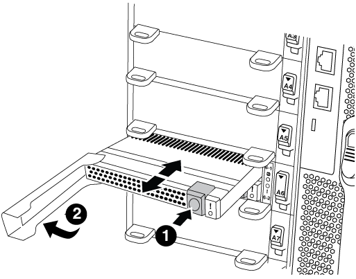

= Fase 1: Spegnere il controller compromesso
:allow-uri-read: 

È necessario sostituire il modulo di caching nel modulo controller quando il sistema registra un singolo messaggio ASUP (AutoSupport) che indica che il modulo è offline; in caso contrario, le prestazioni si sono degradate. Se AutoSupport non è attivato, è possibile individuare il modulo di caching guasto tramite il LED di guasto situato nella parte anteriore del modulo. È inoltre possibile aggiungere o sostituire il modulo core dump X9170A da 1 TB, necessario se si installano shelf di dischi NS224 in un sistema AFF A700.

.Prima di iniziare
* È necessario sostituire il componente guasto con un componente FRU sostitutivo ricevuto dal provider.
* Per istruzioni sullo scambio a caldo del modulo di caching, vedere link:../fas9000/caching-module-hot-swap.html["Sostituire a caldo un modulo di caching"].
* Durante la rimozione, la sostituzione o l'aggiunta di moduli di caching o core dump, il nodo di destinazione deve essere arrestato nel CARICATORE.
* AFF A700 supporta il modulo di dump core da 1 TB, X9170A, necessario se si aggiungono shelf di dischi NS224.
* I moduli core dump possono essere installati negli slot 6-1 e 6-2. Si consiglia di installare il modulo nello slot 6-1.
* Il modulo core dump X9170A non è sostituibile a caldo.

== Fase 1: Spegnere il controller compromesso

È possibile arrestare o sostituire il controller compromesso utilizzando procedure diverse, a seconda della configurazione hardware del sistema di storage.

[role="tabbed-block"]
====
.Opzione 1: La maggior parte delle configurazioni
--
Per spegnere il controller compromesso, è necessario determinare lo stato del controller e, se necessario, assumere il controllo del controller in modo che il controller integro continui a servire i dati provenienti dallo storage del controller compromesso.

.A proposito di questa attività
* Se si dispone di un sistema SAN, è necessario controllare i messaggi di evento  `cluster kernel-service show`) Per blade SCSI del controller deteriorati. Il `cluster kernel-service show` command visualizza il nome del nodo, lo stato del quorum di quel nodo, lo stato di disponibilità di quel nodo e lo stato operativo di quel nodo.
+
Ogni processo SCSI-blade deve essere in quorum con gli altri nodi del cluster. Eventuali problemi devono essere risolti prima di procedere con la sostituzione.

* Se si dispone di un cluster con più di due nodi, questo deve trovarsi in quorum. Se il cluster non è in quorum o un controller integro mostra false per idoneità e salute, è necessario correggere il problema prima di spegnere il controller compromesso; vedere link:https://docs.netapp.com/us-en/ontap/system-admin/synchronize-node-cluster-task.html?q=Quorum["Sincronizzare un nodo con il cluster"^].

.Fasi
. Se AutoSupport è attivato, eliminare la creazione automatica del caso richiamando un messaggio AutoSupport: `system node autosupport invoke -node * -type all -message MAINT=number_of_hours_downh`
+
Il seguente messaggio AutoSupport elimina la creazione automatica del caso per due ore: `cluster1:> system node autosupport invoke -node * -type all -message MAINT=2h`

. Disattivare il giveback automatico dalla console del controller integro: `storage failover modify –node local -auto-giveback false`
+

NOTE: Quando viene visualizzato _Vuoi disattivare il giveback automatico?_, inserisci `y`.

. Portare la centralina danneggiata al prompt DEL CARICATORE:
+
[cols="1,2"]
|===
| Se il controller non utilizzato visualizza... | Quindi... 

 a| 
Il prompt DEL CARICATORE
 a| 
Passare alla fase successiva.

 a| 
In attesa di un giveback...
 a| 
Premere Ctrl-C, quindi rispondere `y` quando richiesto.

 a| 
Prompt di sistema o prompt della password
 a| 
Assumere il controllo o arrestare il controller compromesso dal controller integro: `storage failover takeover -ofnode _impaired_node_name_`

Quando il controller non utilizzato visualizza Waiting for giveback... (in attesa di giveback...), premere Ctrl-C e rispondere `y`.

|===

--
.Opzione 2: Controller in un MetroCluster a due nodi
--
Per spegnere il controller compromesso, è necessario determinare lo stato del controller e, se necessario, sostituirlo in modo che il controller integro continui a servire i dati provenienti dallo storage del controller compromesso.

.A proposito di questa attività
* Al termine di questa procedura, è necessario lasciare accesi gli alimentatori per alimentare il controller integro.

.Fasi
. Controllare lo stato MetroCluster per determinare se il controller compromesso è passato automaticamente al controller integro: `metrocluster show`
. A seconda che si sia verificato uno switchover automatico, procedere come indicato nella seguente tabella:
+
[cols="1,2"]
|===
| Se il controller è compromesso... | Quindi... 

 a| 
Si è attivata automaticamente
 a| 
Passare alla fase successiva.

 a| 
Non si è attivato automaticamente
 a| 
Eseguire un'operazione di switchover pianificata dal controller integro: `metrocluster switchover`

 a| 
Non è stato attivato automaticamente, si è tentato di eseguire lo switchover con `metrocluster switchover` e lo switchover è stato vetoed
 a| 
Esaminare i messaggi di veto e, se possibile, risolvere il problema e riprovare. Se non si riesce a risolvere il problema, contattare il supporto tecnico.

|===
. Risincronizzare gli aggregati di dati eseguendo `metrocluster heal -phase aggregates` dal cluster esistente.
+
[listing]
----
controller_A_1::> metrocluster heal -phase aggregates
[Job 130] Job succeeded: Heal Aggregates is successful.
----
+
Se la riparazione è vetoed, si ha la possibilità di riemettere il `metrocluster heal` con il `-override-vetoes` parametro. Se si utilizza questo parametro opzionale, il sistema sovrascrive qualsiasi veto soft che impedisca l'operazione di riparazione.

. Verificare che l'operazione sia stata completata utilizzando il comando MetroCluster Operation show.
+
[listing]
----
controller_A_1::> metrocluster operation show
    Operation: heal-aggregates
      State: successful
Start Time: 7/25/2016 18:45:55
   End Time: 7/25/2016 18:45:56
     Errors: -
----
. Controllare lo stato degli aggregati utilizzando `storage aggregate show` comando.
+
[listing]
----
controller_A_1::> storage aggregate show
Aggregate     Size Available Used% State   #Vols  Nodes            RAID Status
--------- -------- --------- ----- ------- ------ ---------------- ------------
...
aggr_b2    227.1GB   227.1GB    0% online       0 mcc1-a2          raid_dp, mirrored, normal...
----
. Riparare gli aggregati root utilizzando `metrocluster heal -phase root-aggregates` comando.
+
[listing]
----
mcc1A::> metrocluster heal -phase root-aggregates
[Job 137] Job succeeded: Heal Root Aggregates is successful
----
+
Se la riparazione è vetoed, si ha la possibilità di riemettere il `metrocluster heal` comando con il parametro -override-vetoes. Se si utilizza questo parametro opzionale, il sistema sovrascrive qualsiasi veto soft che impedisca l'operazione di riparazione.

. Verificare che l'operazione di riparazione sia completa utilizzando `metrocluster operation show` sul cluster di destinazione:
+
[listing]
----

mcc1A::> metrocluster operation show
  Operation: heal-root-aggregates
      State: successful
 Start Time: 7/29/2016 20:54:41
   End Time: 7/29/2016 20:54:42
     Errors: -
----
. Sul modulo controller guasto, scollegare gli alimentatori.

--
====

== Fase 2: Sostituire o aggiungere un modulo di caching

I moduli NVMe SSD Flash cache (FlashCache o moduli di caching) sono moduli separati. Si trovano nella parte anteriore del modulo NVRAM. Per sostituire o aggiungere un modulo di caching, posizionarlo sul retro del sistema sullo slot 6, quindi seguire la sequenza specifica di passaggi per sostituirlo.

.Prima di iniziare
Il sistema storage deve soddisfare determinati criteri a seconda della situazione:

* Deve disporre del sistema operativo appropriato per il modulo di caching che si sta installando.
* Deve supportare la capacità di caching.
* Il nodo di destinazione deve trovarsi al prompt DEL CARICATORE prima di aggiungere o sostituire il modulo di caching.
* Il modulo di caching sostitutivo deve avere la stessa capacità del modulo di caching guasto, ma può provenire da un altro vendor supportato.
* Tutti gli altri componenti del sistema di storage devono funzionare correttamente; in caso contrario, contattare il supporto tecnico.

.Fasi
. Se non si è già collegati a terra, mettere a terra l'utente.
. Individuare il modulo di caching guasto, nello slot 6, tramite il LED di attenzione acceso di colore ambra sulla parte anteriore del modulo di caching.
. Rimuovere il modulo di caching:
+

NOTE: Se si aggiunge un altro modulo di caching al sistema, rimuovere il modulo vuoto e passare alla fase successiva.

+

+
|===

| image:../media/legend_icon_01.png["Numero di didascalia 1"] | Pulsante di rilascio arancione. 

 a| 
image:../media/legend_icon_02.png["Numero di didascalia 2"]
| Handle CAM del modulo di caching. 
|===
+
.. Premere il pulsante di rilascio arancione sulla parte anteriore del modulo di caching.
+

NOTE: Non utilizzare il latch i/o Cam numerato e con lettere per espellere il modulo di caching. Il latch i/o Cam numerato e con lettere espelle l'intero modulo NVRAM10 e non il modulo di caching.

.. Ruotare l'impugnatura della camma fino a quando il modulo di caching inizia a scorrere fuori dal modulo NVRAM10.
.. Tirare delicatamente la maniglia della camma verso di sé per rimuovere il modulo di caching dal modulo NVRAM10.
+
Assicurarsi di supportare il modulo di caching durante la rimozione dal modulo NVRAM10.

. Installare il modulo di caching:
+
.. Allineare i bordi del modulo di caching con l'apertura nel modulo NVRAM10.
.. Spingere delicatamente il modulo di caching nell'alloggiamento fino a quando la maniglia della camma non si aggancia.
.. Ruotare la maniglia della camma fino a bloccarla in posizione.

== Fase 3: Aggiunta o sostituzione di un modulo dump core X9170A

Il core dump della cache da 1 TB, X9170A, viene utilizzato solo nei sistemi AFF A700. Il modulo core dump non può essere sostituito a caldo. Il modulo core dump si trova generalmente nella parte anteriore del modulo NVRAM nello slot 6-1 nella parte posteriore del sistema. Per sostituire o aggiungere il modulo core dump, individuare lo slot 6-1, quindi seguire la sequenza specifica di passaggi per aggiungerlo o sostituirlo.

.Prima di iniziare
* Per aggiungere un modulo core dump, il sistema deve eseguire ONTAP 9.8 o versione successiva.
* Il modulo core dump X9170A non è sostituibile a caldo.
* Il nodo di destinazione deve trovarsi al prompt DEL CARICATORE prima di aggiungere o sostituire il modulo code dump.
* È necessario aver ricevuto due moduli di dump core X9170, uno per ciascun controller.
* Tutti gli altri componenti del sistema di storage devono funzionare correttamente; in caso contrario, contattare il supporto tecnico.

.Fasi
. Se non si è già collegati a terra, mettere a terra l'utente.
. Se si sta sostituendo un modulo di dump core guasto, individuarlo e rimuoverlo:
+

+
[cols="1,3"]
|===

| image:../media/legend_icon_01.png["Numero di didascalia 1"] | Pulsante di rilascio arancione. 

 a| 
image:../media/legend_icon_02.png["Numero di didascalia 2"]
 a| 
Core dump module Cam handle.

|===
+
.. Individuare il modulo guasto tramite il LED di attenzione ambra sulla parte anteriore del modulo.
.. Premere il pulsante di rilascio arancione sulla parte anteriore del modulo core dump.
+

NOTE: Non utilizzare il dispositivo di chiusura i/o Cam numerato e intestato per espellere il modulo core dump. Il dispositivo di chiusura i/o Cam numerato e con lettere espelle l'intero modulo NVRAM10 e non il modulo core dump.

.. Ruotare la maniglia della camma fino a quando il modulo di dump del nucleo non inizia a scorrere fuori dal modulo NVRAM10.
.. Tirare delicatamente la maniglia della camma verso di sé per rimuovere il modulo di dump core dal modulo NVRAM10 e metterlo da parte.
+
Assicurarsi di supportare il modulo core dump mentre viene rimosso dal modulo NVRAM10.

. Installare il modulo core dump:
+
.. Se si installa un nuovo modulo core dump, rimuovere il modulo vuoto dallo slot 6-1.
.. Allineare i bordi del modulo core dump con l'apertura del modulo NVRAM10.
.. Spingere delicatamente il modulo di dump del nucleo nell'alloggiamento fino a quando la maniglia della camma non si aggancia.
.. Ruotare la maniglia della camma fino a bloccarla in posizione.

== Fase 4: Riavviare il controller dopo la sostituzione della FRU

Dopo aver sostituito la FRU, è necessario riavviare il modulo controller.

.Fase
. Per avviare ONTAP dal prompt DEL CARICATORE, immettere `bye`.

== Fase 5: Switch back aggregates in una configurazione MetroCluster a due nodi

Una volta completata la sostituzione dell'unità FRU in una configurazione MetroCluster a due nodi, è possibile eseguire l'operazione di switchback dell'unità MetroCluster. In questo modo, la configurazione torna al suo normale stato operativo, con le macchine virtuali dello storage di origine sincronizzata (SVM) sul sito precedentemente compromesso ora attive e che forniscono i dati dai pool di dischi locali.

Questa attività si applica solo alle configurazioni MetroCluster a due nodi.

.Fasi
. Verificare che tutti i nodi si trovino in `enabled` stato: `metrocluster node show`
+
[listing]
----
cluster_B::>  metrocluster node show

DR                           Configuration  DR
Group Cluster Node           State          Mirroring Mode
----- ------- -------------- -------------- --------- --------------------
1     cluster_A
              controller_A_1 configured     enabled   heal roots completed
      cluster_B
              controller_B_1 configured     enabled   waiting for switchback recovery
2 entries were displayed.
----
. Verificare che la risincronizzazione sia completa su tutte le SVM: `metrocluster vserver show`
. Verificare che tutte le migrazioni LIF automatiche eseguite dalle operazioni di riparazione siano state completate correttamente: `metrocluster check lif show`
. Eseguire lo switchback utilizzando `metrocluster switchback` comando da qualsiasi nodo del cluster esistente.
. Verificare che l'operazione di switchback sia stata completata: `metrocluster show`
+
L'operazione di switchback è ancora in esecuzione quando un cluster si trova in `waiting-for-switchback` stato:

+
[listing]
----
cluster_B::> metrocluster show
Cluster              Configuration State    Mode
--------------------	------------------- 	---------
 Local: cluster_B configured       	switchover
Remote: cluster_A configured       	waiting-for-switchback
----
+
L'operazione di switchback è completa quando i cluster si trovano in `normal` stato:

+
[listing]
----
cluster_B::> metrocluster show
Cluster              Configuration State    Mode
--------------------	------------------- 	---------
 Local: cluster_B configured      		normal
Remote: cluster_A configured      		normal
----
+
Se il completamento di uno switchback richiede molto tempo, è possibile verificare lo stato delle linee di base in corso utilizzando `metrocluster config-replication resync-status show` comando.

. Ripristinare le configurazioni SnapMirror o SnapVault.

== Fase 6: Restituire la parte guasta a NetApp

Restituire la parte guasta a NetApp, come descritto nelle istruzioni RMA fornite con il kit. Vedere https://mysupport.netapp.com/site/info/rma["Parti restituita  sostituzioni"] per ulteriori informazioni.
