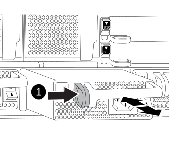

= 
:allow-uri-read: 

Lo scambio di un alimentatore comporta lo spegnimento, lo scollegamento e la rimozione del vecchio alimentatore, l'installazione, il collegamento e l'accensione dell'alimentatore sostitutivo.

Tutti gli altri componenti del sistema devono funzionare correttamente; in caso contrario, contattare il supporto tecnico.

* Gli alimentatori sono ridondanti e sostituibili a caldo. Non è necessario spegnere il controller per sostituire un alimentatore.
* Questa procedura è stata scritta per la sostituzione di un alimentatore alla volta.
+

NOTE: Si consiglia di sostituire l'alimentatore entro due minuti dalla rimozione dallo chassis. Il sistema continua a funzionare, ma ONTAP invia messaggi alla console sull'alimentatore danneggiato fino alla sostituzione dell'alimentatore.

* Il numero di alimentatori nel sistema dipende dal modello.
* Gli alimentatori sono a portata automatica.
+

IMPORTANT: Non combinare PSU con diversi indici di efficienza. Sostituire sempre come per come.

.Fasi
. Identificare l'alimentatore che si desidera sostituire, in base ai messaggi di errore della console o tramite i LED degli alimentatori.
. Se non si è già collegati a terra, mettere a terra l'utente.
. Spegnere l'alimentatore e scollegare i cavi di alimentazione:
+
.. Spegnere l'interruttore di alimentazione dell'alimentatore.
.. Aprire il fermo del cavo di alimentazione, quindi scollegare il cavo di alimentazione dall'alimentatore.
.. Scollegare il cavo di alimentazione dalla fonte di alimentazione.

. Tenere premuto il pulsante arancione sulla maniglia dell'alimentatore, quindi estrarre l'alimentatore dallo chassis.
+

CAUTION: Quando si rimuove un alimentatore, utilizzare sempre due mani per sostenerne il peso.

+

+
[cols="1,4"]
|===

 a| 
image:../media/icon_round_1.png["Numero di didascalia 1"]
 a| 
Pulsante di bloccaggio

|===
. Assicurarsi che l'interruttore on/off del nuovo alimentatore sia in posizione off.
. Con entrambe le mani, sostenere e allineare i bordi dell'alimentatore con l'apertura nello chassis del sistema, quindi spingere delicatamente l'alimentatore nello chassis fino a bloccarlo in posizione.
+
Gli alimentatori sono dotati di chiavi e possono essere installati in un solo modo.

+

NOTE: Non esercitare una forza eccessiva quando si inserisce l'alimentatore nel sistema. Il connettore potrebbe danneggiarsi.

. Ricollegare il cablaggio dell'alimentatore:
+
.. Ricollegare il cavo di alimentazione all'alimentatore e alla fonte di alimentazione.
.. Fissare il cavo di alimentazione all'alimentatore utilizzando il fermo del cavo di alimentazione.

+
Una volta ripristinata l'alimentazione, il LED di stato deve essere verde.

. Accendere il nuovo alimentatore, quindi verificare il funzionamento dei LED di attività dell'alimentatore.
+
Il LED di alimentazione verde si accende quando l'alimentatore è completamente inserito nel telaio e il LED di attenzione ambra lampeggia inizialmente, ma si spegne dopo alcuni istanti.

. Restituire la parte guasta a NetApp, come descritto nelle istruzioni RMA fornite con il kit. Vedere la https://mysupport.netapp.com/site/info/rma["Restituzione e sostituzione delle parti"^] pagina per ulteriori informazioni.

