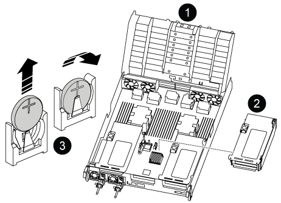

= 
:allow-uri-read: 

La procedura per la sostituzione della batteria RTC varia a seconda che il controller sia un modello originale o VER2.  Utilizzare le schede sottostanti per selezionare le istruzioni appropriate per il modello del controller in uso.

.A proposito di questa attività
La batteria si trova sotto il Riser 2 (il riser centrale) sui controller Original e vicino ai moduli DIMM sui controller VER2.

[role="tabbed-block"]
====
.Centralina originale
--
.Fasi
. Rimuovere il riser PCIe 2 (riser centrale) dal modulo controller:
+
.. Rimuovere eventuali moduli SFP o QSFP presenti nelle schede PCIe.
.. Ruotare verso l'alto e verso i moduli delle ventole il fermo di blocco del riser sul lato sinistro del riser.
+
Il riser si solleva leggermente dal modulo controller.

.. Sollevare il riser, spostarlo verso le ventole in modo che il bordo di lamiera del riser si allontani dal bordo del modulo controller, sollevare il riser ed estrarlo dal modulo controller, quindi posizionarlo su una superficie piana e stabile.
+
image::../media/drw_a800_riser_2_3_remove.png[Rimuovere il riser 2]

+
[cols="1,4"]
|===

 a| 
image:../media/icon_round_1.png["Numero di didascalia 1"]
 a| 
Condotto dell'aria

 a| 
image:../media/icon_round_2.png["Numero di didascalia 2"]
 a| 
Fermo di bloccaggio del riser 2 (montante centrale)

|===

. Individuare la batteria RTC sotto il riser 2.
+

+
[cols="1,4"]
|===

 a| 
image:../media/icon_round_1.png["Numero di didascalia 1"]
 a| 
Condotto dell'aria

 a| 
image:../media/icon_round_2.png["Numero di didascalia 2"]
 a| 
Riser 2

 a| 
image:../media/icon_round_3.png["Numero di didascalia 3"]
 a| 
Batteria e alloggiamento RTC

|===
. Estrarre delicatamente la batteria dal supporto, ruotarla verso l'esterno, quindi estrarla dal supporto.
+

NOTE: Prendere nota della polarità della batteria mentre viene rimossa dal supporto. La batteria è contrassegnata con un segno più e deve essere posizionata correttamente nel supporto. Un segno più vicino al supporto indica come posizionare la batteria.

. Rimuovere la batteria di ricambio dalla confezione antistatica per la spedizione.
. Prendere nota della polarità della batteria RTC, quindi inserirla nel supporto inclinandola e spingendola verso il basso.
. Controllare visivamente che la batteria sia completamente installata nel supporto e che la polarità sia corretta.
. Installare il riser nel modulo controller:
+
.. Allineare il bordo del riser con la parte inferiore della lamiera del modulo controller.
.. Guidare il riser lungo i pin nel modulo controller, quindi abbassare il riser nel modulo controller.
.. Ruotare il fermo di bloccaggio verso il basso e farlo scattare in posizione di blocco.
+
Una volta bloccato, il fermo di bloccaggio è a filo con la parte superiore del riser e il riser è posizionato correttamente nel modulo controller.

.. Reinserire tutti i moduli SFP rimossi dalle schede PCIe.

--
.Controller ver2
--
.Fasi
. Individuare la batteria RTC vicino ai DIMM.
+
image::../media/drw_a800_rtc_battery_replace_v2.png[Rimuovere e sostituire la batteria RTC]

+
[cols="1,4"]
|===

 a| 
image:../media/icon_round_1.png["Numero di didascalia 1"]
 a| 
Condotto dell'aria

 a| 
image:../media/icon_round_2.png["Numero di didascalia 2"]
 a| 
Batteria e alloggiamento RTC

|===
. Estrarre delicatamente la batteria dal supporto, ruotarla verso l'esterno, quindi estrarla dal supporto.
+

NOTE: Prendere nota della polarità della batteria mentre viene rimossa dal supporto. La batteria è contrassegnata con un segno più e deve essere posizionata correttamente nel supporto. Un segno più vicino al supporto indica come posizionare la batteria.

. Rimuovere la batteria di ricambio dalla confezione antistatica per la spedizione.
. Prendere nota della polarità della batteria RTC, quindi inserirla nel supporto inclinandola e spingendola verso il basso.
. Controllare visivamente che la batteria sia completamente installata nel supporto e che la polarità sia corretta.

--
====