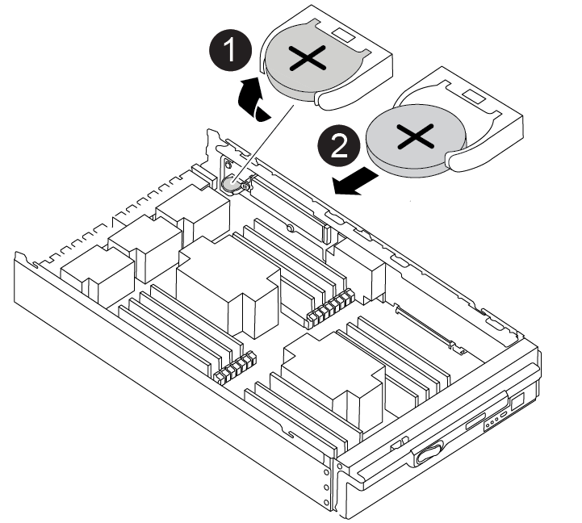

= Fase 1: Spegnere il controller compromesso
:allow-uri-read: 

Si sostituisce la batteria dell'orologio in tempo reale (RTC) nel modulo controller in modo che i servizi e le applicazioni del sistema che dipendono dalla sincronizzazione dell'ora accurata continuino a funzionare.

* È possibile utilizzare questa procedura con tutte le versioni di ONTAP supportate dal sistema
* Tutti gli altri componenti del sistema devono funzionare correttamente; in caso contrario, contattare il supporto tecnico.

== Fase 1: Spegnere il controller compromesso

Arrestare o sostituire il controller compromesso utilizzando una delle seguenti opzioni.

[role="tabbed-block"]
====
.Opzione 1: La maggior parte dei sistemi
--
Per spegnere il controller compromesso, è necessario determinare lo stato del controller e, se necessario, assumere il controllo del controller in modo che il controller integro continui a servire i dati provenienti dallo storage del controller compromesso.

.A proposito di questa attività
* Se si dispone di un sistema SAN, è necessario aver controllato i messaggi di evento  `cluster kernel-service show`) per il blade SCSI del controller danneggiato. Il `cluster kernel-service show` comando (dalla modalità avanzata precedente) visualizza il nome del nodo, link:https://docs.netapp.com/us-en/ontap/system-admin/display-nodes-cluster-task.html["stato quorum"] di quel nodo, lo stato di disponibilità di quel nodo e lo stato operativo di quel nodo.
+
Ogni processo SCSI-blade deve essere in quorum con gli altri nodi del cluster. Eventuali problemi devono essere risolti prima di procedere con la sostituzione.

* Se si dispone di un cluster con più di due nodi, questo deve trovarsi in quorum. Se il cluster non è in quorum o un controller integro mostra false per idoneità e salute, è necessario correggere il problema prima di spegnere il controller compromesso; vedere link:https://docs.netapp.com/us-en/ontap/system-admin/synchronize-node-cluster-task.html?q=Quorum["Sincronizzare un nodo con il cluster"^].

.Fasi
. Se AutoSupport è attivato, sospendere la creazione automatica dei casi richiamando un messaggio AutoSupport: `system node autosupport invoke -node * -type all -message MAINT=<# of hours>h`
+
Il seguente messaggio AutoSupport elimina la creazione automatica del caso per due ore: `cluster1:> system node autosupport invoke -node * -type all -message MAINT=2h`

. Disattivare il giveback automatico dalla console del controller integro: `storage failover modify –node local -auto-giveback false`
+

NOTE: Quando viene visualizzato _Vuoi disattivare il giveback automatico?_, inserisci `y`.

. Portare la centralina danneggiata al prompt DEL CARICATORE:
+
[cols="1,2"]
|===
| Se il controller non utilizzato visualizza... | Quindi... 

 a| 
Il prompt DEL CARICATORE
 a| 
Passare alla fase successiva.

 a| 
In attesa di un giveback...
 a| 
Premere Ctrl-C, quindi rispondere `y` quando richiesto.

 a| 
Prompt di sistema o prompt della password
 a| 
Assumere il controllo o arrestare il controller compromesso dal controller integro: `storage failover takeover -ofnode _impaired_node_name_`

Quando il controller non utilizzato visualizza Waiting for giveback... (in attesa di giveback...), premere Ctrl-C e rispondere `y`.

|===

--
.Opzione 2: Controller in un MetroCluster
--

NOTE: Non utilizzare questa procedura se il sistema si trova in una configurazione MetroCluster a due nodi.

Per spegnere il controller compromesso, è necessario determinare lo stato del controller e, se necessario, assumere il controllo del controller in modo che il controller integro continui a servire i dati provenienti dallo storage del controller compromesso.

* Se si dispone di un cluster con più di due nodi, questo deve trovarsi in quorum. Se il cluster non è in quorum o un controller integro mostra false per idoneità e salute, è necessario correggere il problema prima di spegnere il controller compromesso; vedere link:https://docs.netapp.com/us-en/ontap/system-admin/synchronize-node-cluster-task.html?q=Quorum["Sincronizzare un nodo con il cluster"^].
* Se si dispone di una configurazione MetroCluster, è necessario confermare che lo stato di configurazione MetroCluster è configurato e che i nodi sono in uno stato abilitato e normale (`metrocluster node show`).

.Fasi
. Se AutoSupport è attivato, eliminare la creazione automatica del caso richiamando un messaggio AutoSupport: `system node autosupport invoke -node * -type all -message MAINT=number_of_hours_downh`
+
Il seguente messaggio AutoSupport elimina la creazione automatica del caso per due ore: `cluster1:*> system node autosupport invoke -node * -type all -message MAINT=2h`

. Disattivare il giveback automatico dalla console del controller integro: `storage failover modify –node local -auto-giveback false`
. Portare la centralina danneggiata al prompt DEL CARICATORE:
+
[cols="1,2"]
|===
| Se il controller non utilizzato visualizza... | Quindi... 

 a| 
Il prompt DEL CARICATORE
 a| 
Passare alla fase successiva.

 a| 
In attesa di un giveback...
 a| 
Premere Ctrl-C, quindi rispondere `y` quando richiesto.

 a| 
Prompt di sistema o prompt della password (inserire la password di sistema)
 a| 
Assumere il controllo o arrestare il controller compromesso dal controller integro: `storage failover takeover -ofnode _impaired_node_name_`

Quando il controller non utilizzato visualizza Waiting for giveback... (in attesa di giveback...), premere Ctrl-C e rispondere `y`.

|===

--
====

== Fase 2: Rimuovere il controller

Per accedere ai componenti all'interno del controller, rimuovere prima il modulo controller dal sistema, quindi rimuovere il coperchio sul modulo controller.

. Se non si è già collegati a terra, mettere a terra l'utente.
. Scollegare i cavi dal modulo controller guasto e tenere traccia del punto in cui sono stati collegati i cavi.
. Far scorrere verso il basso il pulsante terra cotta sulla maniglia della camma fino a sbloccarla.
+
.Animazione - rimuovere il controller
video::256721fd-4c2e-40b3-841a-adf2000df5fa[panopto]
+
image::../media/drw_a900_remove_PCM.png[Rilasciare la centralina]

+
[cols="1,4"]
|===

 a| 
image:../media/icon_round_1.png["Numero di didascalia 1"]
 a| 
Pulsante di rilascio della maniglia della camma

 a| 
image:../media/icon_round_2.png["Numero di didascalia 2"]
 a| 
Maniglia CAM

|===
. Ruotare la maniglia della camma in modo da disimpegnare completamente il modulo controller dal telaio, quindi estrarre il modulo controller dal telaio.
+
Assicurarsi di sostenere la parte inferiore del modulo controller mentre lo si sposta fuori dallo chassis.

. Posizionare il coperchio del modulo controller con il lato rivolto verso l'alto su una superficie stabile e piana, premere il pulsante blu sul coperchio, far scorrere il coperchio sul retro del modulo controller, quindi sollevare il coperchio ed estrarlo dal modulo controller.

image::../media/drw_a900_PCM_open.png[Sollevare il coperchio dal modulo controller]

[cols="1,4"]
|===

 a| 
image:../media/icon_round_1.png["Numero di didascalia 1"]
 a| 
Pulsante di bloccaggio del coperchio del modulo controller

|===

== Fase 3: Sostituire la batteria RTC

Per sostituire la batteria RTC, individuare la batteria guasta nel modulo controller, rimuoverla dal supporto, quindi installare la batteria sostitutiva nel supporto.

. Se non si è già collegati a terra, mettere a terra l'utente.
. Individuare la batteria RTC.
+
.Animazione - sostituire la batteria RTC
video::1bb4d8d4-5040-471c-9593-adf2000df48d[panopto]
+

+
[cols="1,4"]
|===

 a| 
image:../media/icon_round_1.png["Numero di didascalia 1"]
 a| 
Batteria RTC

 a| 
image:../media/icon_round_2.png["Numero di didascalia 2"]
 a| 
Alloggiamento della batteria RTC

|===
. Estrarre delicatamente la batteria dal supporto, ruotarla verso l'esterno, quindi estrarla dal supporto.
+

NOTE: Prendere nota della polarità della batteria mentre viene rimossa dal supporto. La batteria è contrassegnata con un segno più e deve essere posizionata correttamente nel supporto. Un segno più vicino al supporto indica come posizionare la batteria.

. Rimuovere la batteria di ricambio dalla confezione antistatica per la spedizione.
. Individuare il supporto batteria vuoto nel modulo controller.
. Prendere nota della polarità della batteria RTC, quindi inserirla nel supporto inclinandola e spingendola verso il basso.
. Controllare visivamente che la batteria sia completamente installata nel supporto e che la polarità sia corretta.
. Reinstallare il coperchio del modulo controller.

== Fase 4: Reinstallare il modulo controller e impostare data/ora

Dopo aver sostituito la batteria RTC, è necessario reinstallare il modulo controller. Se la batteria RTC è stata lasciata fuori dal modulo controller per più di 10 minuti, potrebbe essere necessario reimpostare la data e l'ora.

. Se non è già stato fatto, chiudere il condotto dell'aria o il coperchio del modulo controller.
. Allineare l'estremità del modulo controller con l'apertura dello chassis, quindi spingere delicatamente il modulo controller a metà nel sistema.
+
Non inserire completamente il modulo controller nel telaio fino a quando non viene richiesto.

. Ricable il sistema, come necessario.
+
Se sono stati rimossi i convertitori multimediali (QSFP o SFP), ricordarsi di reinstallarli se si utilizzano cavi in fibra ottica.

. Se gli alimentatori sono stati scollegati, ricollegarli e reinstallare i fermi dei cavi di alimentazione.
. Completare la reinstallazione del modulo controller:
+
.. Con la maniglia della camma in posizione aperta, spingere con decisione il modulo controller fino a quando non raggiunge la scheda intermedia e non è completamente inserito, quindi chiudere la maniglia della camma in posizione di blocco.
+

IMPORTANT: Non esercitare una forza eccessiva quando si fa scorrere il modulo controller nel telaio per evitare di danneggiare i connettori.

.. Se non è già stato fatto, reinstallare il dispositivo di gestione dei cavi.
.. Collegare i cavi al dispositivo di gestione dei cavi con il gancio e la fascetta.
.. Ricollegare i cavi di alimentazione agli alimentatori e alle fonti di alimentazione, quindi accendere l'alimentazione per avviare il processo di avvio.
.. Arrestare il controller al prompt DEL CARICATORE.

NOTE: Se il sistema si arresta nel menu di avvio, selezionare l'opzione "Reboot node" (Riavvia nodo) e rispondere y quando richiesto, quindi avviare IL SISTEMA DAL CARICATORE premendo `Ctrl-C`.

. Ripristinare l'ora e la data sul controller:
+
.. Controllare la data e l'ora del controller integro con `show date` comando.
.. Al prompt DEL CARICATORE sul controller di destinazione, controllare l'ora e la data.
.. Se necessario, modificare la data con `set date mm/dd/yyyy` comando.
.. Se necessario, impostare l'ora, in GMT, utilizzando `set time hh:mm:ss` comando.
.. Confermare la data e l'ora sul controller di destinazione.

. Al prompt DEL CARICATORE, immettere `bye` Reinizializzare le schede PCIe e gli altri componenti e lasciare riavviare il controller.
. Riportare il controller al funzionamento normale restituendo lo storage: `storage failover giveback -ofnode impaired_node_name`
. Se il giveback automatico è stato disattivato, riabilitarlo: `storage failover modify -node local -auto-giveback true`

== Fase 5: Restituire il componente guasto a NetApp

Restituire la parte guasta a NetApp, come descritto nelle istruzioni RMA fornite con il kit. Vedere la https://mysupport.netapp.com/site/info/rma["Restituzione e sostituzione delle parti"] pagina per ulteriori informazioni.
