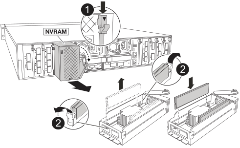

= Fase 1: Spegnere il controller compromesso
:allow-uri-read: 

Il modulo NVRAM è composto da hardware NVRAM12 e DIMM sostituibili sul campo. È possibile sostituire un modulo NVRAM guasto o i DIMM all'interno del modulo NVRAM. Per sostituire un modulo NVRAM guasto, è necessario rimuovere il modulo dal contenitore, spostare i moduli DIMM nel modulo sostitutivo e installare il modulo NVRAM sostitutivo nel contenitore.

Tutti gli altri componenti del sistema devono funzionare correttamente; in caso contrario, è necessario contattare https://support.netapp.com["Supporto NetApp"].

È necessario sostituire il componente guasto con un componente FRU sostitutivo ricevuto dal provider.

== Fase 1: Spegnere il controller compromesso

Arrestare o sostituire il controller compromesso utilizzando una delle seguenti opzioni.

[role="tabbed-block"]
====
.Opzione 1: La maggior parte dei sistemi
--
Per spegnere il controller compromesso, è necessario determinare lo stato del controller e, se necessario, assumere il controllo del controller in modo che il controller integro continui a servire i dati provenienti dallo storage del controller compromesso.

.A proposito di questa attività
* Se si dispone di un sistema SAN, è necessario aver controllato i messaggi di evento  `cluster kernel-service show`) per il blade SCSI del controller danneggiato. Il `cluster kernel-service show` comando (dalla modalità avanzata precedente) visualizza il nome del nodo, link:https://docs.netapp.com/us-en/ontap/system-admin/display-nodes-cluster-task.html["stato quorum"] di quel nodo, lo stato di disponibilità di quel nodo e lo stato operativo di quel nodo.
+
Ogni processo SCSI-blade deve essere in quorum con gli altri nodi del cluster. Eventuali problemi devono essere risolti prima di procedere con la sostituzione.

* Se si dispone di un cluster con più di due nodi, questo deve trovarsi in quorum. Se il cluster non è in quorum o un controller integro mostra false per idoneità e salute, è necessario correggere il problema prima di spegnere il controller compromesso; vedere link:https://docs.netapp.com/us-en/ontap/system-admin/synchronize-node-cluster-task.html?q=Quorum["Sincronizzare un nodo con il cluster"^].

.Fasi
. Se AutoSupport è attivato, sospendere la creazione automatica dei casi richiamando un messaggio AutoSupport: `system node autosupport invoke -node * -type all -message MAINT=<# of hours>h`
+
Il seguente messaggio AutoSupport elimina la creazione automatica del caso per due ore: `cluster1:> system node autosupport invoke -node * -type all -message MAINT=2h`

. Disattivare il giveback automatico dalla console del controller integro: `storage failover modify –node local -auto-giveback false`
+

NOTE: Quando viene visualizzato _Vuoi disattivare il giveback automatico?_, inserisci `y`.

. Portare la centralina danneggiata al prompt DEL CARICATORE:
+
[cols="1,2"]
|===
| Se il controller non utilizzato visualizza... | Quindi... 

 a| 
Il prompt DEL CARICATORE
 a| 
Passare alla fase successiva.

 a| 
In attesa di un giveback...
 a| 
Premere Ctrl-C, quindi rispondere `y` quando richiesto.

 a| 
Prompt di sistema o prompt della password
 a| 
Assumere il controllo o arrestare il controller compromesso dal controller integro: `storage failover takeover -ofnode _impaired_node_name_`

Quando il controller non utilizzato visualizza Waiting for giveback... (in attesa di giveback...), premere Ctrl-C e rispondere `y`.

|===

--
.Opzione 2: Controller in un MetroCluster
--
Per spegnere il controller compromesso, è necessario determinare lo stato del controller e, se necessario, assumere il controllo del controller in modo che il controller integro continui a servire i dati provenienti dallo storage del controller compromesso.

* Se si dispone di un cluster con più di due nodi, questo deve trovarsi in quorum. Se il cluster non è in quorum o un controller integro mostra false per idoneità e salute, è necessario correggere il problema prima di spegnere il controller compromesso; vedere link:https://docs.netapp.com/us-en/ontap/system-admin/synchronize-node-cluster-task.html?q=Quorum["Sincronizzare un nodo con il cluster"^].
* È necessario aver confermato che lo stato di configurazione MetroCluster è configurato e che i nodi sono in uno stato abilitato e normale (`metrocluster node show`).

.Fasi
. Se AutoSupport è attivato, eliminare la creazione automatica del caso richiamando un messaggio AutoSupport: `system node autosupport invoke -node * -type all -message MAINT=number_of_hours_downh`
+
Il seguente messaggio AutoSupport elimina la creazione automatica del caso per due ore: `cluster1:*> system node autosupport invoke -node * -type all -message MAINT=2h`

. Disattivare il giveback automatico dalla console del controller integro: `storage failover modify –node local -auto-giveback false`
. Portare la centralina danneggiata al prompt DEL CARICATORE:
+
[cols="1,2"]
|===
| Se il controller non utilizzato visualizza... | Quindi... 

 a| 
Il prompt DEL CARICATORE
 a| 
Passare alla sezione successiva.

 a| 
In attesa di un giveback...
 a| 
Premere Ctrl-C, quindi rispondere `y` quando richiesto.

 a| 
Prompt di sistema o prompt della password (inserire la password di sistema)
 a| 
Assumere il controllo o arrestare il controller compromesso dal controller integro: `storage failover takeover -ofnode _impaired_node_name_`

Quando il controller non utilizzato visualizza Waiting for giveback... (in attesa di giveback...), premere Ctrl-C e rispondere `y`.

|===

--
====

== Fase 2: Sostituire il modulo NVRAM

Per sostituire il modulo NVRAM, posizionarlo nello slot 4/5 del contenitore e seguire la sequenza di passaggi specifica.

. Se non si è già collegati a terra, mettere a terra l'utente.
. Scollegare il cavo di alimentazione da entrambi gli alimentatori.
. Ruotare il vassoio di gestione dei cavi verso il basso tirando delicatamente i perni alle estremità del vassoio e ruotandolo verso il basso.
. Rimuovere il modulo NVRAM danneggiato dal contenitore:
+
.. Premere il pulsante della camma di bloccaggio.
+
Il pulsante della camma si allontana dal contenitore.

.. Ruotare il dispositivo di chiusura della camma verso il basso fino in fondo.
.. Rimuovere il modulo NVRAM danneggiato dal contenitore agganciando il dito nell'apertura della leva della camma ed estraendo il modulo dal contenitore.
+

+
[cols="1,4"]
|===

| image:../media/icon_round_1.png["Numero di didascalia 1"]  a| 
Pulsante di bloccaggio della camma

 a| 
image:../media/icon_round_2.png["Numero di didascalia 2"]
| Linguette di bloccaggio DIMM 
|===

. Impostare il modulo NVRAM su una superficie stabile.
. Rimuovere i moduli DIMM, uno alla volta, dal modulo NVRAM danneggiato e installarli nel modulo NVRAM sostitutivo.
. Installare il modulo NVRAM sostitutivo nel contenitore:
+
.. Allineare il modulo ai bordi dell'apertura del contenitore nello slot 4/5.
.. Far scorrere delicatamente il modulo nell'alloggiamento fino in fondo, quindi ruotare il dispositivo di chiusura della camma completamente verso l'alto per bloccare il modulo in posizione.

. Ricablare le PSU.
. Ruotare il vassoio di gestione dei cavi verso l'alto fino alla posizione di chiusura.

== Fase 3: Sostituire un DIMM NVRAM

Per sostituire i DIMM NVRAM nel modulo NVRAM, è necessario rimuovere il modulo NVRAM e sostituire il DIMM di destinazione.

. Se non si è già collegati a terra, mettere a terra l'utente.
. Scollegare il cavo di alimentazione da entrambi gli alimentatori.
. Ruotare il vassoio di gestione dei cavi verso il basso tirando delicatamente i perni alle estremità del vassoio e ruotandolo verso il basso.
. Rimuovere il modulo NVRAM di destinazione dal contenitore.
+

+
[cols="1,4"]
|===

| image:../media/icon_round_1.png["Numero di didascalia 1"]  a| 
Pulsante di bloccaggio della camma

 a| 
image:../media/icon_round_2.png["Numero di didascalia 2"]
| Linguette di bloccaggio DIMM 
|===
. Impostare il modulo NVRAM su una superficie stabile.
. Individuare il DIMM da sostituire all'interno del modulo NVRAM.
+

NOTE: Consultare l'etichetta della mappa FRU sul lato del modulo NVRAM per determinare la posizione degli slot DIMM 1 e 2.

. Rimuovere il modulo DIMM premendo verso il basso le linguette di bloccaggio e sollevando il modulo DIMM dallo zoccolo.
. Installare il modulo DIMM sostitutivo allineandolo allo zoccolo e spingendolo delicatamente nello zoccolo fino a quando le linguette di bloccaggio non si bloccano in posizione.
. Installare il modulo NVRAM nel contenitore:
+
.. Far scorrere delicatamente il modulo nello slot fino a quando il dispositivo di chiusura della camma non inizia a innestarsi con il perno della camma di i/o, quindi ruotare il dispositivo di chiusura della camma completamente verso l'alto per bloccare il modulo in posizione.

. Ricablare le PSU.
. Ruotare il vassoio di gestione dei cavi verso l'alto fino alla posizione di chiusura.

== Fase 4: Riavviare il controller

Dopo aver sostituito la FRU, è necessario riavviare il modulo controller.

. Per avviare ONTAP dal prompt del CARICATORE, immettere _bye_.
. Riportare la centralina guasta al normale funzionamento restituendo la memoria: `_storage failover giveback -ofnode _impaired_node_name_`.
. Se lo sconto automatico è stato disattivato, riattivarlo: `storage failover modify -node local -auto-giveback true` .
. Se AutoSupport è attivato, ripristinare/riattivare la creazione automatica dei casi: `system node autosupport invoke -node * -type all -message MAINT=END`.

== Fase 5: Riassegnare i dischi

È necessario confermare la modifica dell'ID di sistema all'avvio del controller e verificare che la modifica sia stata implementata.

CAUTION: La riassegnazione del disco è necessaria solo quando si sostituisce il modulo NVRAM e non si applica alla sostituzione del DIMM NVRAM.

.Fasi
. Se la centralina è in modalità di manutenzione (viene visualizzato il `*>` messaggio), uscire dalla modalità di manutenzione e andare al prompt del CARICATORE: _Halt_
. Dal prompt del CARICATORE sul controller, avviare il controller e immettere _y_ quando viene richiesto di ignorare l'ID del sistema a causa di una mancata corrispondenza dell'ID del sistema.
. Attendere fino all'attesa dello sconto... Viene visualizzato un messaggio sulla console del controller con il modulo sostitutivo, quindi, dal controller integro, verificare che il nuovo ID di sistema partner sia stato assegnato automaticamente: _Storage failover show_
+
Nell'output del comando, viene visualizzato un messaggio che indica che l'ID del sistema è stato modificato sul controller compromesso, mostrando gli ID vecchi e nuovi corretti. Nell'esempio seguente, il node2 è stato sostituito e ha un nuovo ID di sistema pari a 151759706.

+
[listing]
----
node1:> storage failover show
                                    Takeover
Node              Partner           Possible     State Description
------------      ------------      --------     -------------------------------------
node1             node2             false        System ID changed on partner (Old:
                                                  151759755, New: 151759706), In takeover
node2             node1             -            Waiting for giveback (HA mailboxes)
----
. Restituire il controller:
+
.. Dal controller integro, restituisci lo storage del controller sostituito: _Storage failover giveback -node replacement_node_name_
+
Il controller recupera lo storage e completa l'avvio.

+
Se viene richiesto di sovrascrivere l'ID del sistema a causa di una mancata corrispondenza dell'ID del sistema, immettere _y_.

+

NOTE: Se il giveback viene vetoed, puoi prendere in considerazione la possibilità di ignorare i veti.

+
Per ulteriori informazioni, consultare https://docs.netapp.com/us-en/ontap/high-availability/ha_manual_giveback.html#if-giveback-is-interrupted["Comandi manuali di giveback"^] argomento per ignorare il veto.

.. Al termine del giveback, verifica che la coppia ha sia in buone condizioni e che il takeover sia possibile: _Failover dello storage show_
+
L'output di `storage failover show` Il comando non deve includere l'ID di sistema modificato nel messaggio del partner.

. Verificare che i dischi siano stati assegnati correttamente: `storage disk show -ownership`
+
I dischi appartenenti al controller dovrebbero mostrare il nuovo ID di sistema. Nell'esempio seguente, i dischi di proprietà di node1 ora mostrano il nuovo ID di sistema, 151759706:

+
[listing]
----
node1:> storage disk show -ownership

Disk  Aggregate Home  Owner  DR Home  Home ID    Owner ID  DR Home ID Reserver  Pool
----- ------    ----- ------ -------- -------    -------    -------  ---------  ---
1.0.0  aggr0_1  node1 node1  -        151759706  151759706  -       151759706 Pool0
1.0.1  aggr0_1  node1 node1           151759706  151759706  -       151759706 Pool0
.
.
.
----
. Se il sistema è in una configurazione MetroCluster, monitorare lo stato del controller: _MetroCluster node show_
+
La configurazione MetroCluster impiega alcuni minuti dopo la sostituzione per tornare a uno stato normale, in cui ogni controller mostra uno stato configurato, con mirroring DR abilitato e una modalità normale. L' `metrocluster node show -fields node-systemid` output del comando visualizza l'ID di sistema danneggiato fino a quando la configurazione MetroCluster non torna a uno stato normale.

. Se il controller si trova in una configurazione MetroCluster, a seconda dello stato MetroCluster, verificare che il campo DR home ID (ID origine DR) indichi il proprietario originale del disco se il proprietario originale è un controller nel sito di emergenza.
+
Ciò è necessario se si verificano entrambe le seguenti condizioni:

+
** La configurazione MetroCluster è in uno stato di switchover.
** Il controller è il proprietario attuale dei dischi nel sito di emergenza.
+
Vedere https://docs.netapp.com/us-en/ontap-metrocluster/manage/concept_understanding_mcc_data_protection_and_disaster_recovery.html#disk-ownership-changes-during-ha-takeover-and-metrocluster-switchover-in-a-four-node-metrocluster-configuration["La proprietà del disco cambia durante il takeover ha e lo switchover MetroCluster in una configurazione MetroCluster a quattro nodi"] per ulteriori informazioni.

. Se il sistema è in una configurazione MetroCluster, verificare che ogni controller sia configurato: _MetroCluster node show - fields Configuration-state_
+
[listing]
----
node1_siteA::> metrocluster node show -fields configuration-state

dr-group-id            cluster node           configuration-state
-----------            ---------------------- -------------- -------------------
1 node1_siteA          node1mcc-001           configured
1 node1_siteA          node1mcc-002           configured
1 node1_siteB          node1mcc-003           configured
1 node1_siteB          node1mcc-004           configured

4 entries were displayed.
----
. Verificare che i volumi previsti siano presenti per ciascun controller: `vol show -node node-name`
. Riportare la centralina guasta al normale funzionamento restituendo la memoria: `storage failover giveback -ofnode _impaired_node_name_`.
. Se lo sconto automatico è stato disattivato, riattivarlo: `storage failover modify -node local -auto-giveback true`.
. Se AutoSupport è attivato, ripristinare/riattivare la creazione automatica dei casi: `system node autosupport invoke -node * -type all -message MAINT=END`.

== Fase 6: Restituire la parte guasta a NetApp

Restituire la parte guasta a NetApp, come descritto nelle istruzioni RMA fornite con il kit. Vedere la https://mysupport.netapp.com/site/info/rma["Restituzione e sostituzione delle parti"] pagina per ulteriori informazioni.
