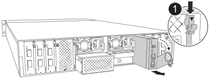

= 
:allow-uri-read: 

Il modulo di gestione del sistema contiene il supporto di avvio e fornisce le funzioni di gestione del sistema. Devi rimuovere il modulo di gestione del sistema danneggiato, trasferire il supporto di avvio sul modulo sostitutivo e reinstallare il modulo sostitutivo nell'alloggiamento.

.Fasi
. Rimuovere il modulo di gestione del sistema:
+

NOTE: Assicurati che il destage della NVRAM sia completato prima di procedere. Quando il LED sul modulo NV è spento, la NVRAM è stata destaggiata. Se il LED lampeggia, aspetta che smetta di lampeggiare. Se il lampeggio continua per più di 5 minuti, contatta il supporto tecnico per assistenza.

+

+
[cols="1,4"]
|===

 a| 
image::../media/icon_round_1.png[Numero di didascalia 1]
 a| 
Dispositivo di chiusura della camma del modulo di gestione del sistema

|===
+
.. Se non si è già collegati a terra, mettere a terra l'utente.
.. Scollegare i cavi di alimentazione dagli alimentatori.
.. Rimuovere tutti i cavi collegati al modulo di gestione del sistema.  Etichettare i cavi nel punto in cui erano collegati, in modo da poterli ricollegare alle porte corrette quando si reinstalla il modulo.
.. Ruotare il vassoio di gestione dei cavi verso il basso tirando i pulsanti su entrambi i lati all'interno del vassoio di gestione dei cavi, quindi ruotare il vassoio verso il basso.
.. Premere il pulsante CAM sul modulo di gestione del sistema.
.. Ruotare la leva della camma verso il basso fino in fondo.
.. Avvolgere il dito nel foro sulla leva della camma ed estrarre il modulo dal sistema.
.. Posizionare il modulo di gestione del sistema su un tappetino antistatico per accedere al supporto di avvio.

. Spostare il supporto di avvio nel modulo di gestione del sistema sostitutivo:
+
image::../media/drw_afx_2k_boot_media_remove_replace_ieops-2877.svg[Sostituzione dei supporti di avvio]

+
[cols="1,4"]
|===

 a| 
image::../media/icon_round_1.png[Numero di didascalia 1]
 a| 
Dispositivo di chiusura della camma del modulo di gestione del sistema

 a| 
image::../media/icon_round_2.png[Numero di didascalia 2]
 a| 
Pulsante di blocco dei supporti di avvio

 a| 
image::../media/icon_round_3.png[Numero di didascalia 3]
 a| 
Supporto di boot

|===
+
.. Premere il pulsante blu di blocco dei supporti di avvio nel modulo Gestione sistema non funzionante.
.. Ruotare il supporto di avvio verso l'alto ed estrarlo dallo zoccolo.

. Installare il supporto di avvio nel modulo di gestione del sistema sostitutivo:
+
.. Allineare i bordi del supporto di avvio con l'alloggiamento dello zoccolo, quindi spingerlo delicatamente a squadra nello zoccolo.
.. Ruotare il supporto di avvio verso il basso finché non tocca il pulsante di blocco.
.. Premere il blocco blu e ruotare il supporto di avvio completamente verso il basso e rilasciare il pulsante di blocco blu.

. Installare il modulo di gestione del sistema sostitutivo nel contenitore:
+
.. Allineare i bordi del modulo di gestione del sistema sostitutivo con l'apertura del sistema e spingerlo delicatamente nel modulo controller.
.. Far scorrere delicatamente il modulo nello slot fino a quando il dispositivo di chiusura della camma non inizia a innestarsi con il perno della camma di i/o, quindi ruotare il dispositivo di chiusura della camma completamente verso l'alto per bloccare il modulo in posizione.

. Ruotare il ARM di gestione dei cavi verso l'alto fino alla posizione di chiusura.
. Eseguire il richiamo del modulo Gestione del sistema.

