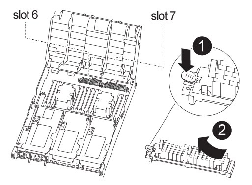

= 
:allow-uri-read: 

Quando si sostituisce un modulo controller, è necessario spostare il modulo di caching dal modulo controller danneggiato al modulo controller sostitutivo.

NOTE: Il modulo controller Ver2 dispone di un solo socket per modulo di caching nel modello FAS8300. FAS8700 non dispone di un modulo controller ver2. La funzionalità del modulo di caching non è influenzata dalla rimozione del socket.

Per spostare i moduli di caching nel nuovo modulo controller, è possibile utilizzare la seguente animazione, illustrazione o procedura scritta.

.Animazione - spostare i moduli di caching
video::d6a43902-0e78-40c3-a2bd-aad9012f5b94[panopto]

.Fasi
. Se non si è già collegati a terra, mettere a terra l'utente.
. Spostare i moduli di caching dal modulo controller compromesso al modulo controller sostitutivo:
+
.. Premere la linguetta blu di rilascio all'estremità del modulo di caching, ruotare il modulo verso l'alto, quindi rimuovere il modulo dallo zoccolo.
.. Spostare il modulo di caching nello stesso socket del modulo controller sostitutivo.
.. Allineare i bordi del modulo di caching con il socket e inserire delicatamente il modulo fino in fondo nel socket.
.. Ruotare il modulo di caching verso il basso verso la scheda madre.
.. Posizionando il dito all'estremità del modulo di caching tramite il pulsante blu, premere con decisione verso il basso l'estremità del modulo di caching, quindi sollevare il pulsante di blocco per bloccare il modulo di caching in posizione.

