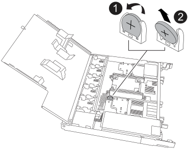

= 
:allow-uri-read: 

Rimuovere la batteria RTC guasta e installare la batteria RTC di ricambio.

.Fasi
. Individuare la batteria RTC.
. Rimuovere la batteria RTC:
+

+
[cols="1,4"]
|===

 a| 
image::../media/icon_round_1.png[Numero di didascalia 1]
 a| 
Ruotare delicatamente la batteria RTC ad un angolo lontano dal relativo supporto.

 a| 
image::../media/icon_round_2.png[Numero di didascalia 2]
 a| 
Estrarre la batteria RTC dal relativo supporto.

|===
. Installare la batteria RTC di ricambio:
+
.. Rimuovere la batteria di ricambio dalla confezione antistatica per la spedizione.
.. Posizionare la batteria in modo che il segno più sulla batteria sia rivolto verso l'esterno e corrisponda al segno più sulla scheda madre.
.. Inserire la batteria nel supporto inclinandola, quindi spingerla in posizione verticale in modo che sia completamente inserita nel supporto.
.. Ispezionare visivamente la batteria per assicurarsi che sia completamente inserita nel relativo supporto e che la polarità sia corretta.

