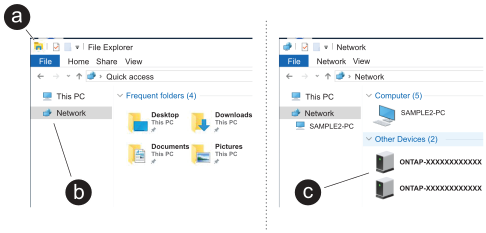

= Fase 1: Raccogliere le informazioni sul cluster
:allow-uri-read: 

Dopo aver acceso il sistema storage, è possibile rilevare una rete di cluster e configurare un cluster ONTAP.

== Fase 1: Raccogliere le informazioni sul cluster

Se non lo si è già fatto, raccogliere le informazioni necessarie per configurare il cluster, come la porta dell'interfaccia di gestione del cluster e l'indirizzo IP.

Utilizzare https://docs.netapp.com/us-en/ontap/software_setup/index.html["foglio di lavoro per la configurazione del cluster"^] per registrare i valori necessari durante il processo di configurazione del cluster. Se viene fornito un valore predefinito, è possibile utilizzare tale valore oppure immettere il proprio.

== Passaggio 2: Individuazione della rete cluster

Il processo di rilevamento consente di rilevare i controller dei sistemi storage sulla rete.

[role="tabbed-block"]
====
.Opzione 1: Rilevamento della rete attivato
--
Se il rilevamento della rete è abilitato sul laptop, è possibile completare l'installazione e la configurazione della piattaforma utilizzando il rilevamento automatico dei cluster.

.Fasi
. Collegare il computer portatile allo switch di gestione e accedere ai computer e ai dispositivi di rete.
. Selezionare un'icona ONTAP elencata per scoprire:
+

+
.. Aprire file Explorer.
.. Fare clic su *rete* nel riquadro sinistro, fare clic con il pulsante destro del mouse e selezionare *aggiorna*.
.. Fare doppio clic sull'icona ONTAP e accettare i certificati visualizzati sullo schermo.
+

NOTE: XXXXX è il numero di serie della piattaforma per il nodo di destinazione.

+
Viene visualizzato Gestione sistema.

--
.Opzione 2: Il rilevamento della rete non è attivato
--
Se il rilevamento della rete non è abilitato sul laptop, completare la configurazione e la configurazione utilizzando la procedura guidata di configurazione del cluster dell'interfaccia a riga di comando (CLI) di ONTAP.

.Prima di iniziare
Assicurarsi che il computer portatile sia collegato alla porta seriale della console e che i controller siano accesi. Vedere link:install-power-hardware.html#step-2-power-on-the-controllers["accendere il sistema di archiviazione"] per istruzioni.

.Fasi
Assegnare un indirizzo IP di gestione del nodo iniziale a uno dei nodi.

[cols="1,2"]
|===
| Se la rete di gestione dispone di DHCP... | Quindi... 

 a| 
Configurato
 a| 
Registrare l'indirizzo IP assegnato ai nuovi controller.

 a| 
Non configurato
 a| 
. Aprire una sessione della console utilizzando putty, un server terminal o un server equivalente per l'ambiente in uso.
+

NOTE: Se non si sa come configurare PuTTY, consultare la guida in linea del portatile o della console.

. Connettersi alla console del primo nodo.
+
Il nodo viene avviato, quindi viene avviata la procedura guidata di installazione del cluster sulla console.

. Immettere l'indirizzo IP di gestione del nodo quando richiesto dalla procedura guidata di configurazione del cluster.

|===
--
====

== Passaggio 3: Configurare il cluster

NetApp consiglia di utilizzare System Manager per configurare nuovi cluster. Vedere https://docs.netapp.com/us-en/ontap/task_configure_ontap.html["Configurare ONTAP su un nuovo cluster con Gestione di sistema"^] per le istruzioni di installazione.

System Manager offre un workflow semplice e intuitivo per la configurazione e la configurazione del cluster, che include l'assegnazione di un indirizzo IP di gestione dei nodi, l'inizializzazione del cluster, la creazione di un Tier locale, la configurazione dei protocolli e il provisioning iniziale dello storage collegato.

.Quali sono le prossime novità?
Dopo l'inizializzazione del cluster, scaricare ed eseguire  https://mysupport.netapp.com/site/tools/tool-eula/activeiq-configadvisor["Active IQ Config Advisor"^] per confermare la configurazione.
