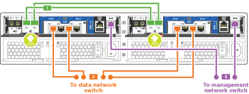
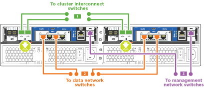
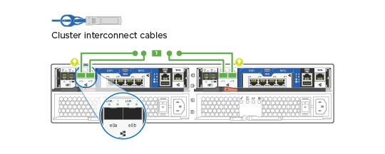

= Guida dettagliata - AFF A220
:allow-uri-read: 
:icons: font
:imagesdir: ../media/

[role="lead"]
Questa pagina fornisce istruzioni dettagliate per l'installazione di un sistema NetApp tipico.

== Fase 1: Preparazione per l'installazione

Per installare il sistema AFF A220, è necessario creare un account sul sito del supporto NetApp, registrare il sistema e ottenere le chiavi di licenza. È inoltre necessario inventariare il numero e il tipo di cavi appropriati per il sistema e raccogliere informazioni di rete specifiche.

È necessario accedere a Hardware Universe per ottenere informazioni sui requisiti del sito e ulteriori informazioni sul sistema configurato. Per ulteriori informazioni su questo sistema, è possibile accedere alle Note di rilascio della versione di ONTAP in uso.

https://hwu.netapp.com["NetApp Hardware Universe"]

http://mysupport.netapp.com/documentation/productlibrary/index.html?productID=62286["Trova le Note di rilascio relative alla tua versione di ONTAP 9"]

Devi fornire quanto segue presso la tua sede:

* Spazio rack per il sistema storage
* Cacciavite Phillips n. 2
* Cavi di rete aggiuntivi per collegare il sistema allo switch di rete e al laptop o alla console mediante un browser Web
* Computer portatile o console con connessione RJ-45 e accesso a un browser Web

.Fasi
. Disimballare il contenuto di tutte le confezioni.
. Annotare il numero di serie del sistema dai controller.
+
image::../media/drw_ssn_label.png[Esempio di numero di serie del sistema]

. Configurazione dell'account:
+
.. Accedi al tuo account esistente o crea un account.
.. Registrare il sistema.
+
https://mysupport.netapp.com/eservice/registerSNoAction.do?moduleName=RegisterMyProduct["Registrazione del prodotto NetApp"]

. Scaricare e installare Config Advisor sul laptop.
+
https://mysupport.netapp.com/site/tools/tool-eula/activeiq-configadvisor["Download NetApp: Config Advisor"]

. Fare un inventario e prendere nota del numero e dei tipi di cavi ricevuti.
+
La seguente tabella identifica i tipi di cavi che potrebbero essere ricevuti. Se si riceve un cavo non elencato nella tabella, consultare la Hardware Universe per individuare il cavo e identificarne l'utilizzo.

+
https://hwu.netapp.com["NetApp Hardware Universe"]

+
[cols="1,2,1,2"]
|===
| Tipo di cavo... | Codice e lunghezza del ricambio | Tipo di connettore | Per... 

 a| 
Cavo da 10 GbE (in base all'ordine)
 a| 
X6566B-05-R6 (112-00297), 0,5 m

X6566B-2-R6 (112-00299), 2 m
 a| 
image:../media/oie_cable_sfp_gbe_copper.png["Connettore GbE SFP in rame"]
 a| 
Rete di interconnessione del cluster

 a| 
Cavo da 10 GbE (in base all'ordine)
 a| 
Codice X6566B-2-R6 (112-00299), 2 m

O X6566B-3-R6 (112-00300), 3 m.

X6566B-5-R6 (112-00301), 5 m.
 a| 
image:../media/oie_cable_sfp_gbe_copper.png["Connettore GbE SFP in rame"]
 a| 
Dati

 a| 
Cavi di rete ottica (in base all'ordine)
 a| 
X6553-R6 (112-00188), 2 m

X6536-R6 (112-00090), 5 m.

X6554-R6 (112-00189), 15 m.
 a| 
image:../media/oie_cable_fiber_lc_connector.png["Immagine che mostra un connettore LC in fibra ottica"]
 a| 
Rete host FC

 a| 
Cat 6, RJ-45 (in base all'ordine)
 a| 
Codici X6585-R6 (112-00291), 3 m.

X6562-R6 (112-00196), 5 m.
 a| 
image:../media/oie_cable_rj45.png["Connettore del cavo RJ-45"]
 a| 
Rete di gestione e dati Ethernet

 a| 
Storage (in base all'ordine)
 a| 
Codice X66030A (112-00435), 0,5 m.

X66031A (112-00436), 1 m.

X66032A (112-00437), 2 m

X66033A (112-00438), 3 m.
 a| 
image:../media/oie_cable_mini_sas_hd_to_mini_sas_hd.png["Connettore da mini-SAS a mini-SAS"]
 a| 
Storage

 a| 
Cavo per console micro-USB
 a| 
Non applicabile
 a| 
image:../media/oie_cable_micro_usb.png["Immagine che mostra un connettore micro USB"]
 a| 
Connessione della console durante la configurazione del software su computer portatili/console non Windows o Mac

 a| 
Cavi di alimentazione
 a| 
Non applicabile
 a| 
image:../media/oie_cable_power.png["Cavi di alimentazione"]
 a| 
Accensione del sistema

|===
. Scarica e completa il _foglio di lavoro di configurazione del cluster_.
+
https://library.netapp.com/ecm/ecm_download_file/ECMLP2839002["Foglio di lavoro per la configurazione del cluster"]

== Fase 2: Installare l'hardware

È necessario installare il sistema in un rack a 4 montanti o in un cabinet di sistema NetApp, a seconda dei casi.

.Fasi
. Installare i kit di guide, secondo necessità.
. Installare e fissare il sistema seguendo le istruzioni fornite con il kit di guide.
+

NOTE: È necessario essere consapevoli dei problemi di sicurezza associati al peso del sistema.

+
image::../media/drw_oie_fas2700_weight_caution.png[Avvertenza sollevamento a due persone]

. Collegare i dispositivi di gestione dei cavi (come illustrato).
+
image::../media/drw_cable_management_arm_install.png[Collegamento dei dispositivi di gestione dei cavi]

. Posizionare il pannello anteriore del sistema.

== Fase 3: Collegare i controller alla rete

È possibile collegare i controller alla rete utilizzando il metodo cluster senza switch a due nodi o la rete di interconnessione del cluster.

=== Opzione 1: Collegamento via cavo a un cluster senza switch a due nodi, configurazione di rete unificata

La rete di gestione, la rete dati UTA2 e le porte di gestione dei controller sono collegate agli switch. Le porte di interconnessione del cluster sono cablate su entrambi i controller.

Per informazioni sulla connessione del sistema agli switch, contattare l'amministratore di rete.

Verificare che la freccia dell'illustrazione sia orientata correttamente con la linguetta di estrazione del connettore del cavo.

image::../media/oie_cable_pull_tab_down.png[Connettore per cavo con linguetta di estrazione sul fondo]

NOTE: Quando si inserisce il connettore, si dovrebbe avvertire uno scatto in posizione; se non si sente uno scatto, rimuoverlo, ruotarlo e riprovare.

.Fasi
. È possibile utilizzare la figura o le istruzioni dettagliate per completare il cablaggio tra i controller e gli switch:
+
image::../media/drw_2700_tnsc_unified_network_cabling_animated_gif.png[Cablaggio cluster senza switch a due nodi in una configurazione di rete unificata]

+
[cols="1,3"]
|===
| Fase | Eseguire su ciascun controller 

 a| 
image:../media/oie_legend_icon_1_lg.png["Fase 1"]
 a| 
Collegare le porte di interconnessione del cluster l'una all'altra con il cavo di interconnessione del cluster:

** da e0a e0a
** da e0b a e0b
image:../media/drw_c190_u_tnsc_clust_cbling.png["Cablaggio di interconnessione in cluster"]

 a| 
image:../media/oie_legend_icon_2_o.png["Passaggio 2"]
 a| 
Utilizzare uno dei seguenti tipi di cavo per collegare le porte dati UTA2 alla rete host:

Un host FC

** 0c e 0d
** *O* 0e e 0f A 10GbE
** e0c ed e0d
** *o* e0e ed e0f

NOTE: È possibile collegare una coppia di porte come CNA e una coppia di porte come FC oppure entrambe le coppie di porte come CNA o entrambe come FC.

image:../media/drw_c190_u_fc_10gbe_cbling.png["Immagine che mostra le connessioni della porta dati come descritto nel testo circostante"]

 a| 
image:../media/oie_legend_icon_3_lp.png["Passaggio 3"]
 a| 
Collegare le porte e0M agli switch della rete di gestione con i cavi RJ45:

image:../media/drw_c190_u_mgmt_cbling.png["Cablaggio delle porte di gestione"]

 a| 
image:../media/oie_legend_icon_attn_symbol.png["Simbolo di attenzione"]
 a| 
NON collegare i cavi di alimentazione a questo punto.

|===
. Per collegare lo storage, vedere <<Fase 4: Collegare i controller dei cavi agli shelf di dischi>>

=== Opzione 2: Collegamento via cavo a a un cluster con switch, configurazione di rete unificata

La rete di gestione, la rete dati UTA2 e le porte di gestione dei controller sono collegate agli switch. Le porte di interconnessione del cluster sono cablate agli switch di interconnessione del cluster.

Per informazioni sulla connessione del sistema agli switch, contattare l'amministratore di rete.

Verificare che la freccia dell'illustrazione sia orientata correttamente con la linguetta di estrazione del connettore del cavo.

image::../media/oie_cable_pull_tab_down.png[Connettore per cavo con linguetta di estrazione sul fondo]

NOTE: Quando si inserisce il connettore, si dovrebbe avvertire uno scatto in posizione; se non si sente uno scatto, rimuoverlo, ruotarlo e riprovare.

.Fasi
. È possibile utilizzare la figura o le istruzioni dettagliate per completare il cablaggio tra i controller e gli switch:
+
image::../media/drw_2700_switched_unified_network_cabling_animated_gif.png[Cablaggio di rete unificato con switch luster]

+
[cols="1,3"]
|===
| Fase | Eseguire su ciascun modulo controller 

 a| 
image:../media/oie_legend_icon_1_lg.png["Fase 1"]
 a| 
Cavo e0a e e0b agli switch di interconnessione del cluster con il cavo di interconnessione del cluster:

image:../media/drw_c190_u_switched_clust_cbling.png["Cablaggio ClusterInterconnect"]

 a| 
image:../media/oie_legend_icon_2_o.png["Passaggio 2"]
 a| 
Utilizzare uno dei seguenti tipi di cavo per collegare le porte dati UTA2 alla rete host:

Un host FC

** 0c e 0d
** **o** 0e e 0f

A 10 GbE

** e0c ed e0d
** **o** e0e ed e0f

NOTE: È possibile collegare una coppia di porte come CNA e una coppia di porte come FC oppure entrambe le coppie di porte come CNA o entrambe come FC.

image:../media/drw_c190_u_fc_10gbe_cbling.png["Immagine che mostra le connessioni della porta dati come descritto nel testo circostante"]

 a| 
image:../media/oie_legend_icon_3_lp.png["Passaggio 3"]
 a| 
Collegare le porte e0M agli switch della rete di gestione con i cavi RJ45:

image:../media/drw_c190_u_mgmt_cbling.png["Cablaggio delle porte di gestione"]

 a| 
image:../media/oie_legend_icon_attn_symbol.png["Simbolo di attenzione"]
 a| 
NON collegare i cavi di alimentazione a questo punto.

|===
. Per collegare lo storage, vedere <<Fase 4: Collegare i controller dei cavi agli shelf di dischi>>

=== Opzione 3: Collegare un cluster senza switch a due nodi, configurazione di rete Ethernet

La rete di gestione, la rete dati Ethernet e le porte di gestione dei controller sono collegate agli switch. Le porte di interconnessione del cluster sono cablate su entrambi i controller.

Per informazioni sulla connessione del sistema agli switch, contattare l'amministratore di rete.

Verificare che la freccia dell'illustrazione sia orientata correttamente con la linguetta di estrazione del connettore del cavo.

image::../media/oie_cable_pull_tab_down.png[Connettore per cavo con linguetta di estrazione sul fondo]

NOTE: Quando si inserisce il connettore, si dovrebbe avvertire uno scatto in posizione; se non si sente uno scatto, rimuoverlo, ruotarlo e riprovare.

.Fasi
. È possibile utilizzare la figura o le istruzioni dettagliate per completare il cablaggio tra i controller e gli switch:
+

+
[cols="1,3"]
|===
| Fase | Eseguire su ciascun controller 

 a| 
image:../media/oie_legend_icon_1_lg.png["Fase 1"]
 a| 
Collegare le porte di interconnessione del cluster l'una all'altra con il cavo di interconnessione del cluster:

** da e0a e0a
** da e0b a e0b
image:../media/drw_c190_e_tnsc_clust_cbling.png["Immagine che mostra le interconnessioni del cluster tra le porte sul retro dei controller"]

 a| 
image:../media/oie_legend_icon_2_o.png["Passaggio 2"]
 a| 
Utilizzare il cavo RJ45 Cat 6 per collegare l'unità e0c attraverso le porte e0f alla rete host:

image:../media/drw_c190_e_rj45_cbling.png["Cablaggio di rete host"]

 a| 
image:../media/oie_legend_icon_3_lp.png["Passaggio 3"]
 a| 
Collegare le porte e0M agli switch della rete di gestione con i cavi RJ45:

image:../media/drw_c190_e_mgmt_cbling.png["Cablaggio delle porte di gestione"]

 a| 
image:../media/oie_legend_icon_attn_symbol.png["Simbolo di attenzione"]
 a| 
NON collegare i cavi di alimentazione a questo punto.

|===
. Per collegare lo storage, vedere <<Fase 4: Collegare i controller dei cavi agli shelf di dischi>>

=== Opzione 4: Cluster con switch via cavo a, configurazione di rete Ethernet

La rete di gestione, la rete dati Ethernet e le porte di gestione dei controller sono collegate agli switch. Le porte di interconnessione del cluster sono cablate agli switch di interconnessione del cluster.

Per informazioni sulla connessione del sistema agli switch, contattare l'amministratore di rete.

Verificare che la freccia dell'illustrazione sia orientata correttamente con la linguetta di estrazione del connettore del cavo.

image::../media/oie_cable_pull_tab_down.png[Connettore per cavo con linguetta di estrazione sul fondo]

NOTE: Quando si inserisce il connettore, si dovrebbe avvertire uno scatto in posizione; se non si sente uno scatto, rimuoverlo, ruotarlo e riprovare.

.Fasi
. È possibile utilizzare la figura o le istruzioni dettagliate per completare il cablaggio tra i controller e gli switch:
+

+
[cols="1,2"]
|===
| Fase | Eseguire su ciascun modulo controller 

 a| 
image:../media/oie_legend_icon_1_lg.png["Fase 1"]
 a| 
Cavo e0a e e0b agli switch di interconnessione del cluster con il cavo di interconnessione del cluster:

 a| 
image:../media/oie_legend_icon_2_o.png["Passaggio 2"]
 a| 
Utilizzare il cavo RJ45 Cat 6 per collegare l'unità e0c attraverso le porte e0f alla rete host:

image:../media/drw_c190_e_rj45_cbling.png["Cablaggio di rete host"]

 a| 
image:../media/oie_legend_icon_3_lp.png["Passaggio 3"]
 a| 
Collegare le porte e0M agli switch della rete di gestione con i cavi RJ45:

image:../media/drw_c190_e_mgmt_cbling.png["Cablaggio delle porte di gestione"]

 a| 
image:../media/oie_legend_icon_attn_symbol.png["Simbolo di attenzione"]
 a| 
NON collegare i cavi di alimentazione a questo punto.

|===
. Per collegare lo storage, vedere <<Fase 4: Collegare i controller dei cavi agli shelf di dischi>>

== Fase 4: Collegare i controller dei cavi agli shelf di dischi

È necessario collegare i controller agli shelf utilizzando le porte di storage integrate. NetApp consiglia il cablaggio MP-ha per i sistemi con storage esterno. Se si dispone di un'unità a nastro SAS, è possibile utilizzare il cablaggio a percorso singolo. Se non si dispone di shelf esterni, il cablaggio MP-ha alle unità interne è opzionale (non mostrato) se i cavi SAS vengono ordinati con il sistema.

=== Opzione 1: Storage via cavo su una coppia ha con shelf di dischi esterni

È necessario collegare i collegamenti shelf-to-shelf, quindi collegare entrambi i controller agli shelf di dischi.

Verificare che la freccia dell'illustrazione sia orientata correttamente con la linguetta di estrazione del connettore del cavo.

image::../media/oie_cable_pull_tab_down.png[Connettore per cavo con linguetta di estrazione sul fondo]

.Fasi
. Cablare la coppia ha con shelf di dischi esterni:
+

NOTE: L'esempio utilizza DS224C. Il cablaggio è simile agli altri shelf di dischi supportati.

+
image::../media/drw_2700_ha_storage_cabling_animated_gif.png[Cablaggio degli shelf in coppia ha]

+
[cols="1,3"]
|===
| Fase | Eseguire su ciascun controller 

 a| 
image:../media/oie_legend_icon_1_lo.png["Numero di didascalia 1"]
 a| 
Cablare le porte shelf-to-shelf.

** Dalla porta 3 su IOM A alla porta 1 sull'IOM A sullo shelf direttamente sotto.
** Dalla porta 3 su IOM B alla porta 1 sull'IOM B sullo shelf direttamente sotto.
+
image:../media/oie_cable_mini_sas_hd_to_mini_sas_hd.png["Connettore da mini-SAS a mini-SAS"]     Cavi da mini-SAS HD a mini-SAS HD

 a| 

 a| 
Collegare ciascun nodo a IOM A nello stack.

** Porta da controller 1 0b a IOM A porta 3 sull'ultimo shelf di dischi nello stack.
** Porta del controller 2 0a a IOM A porta 1 sul primo shelf di dischi dello stack.
+
image:../media/oie_cable_mini_sas_hd_to_mini_sas_hd.png["Connettore da mini-SAS a mini-SAS"]     Cavi da mini-SAS HD a mini-SAS HD

 a| 
image:../media/oie_legend_icon_3_t.png["Passaggio 3"]
 a| 
Collegare ciascun nodo all'IOM B nello stack

** Porta del controller 1 0a alla porta IOM B 1 sul primo shelf di dischi nello stack.
** Porta del controller 2 0b alla porta IOM B 3 sull'ultimo shelf di dischi nello stack.
image:../media/oie_cable_mini_sas_hd_to_mini_sas_hd.png["Connettore da mini-SAS a mini-SAS"]     Cavi da mini-SAS HD a mini-SAS HD

|===
+
Se si dispone di più shelf di dischi, consultare la _Guida all'installazione e al cablaggio_ per il tipo di shelf di dischi.

. Per completare la configurazione del sistema, vedere <<Fase 5: Completare l'installazione e la configurazione del sistema>>

== Fase 5: Completare l'installazione e la configurazione del sistema

È possibile completare l'installazione e la configurazione del sistema utilizzando il rilevamento del cluster solo con una connessione allo switch e al laptop oppure collegandosi direttamente a un controller del sistema e quindi allo switch di gestione.

=== Opzione 1: Completare la configurazione del sistema se è attivato il rilevamento della rete

Se sul laptop è attivata la funzione di rilevamento della rete, è possibile completare l'installazione e la configurazione del sistema utilizzando la funzione di rilevamento automatico del cluster.

.Fasi
. Utilizzare la seguente animazione per impostare uno o più ID shelf di dischi
+
.Animazione - impostazione degli ID dello shelf di dischi
video::c600f366-4d30-481a-89d9-ab1b0066589b[panopto]
. Collegare i cavi di alimentazione agli alimentatori del controller, quindi collegarli a fonti di alimentazione su diversi circuiti.
. Accendere gli interruttori di alimentazione su entrambi i nodi.
+
image::../media/drw_turn_on_power_switches_to_psus.png[Accensione]

+

NOTE: L'avvio iniziale può richiedere fino a otto minuti.

. Assicurarsi che il rilevamento della rete sia attivato sul laptop.
+
Per ulteriori informazioni, consultare la guida in linea del portatile.

. Utilizzare la seguente animazione per collegare il laptop allo switch di gestione.
+
.Animazione - collegare il laptop allo switch di gestione
video::d61f983e-f911-4b76-8b3a-ab1b0066909b[panopto]
. Selezionare un'icona ONTAP elencata per scoprire:
+
image::../media/drw_autodiscovery_controler_select.png[Selezionare un'icona ONTAP]

+
.. Aprire file Explorer.
.. Fare clic su Network (rete) nel riquadro sinistro.
.. Fare clic con il pulsante destro del mouse e selezionare Aggiorna.
.. Fare doppio clic sull'icona ONTAP e accettare i certificati visualizzati sullo schermo.
+

NOTE: XXXXX è il numero di serie del sistema per il nodo di destinazione.

+
Viene visualizzato Gestione sistema.

. Utilizza la configurazione guidata di System Manager per configurare il tuo sistema utilizzando i dati raccolti nella _Guida alla configurazione di NetApp ONTAP_.
+
https://library.netapp.com/ecm/ecm_download_file/ECMLP2862613["Guida alla configurazione di ONTAP"]

. Verificare lo stato del sistema eseguendo Config Advisor.
. Una volta completata la configurazione iniziale, passare alla https://www.netapp.com/data-management/oncommand-system-documentation/["ONTAP  risorse di documentazione per il gestore di sistema ONTAP"] Pagina per informazioni sulla configurazione di funzioni aggiuntive in ONTAP.

=== Opzione 2: Completamento della configurazione e della configurazione del sistema se il rilevamento della rete non è attivato

Se il rilevamento della rete non è abilitato sul laptop, è necessario completare la configurazione e la configurazione utilizzando questa attività.

.Fasi
. Cablare e configurare il laptop o la console:
+
.. Impostare la porta della console del portatile o della console su 115,200 baud con N-8-1.
+

NOTE: Per informazioni su come configurare la porta della console, consultare la guida in linea del portatile o della console.

.. Collegare il cavo della console al computer portatile o alla console e la porta della console sul controller utilizzando il cavo della console fornito con il sistema.
+
image::../media/drw_console_connect_fas2700_affa200.png[Collegamento alla porta della console]

.. Collegare il laptop o la console allo switch sulla subnet di gestione.
+
image::../media/drw_client_to_mgmt_subnet_fas2700_affa220.png[Connessione alla subnet di gestione in corso]

.. Assegnare un indirizzo TCP/IP al portatile o alla console, utilizzando un indirizzo presente nella subnet di gestione.

. Utilizzare la seguente animazione per impostare uno o più ID shelf di dischi:
+
.Animazione - impostazione degli ID dello shelf di dischi
video::c600f366-4d30-481a-89d9-ab1b0066589b[panopto]
. Collegare i cavi di alimentazione agli alimentatori del controller, quindi collegarli a fonti di alimentazione su diversi circuiti.
. Accendere gli interruttori di alimentazione su entrambi i nodi.
+
image::../media/drw_turn_on_power_switches_to_psus.png[Accensione]

+

NOTE: L'avvio iniziale può richiedere fino a otto minuti.

. Assegnare un indirizzo IP di gestione del nodo iniziale a uno dei nodi.
+
[cols="1-3"]
|===
| Se la rete di gestione dispone di DHCP... | Quindi... 

 a| 
Configurato
 a| 
Registrare l'indirizzo IP assegnato ai nuovi controller.

 a| 
Non configurato
 a| 
.. Aprire una sessione della console utilizzando putty, un server terminal o un server equivalente per l'ambiente in uso.
+

NOTE: Se non si sa come configurare PuTTY, consultare la guida in linea del portatile o della console.

.. Inserire l'indirizzo IP di gestione quando richiesto dallo script.

|===
. Utilizzando System Manager sul laptop o sulla console, configurare il cluster:
+
.. Puntare il browser sull'indirizzo IP di gestione del nodo.
+

NOTE: Il formato dell'indirizzo è +https://x.x.x.x.+

.. Configurare il sistema utilizzando i dati raccolti nella _Guida alla configurazione di NetApp ONTAP_.
+
https://library.netapp.com/ecm/ecm_download_file/ECMLP2862613["Guida alla configurazione di ONTAP"]

. Verificare lo stato del sistema eseguendo Config Advisor.
. Una volta completata la configurazione iniziale, passare alla https://www.netapp.com/data-management/oncommand-system-documentation/["ONTAP  risorse di documentazione per il gestore di sistema ONTAP"] Pagina per informazioni sulla configurazione di funzioni aggiuntive in ONTAP.

