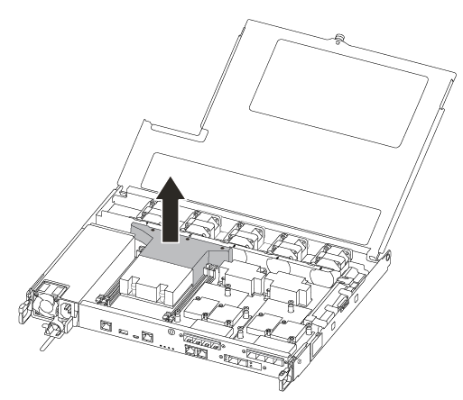
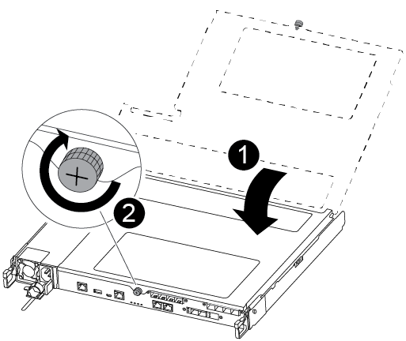

= Sostituire un modulo DIMM - AFF A250
:allow-uri-read: 
:icons: font
:imagesdir: ../media/

[role="lead"]
È necessario sostituire un modulo DIMM nel modulo controller quando il sistema registra un numero crescente di codici di correzione degli errori correggibili (ECC); in caso contrario, si verifica un errore di sistema.

.A proposito di questa attività
Tutti gli altri componenti del sistema devono funzionare correttamente; in caso contrario, contattare il supporto tecnico.

È necessario sostituire il componente guasto con un componente FRU sostitutivo ricevuto dal provider.

== Fase 1: Spegnere il controller compromesso

Per spegnere il controller compromesso, è necessario determinare lo stato del controller e, se necessario, assumere il controllo del controller in modo che il controller integro continui a servire i dati provenienti dallo storage del controller compromesso.

.A proposito di questa attività
* Se si dispone di un sistema SAN, è necessario aver controllato i messaggi di evento  `cluster kernel-service show`) per il blade SCSI del controller danneggiato. Il `cluster kernel-service show` comando (dalla modalità avanzata precedente) visualizza il nome del nodo, link:https://docs.netapp.com/us-en/ontap/system-admin/display-nodes-cluster-task.html["stato quorum"] di quel nodo, lo stato di disponibilità di quel nodo e lo stato operativo di quel nodo.
+
Ogni processo SCSI-blade deve essere in quorum con gli altri nodi del cluster. Eventuali problemi devono essere risolti prima di procedere con la sostituzione.

* Se si dispone di un cluster con più di due nodi, questo deve trovarsi in quorum. Se il cluster non è in quorum o un controller integro mostra false per idoneità e salute, è necessario correggere il problema prima di spegnere il controller compromesso; vedere link:https://docs.netapp.com/us-en/ontap/system-admin/synchronize-node-cluster-task.html?q=Quorum["Sincronizzare un nodo con il cluster"^].

.Fasi
. Se AutoSupport è attivato, sospendere la creazione automatica dei casi richiamando un messaggio AutoSupport: `system node autosupport invoke -node * -type all -message MAINT=<# of hours>h`
+
Il seguente messaggio AutoSupport elimina la creazione automatica del caso per due ore: `cluster1:> system node autosupport invoke -node * -type all -message MAINT=2h`

. Disattivare il giveback automatico dalla console del controller integro: `storage failover modify –node local -auto-giveback false`
+

NOTE: Quando viene visualizzato _Vuoi disattivare il giveback automatico?_, inserisci `y`.

. Portare la centralina danneggiata al prompt DEL CARICATORE:
+
[cols="1,2"]
|===
| Se il controller non utilizzato visualizza... | Quindi... 

 a| 
Il prompt DEL CARICATORE
 a| 
Passare alla fase successiva.

 a| 
In attesa di un giveback...
 a| 
Premere Ctrl-C, quindi rispondere `y` quando richiesto.

 a| 
Prompt di sistema o prompt della password
 a| 
Assumere il controllo o arrestare il controller compromesso dal controller integro: `storage failover takeover -ofnode _impaired_node_name_`

Quando il controller non utilizzato visualizza Waiting for giveback... (in attesa di giveback...), premere Ctrl-C e rispondere `y`.

|===

== Fase 2: Rimuovere il modulo controller

È necessario rimuovere il modulo controller dallo chassis quando si sostituisce un componente all'interno del modulo controller.

Assicurarsi di etichettare i cavi in modo da conoscerne la provenienza.

. Se non si è già collegati a terra, mettere a terra l'utente.
. Scollegare gli alimentatori del modulo controller dalla fonte di alimentazione.
. Rilasciare i fermi dei cavi di alimentazione, quindi scollegare i cavi dagli alimentatori.
. Inserire l'indice nel meccanismo di blocco su entrambi i lati del modulo controller, premere la leva con il pollice ed estrarre delicatamente il controller dal telaio.
+

NOTE: In caso di difficoltà nella rimozione del modulo controller, posizionare le dita di riferimento attraverso i fori all'interno (incrociando le braccia).

+
image::../media/drw_a250_pcm_remove_install.png[Apertura del meccanismo di chiusura]

+
[cols="1,3"]
|===

 a| 
image:../media/icon_round_1.png["Numero di didascalia 1"]
| Leva 

 a| 
image:../media/icon_round_2.png["Numero di didascalia 2"]
 a| 
Meccanismo di blocco

|===
. Con entrambe le mani, afferrare i lati del modulo controller ed estrarlo delicatamente dallo chassis e posizionare il modulo su una superficie piana e stabile.
. Ruotare la vite a testa zigrinata sulla parte anteriore del modulo controller in senso antiorario e aprire il coperchio del modulo controller.
+
image::../media/drw_a250_open_controller_module_cover.png[Apertura del coperchio del modulo controller]

+
[cols="1,3"]
|===

 a| 
image:../media/icon_round_1.png["Numero di didascalia 1"]
| Vite a testa zigrinata 

 a| 
image:../media/icon_round_2.png["Numero di didascalia 2"]
 a| 
Coperchio del modulo controller.

|===
. Estrarre il coperchio del condotto dell'aria.
+

== Fase 3: Sostituire un DIMM

Per sostituire un modulo DIMM, posizionarlo nel modulo del controller utilizzando l'etichetta della mappa DIMM sulla parte superiore del condotto dell'aria e sostituirlo seguendo la sequenza di passaggi specifica.

Per sostituire un modulo DIMM, utilizzare il video seguente o le istruzioni riportate in tabella:

.Animazione - sostituire un DIMM
video::fa6b8107-86fb-4332-aa57-ac5b01605e52[panopto]
. Sostituire il modulo DIMM guasto sul modulo controller.
+
I DIMM si trovano nello slot 3 o 1 della scheda madre. Gli slot 2 e 4 rimangono vuoti. Non tentare di installare DIMM in questi slot.

+
image::../media/drw_a250_dimm_replace.png[Sostituzione dei moduli DIMM]

. Prendere nota dell'orientamento del DIMM nello zoccolo in modo da poter inserire il DIMM sostitutivo nell'orientamento corretto.
. Spingere lentamente le linguette di espulsione dei moduli DIMM su entrambi i lati del modulo DIMM ed estrarre il modulo DIMM dallo slot.
. Lasciare le linguette di espulsione DIMM sul connettore in posizione aperta.
. Rimuovere il modulo DIMM di ricambio dalla confezione antistatica, tenerlo per gli angoli e allinearlo allo slot.
+

NOTE: Tenere il modulo DIMM per i bordi per evitare di esercitare pressione sui componenti della scheda a circuiti stampati del modulo DIMM.

. Inserire il modulo DIMM di ricambio nello slot.
+
I DIMM sono inseriti saldamente nello zoccolo. In caso contrario, reinserire il DIMM per riallinearlo con lo zoccolo.

. Esaminare visivamente il modulo DIMM per verificare che sia allineato in modo uniforme e inserito completamente nello zoccolo.

== Fase 4: Installare il modulo controller

Dopo aver sostituito il componente nel modulo controller, è necessario reinstallare il modulo controller nel telaio e avviarlo.

Per installare il modulo controller sostitutivo nel telaio, è possibile utilizzare le seguenti illustrazioni o i passaggi scritti.

. Se non è già stato fatto, installare il condotto dell'aria.
+
image::../media/drw_a250_install_airduct_cover.png[Installazione del condotto dell'aria]

. Chiudere il coperchio del modulo controller e serrare la vite a testa zigrinata.
+

+
[cols="1,3"]
|===

 a| 
image:../media/icon_round_1.png["Numero di didascalia 1"]
| Coperchio del modulo controller 

 a| 
image:../media/icon_round_2.png["Numero di didascalia 2"]
 a| 
Vite a testa zigrinata

|===
. Inserire il modulo controller nel telaio:
+
.. Assicurarsi che i bracci del meccanismo di chiusura siano bloccati in posizione completamente estesa.
.. Con entrambe le mani, allineare e far scorrere delicatamente il modulo controller nei bracci del meccanismo di chiusura fino a quando non si arresta.
.. Posizionare le dita di riferimento attraverso i fori per le dita dall'interno del meccanismo di blocco.
.. Premere i pollici verso il basso sulle linguette arancioni sulla parte superiore del meccanismo di blocco e spingere delicatamente il modulo controller oltre il fermo.
.. Rilasciare i pollici dalla parte superiore dei meccanismi di blocco e continuare a spingere fino a quando i meccanismi di blocco non scattano in posizione.
+
Il modulo controller inizia ad avviarsi non appena viene inserito completamente nello chassis.

+
Il modulo controller deve essere inserito completamente e a filo con i bordi dello chassis.

. Cablare solo le porte di gestione e console, in modo da poter accedere al sistema per eseguire le attività descritte nelle sezioni seguenti.
+

NOTE: I cavi rimanenti verranno collegati al modulo controller più avanti in questa procedura.

== Fase 5: Restituire il componente guasto a NetApp

Restituire la parte guasta a NetApp, come descritto nelle istruzioni RMA fornite con il kit. Vedere la https://mysupport.netapp.com/site/info/rma["Restituzione e sostituzione delle parti"] pagina per ulteriori informazioni.
