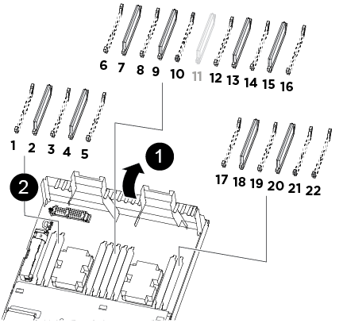

= Sostituire un modulo DIMM - AFF A320
:allow-uri-read: 
:icons: font
:imagesdir: ../media/

[role="lead"]
È necessario sostituire un modulo DIMM nel modulo controller quando il sistema registra un numero crescente di codici di correzione degli errori correggibili (ECC); in caso contrario, si verifica un errore di sistema.

Tutti gli altri componenti del sistema devono funzionare correttamente; in caso contrario, contattare il supporto tecnico.

È necessario sostituire il componente guasto con un componente FRU sostitutivo ricevuto dal provider.

== Fase 1: Spegnere il controller

Per spegnere il controller compromesso, è necessario determinare lo stato del controller e, se necessario, assumere il controllo del controller in modo che il controller integro continui a servire i dati provenienti dallo storage del controller compromesso.

.A proposito di questa attività
* Se si utilizza NetApp Storage Encryption, è necessario reimpostare il MSID seguendo le istruzioni riportate in link:https://docs.netapp.com/us-en/ontap/encryption-at-rest/return-seds-unprotected-mode-task.html["Ripristino dei SED in modalità non protetta"].
* Se si dispone di un sistema SAN, è necessario controllare i messaggi di evento  `cluster kernel-service show`) Per blade SCSI del controller deteriorati. Il `cluster kernel-service show` command visualizza il nome del nodo, lo stato del quorum di quel nodo, lo stato di disponibilità di quel nodo e lo stato operativo di quel nodo.
+
Ogni processo SCSI-blade deve essere in quorum con gli altri nodi del cluster. Eventuali problemi devono essere risolti prima di procedere con la sostituzione.

* Se si dispone di un cluster con più di due nodi, questo deve trovarsi in quorum. Se il cluster non è in quorum o un controller integro mostra false per idoneità e salute, è necessario correggere il problema prima di spegnere il controller compromesso; vedere link:https://docs.netapp.com/us-en/ontap/system-admin/synchronize-node-cluster-task.html?q=Quorum["Sincronizzare un nodo con il cluster"^].

.Fasi
. Se AutoSupport è attivato, eliminare la creazione automatica del caso richiamando un messaggio AutoSupport: `system node autosupport invoke -node * -type all -message MAINT=number_of_hours_downh`
+
Il seguente messaggio AutoSupport elimina la creazione automatica del caso per due ore: `cluster1:> system node autosupport invoke -node * -type all -message MAINT=2h`

. Disattivare il giveback automatico dalla console del controller integro: `storage failover modify –node local -auto-giveback false`
+

NOTE: Quando viene visualizzato _Vuoi disattivare il giveback automatico?_, inserisci `y`.

. Portare la centralina danneggiata al prompt DEL CARICATORE:
+
[cols="1,2"]
|===
| Se il controller non utilizzato visualizza... | Quindi... 

 a| 
Il prompt DEL CARICATORE
 a| 
Andare a Rimozione del modulo controller.

 a| 
In attesa di un giveback...
 a| 
Premere Ctrl-C, quindi rispondere `y` quando richiesto.

 a| 
Prompt di sistema o prompt della password
 a| 
Assumere il controllo o arrestare il controller compromesso dal controller integro: `storage failover takeover -ofnode _impaired_node_name_`

Quando il controller non utilizzato visualizza Waiting for giveback... (in attesa di giveback...), premere Ctrl-C e rispondere `y`.

|===

== Fase 2: Rimuovere il modulo controller

Per accedere ai componenti all'interno del modulo controller, è necessario rimuovere il modulo controller dallo chassis.

. Se non si è già collegati a terra, mettere a terra l'utente.
. Scollegare l'alimentazione del modulo controller dalla fonte di alimentazione.
. Allentare il gancio e la fascetta che fissano i cavi al dispositivo di gestione dei cavi, quindi scollegare i cavi di sistema e gli SFP (se necessario) dal modulo controller, tenendo traccia del punto in cui sono stati collegati i cavi.
+
image::../media/drw_a320_cable_management_arms.png[bracci di gestione cavi drw a320]

+
Lasciare i cavi nel dispositivo di gestione dei cavi in modo che quando si reinstalla il dispositivo di gestione dei cavi, i cavi siano organizzati.

. Rimuovere e mettere da parte i dispositivi di gestione dei cavi dai lati sinistro e destro del modulo controller.
. Rimuovere il modulo controller dal telaio:

image::../media/drw_a320_controller_remove_animated_gif.png[il controller drw a320 rimuove il gif animato]

. Inserire l'indice nel meccanismo di blocco su entrambi i lati del modulo controller.
. Premere verso il basso la linguetta arancione sulla parte superiore del meccanismo di chiusura fino a liberare il perno di chiusura sul telaio.
+
Il gancio del meccanismo di chiusura deve essere quasi verticale e non deve essere lontano dal perno del telaio.

. Tirare delicatamente il modulo controller di alcuni pollici verso di sé in modo da poter afferrare i lati del modulo controller.
. Con entrambe le mani, estrarre delicatamente il modulo controller dal telaio e posizionare il modulo su una superficie piana e stabile.

== Fase 3: Sostituire i DIMM di sistema

La sostituzione di un DIMM di sistema implica l'identificazione del DIMM di destinazione attraverso il relativo messaggio di errore, l'individuazione del DIMM di destinazione mediante la mappa FRU sul condotto dell'aria e la sostituzione del DIMM.

. Ruotare il condotto dell'aria in posizione aperta.
. Individuare i DIMM sul modulo controller.
+

+
|===

 a| 
image:../media/legend_icon_01.png["Numero di didascalia 1"]
 a| 
Condotto dell'aria

 a| 
image:../media/legend_icon_02.png["Numero di didascalia 2"]
 a| 
** Slot DIMM di sistema: 2,4, 7, 9, 13, 15, 18 e 20
** Slot NVDIMM: 11
+

NOTE: Il modulo NVDIMM è molto diverso dai DIMM di sistema.

|===
. Prendere nota dell'orientamento del DIMM nello zoccolo in modo da poter inserire il DIMM sostitutivo nell'orientamento corretto.
. Estrarre il modulo DIMM dal relativo alloggiamento spingendo lentamente le due linguette di espulsione dei moduli DIMM su entrambi i lati del modulo, quindi estrarre il modulo dal relativo alloggiamento.
+

NOTE: Tenere il modulo DIMM per i bordi in modo da evitare di esercitare pressione sui componenti della scheda a circuiti stampati del modulo DIMM.

. Rimuovere il modulo DIMM di ricambio dalla confezione antistatica, tenerlo per gli angoli e allinearlo allo slot.
+
La tacca tra i pin del DIMM deve allinearsi con la linguetta dello zoccolo.

. Assicurarsi che le linguette di espulsione del modulo DIMM sul connettore siano aperte, quindi inserire il modulo DIMM correttamente nello slot.
+
Il DIMM si inserisce saldamente nello slot, ma dovrebbe essere inserito facilmente. In caso contrario, riallineare il DIMM con lo slot e reinserirlo.

+

NOTE: Esaminare visivamente il DIMM per verificare che sia allineato in modo uniforme e inserito completamente nello slot.

. Spingere con cautela, ma con decisione, il bordo superiore del DIMM fino a quando le linguette dell'espulsore non scattano in posizione sulle tacche alle estremità del DIMM.
. Chiudere il condotto dell'aria.

== Fase 4: Installare il modulo controller

Dopo aver sostituito il componente nel modulo controller, è necessario reinstallare il modulo controller nel telaio.

. Se non è già stato fatto, chiudere il condotto dell'aria sul retro del modulo controller e reinstallare il coperchio sulle schede PCIe.
. Allineare l'estremità del modulo controller con l'apertura dello chassis, quindi spingere delicatamente il modulo controller a metà nel sistema.
+
image::../media/drw_a320_controller_install_animated_gif.png[gif animato installazione controller drw a320]

+

NOTE: Non inserire completamente il modulo controller nel telaio fino a quando non viene richiesto.

. Cablare solo le porte di gestione e console, in modo da poter accedere al sistema per eseguire le attività descritte nelle sezioni seguenti.
+

NOTE: I cavi rimanenti verranno collegati al modulo controller più avanti in questa procedura.

. Completare la reinstallazione del modulo controller:
+
.. Assicurarsi che i bracci del dispositivo di chiusura siano bloccati in posizione estesa.
.. Utilizzando i bracci del dispositivo di chiusura, spingere il modulo controller nell'alloggiamento dello chassis fino a quando non si arresta.
.. Tenere premuti le linguette arancioni sulla parte superiore del meccanismo di chiusura.
.. Spingere delicatamente il modulo controller nell'alloggiamento dello chassis fino a quando non è a filo con i bordi dello chassis.
+

NOTE: I bracci del meccanismo di chiusura scorrono nel telaio.

+
Il modulo controller inizia ad avviarsi non appena viene inserito completamente nello chassis.

.. Rilasciare i fermi per bloccare il modulo controller in posizione.
.. Rieseguire l'alimentatore.
.. Se non è già stato fatto, reinstallare il dispositivo di gestione dei cavi.

== Fase 5: Ripristinare il funzionamento del modulo controller

È necessario recuperare il sistema, restituire il modulo controller e riabilitare il giveback automatico.

. Ricable il sistema, come necessario.
+
Se sono stati rimossi i convertitori multimediali (QSFP o SFP), ricordarsi di reinstallarli se si utilizzano cavi in fibra ottica.

. Riportare il controller al funzionamento normale restituendo lo storage: `storage failover giveback -ofnode _impaired_node_name_`
. Se il giveback automatico è stato disattivato, riabilitarlo: `storage failover modify -node local -auto-giveback true`

== Fase 6: Restituire la parte guasta a NetApp

Restituire la parte guasta a NetApp, come descritto nelle istruzioni RMA fornite con il kit. Vedere https://mysupport.netapp.com/site/info/rma["Parti restituita  sostituzioni"] per ulteriori informazioni.
