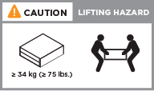
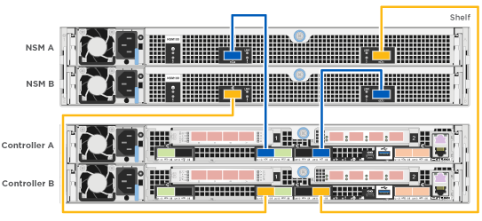

= Guida dettagliata - AFF A320
:allow-uri-read: 
:icons: font
:imagesdir: ../media/

[role="lead"]
Questa guida fornisce istruzioni dettagliate e dettagliate per l'installazione di un sistema NetApp tipico. Utilizzare questa guida per ottenere istruzioni di installazione più dettagliate.

== Preparazione per l'installazione

Per installare il sistema AFF A320, è necessario creare un account, registrare il sistema e ottenere le chiavi di licenza. È inoltre necessario inventariare il numero e il tipo di cavi appropriati per il sistema e raccogliere informazioni di rete specifiche.

È necessario accedere a Hardware Universe per ottenere informazioni sui requisiti del sito e ulteriori informazioni sul sistema configurato. Per ulteriori informazioni su questo sistema, è possibile accedere alle Note di rilascio della versione di ONTAP in uso.

https://hwu.netapp.com["NetApp Hardware Universe"]

http://mysupport.netapp.com/documentation/productlibrary/index.html?productID=62286["Trova le Note di rilascio relative alla tua versione di ONTAP 9"]

Devi fornire quanto segue presso la tua sede:

* Spazio rack per il sistema storage
* Cacciavite Phillips n. 2
* Cavi di rete aggiuntivi per collegare il sistema allo switch di rete e al laptop o alla console mediante un browser Web
* Computer portatile o console con connessione RJ-45 e accesso a un browser Web
+
.. Disimballare il contenuto di tutte le confezioni.
.. Annotare il numero di serie del sistema dai controller.
+
image::../media/drw_ssn_label.png[Esempio del numero di serie del sistema che mostra la posizione del numero]

.. Configurazione dell'account:
+
... Accedi al tuo account esistente o crea un account.
... Registrare il sistema.
+
https://mysupport.netapp.com/eservice/registerSNoAction.do?moduleName=RegisterMyProduct["Registrazione del prodotto NetApp"]

.. Fare un inventario e prendere nota del numero e dei tipi di cavi ricevuti.
+
La seguente tabella identifica i tipi di cavi che potrebbero essere ricevuti. Se si riceve un cavo non elencato nella tabella, consultare la Hardware Universe per individuare il cavo e identificarne l'utilizzo.

+
https://hwu.netapp.com["NetApp Hardware Universe"]

+
[cols="1,2,1,2"]
|===
| Tipo di cavo... | Codice e lunghezza del ricambio | Tipo di connettore | Per... 

 a| 
Cavo da 100 GbE (QSF(28)
 a| 
X66211A-05 (112-00595), 0,5 m.

X66211A-1 (112-00573), 1 m.

X66211A-2 (112-00574), 2 m

X66211A-5 (112-00574), 5 m.
 a| 
image:../media/oie_cable100_gbe_qsfp28.png["Connettore 100 GbE QSFP28"]
 a| 
Storage, interconnessione cluster/ha e dati Ethernet (in base all'ordine)

 a| 
Cavo da 40 GbE
 a| 
X66211A-1 (112-00573), 1 m;

X66211A-3 (112-00543), 3 m;

X66211A-5 (112-00576), 5 m.
 a| 
image:../media/oie_cable_sfp_gbe_copper.png["Connettore GbE SFP in rame"]
 a| 
Storage, interconnessione cluster/ha e dati Ethernet (in base all'ordine)

 a| 
Cavo Ethernet - MPO
 a| 
X66200-2 (112-00326), 2 m

X66250-5 (112-00328), 5 m.

X66250-30 (112-00331), 30 m.
 a| 
image:../media/oie_cable_etherned_mpo.png[""]
 a| 
Cavo Ethernet (in base all'ordine)

 a| 
Cavi ottici
 a| 
SR:

X6553-R6 (112-00188), 2 m

X6554-R6 (112-00189), 15 m.

X6537-R6 (112-00091), 30 m.

LR:

X66250-3 (112-00342), 2 m

X66260-5 (112-00344), 5 m.

X66260-30 (112-00354), 30 m.
 a| 
image:../media/oie_cable_fiber_lc_connector.png["Immagine che mostra un connettore LC in fibra ottica"]
 a| 
Configurazioni FC (in base all'ordine)

 a| 
RJ-45 (in base all'ordine)
 a| 
X6585-R6 (112-00291), 3 m.

X6562-R6 (112-00196), 5 m.
 a| 
image:../media/oie_cable_rj45.png["Connettore del cavo RJ-45"]
 a| 
Rete di gestione

 a| 
Cavo per console micro-USB
 a| 
Non applicabile
 a| 
image:../media/oie_cable_micro_usb.png["Immagine che mostra un connettore micro USB"]
 a| 
Connessione alla console utilizzata durante l'installazione del software se il laptop o la console non supportano il rilevamento della rete.

 a| 
Cavi di alimentazione
 a| 
Non applicabile
 a| 
image:../media/oie_cable_power.png["Cavi di alimentazione"]
 a| 
Accensione del sistema

|===
.. Scarica e completa il _foglio di lavoro di configurazione del cluster_.
+
https://library.netapp.com/ecm/ecm_download_file/ECMLP2839002["Foglio di lavoro per la configurazione del cluster"]

== Installare l'hardware

È necessario installare il sistema in un rack a 4 montanti o in un cabinet di sistema NetApp, a seconda dei casi.

. Installare i kit di guide, secondo necessità.
. Installare e fissare il sistema seguendo le istruzioni fornite con il kit di guide.
+

NOTE: È necessario essere consapevoli dei problemi di sicurezza associati al peso del sistema.

+

. Collegare i dispositivi di gestione dei cavi (come illustrato).
+
image::../media/drw_a320_cable_management_arms.png[Rimozione o installazione dei bracci di gestione dei cavi]

. Posizionare il pannello anteriore del sistema.

== Collegare i controller alla rete

È possibile collegare i controller alla rete utilizzando il metodo cluster senza switch a due nodi o la rete di interconnessione del cluster.

=== Opzione 1: Collegare un cluster senza switch a due nodi

Le porte dati opzionali, le schede NIC opzionali e le porte di gestione dei moduli controller sono collegate agli switch. Le porte di interconnessione cluster/ha sono cablate su entrambi i moduli controller.

Per informazioni sulla connessione del sistema agli switch, contattare l'amministratore di rete.

Verificare che la freccia dell'illustrazione sia orientata correttamente con la linguetta di estrazione del connettore del cavo.

image::../media/oie_cable_pull_tab_up.png[Connettore per cavo con linguetta di estrazione sulla parte superiore]

NOTE: Quando si inserisce il connettore, si dovrebbe avvertire uno scatto in posizione; se non si sente uno scatto, rimuoverlo, ruotarlo e riprovare.

. È possibile utilizzare l'illustrazione o le istruzioni dettagliate per completare il cablaggio tra i controller e gli switch:
+
image::../media/drw_a320_tnsc_network_cabling_composite_animated_gif.png[gif animata composita di cablaggio di rete drw a320 tnsc]

+
[cols="1,2"]
|===
| Fase | Eseguire su ciascun modulo controller 

 a| 
image:../media/oie_legend_icon_1_lg.png["Fase 1"]
 a| 
Collegare tra loro le porte cluster/ha con il cavo da 100 GbE (QSFP28):

** da e0a e0a
** da e0d a e0dimage:../media/drw_a320_tnsc_cluster_ha_connection_step1a.png[""]

 a| 
image:../media/oie_legend_icon_2_o.png["Passaggio 2"]
 a| 
Se si utilizzano le porte integrate per una connessione di rete dati, collegare i cavi 100GbE o 40GbE agli switch di rete dati appropriati:

** e0g e e0himage:../media/drw_a320_onboard_data_connection_step2.png[""]

 a| 
image:../media/oie_legend_icon_3_dr.png["Passaggio 3"]
 a| 
Se si utilizzano schede NIC per connessioni Ethernet o FC, collegare le schede NIC agli switch appropriati:

image::../media/drw_a320_nic_connections_step3.png[connessioni niche drw a320, punto 3]

 a| 
image:../media/oie_legend_icon_4_lp.png["Passaggio 4"]
 a| 
Collegare le porte e0M agli switch della rete di gestione con i cavi RJ45.

image:../media/drw_a320_management_port_connection_step4.png[""]

 a| 
image:../media/oie_legend_icon_attn_symbol.png["Simbolo di attenzione"]
 a| 
NON collegare i cavi di alimentazione a questo punto.

|===
. Cablare lo storage: <<Cavi controller per gli shelf di dischi>>

=== Opzione 2: Cablaggio di un cluster con switch

Le porte dati opzionali, le schede NIC opzionali e le porte di gestione dei moduli controller sono collegate agli switch. Le porte di interconnessione cluster/ha sono cablate al cluster/switch ha.

Per informazioni sulla connessione del sistema agli switch, contattare l'amministratore di rete.

Verificare che la freccia dell'illustrazione sia orientata correttamente con la linguetta di estrazione del connettore del cavo.

image::../media/oie_cable_pull_tab_up.png[Connettore per cavo con linguetta di estrazione sulla parte superiore]

NOTE: Quando si inserisce il connettore, si dovrebbe avvertire uno scatto in posizione; se non si sente uno scatto, rimuoverlo, ruotarlo e riprovare.

. È possibile utilizzare l'illustrazione o le istruzioni dettagliate per completare il cablaggio tra i controller e gli switch:
+
image::../media/drw_a320_switched_network_cabling_composite_animated_GIF.png[GIF animato composito con cablaggio di rete con switch drw a320]

+
[cols="1,3"]
|===
| Fase | Eseguire su ciascun modulo controller 

 a| 
image:../media/oie_legend_icon_1_lg.png["Fase 1"]
 a| 
Collegare le porte cluster/ha allo switch cluster/ha con il cavo 100 GbE (QSFP28):

** E0a su entrambi i controller allo switch cluster/ha
** E0d su entrambi i controller allo switch cluster/haimage:../media/drw_a320_switched_cluster_ha_connection_step1b.png[""]

 a| 
image:../media/oie_legend_icon_2_o.png["Passaggio 2"]
 a| 
Se si utilizzano le porte integrate per una connessione di rete dati, collegare i cavi 100GbE o 40GbE agli switch di rete dati appropriati:

** e0g e e0himage:../media/drw_a320_onboard_data_connection_step2.png[""]

 a| 
image:../media/oie_legend_icon_3_dr.png["Passaggio 3"]
 a| 
Se si utilizzano schede NIC per connessioni Ethernet o FC, collegare le schede NIC agli switch appropriati:

image::../media/drw_a320_nic_connections_step3.png[connessioni niche drw a320, punto 3]

 a| 
image:../media/oie_legend_icon_4_lp.png["Passaggio 4"]
 a| 
Collegare le porte e0M agli switch della rete di gestione con i cavi RJ45.

image:../media/drw_a320_management_port_connection_step4.png[""]

 a| 
image:../media/oie_legend_icon_attn_symbol.png["Simbolo di attenzione"]
 a| 
NON collegare i cavi di alimentazione a questo punto.

|===
. Cablare lo storage: <<Cavi controller per gli shelf di dischi>>

== Cavi controller per gli shelf di dischi

È necessario collegare i controller agli shelf utilizzando le porte di storage integrate.

=== Opzione 1: Collegare i controller a un singolo shelf di dischi

È necessario collegare ciascun controller ai moduli NSM sullo shelf di dischi NS224.

Verificare che la freccia dell'illustrazione sia orientata correttamente con la linguetta di estrazione del connettore del cavo.

image::../media/oie_cable_pull_tab_up.png[Connettore per cavo con linguetta di estrazione sulla parte superiore]

NOTE: Quando si inserisce il connettore, si dovrebbe avvertire uno scatto in posizione; se non si sente uno scatto, rimuoverlo, ruotarlo e riprovare.

. È possibile utilizzare l'illustrazione o le istruzioni dettagliate per collegare i controller a un singolo shelf.
+

+
[cols="1,3"]
|===
| Fase | Eseguire su ciascun modulo controller 

 a| 
image:../media/oie_legend_icon_1_mb.png["Numero di didascalia 1"]
 a| 
Collegare il controller a allo shelf image:../media/drw_a320_storage_cabling_controller_a_single_shelf.png[""]

 a| 
image:../media/oie_legend_icon_2_lo.png["Numero di didascalia 2"]
 a| 
Collegare il controller del cavo B allo shelf: image:../media/drw_a320_storage_cabling_controller_b_single_shelf.png[""]

|===
. Per completare la configurazione del sistema, vedere <<Completare la configurazione e l'installazione del sistema>>

=== Opzione 2: Collegare i controller a due shelf di dischi

È necessario collegare ciascun controller ai moduli NSM su entrambi gli shelf di dischi NS224.

Verificare che la freccia dell'illustrazione sia orientata correttamente con la linguetta di estrazione del connettore del cavo.

image::../media/oie_cable_pull_tab_up.png[Connettore per cavo con linguetta di estrazione sulla parte superiore]

NOTE: Quando si inserisce il connettore, si dovrebbe avvertire uno scatto in posizione; se non si sente uno scatto, rimuoverlo, ruotarlo e riprovare.

. È possibile utilizzare la seguente illustrazione o la procedura scritta per collegare i controller a due shelf di dischi.
+
image::../media/drw_a320_2_shevles_cabling_animated_gif.png[i 2 cavi del drw a320 sono animati gif]

+
[cols="1-3"]
|===
| Fase | Eseguire su ciascun modulo controller 

 a| 
image:../media/oie_legend_icon_1_mb.png["Numero di didascalia 1"]
 a| 
Collegare il controller dei cavi A agli shelf: image:../media/drw_a320_2_shelves_cabling_controller_a.png[""]

 a| 
image:../media/oie_legend_icon_2_lo.png["Numero di didascalia 2"]
 a| 
Collegare il controller dei cavi B agli shelf: image:../media/drw_a320_2_shelves_cabling_controller_b.png[""]

|===
. Per completare la configurazione del sistema, vedere <<Completare la configurazione e l'installazione del sistema>>

== Completare la configurazione e l'installazione del sistema

È possibile completare l'installazione e la configurazione del sistema utilizzando il rilevamento del cluster solo con una connessione allo switch e al laptop oppure collegandosi direttamente a un controller del sistema e quindi allo switch di gestione.

=== Opzione 1: Completamento della configurazione e della configurazione del sistema se è attivato il rilevamento della rete

Se sul laptop è attivata la funzione di rilevamento della rete, è possibile completare l'installazione e la configurazione del sistema utilizzando la funzione di rilevamento automatico del cluster.

. Collegare i cavi di alimentazione agli alimentatori del controller, quindi collegarli a fonti di alimentazione su diversi circuiti.
+
Il sistema inizia l'avvio. L'avvio iniziale può richiedere fino a otto minuti

. Assicurarsi che il rilevamento della rete sia attivato sul laptop.
+
Per ulteriori informazioni, consultare la guida in linea del portatile.

. Utilizzare la seguente animazione per collegare il laptop allo switch di gestione.
+
.Animazione - collegare il laptop allo switch di gestione
video::d61f983e-f911-4b76-8b3a-ab1b0066909b[panopto]
. Selezionare un'icona ONTAP elencata per scoprire:
+
image::../media/drw_autodiscovery_controler_select.png[Selezionare un'icona ONTAP]

+
.. Aprire file Explorer.
.. Fare clic su Network (rete) nel riquadro sinistro.
.. Fare clic con il pulsante destro del mouse e selezionare Aggiorna.
.. Fare doppio clic sull'icona ONTAP e accettare i certificati visualizzati sullo schermo.
+

NOTE: XXXXX è il numero di serie del sistema per il nodo di destinazione.

+
Viene visualizzato Gestione sistema.

. Utilizza la configurazione guidata di System Manager per configurare il tuo sistema utilizzando i dati raccolti nella _Guida alla configurazione di NetApp ONTAP_.
+
https://library.netapp.com/ecm/ecm_download_file/ECMLP2862613["Guida alla configurazione di ONTAP"]

. Verificare lo stato del sistema eseguendo Config Advisor.
. Una volta completata la configurazione iniziale, passare alla https://www.netapp.com/data-management/oncommand-system-documentation/["ONTAP  risorse di documentazione per il gestore di sistema ONTAP"] Pagina per informazioni sulla configurazione di funzioni aggiuntive in ONTAP.

=== Opzione 2: Completamento della configurazione e della configurazione del sistema se il rilevamento della rete non è attivato

Se il rilevamento della rete non è abilitato sul laptop, è necessario completare la configurazione e la configurazione utilizzando questa attività.

. Cablare e configurare il laptop o la console:
+
.. Impostare la porta della console del portatile o della console su 115,200 baud con N-8-1.
+

NOTE: Per informazioni su come configurare la porta della console, consultare la guida in linea del portatile o della console.

.. Collegare il cavo della console al laptop o alla console utilizzando il cavo della console fornito con il sistema, quindi collegare il laptop allo switch di gestione sulla subnet di gestione.
+
image::../media/drw_a320_laptop_to_switch_and_controller.png[computer portatile drw a320 per switch e controller]

.. Assegnare un indirizzo TCP/IP al portatile o alla console, utilizzando un indirizzo presente nella subnet di gestione.

. Utilizzare la seguente animazione per impostare uno o più ID shelf di dischi:
+
.Animazione - impostazione degli ID dello shelf di dischi
video::c600f366-4d30-481a-89d9-ab1b0066589b[panopto]
. Collegare i cavi di alimentazione agli alimentatori del controller, quindi collegarli a fonti di alimentazione su diversi circuiti.
+
Il sistema inizia l'avvio. L'avvio iniziale può richiedere fino a otto minuti

. Assegnare un indirizzo IP di gestione del nodo iniziale a uno dei nodi.
+
[cols="1,3"]
|===
| Se la rete di gestione dispone di DHCP... | Quindi... 

 a| 
Configurato
 a| 
Registrare l'indirizzo IP assegnato ai nuovi controller.

 a| 
Non configurato
 a| 
.. Aprire una sessione della console utilizzando putty, un server terminal o un server equivalente per l'ambiente in uso.
+

NOTE: Se non si sa come configurare PuTTY, consultare la guida in linea del portatile o della console.

.. Inserire l'indirizzo IP di gestione quando richiesto dallo script.

|===
. Utilizzando System Manager sul laptop o sulla console, configurare il cluster:
+
.. Puntare il browser sull'indirizzo IP di gestione del nodo.
+

NOTE: Il formato dell'indirizzo è +https://x.x.x.x+.

.. Configurare il sistema utilizzando i dati raccolti nella _Guida alla configurazione di NetApp ONTAP_.
+
https://library.netapp.com/ecm/ecm_download_file/ECMLP2862613["Guida alla configurazione di ONTAP"]

. Verificare lo stato del sistema eseguendo Config Advisor.
. Una volta completata la configurazione iniziale, passare alla https://www.netapp.com/data-management/oncommand-system-documentation/["ONTAP  risorse di documentazione per il gestore di sistema ONTAP"] Pagina per informazioni sulla configurazione di funzioni aggiuntive in ONTAP.

