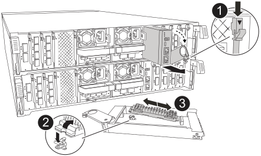

= Sostituire i supporti di avvio - AFF A70, AFF A90
:allow-uri-read: 
:icons: font
:imagesdir: ../media/

[role="lead"]
Per sostituire il supporto di avvio, è necessario rimuovere il modulo di gestione del sistema dal retro del sistema, rimuovere il supporto di avvio danneggiato, installare il supporto di avvio sostitutivo nel modulo di gestione del sistema e trasferire l'immagine di avvio su un'unità flash USB.

== Fase 1: Sostituire il supporto di avvio

Il supporto di avvio si trova all'interno del modulo di gestione del sistema ed è accessibile rimuovendo il modulo dal sistema.

[cols="1,4"]
|===

 a| 
image::../media/legend_icon_01.svg[Numero di didascalia 1]
 a| 
Dispositivo di chiusura della camma del modulo di gestione del sistema

 a| 
image::../media/legend_icon_02.svg[Numero di didascalia 2]
 a| 
Pulsante di blocco dei supporti di avvio

 a| 
image::../media/legend_icon_03.svg[Numero di didascalia 3]
 a| 
Supporto di boot

|===
. Nella parte anteriore dello chassis, premere con decisione ciascun disco fino a quando non si avverte un arresto positivo. In questo modo, i dischi sono posizionati saldamente sulla scheda intermedia dello chassis.
+
image::../media/drw_a800_drive_seated_IEOPS-960.svg[Disco drw a800 installato IEOPS 960]

. Andare sul retro del telaio. Se non si è già collegati a terra, mettere a terra l'utente.
. Scollegare l'alimentazione al modulo controller estraendo il modulo controller di circa tre pollici:
+
.. Premere verso il basso entrambi i fermi di bloccaggio del modulo controller, quindi ruotare entrambi i fermi contemporaneamente verso il basso.
.. Estrarre il modulo controller di circa 3 pollici dal telaio per disinserire l'alimentazione.
.. Rimuovere tutti i cavi collegati al modulo di gestione del sistema. Assicurarsi di etichettare il punto in cui sono stati collegati i cavi, in modo da poterli collegare alle porte corrette quando si reinstalla il modulo.
.. Ruotare il vassoio di gestione dei cavi verso il basso tirando i pulsanti su entrambi i lati all'interno del vassoio di gestione dei cavi, quindi ruotare il vassoio verso il basso.
.. Premere il pulsante della camma di gestione del sistema. La leva della camma si allontana dal telaio.
.. Ruotare la leva della camma completamente verso il basso e rimuovere il modulo di gestione del sistema dal modulo controller.
.. Posizionare il modulo di gestione del sistema su un tappetino antistatico, in modo che il supporto di avvio sia accessibile.

. Rimuovere il supporto di avvio dal modulo di gestione:
+
.. Premere il pulsante di bloccaggio blu.
.. Ruotare il supporto di avvio verso l'alto, farlo scorrere fuori dallo zoccolo e metterlo da parte.

. Installare il supporto di avvio sostitutivo nel modulo di gestione del sistema:
+
.. Allineare i bordi del supporto di avvio con l'alloggiamento dello zoccolo, quindi spingerlo delicatamente a squadra nello zoccolo.
.. Ruotare il supporto di avvio verso il basso verso il pulsante di bloccaggio.
.. Premere il pulsante di bloccaggio, ruotare completamente il supporto di avvio e rilasciare il pulsante di bloccaggio.

. Reinstallare il modulo di gestione del sistema:
+
.. Ruotare il vassoio di gestione dei cavi verso l'alto fino alla posizione di chiusura.
.. Eseguire il richiamo del modulo Gestione del sistema.

== Fase 2: Trasferire l'immagine di avvio sul supporto di avvio

Il supporto di avvio sostitutivo installato non dispone di un'immagine ONTAP, pertanto è necessario trasferire un'immagine ONTAP utilizzando un'unità flash USB.

.Prima di iniziare
* È necessario disporre di un'unità flash USB, formattata con FAT32, con almeno 4 GB di capacità.
* È necessario disporre di una copia della stessa versione dell'immagine di ONTAP del controller danneggiato in esecuzione. È possibile scaricare l'immagine appropriata dalla https://support.netapp.com/downloads["Download"] sezione sul sito di assistenza NetApp
+
** Se NVE è supportato, scaricare l'immagine con crittografia dei volumi di NetApp, come indicato nel pulsante di download.
** Se NVE non è supportato, scaricare l'immagine senza crittografia dei volumi di NetApp, come indicato nel pulsante di download.

* Se il sistema è una coppia ha, è necessario disporre di una connessione di rete tra le porte di gestione dei nodi dei controller (in genere le interfacce e0M).

.Fasi
. Scaricare e copiare l'immagine di servizio appropriata da https://mysupport.netapp.com/["Sito di supporto NetApp"] nell'unità flash USB.
+
.. Scaricare l'immagine del servizio dal collegamento Download nella pagina, nello spazio di lavoro del computer portatile.
.. Decomprimere l'immagine del servizio.
+

NOTE: Se si stanno estraendo i contenuti utilizzando Windows, non utilizzare WinZip per estrarre l'immagine netboot. Utilizzare un altro strumento di estrazione, ad esempio 7-zip o WinRAR.

+
L'unità flash USB dovrebbe avere l'immagine ONTAP appropriata di ciò che il controller danneggiato è in esecuzione.

+
.. Rimuovere l'unità flash USB dal computer portatile.

. Inserire l'unità flash USB nella porta USB-A del modulo di gestione del sistema.
+
Assicurarsi di installare l'unità flash USB nello slot contrassegnato per i dispositivi USB e non nella porta della console USB.

. Ricollegare l'alimentazione al modulo controller:
+
.. Spingere con decisione il modulo controller nello chassis fino a quando non raggiunge la scheda intermedia e non è completamente inserito.
+
I fermi di bloccaggio si sollevano quando il modulo controller è completamente inserito.

.. Ruotare i fermi di bloccaggio verso l'alto in posizione bloccata.
+
Il controller inizia ad avviarsi non appena l'alimentazione viene ricollegata al sistema.

. Interrompere il processo di avvio premendo Ctrl-C per interrompere il PROCESSO al prompt DEL CARICATORE.
+
Se non viene visualizzato questo messaggio, premere Ctrl-C, selezionare l'opzione per avviare la modalità di manutenzione, quindi arrestare il controller per avviare IL CARICATORE.

. Impostare il tipo di connessione di rete al prompt DEL CARICATORE:
+
** Se si sta configurando DHCP: `ifconfig e0M -auto`
+

NOTE: La porta di destinazione configurata è la porta di destinazione utilizzata per comunicare con il controller compromesso dal controller integro durante il ripristino del file system var con una connessione di rete. È anche possibile utilizzare la porta e0M in questo comando.

** Se si configurano connessioni manuali: `ifconfig e0M -addr=filer_addr -mask=netmask -gw=gateway`
+
*** Filer_addr è l'indirizzo IP del sistema di storage.
*** Netmask è la maschera di rete della rete di gestione connessa al partner ha.
*** gateway è il gateway per la rete.

+

NOTE: Potrebbero essere necessari altri parametri per l'interfaccia. Per ulteriori informazioni, immettere help ifconfig al prompt del firmware.

