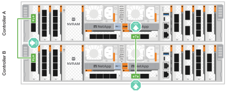

= Collegare l'hardware - AFF A70, AFF A90
:allow-uri-read: 
:icons: font
:imagesdir: ../media/

[role="lead"]
Cablare controller e shelf in base alla configurazione specifica del sistema storage.

.Prima di iniziare
Per l'orientamento corretto della linguetta di estrazione del connettore del cavo, consultare la freccia degli schemi dei cavi.

image::../media/drw_cable_pull_tab_direction_ieops-1699.svg[Esempio di orientamento della linguetta di estrazione del cavo]

* Quando si inserisce il connettore, si dovrebbe avvertire uno scatto in posizione; se non si sente uno scatto, rimuoverlo, capovolgere la testa del cavo e riprovare.
* Se si effettua il collegamento a uno switch ottico, inserire il modulo SFP nella porta del controller prima di collegarlo alla porta.

== Fase 1: Collegare i controller alla rete

Collegare i controller alla rete come cluster senza switch a due nodi o come cluster con switch.

.Prima di iniziare
Contattare l'amministratore di rete per informazioni sulla connessione del sistema di archiviazione agli switch.

.A proposito di questa attività
Queste procedure mostrano le configurazioni comuni. Tenete presente che il cablaggio specifico dipende dai componenti ordinati per il vostro sistema di storage. Per informazioni dettagliate sulla configurazione e la priorità degli slot, vedere link:https://hwu.netapp.com["NetApp Hardware Universe"^].

[role="tabbed-block"]
====
.Opzione 1: Cluster senza switch via cavo
--
Collegamento via cavo delle connessioni del cluster senza switch.

.Fasi
. Collegare le porte di interconnessione Cluster/ha da E1a a E1a e da e7a a e7a con il cavo di interconnessione Cluster/ha.
+

NOTE: Il traffico di cluster Interconnect e quello di ha condividono le stesse porte fisiche.

+
image::../media/oie_cable_25Gb_Ethernet_SFP28_IEOPS-1069.svg[Cavo ha del cluster]

+
*Cavi di interconnessione cluster/ha*

+

. Collegare le porte del modulo Ethernet alla rete host.
+
Di seguito sono riportati alcuni esempi tipici di cablaggio della rete host. Per informazioni sulla configurazione specifica del sistema, vedere link:https://hwu.netapp.com["NetApp Hardware Universe"^] .

+
.. Collegare le porte via cavo e9a e e9b allo switch di rete dati Ethernet, come illustrato.
+

NOTE: Per ottenere le massime performance di sistema per il traffico cluster e ha, si consiglia di non utilizzare le porte e1b e e7b per le connessioni di rete host. Utilizzare una scheda host separata per ottimizzare le prestazioni.

+
*Cavo 100 GbE*

+
image::../media/oie_cable_sfp_gbe_copper.svg[100GB cavo Ethernet]

+
image::../media/drw_70-90_network_cabling1_ieops-1654.svg[Cavo alla rete Ethernet da 100 GB]

.. Collegare gli switch di rete host 10/25 GbE.
+
*4 porte, 10/25 GbE host*

+
image::../media/oie_cable_sfp_gbe_copper.svg[Cavo da 10/25 GB]

+
image::../media/drw_70-90_network_cabling2_ieops-1655.svg[Cavo alla rete Ethernet 100GB]

. Collegare le porte di gestione del controller (chiave inglese) agli switch di rete di gestione con cavi RJ-45 1000BASE-T.
+
image::../media/oie_cable_rj45.svg[RJ45 cavi]

+
*CAVI RJ-45 1000BASE-T.

+
image::../media/drw_70-90_management_connection_ieops-1656.svg[Connettersi alla rete di gestione]

IMPORTANT: NON collegare ancora i cavi di alimentazione.

--
.Opzione 2: Cluster con switch via cavo
--
Collegare via cavo le connessioni del cluster con switch.

.Fasi
. Effettuare i seguenti collegamenti:
+

NOTE: Il traffico di cluster Interconnect e quello di ha condividono le stesse porte fisiche.

+
.. Porta del cavo E1a sul controller A e porta E1a sul controller B allo switch di rete del cluster A.
.. Porta del cavo e7a sul controller A e porta e7a sul controller B allo switch di rete del cluster B.
+
*Cavo 100 GbE*

+
image::../media/oie_cable100_gbe_qsfp28.svg[Cavo da 100 GB]

+
image::../media/drw_70-90_switched_cluster_cabling_ieops-1657.svg[Connessioni cluster via cavo alla rete cluster]

. Collegare le porte del modulo Ethernet alla rete host.
+
Di seguito sono riportati alcuni esempi tipici di cablaggio della rete host. Per informazioni sulla configurazione specifica del sistema, vedere link:https://hwu.netapp.com["NetApp Hardware Universe"^] .

+
.. Collegare le porte via cavo e9a e e9b allo switch di rete dati Ethernet, come illustrato.
+

NOTE: Per ottenere le massime performance di sistema per il traffico cluster e ha, si consiglia di non utilizzare le porte e1b e e7b per le connessioni di rete host. Utilizzare una scheda host separata per ottimizzare le prestazioni.

+
*Cavo 100 GbE*

+
image::../media/oie_cable_sfp_gbe_copper.svg[100GB cavo Ethernet]

+
image::../media/drw_70-90_network_cabling1_ieops-1654.svg[Cavo alla rete Ethernet 100GB]

.. Collegare gli switch di rete host 10/25 GbE.
+
*4 porte, 10/25 GbE host*

+
image::../media/oie_cable_sfp_gbe_copper.svg[Cavo Ethernet 10/25GB]

+
image::../media/drw_70-90_network_cabling2_ieops-1655.svg[Cavo alla rete Ethernet 10/25GB]

. Collegare le porte di gestione del controller (chiave inglese) agli switch di rete di gestione con cavi RJ-45 1000BASE-T.
+
image::../media/oie_cable_rj45.svg[Cavi RJ-45]

+
*CAVI RJ-45 1000BASE-T.

+
image::../media/drw_70-90_management_connection_ieops-1656.svg[Connettersi alla rete di gestione]

IMPORTANT: NON collegare ancora i cavi di alimentazione.

--
====

== Passaggio 2: Collegare i controller agli shelf

Collega i controller allo shelf o agli shelf.

Queste procedure mostrano come collegare i controller a uno scaffale e a due ripiani. Puoi connettere i tuoi controller a un massimo di quattro shelf.

[role="tabbed-block"]
====
.Opzione 1: Cavo a uno shelf NS224
--
Collegare ciascun controller ai moduli NSM sullo shelf NS224. La grafica mostra il cablaggio di ciascuno dei controller: Il cablaggio del controller A in blu e il cablaggio del controller B in giallo.

.Fasi
. Collegare la porta e11a del controller A alla porta NSM A e0a.
. Collegare la porta e11b del controller A alla porta NSM B e0b.
+
image:../media/drw_a70-90_1shelf_cabling_a_ieops-1731.svg["Controller A e11a e e11b su un singolo shelf NS224"]

. Collegare la porta e11a del controller B alla porta NSM B e0a.
. Collegare la porta e11b del controller B alla porta NSM A e0b.
+
image:../media/drw_a70-90_1shelf_cabling_b_ieops-1732.svg["Controller B e11a e e11b su un singolo shelf NS224"]

--
.Opzione 2: Cavo a due ripiani NS224
--
Collegare ciascun controller ai moduli NSM su entrambi i ripiani NS224. La grafica mostra il cablaggio di ciascuno dei controller: Il cablaggio del controller A in blu e il cablaggio del controller B in giallo.

.Fasi
. Sul controller A, collegare i seguenti collegamenti:
+
.. Collegare la porta e11a allo shelf 1, la porta NSM A e0a.
.. Collegare la porta e11b allo shelf 2, la porta NSM B e0b.
.. Collegare la porta E8a allo shelf 2, la porta NSM A e0a.
.. Collegare la porta e8b allo shelf 1, la porta NSM B e0b.
+
image:../media/drw_a70-90_2shelf_cabling_a_ieops-1733.svg["Connessioni da controller a shelf per il controller A"]

. Sul controller B, collegare i seguenti collegamenti:
+
.. Collegare la porta e11a allo shelf 1, la porta NSM B e0a.
.. Collegare la porta e11b allo shelf 2, la porta NSM A e0b.
.. Collegare la porta E8a allo shelf 2, la porta NSM B e0a.
.. Collegare la porta e8b allo shelf 1, la porta NSM A e0b.
+
image:../media/drw_a70-90_2shelf_cabling_b_ieops-1734.svg["Connessioni da controller a shelf per il controller B"]

--
====