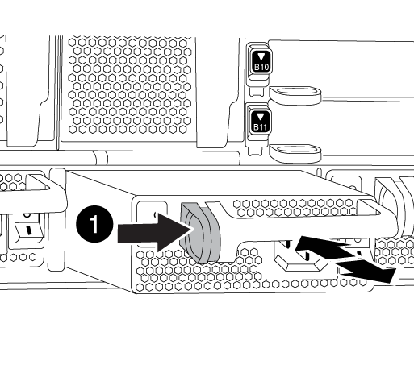

= Spostare e sostituire l'hardware - AFF A700
:allow-uri-read: 
:icons: font
:imagesdir: ../media/

[role="lead"]
Spostare le ventole, i dischi rigidi e il modulo controller o i moduli dallo chassis guasto al nuovo chassis, quindi sostituire lo chassis compromesso dal rack dell'apparecchiatura o dall'armadietto del sistema con il nuovo chassis dello stesso modello dello chassis compromesso.

== Fase 1: Rimuovere gli alimentatori

.Fasi
La rimozione degli alimentatori durante la sostituzione di uno chassis comporta lo spegnimento, lo scollegamento e la rimozione dell'alimentatore dal vecchio chassis.

. Se non si è già collegati a terra, mettere a terra l'utente.
. Spegnere l'alimentatore e scollegare i cavi di alimentazione:
+
.. Spegnere l'interruttore di alimentazione dell'alimentatore.
.. Aprire il fermo del cavo di alimentazione, quindi scollegare il cavo di alimentazione dall'alimentatore.
.. Scollegare il cavo di alimentazione dalla fonte di alimentazione.

. Tenere premuto il pulsante arancione sulla maniglia dell'alimentatore, quindi estrarre l'alimentatore dallo chassis.
+

CAUTION: Quando si rimuove un alimentatore, utilizzare sempre due mani per sostenerne il peso.

+

+
[cols="1,3"]
|===

 a| 
image:../media/icon_round_1.png["Numero di didascalia 1"]
 a| 
Pulsante di bloccaggio

|===
. Ripetere i passi precedenti per tutti gli alimentatori rimanenti.

== Fase 2: Rimuovere le ventole

Per rimuovere i moduli delle ventole durante la sostituzione dello chassis, è necessario eseguire una sequenza specifica di attività.

.Fasi
. Rimuovere il pannello (se necessario) con due mani, afferrando le aperture su ciascun lato del pannello, quindi tirandolo verso di sé fino a quando non si sgancia dai perni sferici sul telaio.
. Premere il pulsante arancione sul modulo della ventola ed estrarre il modulo della ventola dal telaio, assicurandosi di sostenerlo con la mano libera.
+

CAUTION: I moduli della ventola sono corti. Sostenere sempre la parte inferiore del modulo della ventola con la mano libera in modo che non cada improvvisamente dal telaio e non causi lesioni.

+
image::../media/drw_9000_remove_install_fan.png[Rimuovere le ventole]

+
[cols="1,3"]
|===

 a| 
image:../media/icon_round_1.png["Numero di didascalia 1"]
 a| 
Pulsante di rilascio arancione

|===
. Mettere da parte il modulo della ventola.
. Ripetere i passaggi precedenti per tutti i moduli ventola rimanenti.

== Fase 3: Rimuovere il modulo controller

Per sostituire lo chassis, è necessario rimuovere il modulo controller o i moduli dal vecchio chassis.

.Fasi
. Scollegare i cavi dal modulo controller guasto e tenere traccia del punto in cui sono stati collegati i cavi.
. Far scorrere il pulsante arancione sulla maniglia della camma verso il basso fino a sbloccarla.
+
image::../media/drw_9000_remove_pcm.png[Rimuovere il modulo controller]

+
[cols="1,3"]
|===

 a| 
image:../media/icon_round_1.png["Numero di didascalia 1"]
 a| 
Pulsante di rilascio della maniglia della camma

 a| 
image:../media/icon_round_2.png["Numero di didascalia 2"]
 a| 
Maniglia CAM

|===
. Ruotare la maniglia della camma in modo da disimpegnare completamente il modulo controller dal telaio, quindi estrarre il modulo controller dal telaio.
+
Assicurarsi di sostenere la parte inferiore del modulo controller mentre lo si sposta fuori dallo chassis.

. Mettere da parte il modulo controller in un luogo sicuro e ripetere questa procedura se si dispone di un altro modulo controller nello chassis.

== Fase 4: Rimuovere i moduli i/O.

.Fasi
Per rimuovere i moduli i/o dal vecchio chassis, inclusi i moduli NVRAM, seguire la sequenza specifica dei passaggi. Non è necessario rimuovere il modulo FlashCache dal modulo NVRAM quando lo si sposta in un nuovo chassis.

. Scollegare i cavi associati al modulo i/o di destinazione.
+
Assicurarsi di etichettare i cavi in modo da conoscerne la provenienza.

. Rimuovere il modulo i/o di destinazione dallo chassis:
+
.. Premere il tasto contrassegnato e numerato CAM.
+
Il pulsante CAM si allontana dal telaio.

.. Ruotare il fermo della camma verso il basso fino a portarlo in posizione orizzontale.
+
Il modulo i/o si disinnesta dallo chassis e si sposta di circa 1/2 pollici fuori dallo slot i/O.

.. Rimuovere il modulo i/o dallo chassis tirando le linguette sui lati del lato anteriore del modulo.
+
Assicurarsi di tenere traccia dello slot in cui si trovava il modulo i/O.

+
image::../media/drw_9000_remove_pcie_module.png[Rimuovere un modulo PCIe]

+
[cols="1,3"]
|===

 a| 
image:../media/icon_round_1.png["Numero di didascalia 1"]
 a| 
Latch i/o Cam intestato e numerato

 a| 
image:../media/icon_round_2.png["Numero di didascalia 2"]
 a| 
Fermo i/o Cam completamente sbloccato

|===

. Mettere da parte il modulo i/O.
. Ripetere il passaggio precedente per i moduli i/o rimanenti nel vecchio chassis.

== Fase 5: Rimuovere il modulo di alimentazione del controller di de-stage

.Fasi
È necessario rimuovere i moduli di alimentazione del controller di de-stage dal vecchio chassis in preparazione dell'installazione del telaio sostitutivo.

. Premere il pulsante di blocco arancione sulla maniglia del modulo, quindi far scorrere il modulo DCPM fuori dal telaio.
+
image::../media/drw_9000_remove_nv_battery.png[Rimuovere la batteria NV]

+
[cols="1,3"]
|===

 a| 
image:../media/icon_round_1.png["Numero di didascalia 1"]
 a| 
Pulsante di blocco arancione del modulo DCPM

|===
. Mettere da parte il modulo DCPM in un luogo sicuro e ripetere questo passaggio per il modulo DCPM rimanente.

== Fase 6: Sostituire uno chassis all'interno del rack dell'apparecchiatura o dell'armadietto del sistema

.Fasi
Prima di installare lo chassis sostitutivo, è necessario rimuovere lo chassis esistente dal rack dell'apparecchiatura o dall'armadietto del sistema.

. Rimuovere le viti dai punti di montaggio del telaio.
+

NOTE: Se il sistema si trova in un cabinet di sistema, potrebbe essere necessario rimuovere la staffa di ancoraggio posteriore.

. Con l'aiuto di due o tre persone, far scorrere il vecchio chassis dalle guide del rack in un cabinet di sistema o dalle staffe _L_ in un rack dell'apparecchiatura, quindi metterlo da parte.
. Se non si è già collegati a terra, mettere a terra l'utente.
. Utilizzando due o tre persone, installare lo chassis sostitutivo nel rack dell'apparecchiatura o nell'armadietto del sistema guidandolo sulle guide del rack in un cabinet del sistema o sulle staffe _L_ in un rack dell'apparecchiatura.
. Far scorrere lo chassis completamente nel rack dell'apparecchiatura o nell'armadietto del sistema.
. Fissare la parte anteriore dello chassis al rack dell'apparecchiatura o all'armadietto del sistema, utilizzando le viti rimosse dal vecchio chassis.
. Fissare la parte posteriore dello chassis al rack dell'apparecchiatura o all'armadietto del sistema.
. Se si utilizzano le staffe di gestione dei cavi, rimuoverle dal vecchio chassis, quindi installarle sul nuovo chassis.
. Se non è già stato fatto, installare il pannello.

== Fase 7: Spostare il modulo LED USB nel nuovo chassis

.Fasi
Una volta installato il nuovo chassis nel rack o nell'armadietto, è necessario spostare il modulo LED USB dal vecchio chassis al nuovo chassis.

. Individuare il modulo LED USB nella parte anteriore del vecchio chassis, direttamente sotto gli alloggiamenti dell'alimentatore.
. Premere il pulsante di blocco nero sul lato destro del modulo per rilasciare il modulo dal telaio, quindi farlo scorrere per estrarlo dal vecchio chassis.
. Allineare i bordi del modulo con l'alloggiamento LED USB nella parte inferiore anteriore dello chassis sostitutivo e spingere delicatamente il modulo fino a farlo scattare in posizione.

== Fase 8: Installare il modulo di alimentazione del controller di de-stage quando si sostituisce il telaio

.Fasi
Una volta installato lo chassis sostitutivo nel rack o nell'armadietto del sistema, è necessario reinstallare i moduli di alimentazione del controller di de-stage.

. Allineare l'estremità del modulo DCPM con l'apertura dello chassis, quindi farlo scorrere delicatamente nello chassis fino a farlo scattare in posizione.
+

NOTE: Il modulo e lo slot sono dotati di chiavi. Non forzare il modulo nell'apertura. Se il modulo non si inserisce facilmente, riallineare il modulo e inserirlo nello chassis.

. Ripetere questo passaggio per il modulo DCPM rimanente.

== Fase 9: Installare le ventole nel telaio

.Fasi
Per installare i moduli delle ventole durante la sostituzione del telaio, è necessario eseguire una sequenza specifica di attività.

. Allineare i bordi del modulo della ventola di ricambio con l'apertura del telaio, quindi farlo scorrere nel telaio fino a farlo scattare in posizione.
+
Quando viene inserito in un sistema attivo, il LED di attenzione ambra lampeggia quattro volte quando il modulo della ventola viene inserito correttamente nello chassis.

. Ripetere questa procedura per i moduli ventola rimanenti.
. Allineare il pannello con i perni a sfera, quindi spingere delicatamente il pannello sui perni a sfera.

== Fase 10: Installare i moduli i/O.

.Fasi
Per installare i moduli i/o, inclusi i moduli NVRAM/FlashCache dal vecchio chassis, seguire la sequenza specifica di passaggi.

È necessario che lo chassis sia installato in modo da poter installare i moduli i/o negli slot corrispondenti del nuovo chassis.

. Dopo aver installato lo chassis sostitutivo nel rack o nell'armadietto, installare i moduli i/o nei rispettivi slot nello chassis sostitutivo facendo scorrere delicatamente il modulo i/o nello slot fino a quando il fermo della camma i/o con lettere e numeri inizia a scattare, Quindi, spingere il fermo della i/o Cam completamente verso l'alto per bloccare il modulo in posizione.
. Ricable il modulo i/o, secondo necessità.
. Ripetere il passaggio precedente per i moduli i/o rimanenti da mettere da parte.
+

NOTE: Se il vecchio chassis dispone di pannelli i/o vuoti, spostarli nel telaio sostitutivo.

== Fase 11: Installare gli alimentatori

.Fasi
L'installazione degli alimentatori durante la sostituzione di uno chassis comporta l'installazione degli alimentatori nello chassis sostitutivo e il collegamento alla fonte di alimentazione.

. Con entrambe le mani, sostenere e allineare i bordi dell'alimentatore con l'apertura nello chassis del sistema, quindi spingere delicatamente l'alimentatore nello chassis fino a bloccarlo in posizione.
+
Gli alimentatori sono dotati di chiavi e possono essere installati in un solo modo.

+

NOTE: Non esercitare una forza eccessiva quando si inserisce l'alimentatore nel sistema. Il connettore potrebbe danneggiarsi.

. Ricollegare il cavo di alimentazione e fissarlo all'alimentatore utilizzando il meccanismo di blocco del cavo di alimentazione.
+

NOTE: Collegare solo il cavo di alimentazione all'alimentatore. Non collegare il cavo di alimentazione a una fonte di alimentazione.

. Ripetere i passi precedenti per tutti gli alimentatori rimanenti.

== Fase 12: Installare il controller

.Fasi
Dopo aver installato il modulo controller e gli altri componenti nel nuovo chassis, avviarlo.

. Allineare l'estremità del modulo controller con l'apertura dello chassis, quindi spingere delicatamente il modulo controller a metà nel sistema.
+

NOTE: Non inserire completamente il modulo controller nel telaio fino a quando non viene richiesto.

. Collegare nuovamente la console al modulo controller, quindi ricollegare la porta di gestione.
. Collegare e accendere gli alimentatori a diverse fonti di alimentazione.
. Con la maniglia della camma in posizione aperta, far scorrere il modulo controller nel telaio e spingere con decisione il modulo controller fino a quando non raggiunge la scheda intermedia e non è completamente inserito, quindi chiudere la maniglia della camma fino a quando non scatta in posizione di blocco.
+

NOTE: Non esercitare una forza eccessiva quando si fa scorrere il modulo controller nel telaio per evitare di danneggiare i connettori.

+
Il modulo controller inizia ad avviarsi non appena viene inserito completamente nello chassis.

. Ripetere i passi precedenti per installare il secondo controller nel nuovo chassis.
. Avviare ciascun nodo in modalità manutenzione:
+
.. Quando ogni nodo avvia l'avvio, premere `Ctrl-C` per interrompere il processo di avvio quando viene visualizzato il messaggio `Press Ctrl-C for Boot Menu`.
+

NOTE: Se il prompt non viene visualizzato e i moduli controller avviano ONTAP, immettere `halt`, Quindi, al prompt DEL CARICATORE, immettere `boot_ontap`, premere `Ctrl-C` quando richiesto, quindi ripetere questo passaggio.

.. Dal menu di avvio, selezionare l'opzione per la modalità di manutenzione.

