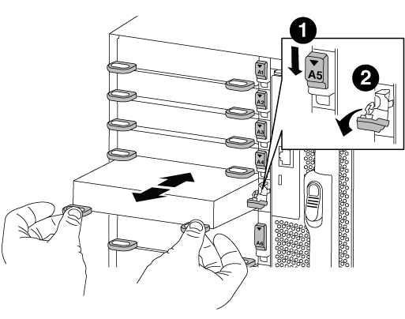

= Sostituire un modulo i/o - AFF A700 e FAS9000
:allow-uri-read: 
:icons: font
:imagesdir: ../media/

[role="lead"]
Per sostituire un modulo i/o, è necessario eseguire una sequenza specifica di attività.

* È possibile utilizzare questa procedura con tutte le versioni di ONTAP supportate dal sistema
* Tutti gli altri componenti del sistema devono funzionare correttamente; in caso contrario, contattare il supporto tecnico.

== Fase 1: Spegnere il controller compromesso

È possibile arrestare o sostituire il controller compromesso utilizzando procedure diverse, a seconda della configurazione hardware del sistema di storage.

[role="tabbed-block"]
====
.Opzione 1: La maggior parte delle configurazioni
--
Per spegnere il controller compromesso, è necessario determinare lo stato del controller e, se necessario, assumere il controllo del controller in modo che il controller integro continui a servire i dati provenienti dallo storage del controller compromesso.

.A proposito di questa attività
* Se si utilizza NetApp Storage Encryption, è necessario reimpostare il MSID seguendo le istruzioni riportate in link:https://docs.netapp.com/us-en/ontap/encryption-at-rest/return-seds-unprotected-mode-task.html["Ripristino dei SED in modalità non protetta"].
* Se si dispone di un sistema SAN, è necessario controllare i messaggi di evento  `cluster kernel-service show`) Per blade SCSI del controller deteriorati. Il `cluster kernel-service show` command visualizza il nome del nodo, lo stato del quorum di quel nodo, lo stato di disponibilità di quel nodo e lo stato operativo di quel nodo.
+
Ogni processo SCSI-blade deve essere in quorum con gli altri nodi del cluster. Eventuali problemi devono essere risolti prima di procedere con la sostituzione.

* Se si dispone di un cluster con più di due nodi, questo deve trovarsi in quorum. Se il cluster non è in quorum o un controller integro mostra false per idoneità e salute, è necessario correggere il problema prima di spegnere il controller compromesso; vedere link:https://docs.netapp.com/us-en/ontap/system-admin/synchronize-node-cluster-task.html?q=Quorum["Sincronizzare un nodo con il cluster"^].

.Fasi
. Se AutoSupport è attivato, eliminare la creazione automatica del caso richiamando un messaggio AutoSupport: `system node autosupport invoke -node * -type all -message MAINT=number_of_hours_downh`
+
Il seguente messaggio AutoSupport elimina la creazione automatica del caso per due ore: `cluster1:> system node autosupport invoke -node * -type all -message MAINT=2h`

. Disattivare il giveback automatico dalla console del controller integro: `storage failover modify –node local -auto-giveback false`
+

NOTE: Quando viene visualizzato _Vuoi disattivare il giveback automatico?_, inserisci `y`.

. Portare la centralina danneggiata al prompt DEL CARICATORE:
+
[cols="1,2"]
|===
| Se il controller non utilizzato visualizza... | Quindi... 

 a| 
Il prompt DEL CARICATORE
 a| 
Andare a Rimozione del modulo controller.

 a| 
In attesa di un giveback...
 a| 
Premere Ctrl-C, quindi rispondere `y` quando richiesto.

 a| 
Prompt di sistema o prompt della password
 a| 
Assumere il controllo o arrestare il controller compromesso dal controller integro: `storage failover takeover -ofnode _impaired_node_name_`

Quando il controller non utilizzato visualizza Waiting for giveback... (in attesa di giveback...), premere Ctrl-C e rispondere `y`.

|===

--
.Opzione 2: Controller in un MetroCluster a due nodi
--
Per spegnere il controller compromesso, è necessario determinare lo stato del controller e, se necessario, sostituirlo in modo che il controller integro continui a servire i dati provenienti dallo storage del controller compromesso.

.A proposito di questa attività
* Se si utilizza NetApp Storage Encryption, è necessario reimpostare il MSID seguendo le istruzioni riportate nella sezione "Restituisci un'unità FIPS o SED in modalità non protetta" di link:https://docs.netapp.com/us-en/ontap/encryption-at-rest/return-seds-unprotected-mode-task.html["Panoramica di NetApp Encryption con CLI"^].
* Al termine di questa procedura, è necessario lasciare accesi gli alimentatori per alimentare il controller integro.

.Fasi
. Controllare lo stato MetroCluster per determinare se il controller compromesso è passato automaticamente al controller integro: `metrocluster show`
. A seconda che si sia verificato uno switchover automatico, procedere come indicato nella seguente tabella:
+
[cols="1,2"]
|===
| Se il controller è compromesso... | Quindi... 

 a| 
Si è attivata automaticamente
 a| 
Passare alla fase successiva.

 a| 
Non si è attivato automaticamente
 a| 
Eseguire un'operazione di switchover pianificata dal controller integro: `metrocluster switchover`

 a| 
Non è stato attivato automaticamente, si è tentato di eseguire lo switchover con `metrocluster switchover` e lo switchover è stato vetoed
 a| 
Esaminare i messaggi di veto e, se possibile, risolvere il problema e riprovare. Se non si riesce a risolvere il problema, contattare il supporto tecnico.

|===
. Risincronizzare gli aggregati di dati eseguendo `metrocluster heal -phase aggregates` dal cluster esistente.
+
[listing]
----
controller_A_1::> metrocluster heal -phase aggregates
[Job 130] Job succeeded: Heal Aggregates is successful.
----
+
Se la riparazione è vetoed, si ha la possibilità di riemettere il `metrocluster heal` con il `-override-vetoes` parametro. Se si utilizza questo parametro opzionale, il sistema sovrascrive qualsiasi veto soft che impedisca l'operazione di riparazione.

. Verificare che l'operazione sia stata completata utilizzando il comando MetroCluster Operation show.
+
[listing]
----
controller_A_1::> metrocluster operation show
    Operation: heal-aggregates
      State: successful
Start Time: 7/25/2016 18:45:55
   End Time: 7/25/2016 18:45:56
     Errors: -
----
. Controllare lo stato degli aggregati utilizzando `storage aggregate show` comando.
+
[listing]
----
controller_A_1::> storage aggregate show
Aggregate     Size Available Used% State   #Vols  Nodes            RAID Status
--------- -------- --------- ----- ------- ------ ---------------- ------------
...
aggr_b2    227.1GB   227.1GB    0% online       0 mcc1-a2          raid_dp, mirrored, normal...
----
. Riparare gli aggregati root utilizzando `metrocluster heal -phase root-aggregates` comando.
+
[listing]
----
mcc1A::> metrocluster heal -phase root-aggregates
[Job 137] Job succeeded: Heal Root Aggregates is successful
----
+
Se la riparazione è vetoed, si ha la possibilità di riemettere il `metrocluster heal` comando con il parametro -override-vetoes. Se si utilizza questo parametro opzionale, il sistema sovrascrive qualsiasi veto soft che impedisca l'operazione di riparazione.

. Verificare che l'operazione di riparazione sia completa utilizzando `metrocluster operation show` sul cluster di destinazione:
+
[listing]
----

mcc1A::> metrocluster operation show
  Operation: heal-root-aggregates
      State: successful
 Start Time: 7/29/2016 20:54:41
   End Time: 7/29/2016 20:54:42
     Errors: -
----
. Sul modulo controller guasto, scollegare gli alimentatori.

--
====

== Fase 2: Sostituire i moduli i/O.

Per sostituire un modulo i/o, individuarlo all'interno dello chassis e seguire la sequenza specifica dei passaggi.

.Fasi
. Se non si è già collegati a terra, mettere a terra l'utente.
. Scollegare i cavi associati al modulo i/o di destinazione.
+
Assicurarsi di etichettare i cavi in modo da conoscerne la provenienza.

. Rimuovere il modulo i/o di destinazione dallo chassis:
+
.. Premere il tasto contrassegnato e numerato CAM.
+
Il pulsante CAM si allontana dal telaio.

.. Ruotare il fermo della camma verso il basso fino a portarlo in posizione orizzontale.
+
Il modulo i/o si disinnesta dallo chassis e si sposta di circa 1/2 pollici fuori dallo slot i/O.

.. Rimuovere il modulo i/o dallo chassis tirando le linguette sui lati del lato anteriore del modulo.
+
Assicurarsi di tenere traccia dello slot in cui si trovava il modulo i/O.

+

+
[cols="1,3"]
|===

 a| 
image:../media/legend_icon_01.png[""]
 a| 
Latch i/o Cam intestato e numerato

 a| 
image:../media/legend_icon_02.png[""]
 a| 
Fermo i/o Cam completamente sbloccato

|===

. Mettere da parte il modulo i/O.
. Installare il modulo i/o sostitutivo nello chassis facendo scorrere delicatamente il modulo i/o nello slot fino a quando il fermo della camma i/o con lettere e numeri inizia a innestarsi nel perno della camma i/o, quindi spingere il fermo della camma i/o completamente verso l'alto per bloccare il modulo in posizione.
. Ricable il modulo i/o, secondo necessità.

== Fase 3: Riavviare il controller dopo la sostituzione del modulo i/O.

Dopo aver sostituito un modulo i/o, è necessario riavviare il modulo controller.

NOTE: Se il nuovo modulo i/o non è lo stesso modello del modulo guasto, è necessario prima riavviare il BMC.

.Fasi
. Riavviare il BMC se il modulo sostitutivo non è lo stesso modello del modulo precedente:
+
.. Dal prompt DEL CARICATORE, passare alla modalità avanzata dei privilegi: `priv set advanced`
.. Riavviare BMC: `sp reboot`

. Dal prompt DEL CARICATORE, riavviare il nodo: `bye`
+

NOTE: In questo modo, le schede PCIe e gli altri componenti vengono reinizializzati e il nodo viene riavviato.

. Se il sistema è configurato per supportare connessioni dati e di interconnessione cluster a 10 GbE su schede di rete 40 GbE o porte integrate, convertire queste porte in connessioni a 10 GbE utilizzando `nicadmin convert` Comando dalla modalità di manutenzione.
+

NOTE: Assicurarsi di uscire dalla modalità di manutenzione dopo aver completato la conversione.

. Ripristinare il funzionamento normale del nodo:
`storage failover giveback -ofnode _impaired_node_name_`
. Se il giveback automatico è stato disattivato, riabilitarlo: `storage failover modify -node local -auto-giveback true`
+

NOTE: Se il sistema si trova in una configurazione MetroCluster a due nodi, è necessario ripristinare gli aggregati come descritto nella fase successiva.

== Fase 4: Switch back aggregates in una configurazione MetroCluster a due nodi

Una volta completata la sostituzione dell'unità FRU in una configurazione MetroCluster a due nodi, è possibile eseguire l'operazione di switchback dell'unità MetroCluster. In questo modo, la configurazione torna al suo normale stato operativo, con le macchine virtuali dello storage di origine sincronizzata (SVM) sul sito precedentemente compromesso ora attive e che forniscono i dati dai pool di dischi locali.

Questa attività si applica solo alle configurazioni MetroCluster a due nodi.

.Fasi
. Verificare che tutti i nodi si trovino in `enabled` stato: `metrocluster node show`
+
[listing]
----
cluster_B::>  metrocluster node show

DR                           Configuration  DR
Group Cluster Node           State          Mirroring Mode
----- ------- -------------- -------------- --------- --------------------
1     cluster_A
              controller_A_1 configured     enabled   heal roots completed
      cluster_B
              controller_B_1 configured     enabled   waiting for switchback recovery
2 entries were displayed.
----
. Verificare che la risincronizzazione sia completa su tutte le SVM: `metrocluster vserver show`
. Verificare che tutte le migrazioni LIF automatiche eseguite dalle operazioni di riparazione siano state completate correttamente: `metrocluster check lif show`
. Eseguire lo switchback utilizzando `metrocluster switchback` comando da qualsiasi nodo del cluster esistente.
. Verificare che l'operazione di switchback sia stata completata: `metrocluster show`
+
L'operazione di switchback è ancora in esecuzione quando un cluster si trova in `waiting-for-switchback` stato:

+
[listing]
----
cluster_B::> metrocluster show
Cluster              Configuration State    Mode
--------------------	------------------- 	---------
 Local: cluster_B configured       	switchover
Remote: cluster_A configured       	waiting-for-switchback
----
+
L'operazione di switchback è completa quando i cluster si trovano in `normal` stato:

+
[listing]
----
cluster_B::> metrocluster show
Cluster              Configuration State    Mode
--------------------	------------------- 	---------
 Local: cluster_B configured      		normal
Remote: cluster_A configured      		normal
----
+
Se il completamento di uno switchback richiede molto tempo, è possibile verificare lo stato delle linee di base in corso utilizzando `metrocluster config-replication resync-status show` comando.

. Ripristinare le configurazioni SnapMirror o SnapVault.

== Fase 5: Restituire il componente guasto a NetApp

Restituire la parte guasta a NetApp, come descritto nelle istruzioni RMA fornite con il kit. Vedere https://mysupport.netapp.com/site/info/rma["Parti restituita  sostituzioni"] per ulteriori informazioni.
