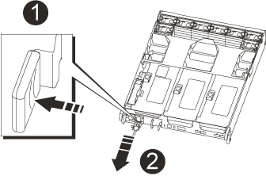

= Sostituire l'hardware del modulo controller - AFF A700
:allow-uri-read: 
:icons: font
:imagesdir: ../media/

[role="lead"]
Per sostituire l'hardware del modulo controller, è necessario rimuovere il controller guasto, spostare i componenti FRU nel modulo controller sostitutivo, installare il modulo controller sostitutivo nel telaio e avviare il sistema in modalità manutenzione.

== Fase 1: Rimuovere il modulo controller

È necessario rimuovere il modulo controller dal telaio quando si sostituisce il modulo controller o un componente all'interno del modulo controller.

. Se non si è già collegati a terra, mettere a terra l'utente.
. Allentare il gancio e la fascetta che fissano i cavi al dispositivo di gestione dei cavi, quindi scollegare i cavi di sistema e gli SFP (se necessario) dal modulo controller, tenendo traccia del punto in cui sono stati collegati i cavi.
+
Lasciare i cavi nel dispositivo di gestione dei cavi in modo che quando si reinstalla il dispositivo di gestione dei cavi, i cavi siano organizzati.

. Scollegare l'alimentatore del modulo controller dalla fonte di alimentazione, quindi scollegare il cavo dall'alimentatore.
. Rimuovere il dispositivo di gestione dei cavi dal modulo controller e metterlo da parte.
. Premere verso il basso entrambi i fermi di bloccaggio, quindi ruotare entrambi i fermi verso il basso contemporaneamente.
+
Il modulo controller si sposta leggermente fuori dallo chassis.

+
image::../media/drw_a700s_pcm_remove.png[Rilasciare il modulo controller]

+
[cols="1,4"]
|===

 a| 
image:../media/icon_round_1.png["Numero di didascalia 1"]
 a| 
Fermo di bloccaggio

 a| 
image:../media/icon_round_2.png["Numero di didascalia 2"]
 a| 
Perno di bloccaggio

|===
. Estrarre il modulo controller dal telaio.
+
Assicurarsi di sostenere la parte inferiore del modulo controller mentre lo si sposta fuori dallo chassis.

. Posizionare il modulo controller su una superficie piana e stabile, quindi aprire il condotto dell'aria:
+
.. Premere verso l'interno le linguette di bloccaggio sui lati del condotto dell'aria verso il centro del modulo controller.
.. Far scorrere il condotto dell'aria verso i moduli delle ventole, quindi ruotarlo verso l'alto fino a portarlo in posizione completamente aperta.
+
image::../media/drw_a700s_open_air_duct.png[Aprire il condotto dell'aria]

+
[cols="1,4"]
|===

 a| 
image:../media/icon_round_1.png["Numero di didascalia 1"]
 a| 
Linguette di bloccaggio del condotto dell'aria

 a| 
image:../media/icon_round_2.png["Numero di didascalia 2"]
 a| 
Riser

 a| 
image:../media/icon_round_3.png["Numero di didascalia 3"]
 a| 
Condotto dell'aria

|===

== Fase 2: Spostare la scheda NVRAM

Come parte del processo di sostituzione del controller, è necessario rimuovere la scheda NVRAM dal riser 1 nel modulo controller compromesso e installare la scheda nel riser 1 del modulo controller sostitutivo. Reinstallare il riser 1 nel modulo controller sostitutivo solo dopo aver spostato i DIMM dal modulo controller guasto al modulo controller sostitutivo.

. Rimuovere il riser NVRAM, Riser 1, dal modulo controller:
+
.. Ruotare verso l'alto e verso le ventole il fermo di blocco del riser sul lato sinistro del riser.
+
Il riser NVRAM si solleva leggermente dal modulo controller.

.. Sollevare il riser NVRAM, spostarlo verso le ventole in modo che il bordo di lamiera del riser si allontani dal bordo del modulo controller, sollevare il riser ed estrarlo dal modulo controller. Quindi posizionarla su una superficie piana e stabile in modo da poter accedere alla scheda NVRAM.
+
image::../media/drw_a700s_nvme_replace.png[Sostituire la scheda NVRAM]

+
[cols="1,4"]
|===

 a| 
image:../media/icon_round_1.png["Numero di didascalia 1"]
 a| 
Condotto dell'aria

 a| 
image:../media/icon_round_2.png["Numero di didascalia 2"]
 a| 
Fermo di bloccaggio del riser 1

 a| 
image:../media/icon_round_3.png["Numero di didascalia 3"]
 a| 
Connettore del cavo della batteria NVRAM che collega la scheda NVRAM

 a| 
image:../media/icon_round_4.png["Numero di didascalia 4"]
 a| 
Staffa di blocco della scheda

 a| 
image:../media/icon_round_5.png["Numero di didascalia 5"]
 a| 
Scheda NVRAM

|===

. Rimuovere la scheda NVRAM dal modulo riser:
+
.. Ruotare il modulo riser in modo da poter accedere alla scheda NVRAM.
.. Scollegare il cavo della batteria NVRAM collegato alla scheda NVRAM.
.. Premere la staffa di blocco sul lato del riser NVRAM, quindi ruotarla in posizione aperta.
.. Rimuovere la scheda NVRAM dal modulo riser.

. Rimuovere il riser NVRAM dal modulo controller sostitutivo.
. Installare la scheda NVRAM nel riser NVRAM:
+
.. Allineare la scheda con la relativa guida sul modulo di montaggio e lo zoccolo nel riser.
.. Far scorrere la scheda verso l'interno dello slot.
+

NOTE: Assicurarsi che la scheda sia inserita correttamente nella presa del riser.

.. Collegare il cavo della batteria alla presa della scheda NVRAM.
.. Ruotare il dispositivo di chiusura in posizione di blocco e assicurarsi che si blocchi in posizione.

== Fase 3: Spostare le schede PCIe

Come parte del processo di sostituzione del controller, è necessario rimuovere entrambi i moduli riser PCIe, Riser 2 (riser centrale) e Riser 3 (riser all'estrema destra) dal modulo controller compromesso, rimuovere le schede PCIe dai moduli riser, e installare le schede negli stessi moduli riser nel modulo controller sostitutivo. I moduli riser verranno installati nel modulo controller sostitutivo una volta spostati i DIMM nel modulo controller sostitutivo.

IMPORTANT: Non installare i riser dal modulo controller guasto nel modulo controller sostitutivo.

. Rimuovere il riser PCIe dal modulo controller:
+
.. Rimuovere eventuali moduli SFP presenti nelle schede PCIe.
.. Ruotare verso l'alto e verso i moduli delle ventole il fermo di blocco del modulo sul lato sinistro del riser.
+
Il riser PCIe si solleva leggermente dal modulo controller.

.. Sollevare il riser PCIe, spostarlo verso le ventole in modo che il bordo di lamiera del riser si allontani dal bordo del modulo controller, sollevare il riser ed estrarlo dal modulo controller, quindi posizionarlo su una superficie piana e stabile.
+
image::../media/drw_a700s_pcie_replace.png[Sostituire una scheda PCIe]

+
[cols="1,4"]
|===

 a| 
image:../media/icon_round_1.png["Numero di didascalia 1"]
 a| 
Condotto dell'aria

 a| 
image:../media/icon_round_2.png["Numero di didascalia 2"]
 a| 
Fermo di bloccaggio del riser

 a| 
image:../media/icon_round_3.png["Numero di didascalia 3"]
 a| 
Staffa di blocco della scheda

 a| 
image:../media/icon_round_4.png["Numero di didascalia 4"]
 a| 
Riser 2 (riser centrale) e schede PCI negli slot riser 2 e 3.

|===

. Rimuovere la scheda PCIe dal riser:
+
.. Ruotare il riser in modo da poter accedere alla scheda PCIe.
.. Premere la staffa di blocco sul lato del riser PCIe, quindi ruotarla in posizione aperta.
.. Rimuovere la scheda PCIe dal riser.

. Rimuovere il riser corrispondente dal modulo controller sostitutivo.
. Installare la scheda PCIe nel riser dal controller sostitutivo, quindi reinstallare il riser nel controller sostitutivo:
+
.. Allineare la scheda alla relativa guida sul riser e allo zoccolo del riser, quindi inserirla correttamente nello slot del riser.
+
Assicurarsi che la scheda sia inserita correttamente nella presa del riser.

.. Reinstallare il riser nel modulo controller sostitutivo.
.. Ruotare il fermo di bloccaggio in posizione fino a quando non scatta in posizione di blocco.

. Ripetere i passaggi precedenti per le schede Riser 3 e PCIe negli slot 4 e 5 del modulo controller compromesso.

== Fase 4: Spostare il supporto di avvio

Nel sistema AFF A700s sono presenti due dispositivi multimediali di avvio, uno primario e uno secondario o un supporto di avvio di backup. È necessario spostarli dal controller compromesso al controller _replacement_ e installarli nei rispettivi slot del controller _replacement_.

I supporti di avvio si trovano sotto Riser 2, il modulo riser PCIe centrale. Questo modulo PCIe deve essere rimosso per accedere al supporto di boot.

. Individuare il supporto di avvio:
+
.. Aprire il condotto dell'aria, se necessario.
.. Se necessario, rimuovere il riser 2, il modulo PCIe centrale, sbloccando il fermo di blocco e rimuovendo il riser dal modulo controller.
+
image::../media/drw_a700s_boot_media_replace.png[Sostituire il supporto di avvio]

+
[cols="1,4"]
|===

 a| 
image:../media/icon_round_1.png["Numero di didascalia 1"]
 a| 
Condotto dell'aria

 a| 
image:../media/icon_round_2.png["Numero di didascalia 2"]
 a| 
Riser 2 (modulo PCIe centrale)

 a| 
image:../media/icon_round_3.png["Numero di didascalia 3"]
 a| 
Vite del supporto di avvio

 a| 
image:../media/icon_round_4.png["Numero di didascalia 4"]
 a| 
Supporto di boot

|===
. Rimuovere il supporto di avvio dal modulo controller:
+
.. Utilizzando un cacciavite Phillips n. 1, rimuovere la vite che fissa il supporto di avvio e mettere da parte la vite in un luogo sicuro.
.. Afferrare i lati del supporto di avvio, ruotare delicatamente il supporto di avvio verso l'alto, quindi estrarre il supporto di avvio dalla presa e metterlo da parte.

. Spostare il supporto di avvio nel nuovo modulo controller e installarlo:
+

NOTE: Installare il supporto di avvio nello stesso socket del modulo controller sostitutivo installato nel modulo controller guasto; nello slot 1, nello slot 1, nello slot 1, nello slot 1, nello slot 2 e nello slot 2, nello slot 2, nello slot 2, nello slot 2, nello slot 2, per supporti di avvio secondari.

+
.. Allineare i bordi del supporto di avvio con l'alloggiamento dello zoccolo, quindi spingerlo delicatamente a squadra nello zoccolo.
.. Ruotare il supporto di avvio verso il basso verso la scheda madre.
.. Fissare il supporto di avvio alla scheda madre utilizzando la vite del supporto di avvio.
+
Non serrare eccessivamente la vite per evitare di danneggiare il supporto di avvio.

== Fase 5: Spostare le ventole

Quando si sostituisce un modulo controller guasto, è necessario spostare le ventole dal modulo controller danneggiato al modulo sostitutivo.

. Rimuovere il modulo della ventola stringendo le linguette di bloccaggio sul lato del modulo della ventola, quindi sollevare il modulo della ventola per estrarlo dal modulo del controller.
+
image::../media/drw_a700s_replace_fan.png[Sostituire una ventola]

+
[cols="1,4"]
|===

 a| 
image:../media/icon_round_1.png["Numero di didascalia 1"]
 a| 
Linguette di bloccaggio della ventola

 a| 
image:../media/icon_round_2.png["Numero di didascalia 2"]
 a| 
Modulo della ventola

|===
. Spostare il modulo della ventola sul modulo controller sostitutivo, quindi installare il modulo della ventola allineandone i bordi con l'apertura nel modulo controller, quindi far scorrere il modulo della ventola nel modulo controller fino a quando i fermi di blocco non scattano in posizione.
. Ripetere questa procedura per i moduli ventola rimanenti.

== Fase 6: Spostare i DIMM di sistema

Per spostare i moduli DIMM, individuarli e spostarli dal controller compromesso al controller sostitutivo e seguire la sequenza specifica dei passaggi.

. Individuare i DIMM sul modulo controller.
+
image::../media/drw_a700s_dimm_replace.png[Sostituire un DIMM]

+
[cols="1,4"]
|===

 a| 
image:../media/icon_round_1.png["Numero di didascalia 1"]
 a| 
Condotto dell'aria

 a| 
image:../media/icon_round_2.png["Numero di didascalia 2"]
 a| 
Riser 1 e DIMM bank 1-4

 a| 
image:../media/icon_round_3.png["Numero di didascalia 3"]
 a| 
Riser 2 e banchi DIMM 5-8 e 9-12

 a| 
image:../media/icon_round_4.png["Numero di didascalia 4"]
 a| 
Riser 3 e DIMM bank 13-16

|===
. Prendere nota dell'orientamento del DIMM nello zoccolo in modo da poter inserire il DIMM nel modulo controller sostitutivo con l'orientamento corretto.
. Estrarre il modulo DIMM dal relativo slot spingendo lentamente verso l'esterno le due linguette di espulsione dei moduli DIMM su entrambi i lati del modulo, quindi estrarre il modulo DIMM dallo slot.
+

NOTE: Tenere il modulo DIMM per i bordi in modo da evitare di esercitare pressione sui componenti della scheda a circuiti stampati del modulo DIMM.

. Individuare lo slot in cui si desidera installare il DIMM.
. Assicurarsi che le linguette di espulsione del modulo DIMM sul connettore siano aperte, quindi inserire il modulo DIMM correttamente nello slot.
+
Il DIMM si inserisce saldamente nello slot, ma dovrebbe essere inserito facilmente. In caso contrario, riallineare il DIMM con lo slot e reinserirlo.

+

NOTE: Esaminare visivamente il DIMM per verificare che sia allineato in modo uniforme e inserito completamente nello slot.

. Spingere con cautela, ma con decisione, il bordo superiore del DIMM fino a quando le linguette dell'espulsore non scattano in posizione sulle tacche alle estremità del DIMM.
. Ripetere questa procedura per i DIMM rimanenti.

== Fase 7: Installazione del modulo NVRAM

Per installare il modulo NVRAM, seguire la sequenza di passaggi specifica.

. Installare il riser nel modulo controller:
+
.. Allineare il bordo del riser con la parte inferiore della lamiera del modulo controller.
.. Guidare il riser lungo i pin nel modulo controller, quindi abbassare il riser nel modulo controller.
.. Ruotare il fermo di bloccaggio verso il basso e farlo scattare in posizione di blocco.
+
Una volta bloccato, il fermo di bloccaggio è a filo con la parte superiore del riser e il riser è posizionato correttamente nel modulo controller.

.. Reinserire tutti i moduli SFP rimossi dalle schede PCIe.

== Fase 8: Spostare la batteria NVRAM

Quando si sostituisce il modulo controller, è necessario spostare la batteria NVRAM dal modulo controller guasto al modulo controller sostitutivo

. Individuare la batteria NVRAM sul lato sinistro del modulo di montaggio, Riser 1.
+
image::../media/drw_a700s_nvme_battery_replace.png[Sostituire la batteria NVRAM]

+
[cols="1,4"]
|===

 a| 
image:../media/icon_round_1.png["Numero di didascalia 1"]
 a| 
Spina della batteria NVRAM

 a| 
image:../media/icon_round_2.png["Numero di didascalia 2"]
 a| 
Linguetta blu di blocco della batteria NVRAM

|===
. Individuare la spina della batteria e premere il fermaglio sulla parte anteriore della spina per sganciarla dalla presa, quindi scollegare il cavo della batteria dalla presa.
. Afferrare la batteria e premere la linguetta di bloccaggio blu contrassegnata CON PUSH, quindi estrarre la batteria dal supporto e dal modulo del controller.
. Spostare la batteria nel modulo controller sostitutivo, quindi installarlo nel riser NVRAM:
+
.. Far scorrere la batteria verso il basso lungo la parete laterale in lamiera fino a quando le linguette di supporto sulla parete laterale non si agganciano agli slot della batteria e il dispositivo di chiusura della batteria si aggancia e si blocca in posizione.
.. Premere con decisione la batteria per assicurarsi che sia bloccata in posizione.
.. Inserire la spina della batteria nella presa di montaggio e assicurarsi che la spina si blocchi in posizione.

== Fase 9: Installare un riser PCIe

Per installare un riser PCIe, seguire una sequenza specifica di passaggi.

. Se non si è già collegati a terra, mettere a terra l'utente.
. Installare il riser nel modulo controller:
+
.. Allineare il bordo del riser con la parte inferiore della lamiera del modulo controller.
.. Guidare il riser lungo i pin nel modulo controller, quindi abbassare il riser nel modulo controller.
.. Ruotare il fermo di bloccaggio verso il basso e farlo scattare in posizione di blocco.
+
Una volta bloccato, il fermo di bloccaggio è a filo con la parte superiore del riser e il riser è posizionato correttamente nel modulo controller.

.. Reinserire tutti i moduli SFP rimossi dalle schede PCIe.

. Ripetere i passaggi precedenti per le schede Riser 3 e PCIe negli slot 4 e 5 del modulo controller compromesso.

== Fase 10: Spostare l'alimentatore

Quando si sostituisce un modulo controller, è necessario spostare l'alimentatore e l'alimentatore vuoti dal modulo controller guasto al modulo controller sostitutivo.

. Se non si è già collegati a terra, mettere a terra l'utente.
. Ruotare la maniglia della camma in modo che possa essere utilizzata per estrarre l'alimentatore dal modulo controller premendo la linguetta di bloccaggio.
+

CAUTION: L'alimentazione è in corto. Utilizzare sempre due mani per sostenerlo durante la rimozione dal modulo controller in modo che non si sposti improvvisamente dal modulo controller e non causi lesioni.

+

+
[cols="1,4"]
|===

 a| 
image:../media/icon_round_1.png["Numero di didascalia 1"]
 a| 
Linguetta blu di bloccaggio dell'alimentatore

 a| 
image:../media/icon_round_2.png["Numero di didascalia 2"]
 a| 
Alimentatore

|===
. Spostare l'alimentatore sul nuovo modulo controller, quindi installarlo.
. Con entrambe le mani, sostenere e allineare i bordi dell'alimentatore con l'apertura nel modulo controller, quindi spingere delicatamente l'alimentatore nel modulo controller fino a quando la linguetta di blocco non scatta in posizione.
+
Gli alimentatori si innestano correttamente solo con il connettore interno e si bloccano in un modo.

+

NOTE: Per evitare di danneggiare il connettore interno, non esercitare una forza eccessiva quando si inserisce l'alimentatore nel sistema.

. Rimuovere il pannello di chiusura dell'alimentatore dal modulo controller guasto, quindi installarlo nel modulo controller sostitutivo.

== Fase 11: Installare il modulo controller

Dopo aver spostato tutti i componenti dal modulo controller guasto al modulo controller sostitutivo, è necessario installare il modulo controller sostitutivo nel telaio e avviarlo in modalità manutenzione.

. Se non si è già collegati a terra, mettere a terra l'utente.
. In caso contrario, chiudere il condotto dell'aria:
+
.. Ruotare completamente il condotto dell'aria verso il basso fino al modulo controller.
.. Far scorrere il condotto dell'aria verso i montanti fino a quando le linguette di bloccaggio non scattano in posizione.
.. Ispezionare il condotto dell'aria per assicurarsi che sia posizionato correttamente e bloccato in posizione.
+
image::../media/drw_a700s_close_air_duct.png[Chiusura del condotto dell'aria]

+
[cols="1,4"]
|===

 a| 
image:../media/icon_round_1.png["Numero di didascalia 1"]
 a| 
Linguette di bloccaggio

 a| 
image:../media/icon_round_2.png["Numero di didascalia 2"]
 a| 
Far scorrere lo stantuffo

|===
. Allineare l'estremità del modulo controller con l'apertura dello chassis, quindi spingere delicatamente il modulo controller a metà nel sistema.
+

NOTE: Non inserire completamente il modulo controller nel telaio fino a quando non viene richiesto.

. Cablare solo le porte di gestione e console, in modo da poter accedere al sistema per eseguire le attività descritte nelle sezioni seguenti.
+

NOTE: I cavi rimanenti verranno collegati al modulo controller più avanti in questa procedura.

. Completare la reinstallazione del modulo controller:
+
.. Spingere con decisione il modulo controller nello chassis fino a quando non raggiunge la scheda intermedia e non è completamente inserito.
+
I fermi di bloccaggio si sollevano quando il modulo controller è completamente inserito.

+

NOTE: Non esercitare una forza eccessiva quando si fa scorrere il modulo controller nel telaio per evitare di danneggiare i connettori.

+
Il modulo controller inizia ad avviarsi non appena viene inserito completamente nello chassis. Prepararsi ad interrompere il processo di avvio.

.. Ruotare i fermi di bloccaggio verso l'alto, inclinandoli in modo da liberare i perni di bloccaggio, quindi abbassarli in posizione di blocco.
.. Interrompere il processo di avvio premendo `Ctrl-C`.

. Collegare i cavi di sistema e i moduli transceiver al modulo controller e reinstallare il dispositivo di gestione dei cavi.
. Collegare i cavi di alimentazione agli alimentatori e reinstallare i fermi dei cavi di alimentazione.
. Se il sistema è configurato per supportare connessioni dati e di interconnessione cluster a 10 GbE su schede di rete 40 GbE o porte integrate, convertire queste porte in connessioni a 10 GbE utilizzando il comando nicadmin convert dalla modalità Maintenance.
+

NOTE: Assicurarsi di uscire dalla modalità di manutenzione dopo aver completato la conversione.

