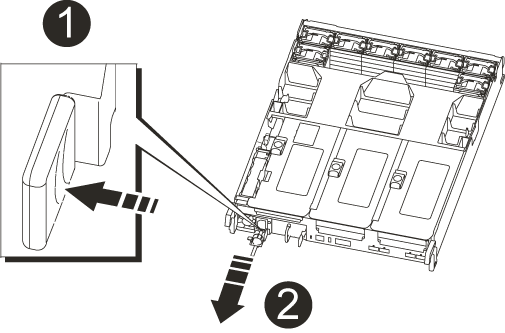

= Sostituire un alimentatore - AFF A700
:allow-uri-read: 
:icons: font
:imagesdir: ../media/

[role="lead"]
Sostituire un alimentatore scollegando l'alimentatore di destinazione dalla fonte di alimentazione, scollegando il cavo di alimentazione, rimuovendo il vecchio alimentatore e installando il nuovo alimentatore, quindi ricollegandolo alla fonte di alimentazione.

* Gli alimentatori sono ridondanti e sostituibili a caldo.
* Questa procedura è stata scritta per la sostituzione di un alimentatore alla volta.
+

NOTE: Si consiglia di sostituire l'alimentatore entro due minuti dalla rimozione dallo chassis. Il sistema continua a funzionare, ma ONTAP invia messaggi alla console sull'alimentatore danneggiato fino alla sostituzione dell'alimentatore.

* Il numero di alimentatori nel sistema dipende dal modello.
* Gli alimentatori sono a portata automatica.

.Fasi
. Se non si è già collegati a terra, mettere a terra l'utente.
. Identificare l'alimentatore che si desidera sostituire, in base ai messaggi di errore della console o tramite i LED degli alimentatori.
. Scollegare l'alimentatore:
+
.. Aprire il fermo del cavo di alimentazione, quindi scollegare il cavo di alimentazione dall'alimentatore.
.. Scollegare il cavo di alimentazione dalla fonte di alimentazione.

. Ruotare la maniglia della camma in modo che possa essere utilizzata per estrarre l'alimentatore dal modulo controller premendo la linguetta di bloccaggio.
+

CAUTION: L'alimentazione è in corto. Utilizzare sempre due mani per sostenerlo durante la rimozione dal modulo controller in modo che non si sposti improvvisamente dal modulo controller e non causi lesioni.

+

+
|===

 a| 
image:../media/legend_icon_01.png["Numero di didascalia 1"]
 a| 
Linguetta blu di bloccaggio dell'alimentatore

 a| 
image:../media/legend_icon_02.png["Numero di didascalia 2"]
 a| 
Alimentatore

|===
. Con entrambe le mani, sostenere e allineare i bordi dell'alimentatore con l'apertura nel modulo controller, quindi spingere delicatamente l'alimentatore nel modulo controller fino a quando la linguetta di blocco non scatta in posizione.
+
Gli alimentatori si innestano correttamente solo con il connettore interno e si bloccano in un modo.

+

NOTE: Per evitare di danneggiare il connettore interno, non esercitare una forza eccessiva quando si inserisce l'alimentatore nel sistema.

. Chiudere la maniglia della camma ruotandola fino in fondo.
. Ricollegare il cablaggio dell'alimentatore:
+
.. Ricollegare il cavo di alimentazione all'alimentatore e alla fonte di alimentazione.
.. Fissare il cavo di alimentazione all'alimentatore utilizzando il fermo del cavo di alimentazione.

+
Una volta ripristinata l'alimentazione, il LED di stato deve essere verde.

. Restituire la parte guasta a NetApp, come descritto nelle istruzioni RMA fornite con il kit. Vedere https://mysupport.netapp.com/site/info/rma["Parti restituita  sostituzioni"^] per ulteriori informazioni.

