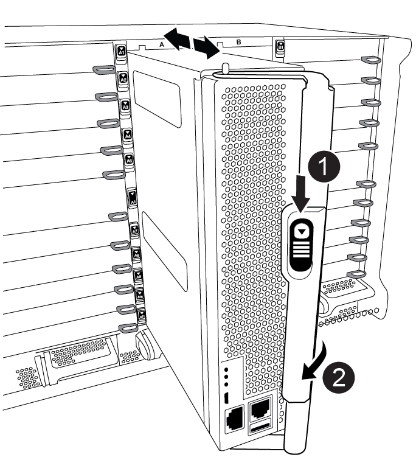

= Sostituire l'hardware del modulo controller - AFF A900
:allow-uri-read: 
:icons: font
:imagesdir: ../media/

[role="lead"]
Per sostituire l'hardware del modulo controller, è necessario rimuovere il controller guasto, spostare i componenti FRU nel modulo controller sostitutivo, installare il modulo controller sostitutivo nel telaio e avviare il sistema in modalità manutenzione.

L'animazione seguente mostra l'intero processo di spostamento dei componenti dal controller non utilizzato al controller sostitutivo.

.Animazione - spostare i componenti nel controller sostitutivo
video::30337552-b10f-4146-9bdb-adf2000df5bd[panopto]

== Fase 1: Rimuovere il modulo controller

Per accedere ai componenti all'interno del controller, rimuovere prima il modulo controller dal sistema, quindi rimuovere il coperchio sul modulo controller.

. Se non si è già collegati a terra, mettere a terra l'utente.
. Scollegare i cavi dal modulo controller guasto e tenere traccia del punto in cui sono stati collegati i cavi.
. Far scorrere verso il basso il pulsante terra cotta sulla maniglia della camma fino a sbloccarla.
+
.Animazione - rimuovere il controller
video::256721fd-4c2e-40b3-841a-adf2000df5fa[panopto]
+

+
[cols="10,90"]
|===

 a| 
image:../media/legend_icon_01.png["Numero di didascalia 1"]
 a| 
Pulsante di rilascio della maniglia della camma

 a| 
image:../media/legend_icon_02.png["Numero di didascalia 2"]
 a| 
Maniglia CAM

|===
. Ruotare la maniglia della camma in modo da disimpegnare completamente il modulo controller dal telaio, quindi estrarre il modulo controller dal telaio.
+
Assicurarsi di sostenere la parte inferiore del modulo controller mentre lo si sposta fuori dallo chassis.

. Posizionare il coperchio del modulo controller con il lato rivolto verso l'alto su una superficie stabile e piana, premere il pulsante blu sul coperchio, far scorrere il coperchio sul retro del modulo controller, quindi sollevare il coperchio ed estrarlo dal modulo controller.
+
image::../media/drw_a900_PCM_open.png[Interruzione del modulo PCM drw a900]

[cols="10,90"]
|===

 a| 
image:../media/legend_icon_01.png["Numero di didascalia 1"]
 a| 
Pulsante di bloccaggio del coperchio del modulo controller

|===

== Fase 2: Spostare il supporto di avvio

Individuare il supporto di avvio e seguire le istruzioni per rimuoverlo dal vecchio controller e inserirlo nel nuovo controller.

. Individuare il supporto di avvio utilizzando la seguente illustrazione o la mappa FRU sul modulo controller:
+
image::../media/drw_a900_remove_boot_dev.png[drw a900 rimuovere lo sviluppo boot]

+
[cols="10,90"]
|===

 a| 
image:../media/legend_icon_01.png["Numero di didascalia 1"]
 a| 
Premere il tasto di rilascio Tab

 a| 
image:../media/legend_icon_02.png["Numero di didascalia 2"]
 a| 
Supporto di boot

|===
. Premere il pulsante blu sull'alloggiamento del supporto di avvio per rilasciare il supporto di avvio dall'alloggiamento, quindi estrarlo delicatamente dalla presa del supporto di avvio.
+

NOTE: Non attorcigliare o tirare il supporto di avvio verso l'alto, in quanto potrebbe danneggiare la presa o il supporto di avvio.

. Spostare il supporto di avvio nel nuovo modulo controller, allineare i bordi del supporto di avvio con l'alloggiamento dello zoccolo, quindi spingerlo delicatamente nello zoccolo.
. Verificare che il supporto di avvio sia inserito correttamente e completamente nella presa.
+
Se necessario, rimuovere il supporto di avvio e reinserirlo nella presa.

. Premere il supporto di avvio verso il basso per inserire il pulsante di blocco sull'alloggiamento del supporto di avvio.

== Fase 3: Spostare i DIMM di sistema

Per spostare i moduli DIMM, individuarli e spostarli dal vecchio controller al controller sostitutivo e seguire la sequenza di passaggi specifica.

NOTE: Il controller ver2 dispone di un numero inferiore di socket DIMM. Non vi è alcuna riduzione nel numero di DIMM supportati o modifica nella numerazione dei socket DIMM. Quando si spostano i moduli DIMM nel nuovo modulo controller, installare i moduli DIMM nello stesso numero/posizione del modulo controller danneggiato.  Vedere il diagramma della mappa FRU sul modulo controller ver2 per le posizioni dei socket DIMM.

. Se non si è già collegati a terra, mettere a terra l'utente.
. Individuare i DIMM sul modulo controller.
. Prendere nota dell'orientamento del DIMM nello zoccolo in modo da poter inserire il DIMM nel modulo controller sostitutivo con l'orientamento corretto.
. Estrarre il modulo DIMM dal relativo slot spingendo lentamente verso l'esterno le due linguette di espulsione dei moduli DIMM su entrambi i lati del modulo, quindi estrarre il modulo DIMM dallo slot.
+

IMPORTANT: Tenere il modulo DIMM per i bordi in modo da evitare di esercitare pressione sui componenti della scheda a circuiti stampati del modulo DIMM.

+
image::../media/drw_a900_replace_PCM_dimms.png[Drw a900 sostituisce i moduli dimm PCM]

+
[cols="10,90"]
|===

 a| 
image:../media/legend_icon_01.png["Numero di didascalia 1"]
 a| 
Schede di espulsione DIMM

 a| 
image:../media/legend_icon_02.png["Numero di didascalia 2"]
 a| 
DIMM

|===
. Individuare lo slot in cui si desidera installare il DIMM.
. Assicurarsi che le linguette di espulsione del modulo DIMM sul connettore siano aperte, quindi inserire il modulo DIMM correttamente nello slot.
+
Il DIMM si inserisce saldamente nello slot, ma dovrebbe essere inserito facilmente. In caso contrario, riallineare il DIMM con lo slot e reinserirlo.

+

IMPORTANT: Esaminare visivamente il DIMM per verificare che sia allineato in modo uniforme e inserito completamente nello slot.

. Inserire il DIMM nello slot.
+
Il DIMM si inserisce saldamente nello slot, ma dovrebbe essere inserito facilmente. In caso contrario, riallineare il DIMM con lo slot e reinserirlo.

+

IMPORTANT: Esaminare visivamente il DIMM per verificare che sia allineato in modo uniforme e inserito completamente nello slot.

. Spingere con cautela, ma con decisione, il bordo superiore del DIMM fino a quando le linguette dell'espulsore non scattano in posizione sulle tacche alle estremità del DIMM.
. Ripetere questa procedura per i DIMM rimanenti.

== Fase 4: Installare il controller

Dopo aver installato i componenti nel modulo controller sostitutivo, è necessario installare il modulo controller sostitutivo nello chassis del sistema e avviare il sistema operativo.

Per le coppie ha con due moduli controller nello stesso chassis, la sequenza in cui si installa il modulo controller è particolarmente importante perché tenta di riavviarsi non appena lo si installa completamente nello chassis.

NOTE: Il sistema potrebbe aggiornare il firmware di sistema all'avvio. Non interrompere questo processo. La procedura richiede di interrompere il processo di avvio, che in genere può essere eseguito in qualsiasi momento dopo la richiesta. Tuttavia, se il sistema aggiorna il firmware del sistema all'avvio, è necessario attendere il completamento dell'aggiornamento prima di interrompere il processo di avvio.

. Se non si è già collegati a terra, mettere a terra l'utente.
. Se non è già stato fatto, riposizionare il coperchio sul modulo controller.
. Allineare l'estremità del modulo controller con l'apertura dello chassis, quindi spingere delicatamente il modulo controller a metà nel sistema.
+
.Animazione - Installazione del controller
video::099237f3-d7f2-4749-86e2-adf2000df53c[panopto]
+

+
[cols="10,90"]
|===

 a| 
image:../media/legend_icon_01.png["Numero di didascalia 1"]
 a| 
Pulsante di rilascio della maniglia della camma

 a| 
image:../media/legend_icon_02.png["Numero di didascalia 2"]
 a| 
Maniglia CAM

|===
+

NOTE: Non inserire completamente il modulo controller nel telaio fino a quando non viene richiesto.

. Cablare solo le porte di gestione e console, in modo da poter accedere al sistema per eseguire le attività descritte nelle sezioni seguenti.
+

NOTE: I cavi rimanenti verranno collegati al modulo controller più avanti in questa procedura.

. Completare la reinstallazione del modulo controller:
+
.. Se non è già stato fatto, reinstallare il dispositivo di gestione dei cavi.
.. Spingere con decisione il modulo controller nello chassis fino a quando non raggiunge la scheda intermedia e non è completamente inserito.
+

IMPORTANT: Non esercitare una forza eccessiva quando si fa scorrere il modulo controller nel telaio per evitare di danneggiare i connettori.

+
Il modulo controller inizia ad avviarsi non appena viene inserito completamente nello chassis. Prepararsi ad interrompere il processo di avvio.

.. Ruotare la maniglia della camma del modulo controller in posizione di blocco.
.. Interrompere il processo di avvio premendo `Ctrl-C` Quando viene visualizzato, premere Ctrl-C per il menu di avvio.
.. Selezionare l'opzione per avviare IL CARICATORE.

