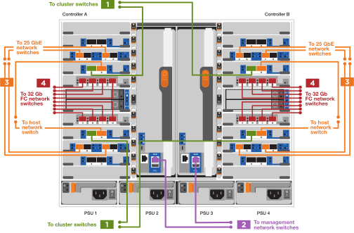
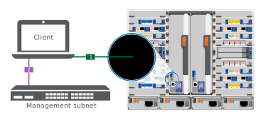

= Fasi dettagliate - AFF 900
:allow-uri-read: 
:icons: font
:imagesdir: ../media/

[role="lead"]
Questo articolo fornisce istruzioni dettagliate per l'installazione di un sistema NetApp tipico. Per istruzioni di installazione più dettagliate, consulta questo articolo.

== Fase 1: Preparazione per l'installazione

Per installare il sistema, è necessario creare un account sul NetApp Support Site, registrare il sistema e ottenere le chiavi di licenza. È inoltre necessario inventariare il numero e il tipo di cavi appropriati per il sistema e raccogliere informazioni di rete specifiche.

È necessario disporre dell'accesso a https://hwu.netapp.com["NetApp Hardware Universe"^] per informazioni sui requisiti del sito e ulteriori informazioni sul sistema configurato.

.Di cosa hai bisogno
È possibile anche avere accesso a http://mysupport.netapp.com/documentation/productlibrary/index.html?productID=62286["Note sulla versione di ONTAP 9"^] Per ulteriori informazioni su questo sistema, consultare la versione di ONTAP in uso.

Devi fornire quanto segue presso la tua sede:

* Spazio rack per il sistema storage
* Cacciavite Phillips n. 2
* Cavi di rete aggiuntivi per collegare il sistema allo switch di rete e al laptop o alla console mediante un browser Web

.Fasi
. Disimballare il contenuto di tutte le confezioni.
. Annotare il numero di serie del sistema dai controller.
+
image::../media/drw_ssn_label.svg[etichetta drw sn]

. Fare un inventario e prendere nota del numero e dei tipi di cavi ricevuti.
+
La seguente tabella identifica i tipi di cavi che potrebbero essere ricevuti. Se si riceve un cavo non elencato nella tabella, consultare la Hardware Universe per individuare il cavo e identificarne l'utilizzo.

+
https://hwu.netapp.com["NetApp Hardware Universe"^]

+
[cols="1,2,2,2"]
|===
| Tipo di cavo... | Codice e lunghezza del ricambio | Tipo di connettore | Per... 

 a| 
Cavo dati 25 GbE
 a| 
X66240A-05 (112-00639), 0,5 m.

X66240A-2 (112-00598), 2 m

X66240A-5 (112-00600), 5 m.
 a| 
image::../media/oie_cable_sfp_gbe_copper.svg[cavo oie sfp gbe rame]
 a| 
Cavo di rete

 a| 
FC da 32 GB (SFP+ Op)
 a| 
X66250-2 (112-00342), 2 m

X66250-5 (112-00344), 5 m.

X66250-15 (112-00346), 15 m.
 a| 
image::../media/oie_cable_sfp_gbe_copper.svg[cavo oie sfp gbe rame]
 a| 
Cavo di rete ottico FC

 a| 
Cavo di rete da 40 GbE
 a| 
X66100-1 (112-00542), 1 m.

X66100-3 (112-00543), 3 m.

X66100-5 (112-00544), 5 m.
 a| 
image::../media/oie_cable100_gbe_qsfp28.svg[oie cable100 gbe qsfp28]
 a| 
Dati Ethernet, rete cluster

 a| 
Cavo da 100 GbE
 a| 
X66211B-1 (112-00573), 1 m.

X66211B-2 (112-00574), 2 m

X66211B-5 (112-00576), 5 m.
 a| 
image::../media/oie_cable100_gbe_qsfp28.svg[oie cable100 gbe qsfp28]
 a| 
Rete,

Storage NVME,

Dati Ethernet,

rete del cluster

 a| 
Cavi ottici
 a| 
X66031A (112-00436), 1 m.

X66032A (112-00437), 2 m

X66033A (112-00438), 3 m.
 a| 
image::../media/oie_cable_fiber_lc_connector.svg[connettore lc in fibra ottica per cavo oie]
 a| 
Rete ottica FC

 a| 
Cat 6, RJ-45 (in base all'ordine)
 a| 
Codici X6585-R6 (112-00291), 3 m.

X6562-R6 (112-00196), 5 m.
 a| 
image::../media/oie_cable_rj45.svg[cavo oie rj45]
 a| 
Rete di gestione e dati Ethernet

 a| 
Cavo per console micro-USB
 a| 
Non applicabile
 a| 
image::../media/oie_cable_micro_usb.svg[cavo oie micro usb]
 a| 
Connessione della console durante la configurazione del software su computer portatili/console non Windows o Mac

 a| 
Cavi di alimentazione
 a| 
Non applicabile
 a| 
image::../media/oie_cable_power.svg[cavo di alimentazione dell'oie]
 a| 
Accensione del sistema

|===
. Esaminare https://library.netapp.com/ecm/ecm_download_file/ECMLP2862613["Guida alla configurazione di ONTAP"^] e raccogliere le informazioni richieste elencate nella guida.

== Fase 2: Installare l'hardware

È necessario installare il sistema in un rack a 4 montanti o in un cabinet di sistema NetApp, a seconda dei casi.

. Installare i kit di guide, secondo necessità.
. Installare e fissare il sistema seguendo le istruzioni fornite con il kit di guide.
+

NOTE: È necessario essere consapevoli dei problemi di sicurezza associati al peso del sistema.

+
image::../media/drw_9500_lifting_icon.svg[drw 9500 icona di sollevamento]

. Collegare i dispositivi di gestione dei cavi (come illustrato).
+
image::../media/drw_9500_cable_management_arms.svg[drw 9500 bracci di gestione dei cavi]

. Posizionare il pannello anteriore del sistema.

Il seguente diagramma mostra l'aspetto tipico di un sistema e la posizione dei componenti principali sul retro del sistema:

image::../media/drw_a900_controller_in _chassis_ID_IEOPS-856.svg[Controller drw a900 con ID chassis IEOPS 856]

== Fase 3: Collegare i controller alla rete

È possibile collegare i controller alla rete utilizzando il metodo cluster senza switch a due nodi o la rete di interconnessione del cluster.

[role="tabbed-block"]
====
.Opzione 1: Cluster senza switch a due nodi
--
La rete di gestione, la rete dati e le porte di gestione dei controller sono collegate agli switch. Le porte di interconnessione del cluster sono cablate su entrambi i controller.

.Prima di iniziare
Per informazioni sulla connessione del sistema agli switch, contattare l'amministratore di rete.

Verificare la direzione delle linguette dei cavi quando si inseriscono i cavi nelle porte. Le linguette di estrazione dei cavi sono rivolte verso l'alto per tutte le porte dei moduli di rete.

image::../media/oie_cable_pull_tab_up.svg[linguetta di estrazione del cavo oie verso l'alto]

NOTE: Quando si inserisce il connettore, si dovrebbe avvertire uno scatto in posizione; se non si sente uno scatto, rimuoverlo, ruotarlo e riprovare.

. Utilizzare l'animazione o l'illustrazione per completare il cablaggio tra i controller e gli switch:
+
.Animazione - collegare un cluster senza switch a due nodi
video::37419c37-f56f-48e5-8e6c-afa600095444[panopto]
+
image::../media/drw_a900_tnsc_network_cabling_IEOPS-933.svg[Cablaggio di rete drw a900 tnsc IEOPS 933]

+
|===
| Fase | Eseguire su ciascun controller 

 a| 
image::../media/oie_legend_icon_1_lg.svg[icona legenda oie 1 lg]
 a| 
Porte di interconnessione del cluster di cavi:

** Slot A4 e B4 (e4a)
** Slot A8 e B8 (e8a)

image::../media/oie_cable100_gbe_qsfp28.svg[oie cable100 gbe qsfp28]

 a| 
image::../media/oie_legend_icon_2_lp.svg[icona legenda oie 2 lp]
 a| 
Porte per la gestione del controller dei cavi (chiave).

image::../media/oie_cable_rj45.svg[cavo oie rj45]

 a| 
image::../media/oie_legend_icon_3_o.svg[icona legenda oie 3 o]
 a| 
Switch di rete 25 GbE via cavo:

Porte negli slot A3 e B3 (e3a e e3c) e negli slot A9 e B9 (e9a e e9c) verso gli switch di rete 25 GbE.

image::../media/oie_cable_sfp_gbe_copper.svg[cavo oie sfp gbe rame]

Switch di rete host 40 GbE:

Collegare le porte host‐lato b dello slot A4 e B4 (e4b) e gli slot A8 e B8 (e8b) allo switch host.

image::../media/oie_cable100_gbe_qsfp28.svg[oie cable100 gbe qsfp28]

 a| 
image::../media/oie_legend_icon_4_dr.svg[icona legenda oie 4 dr]
 a| 
Connessioni FC via cavo da 32 GB:

Porta dei cavi negli slot A5 e B5 (5a, 5b, 5c e 5d) e negli slot A7 e B7 (7a, 7b, 7c e 7d) per gli switch di rete FC da 32 GB.

image::../media/oie_cable_sfp_gbe_copper.svg[cavo oie sfp gbe rame]

 a| 
** Fissare i cavi ai bracci di gestione dei cavi (non mostrati).
** Collegare i cavi di alimentazione alle PSU e a diverse fonti di alimentazione (non mostrate). Gli alimentatori 1 e 3 forniscono alimentazione a tutti i componenti lato A, mentre gli alimentatori PSU2 e PSU4 forniscono alimentazione a tutti i componenti lato B.

 a| 
image::../media/oie_cable_power.svg[cavo di alimentazione dell'oie]

image::../media/drw_a900fas9500_power_source_icon_IEOPS-1142.svg[Drw a900fas9500 icona della fonte di alimentazione IEOPS 1142]

|===

--
.Opzione 2: Cluster con switch
--
La rete di gestione, la rete dati e le porte di gestione dei controller sono collegate agli switch. L'interconnessione del cluster e le porte ha sono cablate al cluster/switch ha.

.Prima di iniziare
Per informazioni sulla connessione del sistema agli switch, contattare l'amministratore di rete.

Verificare la direzione delle linguette dei cavi quando si inseriscono i cavi nelle porte. Le linguette di estrazione dei cavi sono rivolte verso l'alto per tutte le porte dei moduli di rete.

image::../media/oie_cable_pull_tab_up.svg[linguetta di estrazione del cavo oie verso l'alto]

NOTE: Quando si inserisce il connettore, si dovrebbe avvertire uno scatto in posizione; se non si sente uno scatto, rimuoverlo, capovolgere e riprovare.

. Utilizzare l'animazione o l'illustrazione per completare il cablaggio tra i controller e gli switch:
+
.Animazione - cavo a cluster con switch
video::61ec11ec-aa30-474a-87a5-afa60008b52b[panopto]
+

+
|===
| Fase | Eseguire su ciascun controller 

 a| 
image::../media/oie_legend_icon_1_lg.svg[icona legenda oie 1 lg]
 a| 
Porte a di interconnessione del cluster di cavi:

** Slot A4 e B4 (e4a) per lo switch di rete del cluster.
** Slot A8 e B8 (e8a) per lo switch di rete del cluster.

image::../media/oie_cable100_gbe_qsfp28.svg[oie cable100 gbe qsfp28]

 a| 
image::../media/oie_legend_icon_2_lp.svg[icona legenda oie 2 lp]
 a| 
Porte per la gestione del controller dei cavi (chiave).

image::../media/oie_cable_rj45.svg[cavo oie rj45]

 a| 
image::../media/oie_legend_icon_3_o.svg[icona legenda oie 3 o]
 a| 
Switch di rete da 25 GbE via cavo:

Porte negli slot A3 e B3 (e3a e e3c) e negli slot A9 e B9 (e9a e e9c) verso gli switch di rete 25 GbE.

image::../media/oie_cable_sfp_gbe_copper.svg[cavo oie sfp gbe rame]

Switch di rete host 40 GbE:

Collegare le porte host‐lato b dello slot A4 e B4 (e4b) e gli slot A8 e B8 (e8b) allo switch host.

image::../media/oie_cable100_gbe_qsfp28.svg[oie cable100 gbe qsfp28]

 a| 
image::../media/oie_legend_icon_4_dr.svg[icona legenda oie 4 dr]
 a| 
Connessioni FC via cavo da 32 GB:

Porta dei cavi negli slot A5 e B5 (5a, 5b, 5c e 5d) e negli slot A7 e B7 (7a, 7b, 7c e 7d) per gli switch di rete FC da 32 GB.

image::../media/oie_cable_sfp_gbe_copper.svg[cavo oie sfp gbe rame]

 a| 
** Fissare i cavi ai bracci di gestione dei cavi (non mostrati).
** Collegare i cavi di alimentazione alle PSU e a diverse fonti di alimentazione (non mostrate). Gli alimentatori 1 e 3 forniscono alimentazione a tutti i componenti lato A, mentre gli alimentatori PSU2 e PSU4 forniscono alimentazione a tutti i componenti lato B.

 a| 
image::../media/oie_cable_power.svg[cavo di alimentazione dell'oie]

image::../media/drw_a900fas9500_power_source_icon_IEOPS-1142.svg[Drw a900fas9500 icona della fonte di alimentazione IEOPS 1142]

|===

--
====

== Fase 4: Collegare i controller dei cavi agli shelf di dischi

Collegare un singolo shelf di dischi NS224 o due shelf di dischi NS224 ai controller.

[role="tabbed-block"]
====
.Opzione 1: Collegare i controller a un singolo shelf di dischi NS224
--
È necessario collegare ciascun controller ai moduli NSM sullo shelf di dischi NS224 su un sistema AFF A900.

.Prima di iniziare
* Verificare che la freccia dell'illustrazione sia orientata correttamente con la linguetta di estrazione del connettore del cavo. La linguetta di estrazione dei cavi per i moduli di storage è rivolta verso l'alto, mentre le linguette di estrazione sugli scaffali sono rivolte verso il basso.

image::../media/oie_cable_pull_tab_up.svg[linguetta di estrazione del cavo oie verso l'alto]

image::../media/oie_cable_pull_tab_down.svg[linguetta di estrazione del cavo oie verso il basso]

NOTE: Quando si inserisce il connettore, si dovrebbe avvertire uno scatto in posizione; se non si sente uno scatto, rimuoverlo, ruotarlo e riprovare.

. Utilizzare l'animazione o i disegni seguenti per collegare i controller a un singolo shelf di dischi NS224.
+
.Animazione - collegare un singolo shelf NS224
video::8d8b45cd-bd8f-4fab-a4fa-afa5017e7b72[panopto]
+
image::../media/drw_a900_NS224_one shelf_cabling_IEOPS-937.svg[Cablaggio a uno shelf drw a900 NS224 IEOPS 937]

+
|===
| Fase | Eseguire su ciascun controller 

 a| 
image::../media/oie_legend_icon_1_mb.svg[icona legenda oie 1 mb]
 a| 
** Collegare la porta e2a del controller A alla porta e0a del NSM A sullo shelf.
** Collegare la porta e10b del controller A alla porta e0b dell'NSM B sullo shelf.

image::../media/oie_cable100_gbe_qsfp28.svg[oie cable100 gbe qsfp28]

Cavo da 100 GbE

 a| 
image::../media/oie_legend_icon_2_lo.svg[icona legenda oie 2 lo]
 a| 
** Collegare la porta e2a del controller B alla porta e0a del NSM B sullo shelf.
** Collegare la porta e10b del controller B alla porta e0b dell'NSM A sullo shelf.

image::../media/oie_cable100_gbe_qsfp28.svg[oie cable100 gbe qsfp28]

Cavo da 100 GbE

|===

--
.Opzione 2: Collegare i controller a due shelf di dischi NS224
--
È necessario collegare ciascun controller ai moduli NSM sugli shelf di dischi NS224.

.Prima di iniziare
* Verificare che la freccia dell'illustrazione sia orientata correttamente con la linguetta di estrazione del connettore del cavo. La linguetta di estrazione dei cavi per i moduli di storage è rivolta verso l'alto, mentre le linguette di estrazione sugli scaffali sono rivolte verso il basso.

image::../media/oie_cable_pull_tab_up.svg[linguetta di estrazione del cavo oie verso l'alto]

image::../media/oie_cable_pull_tab_down.svg[linguetta di estrazione del cavo oie verso il basso]

NOTE: Quando si inserisce il connettore, si dovrebbe avvertire uno scatto in posizione; se non si sente uno scatto, rimuoverlo, ruotarlo e riprovare.

. Utilizzare la seguente animazione o diagramma per collegare i controller a due shelf di dischi NS224.
+
.Animazione - collegare due shelf NS224
video::ec143c32-9e4b-47e5-893e-afa5017da6b4[panopto]
+
image::../media/drw_a900_NS224_line_art_two shelf_cabling_IEOPS-1147.svg[Cablaggio a due shelf ARD a due shelf drw a900 NS224 IEOPS 1147]

+
image::../media/drw_a900_NS224_two_shelf_cabling_IEOPS-938.svg[Cablaggio a due shelf drw a900 NS224 IEOPS 938]

+
|===
| Fase | Eseguire su ciascun controller 

 a| 
image::../media/oie_legend_icon_1_mb.svg[icona legenda oie 1 mb]
 a| 
** Collegare la porta e2a del controller A a NSM A e0a sullo shelf 1.
** Collegare la porta e10b del controller A a NSM B e0b sullo shelf 1.
** Collegare la porta e2b del controller A a NSM B e0b sullo shelf 2.
** Collegare la porta e10a del controller A a NSM A e0a sullo shelf 2.

image::../media/oie_cable100_gbe_qsfp28.svg[oie cable100 gbe qsfp28]

Cavo da 100 GbE

 a| 
image::../media/oie_legend_icon_2_lo.svg[icona legenda oie 2 lo]
 a| 
** Collegare la porta e2a del controller B a NSM B e0a sullo shelf 1.
** Collegare la porta e10b del controller B a NSM A e0b sullo shelf 1.
** Collegare la porta e2b del controller B a NSM A e0b sullo shelf 2.
** Collegare la porta e10a del controller B a NSM B e0a sullo shelf 2.

image::../media/oie_cable100_gbe_qsfp28.svg[oie cable100 gbe qsfp28]

Cavo da 100 GbE

|===

--
====

== Fase 5: Completare l'installazione e la configurazione del sistema

È possibile completare l'installazione e la configurazione del sistema utilizzando il rilevamento del cluster solo con una connessione allo switch e al laptop oppure collegandosi direttamente a un controller del sistema e quindi allo switch di gestione.

[role="tabbed-block"]
====
.Opzione 1: Se la funzione di rilevamento della rete è attivata
--
Se sul laptop è attivata la funzione di rilevamento della rete, è possibile completare l'installazione e la configurazione del sistema utilizzando la funzione di rilevamento automatico del cluster.

. Utilizzare la seguente animazione o disegno per impostare uno o più ID shelf di dischi:
+
Gli shelf NS224 sono preimpostati su shelf ID 00 e 01. Se si desidera modificare gli ID dello shelf, è necessario creare uno strumento da inserire nel foro in cui si trova il pulsante. vedere https://docs.netapp.com/us-en/ontap-systems/ns224/change-shelf-id.html["Modifica dell'ID di uno shelf - shelf NS224"] per istruzioni dettagliate.

+
.Animazione - impostare gli ID dello shelf del disco NVMe
video::95a29da1-faa3-4ceb-8a0b-ac7600675aa6[panopto]
+
image::../media/drw_a900_oie_change_ns224_shelf ID_IEOPS-836.svg[Drw a900 modifica oie ns224 shelf ID IEOPS 836]

+
[cols="20%,80%"]
|===

 a| 
image::../media/legend_icon_01.svg[icona legenda 01]
 a| 
Tappo terminale dello scaffale

 a| 
image::../media/legend_icon_02.svg[icona legenda 02]
 a| 
Mascherina dello scaffale

 a| 
image::../media/legend_icon_03.svg[icona legenda 03]
 a| 
LED ID shelf

 a| 
image::../media/legend_icon_04.svg[icona legenda 04]
 a| 
Pulsante di impostazione dell'ID dello shelf

|===
. Accendere gli interruttori di alimentazione su entrambi i nodi.
+
.Animazione - consente di accendere i controller
video::a905e56e-c995-4704-9673-adfa0005a891[panopto]
+
image::../media/drw_a900_power-on_IEOPS-941.svg[Drw a900: Accensione di IEOPS 941]

+

NOTE: L'avvio iniziale può richiedere fino a otto minuti.

. Assicurarsi che il rilevamento della rete sia attivato sul laptop.
+
Per ulteriori informazioni, consultare la guida in linea del portatile.

. Utilizzare la seguente animazione per collegare il laptop allo switch di gestione.
+
.Animazione - collegare il laptop allo switch di gestione
video::d61f983e-f911-4b76-8b3a-ab1b0066909b[panopto]
+
image::../media/dwr_laptop_to_switch_only.svg[solo da portatile a switch dwr]

. Selezionare un'icona ONTAP elencata per scoprire:
+
image::../media/drw_autodiscovery_controler_select.svg[selezione del controllo di rilevamento automatico drw]

+
.. Aprire file Explorer.
.. Fare clic su Network (rete) nel riquadro sinistro.
.. Fare clic con il pulsante destro del mouse e selezionare Aggiorna.
.. Fare doppio clic sull'icona ONTAP e accettare i certificati visualizzati sullo schermo.
+

NOTE: XXXXX è il numero di serie del sistema per il nodo di destinazione.

+
Viene visualizzato Gestione sistema.

. Utilizzare la configurazione guidata di System Manager per configurare il sistema utilizzando i dati raccolti in https://library.netapp.com/ecm/ecm_download_file/ECMLP2862613["Guida alla configurazione di ONTAP"^].
. Configura il tuo account e scarica Active IQ Config Advisor:
+
.. Accedi al tuo account esistente o crea un account.
+
https://mysupport.netapp.com/eservice/public/now.do["Registrazione del supporto NetApp"^]

.. Registrare il sistema.
+
https://mysupport.netapp.com/eservice/registerSNoAction.do?moduleName=RegisterMyProduct["Registrazione del prodotto NetApp"^]

.. Scarica Active IQ Config Advisor.
+
https://mysupport.netapp.com/site/tools/tool-eula/activeiq-configadvisor["Download NetApp: Config Advisor"^]

. Verificare lo stato del sistema eseguendo Config Advisor.
. Una volta completata la configurazione iniziale, passare alla https://www.netapp.com/data-management/oncommand-system-documentation/["ONTAP  risorse di documentazione per il gestore di sistema ONTAP"^] Pagina per informazioni sulla configurazione di funzioni aggiuntive in ONTAP.

--
.Opzione 2: Se il rilevamento di rete non è attivato
--
Se non si utilizza un laptop o una console Windows o Mac o se la funzione di rilevamento automatico non è attivata, è necessario completare la configurazione e la configurazione utilizzando questa attività.

. Cablare e configurare il laptop o la console:
+
.. Impostare la porta della console del portatile o della console su 115,200 baud con N-8-1.
+

NOTE: Per informazioni su come configurare la porta della console, consultare la guida in linea del portatile o della console.

.. Collegare il cavo della console al laptop o alla console utilizzando il cavo della console fornito con il sistema, quindi collegare il laptop allo switch di gestione sulla subnet di gestione.
+

.. Assegnare un indirizzo TCP/IP al portatile o alla console, utilizzando un indirizzo presente nella subnet di gestione.

. Utilizzare la seguente animazione per impostare uno o più ID shelf di dischi:
+
Gli shelf NS224 sono preimpostati su shelf ID 00 e 01. Se si desidera modificare gli ID dello shelf, è necessario creare uno strumento da inserire nel foro in cui si trova il pulsante. vedere https://docs.netapp.com/us-en/ontap-systems/ns224/change-shelf-id.html["Modifica dell'ID di uno shelf - shelf NS224"] per istruzioni dettagliate.

+
.Animazione - impostare gli ID dello shelf del disco NVMe
video::95a29da1-faa3-4ceb-8a0b-ac7600675aa6[panopto]
+
image::../media/drw_a900_oie_change_ns224_shelf ID_IEOPS-836.svg[Drw a900 modifica oie ns224 shelf ID IEOPS 836]

+
[cols="20%,80%"]
|===

 a| 
image::../media/legend_icon_01.svg[icona legenda 01]
 a| 
Tappo terminale dello scaffale

 a| 
image::../media/legend_icon_02.svg[icona legenda 02]
 a| 
Mascherina dello scaffale

 a| 
image::../media/legend_icon_03.svg[icona legenda 03]
 a| 
LED ID shelf

 a| 
image::../media/legend_icon_04.svg[icona legenda 04]
 a| 
Pulsante di impostazione dell'ID dello shelf

|===
. Accendere gli interruttori di alimentazione su entrambi i nodi.
+
.Animazione - consente di accendere i controller
video::bb04eb23-aa0c-4821-a87d-ab2300477f8b[panopto]
+
image::../media/drw_a900_power-on_IEOPS-941.svg[Drw a900: Accensione di IEOPS 941]

+

NOTE: L'avvio iniziale può richiedere fino a otto minuti.

. Assegnare un indirizzo IP di gestione del nodo iniziale a uno dei nodi.
+
[cols="20%,80%"]
|===
| Se la rete di gestione dispone di DHCP... | Quindi... 

 a| 
Configurato
 a| 
Registrare l'indirizzo IP assegnato ai nuovi controller.

 a| 
Non configurato
 a| 
.. Aprire una sessione della console utilizzando putty, un server terminal o un server equivalente per l'ambiente in uso.
+

NOTE: Se non si sa come configurare PuTTY, consultare la guida in linea del portatile o della console.

.. Inserire l'indirizzo IP di gestione quando richiesto dallo script.

|===
. Utilizzando System Manager sul laptop o sulla console, configurare il cluster:
+
.. Puntare il browser sull'indirizzo IP di gestione del nodo.
+

NOTE: Il formato dell'indirizzo è +https://x.x.x.x+.

.. Configurare il sistema utilizzando i dati raccolti in https://library.netapp.com/ecm/ecm_download_file/ECMLP2862613["Guida alla configurazione di ONTAP"^]

. Configura il tuo account e scarica Active IQ Config Advisor:
+
.. Accedi al tuo account esistente o crea un account.
+
https://mysupport.netapp.com/eservice/public/now.do["Registrazione del supporto NetApp"^]

.. Registrare il sistema.
+
https://mysupport.netapp.com/eservice/registerSNoAction.do?moduleName=RegisterMyProduct["Registrazione del prodotto NetApp"^]

.. Scarica Active IQ Config Advisor.
+
https://mysupport.netapp.com/site/tools/tool-eula/activeiq-configadvisor["Download NetApp: Config Advisor"^]

. Verificare lo stato del sistema eseguendo Config Advisor.
. Una volta completata la configurazione iniziale, passare alla https://www.netapp.com/data-management/oncommand-system-documentation/["ONTAP  risorse di documentazione per il gestore di sistema ONTAP"^] Pagina per informazioni sulla configurazione di funzioni aggiuntive in ONTAP.

--
====