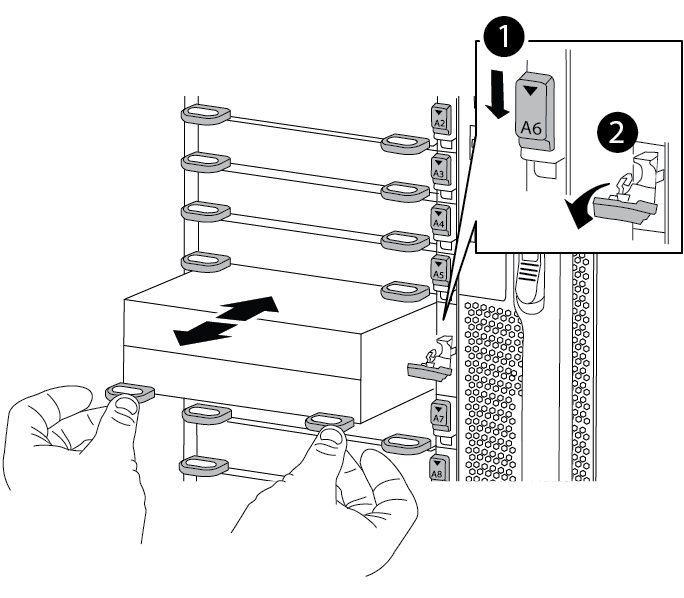

= Sostituire il modulo NVRAM e/o i DIMM NVRAM - AFF A900
:allow-uri-read: 
:icons: font
:imagesdir: ../media/

[role="lead"]
Il modulo NVRAM è composto da NVRAM11 e DIMM. È possibile sostituire un modulo NVRAM guasto o i DIMM all'interno del modulo NVRAM. Per sostituire un modulo NVRAM guasto, rimuoverlo dallo chassis, spostare i DIMM nel modulo sostitutivo e installare il modulo NVRAM sostitutivo nello chassis.

Per sostituire e la NVRAM DIMM, è necessario rimuovere il modulo NVRAM dal telaio, sostituire il modulo DIMM guasto nel modulo, quindi reinstallare il modulo NVRAM.

.A proposito di questa attività
Poiché l'ID di sistema deriva dal modulo NVRAM, in caso di sostituzione del modulo, i dischi appartenenti al sistema vengono riassegnati a un nuovo ID di sistema.

.Prima di iniziare
* Tutti gli shelf di dischi devono funzionare correttamente.
* Se il sistema si trova in una coppia ha, il controller partner deve essere in grado di assumere il controllo associato al modulo NVRAM da sostituire.
* Questa procedura utilizza la seguente terminologia:
+
** Il controller compromesso è il controller su cui si esegue la manutenzione.
** Il controller integro è il partner ha del controller compromesso.

* Questa procedura include la procedura per la riassegnazione automatica dei dischi al modulo controller associato al nuovo modulo NVRAM. È necessario riassegnare i dischi quando richiesto nella procedura. Il completamento della riassegnazione del disco prima del giveback può causare problemi.
* È necessario sostituire il componente guasto con un componente FRU sostitutivo ricevuto dal provider.
* Non è possibile modificare dischi o shelf di dischi come parte di questa procedura.

== Fase 1: Spegnere il controller compromesso

Arrestare o sostituire il controller compromesso utilizzando una delle seguenti opzioni.

[role="tabbed-block"]
====
.Opzione 1: La maggior parte dei sistemi
--
Per spegnere il controller compromesso, è necessario determinare lo stato del controller e, se necessario, assumere il controllo del controller in modo che il controller integro continui a servire i dati provenienti dallo storage del controller compromesso.

.A proposito di questa attività
* Se si dispone di un sistema SAN, è necessario aver controllato i messaggi di evento  `cluster kernel-service show`) per il blade SCSI del controller danneggiato. Il `cluster kernel-service show` comando (dalla modalità avanzata precedente) visualizza il nome del nodo, link:https://docs.netapp.com/us-en/ontap/system-admin/display-nodes-cluster-task.html["stato quorum"] di quel nodo, lo stato di disponibilità di quel nodo e lo stato operativo di quel nodo.
+
Ogni processo SCSI-blade deve essere in quorum con gli altri nodi del cluster. Eventuali problemi devono essere risolti prima di procedere con la sostituzione.

* Se si dispone di un cluster con più di due nodi, questo deve trovarsi in quorum. Se il cluster non è in quorum o un controller integro mostra false per idoneità e salute, è necessario correggere il problema prima di spegnere il controller compromesso; vedere link:https://docs.netapp.com/us-en/ontap/system-admin/synchronize-node-cluster-task.html?q=Quorum["Sincronizzare un nodo con il cluster"^].

.Fasi
. Se AutoSupport è attivato, sospendere la creazione automatica dei casi richiamando un messaggio AutoSupport: `system node autosupport invoke -node * -type all -message MAINT=<# of hours>h`
+
Il seguente messaggio AutoSupport elimina la creazione automatica del caso per due ore: `cluster1:> system node autosupport invoke -node * -type all -message MAINT=2h`

. Disattivare il giveback automatico dalla console del controller integro: `storage failover modify -node local -auto-giveback false`
+

NOTE: Quando viene visualizzato _Vuoi disattivare il giveback automatico?_, inserisci `y`.

. Portare la centralina danneggiata al prompt DEL CARICATORE:
+
[cols="1,2"]
|===
| Se il controller non utilizzato visualizza... | Quindi... 

 a| 
Il prompt DEL CARICATORE
 a| 
Passare alla fase successiva.

 a| 
In attesa di un giveback...
 a| 
Premere Ctrl-C, quindi rispondere `y` quando richiesto.

 a| 
Prompt di sistema o prompt della password
 a| 
Assumere il controllo o arrestare il controller compromesso dal controller integro: `storage failover takeover -ofnode _impaired_node_name_`

Quando il controller non utilizzato visualizza Waiting for giveback... (in attesa di giveback...), premere Ctrl-C e rispondere `y`.

|===

--
.Opzione 2: Controller in un MetroCluster
--

NOTE: Non utilizzare questa procedura se il sistema si trova in una configurazione MetroCluster a due nodi.

Per spegnere il controller compromesso, è necessario determinare lo stato del controller e, se necessario, assumere il controllo del controller in modo che il controller integro continui a servire i dati provenienti dallo storage del controller compromesso.

* Se si dispone di un cluster con più di due nodi, questo deve trovarsi in quorum. Se il cluster non è in quorum o un controller integro mostra false per idoneità e salute, è necessario correggere il problema prima di spegnere il controller compromesso; vedere link:https://docs.netapp.com/us-en/ontap/system-admin/synchronize-node-cluster-task.html?q=Quorum["Sincronizzare un nodo con il cluster"^].
* Se si dispone di una configurazione MetroCluster, è necessario confermare che lo stato di configurazione MetroCluster è configurato e che i nodi sono in uno stato abilitato e normale (`metrocluster node show`).

.Fasi
. Se AutoSupport è attivato, eliminare la creazione automatica del caso richiamando un messaggio AutoSupport: `system node autosupport invoke -node * -type all -message MAINT=number_of_hours_downh`
+
Il seguente messaggio AutoSupport elimina la creazione automatica del caso per due ore: `cluster1:*> system node autosupport invoke -node * -type all -message MAINT=2h`

. Disattivare il giveback automatico dalla console del controller integro: `storage failover modify –node local -auto-giveback false`
. Portare la centralina danneggiata al prompt DEL CARICATORE:
+
[cols="1,2"]
|===
| Se il controller non utilizzato visualizza... | Quindi... 

 a| 
Il prompt DEL CARICATORE
 a| 
Passare alla fase successiva.

 a| 
In attesa di un giveback...
 a| 
Premere Ctrl-C, quindi rispondere `y` quando richiesto.

 a| 
Prompt di sistema o prompt della password (inserire la password di sistema)
 a| 
Assumere il controllo o arrestare il controller compromesso dal controller integro: `storage failover takeover -ofnode _impaired_node_name_`

Quando il controller non utilizzato visualizza Waiting for giveback... (in attesa di giveback...), premere Ctrl-C e rispondere `y`.

|===

--
====

== Fase 2: Sostituire il modulo NVRAM

Per sostituire il modulo NVRAM, posizionarlo nello slot 6 dello chassis e seguire la sequenza di passaggi specifica.

. Se non si è già collegati a terra, mettere a terra l'utente.
. Rimuovere il modulo NVRAM di destinazione dal telaio:
+
.. Premere il tasto contrassegnato e numerato CAM.
+
Il pulsante CAM si allontana dal telaio.

.. Ruotare il fermo della camma verso il basso fino a portarlo in posizione orizzontale.
+
Il modulo NVRAM si disinnesta dal telaio e si sposta di alcuni centimetri.

.. Rimuovere il modulo NVRAM dallo chassis tirando le linguette di estrazione sui lati del lato anteriore del modulo.
+
.Animazione - sostituire il modulo NVRAM
video::6eb2d864-9d35-4a23-b6c2-adf9016b359f[panopto]
+

+
[cols="1,4"]
|===

 a| 
image:../media/icon_round_1.png["Numero di didascalia 1"]
 a| 
Fermo a camma con lettere e numeri

 a| 
image:../media/icon_round_2.png["Numero di didascalia 2"]
 a| 
Fermo della camma completamente sbloccato

|===
. Posizionare il modulo NVRAM su una superficie stabile e rimuovere il coperchio dal modulo NVRAM premendo verso il basso il pulsante di bloccaggio blu sul coperchio, quindi, tenendo premuto il pulsante blu, estrarre il coperchio dal modulo NVRAM.
+
image::../media/drw_a900_remove_NVRAM_module_contents.png[Rimuovere il contenuto del modulo NVRAM]

+
[cols="1,4"]
|===

 a| 
image:../media/icon_round_1.png["Numero di didascalia 1"]
 a| 
Pulsante di bloccaggio del coperchio

 a| 
image:../media/icon_round_2.png["Numero di didascalia 2"]
 a| 
Schede di espulsione DIMM e DIMM

|===
. Rimuovere i DIMM, uno alla volta, dal vecchio modulo NVRAM e installarli nel modulo NVRAM sostitutivo.
. Chiudere il coperchio del modulo.
. Installare il modulo NVRAM sostitutivo nel telaio:
+
.. Allineare il modulo con i bordi dell'apertura dello chassis nello slot 6.
.. Far scorrere delicatamente il modulo nello slot fino a quando il dispositivo di chiusura a camma con lettere e numeri non inizia a innestarsi nel perno della camma di i/o, quindi spingere il dispositivo di chiusura a camma completamente verso l'alto per bloccare il modulo in posizione.

== Fase 3: Sostituire un DIMM NVRAM

Per sostituire i DIMM NVRAM nel modulo NVRAM, rimuovere il modulo NVRAM, aprire il modulo e sostituire il DIMM di destinazione.

. Se non si è già collegati a terra, mettere a terra l'utente.
. Rimuovere il modulo NVRAM di destinazione dal telaio:
+
.. Premere il tasto contrassegnato e numerato CAM.
+
Il pulsante CAM si allontana dal telaio.

.. Ruotare il fermo della camma verso il basso fino a portarlo in posizione orizzontale.
+
Il modulo NVRAM si disinnesta dal telaio e si sposta di alcuni centimetri.

.. Rimuovere il modulo NVRAM dallo chassis tirando le linguette di estrazione sui lati del lato anteriore del modulo.
+
.Animazione - sostituire il DIMM NVRAM
video::0ae4e603-c22b-4930-8070-adf2000e38b5[panopto]
+

+
[cols="1,4"]
|===

 a| 
image:../media/icon_round_1.png["Numero di didascalia 1"]
 a| 
Fermo a camma con lettere e numeri

 a| 
image:../media/icon_round_2.png["Numero di didascalia 2"]
 a| 
fermo della camma completamente sbloccato

|===
. Posizionare il modulo NVRAM su una superficie stabile e rimuovere il coperchio dal modulo NVRAM premendo verso il basso il pulsante di bloccaggio blu sul coperchio, quindi, tenendo premuto il pulsante blu, estrarre il coperchio dal modulo NVRAM.
+
image::../media/drw_a900_remove_NVRAM_module_contents.png[Rimuovere il contenuto del modulo NVRAM]

+
[cols="1,4"]
|===

 a| 
image:../media/icon_round_1.png["Numero di didascalia 1"]
 a| 
Pulsante di bloccaggio del coperchio

 a| 
image:../media/icon_round_2.png["Numero di didascalia 2"]
 a| 
Schede di espulsione DIMM e DIMM

|===
. Individuare il modulo DIMM da sostituire all'interno del modulo NVRAM, quindi rimuoverlo premendo verso il basso le linguette di bloccaggio del modulo DIMM ed estraendolo dallo zoccolo.
. Installare il modulo DIMM sostitutivo allineandolo allo zoccolo e spingendolo delicatamente nello zoccolo fino a quando le linguette di bloccaggio non si bloccano in posizione.
. Chiudere il coperchio del modulo.
. Installare il modulo NVRAM nel telaio:
+
.. Allineare il modulo con i bordi dell'apertura dello chassis nello slot 6.
.. Far scorrere delicatamente il modulo nello slot fino a quando il dispositivo di chiusura a camma con lettere e numeri non inizia a innestarsi nel perno della camma di i/o, quindi spingere il dispositivo di chiusura a camma completamente verso l'alto per bloccare il modulo in posizione.

== Fase 4: Riavviare il controller

Dopo aver sostituito la FRU, è necessario riavviare il modulo controller.

. Per avviare ONTAP dal prompt DEL CARICATORE, immettere `bye`.

== Fase 5: Riassegnare i dischi

È necessario confermare la modifica dell'ID di sistema al momento dell'avvio del controller sostitutivo e verificare che la modifica sia stata implementata.

CAUTION: La riassegnazione del disco è necessaria solo quando si sostituisce il modulo NVRAM e non si applica alla sostituzione del DIMM NVRAM.

.Fasi
. Se il controller sostitutivo è in modalità di manutenzione (che mostra il `*>` Prompt), uscire dalla modalità di manutenzione e passare al prompt DEL CARICATORE: `halt`
. Dal prompt DEL CARICATORE sul controller sostitutivo, avviare il controller e immettere y se viene richiesto di ignorare l'ID del sistema a causa di una mancata corrispondenza dell'ID del sistema.
. Attendi fino all'attesa del giveback... Sulla console del controller con il modulo sostitutivo viene visualizzato il messaggio e quindi, dal controller integro, verificare che il nuovo ID di sistema del partner sia stato assegnato automaticamente: `storage failover show`
+
Nell'output del comando, viene visualizzato un messaggio che indica che l'ID del sistema è stato modificato sul controller compromesso, mostrando gli ID vecchi e nuovi corretti. Nell'esempio seguente, il node2 è stato sostituito e ha un nuovo ID di sistema pari a 151759706.

+
[listing]
----
node1:> storage failover show
                                    Takeover
Node              Partner           Possible     State Description
------------      ------------      --------     -------------------------------------
node1             node2             false        System ID changed on partner (Old:
                                                  151759755, New: 151759706), In takeover
node2             node1             -            Waiting for giveback (HA mailboxes)
----
. Restituire il controller:
+
.. Dal controller integro, restituire lo storage del controller sostituito: `storage failover giveback -ofnode replacement_node_name`
+
Il controller sostitutivo riprende lo storage e completa l'avvio.

+
Se viene richiesto di ignorare l'ID di sistema a causa di una mancata corrispondenza dell'ID di sistema, immettere `y`.

+

NOTE: Se il giveback viene vetoed, puoi prendere in considerazione la possibilità di ignorare i veti.

+
Per ulteriori informazioni, consultare https://docs.netapp.com/us-en/ontap/high-availability/ha_manual_giveback.html#if-giveback-is-interrupted["Comandi manuali di giveback"^] argomento per ignorare il veto.

.. Una volta completato il giveback, verificare che la coppia ha sia in buone condizioni e che sia possibile effettuare il takeover: `storage failover show`
+
L'output di `storage failover show` Il comando non deve includere l'ID di sistema modificato nel messaggio del partner.

. Verificare che i dischi siano stati assegnati correttamente: `storage disk show -ownership`
+
I dischi appartenenti al controller sostitutivo devono mostrare il nuovo ID di sistema. Nell'esempio seguente, i dischi di proprietà di node1 ora mostrano il nuovo ID di sistema, 151759706:

+
[listing]
----
node1:> storage disk show -ownership

Disk  Aggregate Home  Owner  DR Home  Home ID    Owner ID  DR Home ID Reserver  Pool
----- ------    ----- ------ -------- -------    -------    -------  ---------  ---
1.0.0  aggr0_1  node1 node1  -        151759706  151759706  -       151759706 Pool0
1.0.1  aggr0_1  node1 node1           151759706  151759706  -       151759706 Pool0
.
.
.
----
. Se il sistema si trova in una configurazione MetroCluster, monitorare lo stato del controller: `metrocluster node show`
+
La configurazione MetroCluster impiega alcuni minuti dopo la sostituzione per tornare a uno stato normale, in cui ogni controller mostra uno stato configurato, con mirroring DR abilitato e una modalità normale. Il `metrocluster node show -fields node-systemid` L'output del comando visualizza il vecchio ID di sistema fino a quando la configurazione MetroCluster non torna allo stato normale.

. Se il controller si trova in una configurazione MetroCluster, a seconda dello stato MetroCluster, verificare che il campo DR home ID (ID origine DR) indichi il proprietario originale del disco se il proprietario originale è un controller nel sito di emergenza.
+
Ciò è necessario se si verificano entrambe le seguenti condizioni:

+
** La configurazione MetroCluster è in uno stato di switchover.
** Il controller sostitutivo è l'attuale proprietario dei dischi nel sito di disastro.
+
Vedere https://docs.netapp.com/us-en/ontap-metrocluster/manage/concept_understanding_mcc_data_protection_and_disaster_recovery.html#disk-ownership-changes-during-ha-takeover-and-metrocluster-switchover-in-a-four-node-metrocluster-configuration["La proprietà del disco cambia durante il takeover ha e lo switchover MetroCluster in una configurazione MetroCluster a quattro nodi"] per ulteriori informazioni.

. Se il sistema si trova in una configurazione MetroCluster, verificare che ciascun controller sia configurato: `metrocluster node show - fields configuration-state`
+
[listing]
----
node1_siteA::> metrocluster node show -fields configuration-state

dr-group-id            cluster node           configuration-state
-----------            ---------------------- -------------- -------------------
1 node1_siteA          node1mcc-001           configured
1 node1_siteA          node1mcc-002           configured
1 node1_siteB          node1mcc-003           configured
1 node1_siteB          node1mcc-004           configured

4 entries were displayed.
----
. Verificare che i volumi previsti siano presenti per ciascun controller: `vol show -node node-name`
. Se la crittografia dello storage è attivata, è necessario ripristinare la funzionalità.
. Se al riavvio è stato disattivato il Takeover automatico, attivarlo dal controller integro: `storage failover modify -node replacement-node-name -onreboot true`

== Fase 6: Restituire la parte guasta a NetApp

Restituire la parte guasta a NetApp, come descritto nelle istruzioni RMA fornite con il kit. Vedere la https://mysupport.netapp.com/site/info/rma["Restituzione e sostituzione delle parti"] pagina per ulteriori informazioni.
