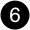

= Panoramica di aggiunta e sostituzione del modulo I/O - AFX 2K
:allow-uri-read: 
:icons: font
:imagesdir: ../media/

[role="lead"]
Il sistema storage AFX 2K offre flessibilità nell'espansione o nella sostituzione dei moduli I/O per migliorare la connettività e le prestazioni di rete. Aggiungere o sostituire un modulo I/O è essenziale quando aggiorni le funzionalità di rete o devi risolvere un problema con un modulo guasto.

Puoi sostituire un modulo I/O guasto nel tuo sistema storage AFX 2K con un modulo I/O dello stesso tipo o con un modulo I/O di tipo diverso. Puoi anche aggiungere un modulo I/O a un sistema con slot vuoti.

* link:io-module-add.html["Aggiungere un modulo i/O."]
+
L'aggiunta di moduli aggiuntivi può migliorare la ridondanza, contribuendo a garantire che il sistema rimanga operativo anche in caso di guasto di un modulo.

* link:io-module-replace.html["Sostituire un modulo i/O."]
+
La sostituzione di un modulo i/o guasto può ripristinare il sistema allo stato operativo ottimale.

.Numerazione degli slot i/O.
Gli slot di I/O sul controller AFX 2K sono numerati da 1 a 11, come mostrato nell'illustrazione seguente.

image::../media/drw_afx_2k_rear_slots_ieops-2862.svg[Numerazione degli slot su un controller AFX 2K]

[cols="10%,23%,10%,24%,10%,23%"]
|===
| Numero di slot | Slot I/O | Numero di slot | Slot I/O | Numero di slot | Slot I/O 

 a| 
image::../media/icon_round_1.svg[Numero di didascalia 1]
| HA  a| 
image::../media/icon_round_4.svg[Numero di didascalia 4]

image::../media/icon_round_5.svg[Numero di didascalia 5]
| NVRAM12  a| 
image::../media/icon_round_9.svg[Callout numero 9]
| Rete 

 a| 
image::../media/icon_round_2.svg[Numero di didascalia 2]
| Cluster  a| 

image::../media/icon_round_7.svg[Callout numero 7]
| NVRAM12-EX  a| 
image::../media/icon_round_10.svg[Callout numero 10]
| Storage 

 a| 
image::../media/icon_round_3.svg[Numero di didascalia 3]
| Rete  a| 
image::../media/icon_round_8.svg[Callout numero 8]
| Storage  a| 
image::../media/icon_round_11.svg[Callout numero 11]
| (*Opzionale*) Quattro porte 25GbE SFP28 per connettività di gestione aggiuntiva 
|===