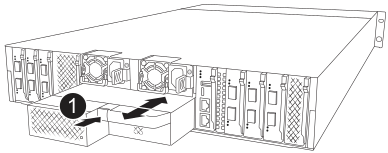
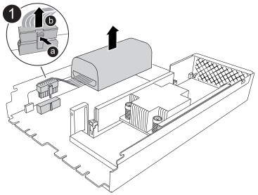

= Sostituisci NVRAM12-EX - AFX 2K
:allow-uri-read: 
:icons: font
:imagesdir: ../media/

[role="lead"]
Sostituisci il modulo NVRAM12-EX nel tuo sistema storage AFX 2K quando la memoria non volatile risulta difettosa o necessita di un aggiornamento. La procedura di sostituzione prevede lo spegnimento del controller danneggiato, la sostituzione del modulo NVRAM12-EX, del DIMM NVRAM o della batteria NVRAM, e la restituzione del componente guasto a NetApp.

Il modulo NVRAM12-EX è composto dall'hardware NVRAM12 e da DIMM sostituibili sul campo. Puoi sostituire un modulo NVRAM12-EX guasto, i DIMM o la batteria NVRAM all'interno del modulo NVRAM12-EX.

.Prima di iniziare
* Assicurarsi di avere a disposizione il pezzo di ricambio. È necessario sostituire il componente guasto con un componente sostitutivo ricevuto da NetApp.
* Verificare che tutti gli altri componenti del sistema di archiviazione funzionino correttamente; in caso contrario, contattare https://support.netapp.com["Supporto NetApp"].
+

NOTE: Prima di sostituire il modulo NVRAM12-EX, assicurati di spegnere il controller guasto prima di procedere con la sostituzione.

== Fase 1: Spegnere il controller compromesso

Spegnere o sostituire il controller compromesso.

Prendere il controllo e arrestare il controller non funzionante in modo che il controller funzionante continui a fornire dati dalla memoria del controller non funzionante. Per fare questo, si sopprime la creazione automatica dei casi in AutoSupport, si disabilita il giveback automatico e si porta il controller non funzionante al prompt LOADER. Il prompt LOADER è lo stato di arresto sicuro da cui è possibile sostituire la FRU.

.A proposito di questa attività
* Se si dispone di un cluster con più di quattro nodi, è necessario che sia raggiunto il quorum.  Per visualizzare le informazioni del cluster sui nodi, utilizzare `cluster show` comando.  Per maggiori informazioni sul `cluster show` comando, vederelink:https://docs.netapp.com/us-en/ontap/system-admin/display-nodes-cluster-task.html["Visualizza i dettagli a livello di nodo in un cluster ONTAP"^] .
* Se il cluster non è in quorum o se lo stato di integrità o l'idoneità di un qualsiasi controller (diverso dal controller non funzionante) risulta falso, è necessario correggere il problema prima di arrestare il controller non funzionante. Vedere link:https://docs.netapp.com/us-en/ontap/system-admin/synchronize-node-cluster-task.html?q=Quorum["Sincronizzare un nodo con il cluster"^] .

.Fasi
. Se AutoSupport è attivato, eliminare la creazione automatica del caso richiamando un messaggio AutoSupport:
+
`system node autosupport invoke -node * -type all -message MAINT=<# of hours>h`

+
Il seguente messaggio AutoSupport elimina la creazione automatica del caso per due ore:

+
`cluster1:> system node autosupport invoke -node * -type all -message MAINT=2h`

. Disattivare il ritorno automatico dalla console del controllore non abilitato:
+
`storage failover modify -node impaired-node -auto-giveback-of false`

+

NOTE: Quando vedi _Vuoi disattivare la restituzione automatica?_, inserisci `y` .

. Portare la centralina danneggiata al prompt DEL CARICATORE:
+
[cols="1,2"]
|===
| Se il controller non utilizzato visualizza... | Quindi... 

 a| 
Il prompt DEL CARICATORE
 a| 
Passare alla fase successiva.

 a| 
Prompt di sistema o prompt della password
 a| 
Prendere il controllo o interrompere il controllo del controllore sano da parte del controllore compromesso:
`storage failover takeover -ofnode _impaired_node_name_ -halt _true_`

Il parametro _-halt true_ porta il nodo danneggiato al prompt LOADER.

|===

== Passaggio 2: Sostituisci il modulo NVRAM12-EX, il DIMM NVRAM o la batteria NVRAM

Sostituisci il modulo NVRAM12-EX, i DIMM NVRAM o la batteria NVRAM utilizzando le seguenti opzioni.

È necessario rimuovere il modulo controller dal contenitore quando si sostituisce il modulo controller o un componente all'interno del modulo controller.

[role="tabbed-block"]
====
.Opzione 1: Sostituisci il modulo NVRAM12-EX
--
Per sostituire il modulo NVRAM12-EX, individualo nello slot 6/7 dell'enclosure e segui la sequenza specifica di passaggi.

. Controlla il LED di stato NVRAM situato nello slot 4/5 e lo slot di stato NVRAM12-EX 6/7 del sistema. C'è anche un LED NVRAM sul pannello anteriore del modulo controller. Cerca l'icona NV:
+
image::../media/drw_a1K-70-90_nvram-led_ieops-1463.svg[Grafico della posizione dei LED di stato e di attenzione NVRAM]

+
[cols="1,4"]
|===

2+| *NVRAM* 

 a| 
image:../media/icon_round_1.png["Numero di didascalia 1"]
 a| 
LED di stato NVRAM

 a| 
image:../media/icon_round_2.png["Numero di didascalia 2"]
 a| 
LED di attenzione NVRAM

|===
+
image::../media/drw_afx_emr_nvram-led_ieops-2962.svg[Grafico della posizione dei LED di attenzione e stato NVRAM12-EX]

+
[cols="1,4"]
|===

2+| *NVRAM12-EX* 

 a| 
image:../media/icon_round_1.png["Numero di didascalia 1"]
 a| 
LED di stato NVRAM12-EX

 a| 
image:../media/icon_round_2.png["Numero di didascalia 2"]
 a| 
LED di attenzione NVRAM12-EX

|===
+
** Se il LED NV è spento, passare alla fase successiva.
** Se il LED NV lampeggia, attendere l'arresto del lampeggio. Se il lampeggiamento continua per più di 5 minuti, contattare il supporto tecnico per assistenza.

. Se non si è già collegati a terra, mettere a terra l'utente.
. Scollegare i cavi di alimentazione dagli alimentatori del controller.
. Ruotare il vassoio di gestione dei cavi verso il basso tirando delicatamente i perni alle estremità del vassoio e ruotandolo verso il basso.
. Rimuovi il modulo NVRAM12-EX danneggiato dall'involucro:
+
.. Premi il pulsante di bloccaggio della camma.
.. Rimuovi il modulo NVRAM12-EX danneggiato dallo chassis tirando fuori il modulo dallo chassis.
+

+
[cols="1,4"]
|===

 a| 
image:../media/icon_round_1.png["Numero di didascalia 1"]
| Pulsante di bloccaggio della camma 
|===

. Metti il modulo NVRAM12-EX su una superficie stabile.
. Apri il coperchio del modulo NVRAM12-EX usando le dita o un cacciavite per allentare l'unica vite a testa zigrinata sul coperchio e sollevare il coperchio dal modulo.
+
image::../media/drw_afx_emr_nv12l_remove_cover_ieops-2929.svg[Rimuovi il coperchio NVRAM12-EX]

+
[cols="1,4"]
|===

 a| 
image:../media/icon_round_1.png["Numero di didascalia 1"]
| Vite a testa zigrinata per il coperchio NVRAM12-EX 
|===
. Rimuovi i DIMM, uno alla volta, dal modulo NVRAM12-EX danneggiato e installali nel modulo NVRAM12-EX sostitutivo.
+
image::../media/drw_afx_emr_nv12l_remove_dimms_ieops-2883.svg[Rimuovi i moduli DIMM NVRAM12-EX]

+
[cols="1,4"]
|===

 a| 
image:../media/icon_round_1.png["Numero di didascalia 1"]
| Linguette di bloccaggio DIMM 
|===
. Scollega la batteria dal modulo NVRAM12-EX:
+
.. Premi la clip sulla parte frontale del connettore della batteria per sganciare il connettore dalla presa.
.. Scollegare il cavo della batteria dalla presa.

. Rimuovi la batteria scollegata sollevandola per estrarla dal modulo.
+

+
[cols="1,4"]
|===

 a| 
image:../media/icon_round_1.png["Numero di didascalia 1"]
| Clip di collegamento della batteria NVRAM12-EX 
|===
. Installa la batteria nel modulo NVRAM12-EX di ricambio:
+
.. Inserisci il clip di connessione della batteria nella presa e assicurati che la spina si blocchi in posizione.
.. Inserire la batteria nello slot e premere con decisione verso il basso per assicurarsi che sia bloccata in posizione.

. Installa il coperchio del modulo NVRAM12-EX allineando il coperchio con il foro della vite e fissandolo con la vite a testa zigrinata.
. Installa il modulo NVRAM12-EX di ricambio nello chassis:
+
.. Allinea il modulo con i bordi dell'apertura dell'involucro nello slot 6/7.
.. Fai scorrere delicatamente il modulo nello slot fino in fondo per bloccarlo in posizione.

. Ruotare il vassoio di gestione dei cavi verso l'alto fino alla posizione di chiusura.

--
.Opzione 2: Sostituire il modulo DIMM NVRAM
--
Per sostituire i DIMM NVRAM nel modulo NVRAM12-EX, devi rimuovere il modulo NVRAM12-EX e poi sostituire il DIMM di destinazione.

. Controlla il LED di stato NVRAM situato nello slot 4/5 e lo slot di stato NVRAM12-EX 6/7 del sistema. C'è anche un LED NVRAM sul pannello anteriore del modulo controller. Cerca l'icona NV:
+
image::../media/drw_a1K-70-90_nvram-led_ieops-1463.svg[Grafico della posizione dei LED di stato e di attenzione NVRAM]

+
[cols="1,4"]
|===

2+| *NVRAM* 

 a| 
image:../media/icon_round_1.png["Numero di didascalia 1"]
 a| 
LED di stato NVRAM

 a| 
image:../media/icon_round_2.png["Numero di didascalia 2"]
 a| 
LED di attenzione NVRAM

|===
+
image::../media/drw_afx_emr_nvram-led_ieops-2962.svg[Grafico della posizione dei LED di attenzione e stato NVRAM12-EX]

+
[cols="1,4"]
|===

2+| *NVRAM12-EX* 

 a| 
image:../media/icon_round_1.png["Numero di didascalia 1"]
 a| 
LED di stato NVRAM12-EX

 a| 
image:../media/icon_round_2.png["Numero di didascalia 2"]
 a| 
LED di attenzione NVRAM12-EX

|===
+
** Se il LED NV è spento, passare alla fase successiva.
** Se il LED NV lampeggia, attendere l'arresto del lampeggio. Se il lampeggiamento continua per più di 5 minuti, contattare il supporto tecnico per assistenza.

. Se non si è già collegati a terra, mettere a terra l'utente.
. Scollegare i cavi di alimentazione dagli alimentatori.
. Ruotare il vassoio di gestione dei cavi verso il basso tirando delicatamente i perni alle estremità del vassoio e ruotandolo verso il basso.
. Rimuovi il modulo NVRAM12-EX di destinazione dallo chassis:
+
.. Premi il pulsante di bloccaggio della camma.
.. Rimuovi il modulo NVRAM12-EX danneggiato dallo chassis tirando fuori il modulo dallo chassis.
+

+
[cols="1,4"]
|===

 a| 
image:../media/icon_round_1.png["Numero di didascalia 1"]
| Pulsante di bloccaggio della camma 
|===

. Metti il modulo NVRAM12-EX su una superficie stabile.
. Apri il coperchio del modulo NVRAM12-EX usando le dita o un cacciavite per allentare l'unica vite a testa zigrinata sul coperchio e sollevare il coperchio dal modulo.
+
image::../media/drw_afx_emr_nv12l_remove_cover_ieops-2929.svg[Rimuovi il coperchio NVRAM12-EX]

+
[cols="1,4"]
|===

 a| 
image:../media/icon_round_1.png["Numero di didascalia 1"]
| Vite a testa zigrinata per il coperchio NVRAM12-EX 
|===
. Individua il DIMM da sostituire all'interno del modulo NVRAM12-EX.
+

NOTE: Consulta l'etichetta FRU sul lato del modulo NVRAM12-EX per determinare la posizione degli slot DIMM 1 e 2.

. Rimuovere il modulo DIMM premendo verso il basso le linguette di bloccaggio e sollevando il modulo DIMM dallo zoccolo.
+
image::../media/drw_afx_emr_nv12l_remove_dimms_ieops-2883.svg[Rimuovi i moduli DIMM NVRAM12-EX]

+
[cols="1,4"]
|===

 a| 
image:../media/icon_round_1.png["Numero di didascalia 1"]
| Linguette di bloccaggio DIMM 
|===
. Installare il modulo DIMM sostitutivo allineandolo allo zoccolo e spingendolo delicatamente nello zoccolo fino a quando le linguette di bloccaggio non si bloccano in posizione.
. Installa il coperchio del modulo NVRAM12-EX allineando il coperchio con il foro della vite e fissandolo con la vite a testa zigrinata.
. Installa il modulo NVRAM12-EX nello chassis:
+
.. Fai scorrere delicatamente il modulo nello slot fino in fondo per bloccarlo in posizione.

. Ruotare il vassoio di gestione dei cavi verso l'alto fino alla posizione di chiusura.

--
.Opzione 3: Sostituisci la batteria NVRAM
--
Per sostituire i DIMM NVRAM nel modulo NVRAM12-EX, devi rimuovere il modulo NVRAM12-EX e poi sostituire la batteria.

. Controlla il LED di stato NVRAM situato nello slot 4/5 e lo slot di stato NVRAM12-EX 6/7 del sistema. C'è anche un LED NVRAM sul pannello anteriore del modulo controller. Cerca l'icona NV:
+
image::../media/drw_a1K-70-90_nvram-led_ieops-1463.svg[Grafico della posizione dei LED di stato e di attenzione NVRAM]

+
[cols="1,4"]
|===

2+| *NVRAM* 

 a| 
image:../media/icon_round_1.png["Numero di didascalia 1"]
 a| 
LED di stato NVRAM

 a| 
image:../media/icon_round_2.png["Numero di didascalia 2"]
 a| 
LED di attenzione NVRAM

|===
+
image::../media/drw_afx_emr_nvram-led_ieops-2962.svg[Grafico della posizione dei LED di attenzione e stato NVRAM12-EX]

+
[cols="1,4"]
|===

2+| *NVRAM12-EX* 

 a| 
image:../media/icon_round_1.png["Numero di didascalia 1"]
 a| 
LED di stato NVRAM12-EX

 a| 
image:../media/icon_round_2.png["Numero di didascalia 2"]
 a| 
LED di attenzione NVRAM12-EX

|===
+
** Se il LED NV è spento, passare alla fase successiva.
** Se il LED NV lampeggia, attendere l'arresto del lampeggio. Se il lampeggiamento continua per più di 5 minuti, contattare il supporto tecnico per assistenza.

. Se non si è già collegati a terra, mettere a terra l'utente.
. Scollegare i cavi di alimentazione dagli alimentatori.
. Ruotare il vassoio di gestione dei cavi verso il basso tirando delicatamente i perni alle estremità del vassoio e ruotandolo verso il basso.
. Rimuovi il modulo NVRAM12-EX di destinazione dallo chassis:
+
.. Premi il pulsante di bloccaggio della camma.
.. Rimuovi il modulo NVRAM12-EX danneggiato dallo chassis tirando fuori il modulo dallo chassis.
+

+
[cols="1,4"]
|===

 a| 
image:../media/icon_round_1.png["Numero di didascalia 1"]
| Pulsante di bloccaggio della camma 
|===

. Metti il modulo NVRAM12-EX su una superficie stabile.
. Apri il coperchio del modulo NVRAM12-EX usando le dita o un cacciavite per allentare l'unica vite a testa zigrinata sul coperchio e sollevare il coperchio dal modulo.
+
image::../media/drw_afx_emr_nv12l_remove_cover_ieops-2929.svg[Rimuovi il coperchio NVRAM12-EX]

+
[cols="1,4"]
|===

 a| 
image:../media/icon_round_1.png["Numero di didascalia 1"]
| Vite a testa zigrinata per il coperchio NVRAM12-EX 
|===
. Scollega la batteria dal modulo NVRAM12-EX:
+
.. Premi la clip sulla parte frontale del connettore della batteria per sganciare il connettore dalla presa.
.. Scollegare il cavo della batteria dalla presa.

. Rimuovi la batteria scollegata sollevandola per estrarla dal modulo.
+

+
[cols="1,4"]
|===

 a| 
image:../media/icon_round_1.png["Numero di didascalia 1"]
| Clip di collegamento della batteria NVRAM12-EX 
|===
. Rimuovere la batteria sostitutiva dalla confezione.
. Installa il pacco batterie di ricambio nel modulo NVRAM12-EX:
+
.. Inserisci il clip di connessione della batteria nella presa e assicurati che la spina si blocchi in posizione.
.. Inserire la batteria nello slot e premere con decisione verso il basso per assicurarsi che sia bloccata in posizione.

. Installa il coperchio del modulo NVRAM12-EX allineando il coperchio con il foro della vite e fissandolo con la vite a testa zigrinata.
. Installa il modulo NVRAM12-EX nello chassis:
+
.. Fai scorrere delicatamente il modulo nello slot fino in fondo per bloccarlo in posizione.

. Ruotare il vassoio di gestione dei cavi verso l'alto fino alla posizione di chiusura.

--
====

== Fase 3: Riavviare il controller

Dopo aver sostituito la FRU, è necessario riavviare il modulo controller.

. Ricollegare i cavi di alimentazione all'alimentatore.
+
Il sistema inizierà a riavviarsi, in genere al prompt del CARICATORE.

. Entra `bye` al prompt LOADER.

== Passaggio 4: Completa la sostituzione della NVRAM12-EX

Esegui i seguenti passaggi per completare la sostituzione della NVRAM12-EX.

.Fasi
. Dal controller funzionante, verificare che il nuovo ID del sistema partner sia stato assegnato automaticamente:
`_storage failover show_`
+
Nell'output del comando, dovresti vedere un messaggio che mostra lo stato corrente della sostituzione dello storage. Nell'esempio seguente,  `node2` ha subito la sostituzione e mostra lo stato corrente come  `In takeover`.

+
[listing]
----
node1:> storage failover show
                                    Takeover
Node              Partner           Possible     State Description
------------      ------------      --------     -------------------------------------
node1             node2             false        In takeover
node2             node1             -            Waiting for giveback
----
. Restituire il controller:
+
.. Dal controller funzionante, restituisci lo storage del controller sostituito: `_storage failover giveback -ofnode impaired_node_name_`
+
Il controller recupera lo storage e completa l'avvio.

+

NOTE: Se il giveback viene vetoed, puoi prendere in considerazione la possibilità di ignorare i veti.

+
Per ulteriori informazioni, consultare https://docs.netapp.com/us-en/ontap/high-availability/ha_manual_giveback.html#if-giveback-is-interrupted["Comandi manuali di giveback"^] argomento per ignorare il veto.

.. Al termine del giveback, verifica che la coppia ha sia in buone condizioni e che il takeover sia possibile: _Failover dello storage show_
+
L'output di `storage failover show` Il comando non deve includere l'ID di sistema modificato nel messaggio del partner.

. Verificare che i volumi previsti siano presenti per ciascun controller:
+
`vol show -node node-name`

. Premere <enter> quando i messaggi della console si interrompono.
+
** Se viene visualizzato il prompt _login_, procedere al passaggio successivo.
** Se non vedi il prompt di accesso, accedi al nodo partner.

. Attendere 5 minuti dopo il completamento del report di sconto e verificare lo stato di failover e dello stato dello sconto:
+
`storage failover show`E `storage failover show-giveback`

+

NOTE: Il seguente comando è disponibile solo nel livello di privilegio Modalità diagnostica.

. Se il giveback automatico è stato disattivato, riabilitarlo:
+
`storage failover modify -node local -auto-giveback-of true`

. Se AutoSupport è attivato, ripristinare/riattivare la creazione automatica dei casi:
+
`system node autosupport invoke -node * -type all -message MAINT=END`

== Fase 5: Restituire il componente guasto a NetApp

Restituire la parte guasta a NetApp, come descritto nelle istruzioni RMA fornite con il kit. Vedere la https://mysupport.netapp.com/site/info/rma["Restituzione e sostituzione delle parti"] pagina per ulteriori informazioni.
