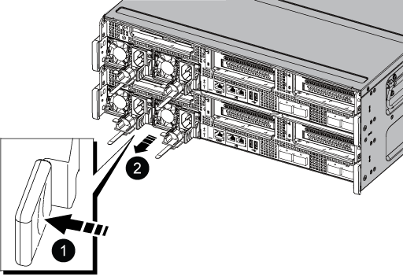

= Sostituire l'hardware del modulo controller - ASA C800
:allow-uri-read: 
:icons: font
:imagesdir: ../media/

[role="lead"]
Per sostituire il controller, è necessario rimuovere il controller guasto, spostare i componenti FRU nel modulo controller sostitutivo, installare il modulo controller sostitutivo nello chassis, quindi avviare il sistema in modalità manutenzione.

== Fase 1: Rimuovere il modulo controller

È necessario rimuovere il modulo controller dal telaio quando si sostituisce il modulo controller o un componente all'interno del modulo controller.

. Nella parte anteriore dello chassis, premere con decisione ciascun disco fino a quando non si avverte un arresto positivo. In questo modo, i dischi sono posizionati saldamente sulla scheda intermedia dello chassis.
+
image::../media/drw_a800_drive_seated_IEOPS-960.svg[Disco drw a800 installato IEOPS 960]

. Andare sul retro del telaio. Se non si è già collegati a terra, mettere a terra l'utente.
. Scollegare gli alimentatori del modulo controller dalla fonte di alimentazione.
. Rilasciare i fermi dei cavi di alimentazione, quindi scollegare i cavi dagli alimentatori.
. Allentare il gancio e la fascetta che fissano i cavi al dispositivo di gestione dei cavi, quindi scollegare i cavi di sistema e i moduli SFP e QSFP (se necessario) dal modulo controller, tenendo traccia della posizione in cui sono stati collegati i cavi.
+
Lasciare i cavi nel dispositivo di gestione dei cavi in modo che quando si reinstalla il dispositivo di gestione dei cavi, i cavi siano organizzati.

. Rimuovere il dispositivo di gestione dei cavi dal modulo controller e metterlo da parte.
. Premere verso il basso entrambi i fermi di bloccaggio, quindi ruotare entrambi i fermi verso il basso contemporaneamente.
+
Il modulo controller si sposta leggermente fuori dallo chassis.

+
image::../media/drw_a800_pcm_remove.png[Rilasciare il modulo controller]

+
[cols="1,4"]
|===

 a| 
image:../media/legend_icon_01.png["Numero di didascalia 1"]
 a| 
Fermo di bloccaggio

 a| 
image:../media/legend_icon_02.png["Numero di didascalia 2"]
 a| 
Perno di bloccaggio

|===
. Estrarre il modulo controller dallo chassis e posizionarlo su una superficie piana e stabile.
+
Assicurarsi di sostenere la parte inferiore del modulo controller mentre lo si sposta fuori dallo chassis. .

. Posizionare il modulo controller su una superficie piana e stabile.
. Aprire il condotto dell'aria del modulo controller:
+
.. Premere verso l'interno le linguette di bloccaggio sui lati del condotto dell'aria verso il centro del modulo controller.
.. Far scorrere il condotto dell'aria verso i moduli delle ventole, quindi ruotarlo verso l'alto fino a portarlo in posizione completamente aperta.
+
image::../media/drw_a800_open_air_duct.png[Aprire il condotto dell'aria]

+
[cols="1,4"]
|===

 a| 
image:../media/legend_icon_01.png["Numero di didascalia 1"]
 a| 
Linguette di bloccaggio del condotto dell'aria

 a| 
image:../media/legend_icon_02.png["Numero di didascalia 2"]
 a| 
Far scorrere il condotto dell'aria verso i moduli delle ventole

 a| 
image:../media/legend_icon_03.png["Numero di didascalia 3"]
 a| 
Ruotare il condotto dell'aria verso i moduli delle ventole

|===

== Fase 2: Spostare gli alimentatori

Quando si sostituisce un modulo controller, è necessario spostare gli alimentatori dal modulo controller guasto al modulo controller sostitutivo.

. Ruotare la maniglia della camma in modo che possa essere utilizzata per estrarre l'alimentatore dal modulo controller premendo la linguetta di bloccaggio.
+

CAUTION: L'alimentazione è in corto. Utilizzare sempre due mani per sostenerlo durante la rimozione dal modulo controller in modo che non si sposti improvvisamente dal modulo controller e non causi lesioni.

+

+
[cols="1,4"]
|===

 a| 
image:../media/legend_icon_01.png["Numero di didascalia 1"]
 a| 
Linguetta blu di bloccaggio dell'alimentatore

 a| 
image:../media/legend_icon_02.png["Numero di didascalia 2"]
 a| 
Alimentatore

|===
. Spostare l'alimentatore sul nuovo modulo controller, quindi installarlo.
. Con entrambe le mani, sostenere e allineare i bordi dell'alimentatore con l'apertura nel modulo controller, quindi spingere delicatamente l'alimentatore nel modulo controller fino a quando la linguetta di blocco non scatta in posizione.
+
Gli alimentatori si innestano correttamente solo con il connettore interno e si bloccano in un modo.

+

NOTE: Per evitare di danneggiare il connettore interno, non esercitare una forza eccessiva quando si inserisce l'alimentatore nel sistema.

== Fase 3: Spostare le ventole

Quando si sostituisce un modulo controller guasto, è necessario spostare le ventole dal modulo controller danneggiato al modulo sostitutivo.

. Rimuovere il modulo della ventola stringendo le linguette di bloccaggio sul lato del modulo della ventola, quindi sollevare il modulo della ventola per estrarlo dal modulo del controller.
+
image::../media/drw_a800_replace_fan.png[Rimuovere la ventola]

+
|===

 a| 
image:../media/legend_icon_01.png["Numero di didascalia 1"]

 a| 
Linguette di bloccaggio della ventola

 a| 
image:../media/legend_icon_02.png["Numero di didascalia 2"]

 a| 
Modulo della ventola

|===
. Spostare il modulo della ventola sul modulo controller sostitutivo, quindi installare il modulo della ventola allineandone i bordi con l'apertura nel modulo controller, quindi far scorrere il modulo della ventola nel modulo controller fino a quando i fermi di blocco non scattano in posizione.
. Ripetere questa procedura per i moduli ventola rimanenti.

== Fase 4: Spostare la batteria NVDIMM

Quando si sostituisce il modulo controller, è necessario spostare la batteria NVRAM dal modulo controller guasto al modulo controller sostitutivo

. Aprire il coperchio del condotto dell'aria e individuare la batteria NVDIMM nel riser.
+
image::../media/drw_a800_nvdimm_battery_replace.png[Sostituire la batteria NVDIMM]

+
[cols="1,4"]
|===

 a| 
image:../media/legend_icon_01.png["Numero di didascalia 1"]
 a| 
Montante del condotto dell'aria

 a| 
image:../media/legend_icon_02.png["Numero di didascalia 2"]
 a| 
Connettore della batteria NVDIMM

 a| 
image:../media/legend_icon_03.png["Numero di didascalia 3"]
 a| 
Batteria NVDIMM

|===
+
*Attenzione:* il LED della scheda di controllo della batteria NVDIMM lampeggia durante la destaging del contenuto nella memoria flash quando si arresta il sistema. Una volta completata la destage, il LED si spegne.

. Individuare la spina della batteria e premere il fermaglio sulla parte anteriore della spina per sganciarla dalla presa, quindi scollegare il cavo della batteria dalla presa.
. Afferrare la batteria ed estrarla dal condotto dell'aria e dal modulo controller.
. Spostare la batteria nel modulo controller sostitutivo, quindi installarlo nel condotto dell'aria NVDIMM:
+
.. Inserire la batteria nello slot e premere con decisione verso il basso per assicurarsi che sia bloccata in posizione.
.. Inserire la spina della batteria nella presa di montaggio e assicurarsi che la spina si blocchi in posizione.

== Fase 5: Rimuovere i riser PCIe

Nell'ambito del processo di sostituzione del controller, è necessario rimuovere i moduli PCIe dal modulo controller compromesso. È necessario installarli nella stessa posizione nel modulo controller sostitutivo una volta che i moduli NVDIMM e DIMM sono stati spostati nel modulo controller sostitutivo.

. Rimuovere il riser PCIe dal modulo controller:
+
.. Rimuovere eventuali moduli SFP o QSFP presenti nelle schede PCIe.
.. Ruotare verso l'alto e verso i moduli delle ventole il fermo di blocco del riser sul lato sinistro del riser.
+
Il riser si solleva leggermente dal modulo controller.

.. Sollevare il riser, spostarlo verso le ventole in modo che il bordo di lamiera del riser si allontani dal bordo del modulo controller, sollevare il riser ed estrarlo dal modulo controller, quindi posizionarlo su una superficie piana e stabile.
+
image::../media/drw_a800_riser_2_3_remove.png[Rimuovere i montanti 2 e 3]

+
[cols="1,4"]
|===

 a| 
image:../media/legend_icon_01.png["Numero di didascalia 1"]
 a| 
Condotto dell'aria

 a| 
image:../media/legend_icon_02.png["Numero di didascalia 2"]
 a| 
Riser 1 (riser sinistro), riser 2 (riser centrale) e 3 (riser destro)

|===

. Ripetere il passo precedente per i riser rimanenti nel modulo controller guasto.
. Ripetere i passaggi precedenti con i riser vuoti nel controller sostitutivo e riporli.

== Fase 6: Spostare i DIMM di sistema

Per spostare i moduli DIMM, individuarli e spostarli dal controller compromesso al controller sostitutivo e seguire la sequenza specifica dei passaggi.

. Prendere nota dell'orientamento del DIMM nello zoccolo in modo da poter inserire il DIMM nel modulo controller sostitutivo con l'orientamento corretto.
. Estrarre il modulo DIMM dal relativo slot spingendo lentamente verso l'esterno le due linguette di espulsione dei moduli DIMM su entrambi i lati del modulo, quindi estrarre il modulo DIMM dallo slot.
+

NOTE: Tenere il modulo DIMM per i bordi in modo da evitare di esercitare pressione sui componenti della scheda a circuiti stampati del modulo DIMM.

. Individuare lo slot in cui si desidera installare il DIMM.
. Inserire il DIMM nello slot.
+
Il DIMM si inserisce saldamente nello slot, ma dovrebbe essere inserito facilmente. In caso contrario, riallineare il DIMM con lo slot e reinserirlo.

+

NOTE: Esaminare visivamente il DIMM per verificare che sia allineato in modo uniforme e inserito completamente nello slot.

. Spingere con cautela, ma con decisione, il bordo superiore del DIMM fino a quando le linguette dell'espulsore non scattano in posizione sulle tacche alle estremità del DIMM.
. Ripetere questa procedura per i DIMM rimanenti.

== Fase 7: Spostamento dei moduli NVDIMM

Per spostare i moduli NVDIMM, individuarli e spostarli dal controller compromesso al controller sostitutivo e seguire la sequenza specifica di passaggi.

. Individuare i moduli NVDIMM sul modulo controller.
+
image::../media/drw_a800_no_risers_nvdimm_move.png[Spostare le NVDIMM]

+
[cols="1,4"]
|===

 a| 
image:../media/legend_icon_01.png["Numero di didascalia 1"]
 a| 
Condotto dell'aria

 a| 
image:../media/legend_icon_02.png["Numero di didascalia 2"]
 a| 
NVDIMM

|===
. Prendere nota dell'orientamento della NVDIMM nello zoccolo in modo da poter inserire la NVDIMM nel modulo del controller sostitutivo con l'orientamento corretto.
. Estrarre il modulo NVDIMM dal relativo slot spingendo lentamente verso l'esterno le due linguette di espulsione del modulo NVDIMM su entrambi i lati del modulo, quindi estrarre il modulo NVDIMM dallo zoccolo e metterlo da parte.
+

NOTE: Tenere il modulo NVDIMM dai bordi con cautela per evitare di esercitare pressione sui componenti della scheda a circuiti stampati del modulo NVDIMM.

. Individuare lo slot in cui si desidera installare il modulo NVDIMM.
. Inserire il modulo NVDIMM nello slot.
+
Il modulo NVDIMM si inserisce saldamente nello slot, ma dovrebbe essere inserito facilmente. In caso contrario, riallineare il modulo NVDIMM con lo slot e reinserirlo.

+

NOTE: Esaminare visivamente il modulo NVDIMM per verificare che sia allineato e inserito completamente nello slot.

. Spingere con cautela, ma con decisione, il bordo superiore del modulo NVDIMM fino a quando le linguette dell'espulsore non scattano in posizione sulle tacche alle estremità del modulo NVDIMM.
. Ripetere i passi precedenti per spostare l'altro NVDIMM.

== Fase 8: Spostare il supporto di avvio

È necessario spostare il dispositivo multimediale di avvio dal controller danneggiato e installarlo nel controller sostitutivo.

Il supporto di avvio si trova sotto Riser 3.

. Individuare il supporto di avvio:
+
image::../media/drw_a800_pcm_replace_only_boot_media.png[Rimuovere il supporto di avvio]

+
[cols="1,4"]
|===

 a| 
image:../media/legend_icon_01.png["Numero di didascalia 1"]
 a| 
Condotto dell'aria

 a| 
image:../media/legend_icon_02.png["Numero di didascalia 2"]
 a| 
Riser 3

 a| 
image:../media/legend_icon_03.png["Numero di didascalia 3"]
 a| 
Cacciavite Phillips n. 1

 a| 
image:../media/legend_icon_04.png["Numero di didascalia 4"]
 a| 
Vite del supporto di avvio

 a| 
image:../media/legend_icon_05.png["Numero di didascalia 5"]
 a| 
Supporto di boot

|===
. Rimuovere il supporto di avvio dal modulo controller:
+
.. Utilizzando un cacciavite Phillips n. 1, rimuovere la vite che fissa il supporto di avvio e mettere da parte la vite in un luogo sicuro.
.. Afferrare i lati del supporto di avvio, ruotare delicatamente il supporto di avvio verso l'alto, quindi estrarre il supporto di avvio dalla presa e metterlo da parte.

. Spostare il supporto di avvio nel nuovo modulo controller e installarlo:
+
.. Allineare i bordi del supporto di avvio con l'alloggiamento dello zoccolo, quindi spingerlo delicatamente a squadra nello zoccolo.
.. Ruotare il supporto di avvio verso il basso verso la scheda madre.
.. Fissare il supporto di avvio alla scheda madre utilizzando la vite del supporto di avvio.
+
Non serrare eccessivamente la vite per evitare di danneggiare il supporto di avvio.

== Fase 9: Installare i riser PCIe

I riser PCIe vengono installati nel modulo controller sostitutivo dopo aver spostato DIMM, NVDIMM e supporti di avvio.

. Installare il riser nel modulo controller sostitutivo:
+
.. Allineare il bordo del riser con la parte inferiore della lamiera del modulo controller.
.. Guidare il riser lungo i pin nel modulo controller, quindi abbassare il riser nel modulo controller.
.. Ruotare il fermo di bloccaggio verso il basso e farlo scattare in posizione di blocco.
+
Una volta bloccato, il fermo di bloccaggio è a filo con la parte superiore del riser e il riser è posizionato correttamente nel modulo controller.

.. Reinserire i moduli SFP o QSFP rimossi dalle schede PCIe.

. Ripetere il passaggio precedente per i riser PCIe rimanenti.

== Fase 10: Installare il modulo controller

Dopo aver spostato tutti i componenti dal modulo controller guasto al modulo controller sostitutivo, è necessario installare il modulo controller sostitutivo nel telaio e avviarlo in modalità manutenzione.

. In caso contrario, chiudere il condotto dell'aria:
+
.. Ruotare completamente il condotto dell'aria verso il basso fino al modulo controller.
.. Far scorrere il condotto dell'aria verso i montanti fino a quando le linguette di bloccaggio non scattano in posizione.
.. Ispezionare il condotto dell'aria per assicurarsi che sia posizionato correttamente e bloccato in posizione.
+
image::../media/drw_a700s_close_air_duct.png[Chiudere il condotto dell'aria]

+
[cols="1,4"]
|===

 a| 
image:../media/legend_icon_01.png["Numero di didascalia 1"]
 a| 
Linguette di bloccaggio

 a| 
image:../media/legend_icon_02.png["Numero di didascalia 2"]
 a| 
Far scorrere lo stantuffo

|===

. Allineare l'estremità del modulo controller con l'apertura dello chassis, quindi spingere delicatamente il modulo controller a metà nel sistema.
+

NOTE: Non inserire completamente il modulo controller nel telaio fino a quando non viene richiesto.

. Cablare solo le porte di gestione e console, in modo da poter accedere al sistema per eseguire le attività descritte nelle sezioni seguenti.
+

NOTE: I cavi rimanenti verranno collegati al modulo controller più avanti in questa procedura.

. Completare la reinstallazione del modulo controller:
+
.. Spingere con decisione il modulo controller nello chassis fino a quando non raggiunge la scheda intermedia e non è completamente inserito.
+
I fermi di bloccaggio si sollevano quando il modulo controller è completamente inserito.

+

NOTE: Non esercitare una forza eccessiva quando si fa scorrere il modulo controller nel telaio per evitare di danneggiare i connettori.

+
Il modulo controller inizia ad avviarsi non appena viene inserito completamente nello chassis. Prepararsi ad interrompere il processo di avvio.

.. Ruotare i fermi di bloccaggio verso l'alto, inclinandoli in modo da liberare i perni di bloccaggio, quindi abbassarli in posizione di blocco.
.. Interrompere il normale processo di avvio premendo `Ctrl-C`.

. Collegare i cavi di sistema e i moduli transceiver al modulo controller e reinstallare il dispositivo di gestione dei cavi.
. Collegare i cavi di alimentazione agli alimentatori e reinstallare i fermi dei cavi di alimentazione.
+

NOTE: Se il sistema dispone di alimentatori CC, assicurarsi che le viti a testa zigrinata sul cavo di alimentazione siano serrate.

