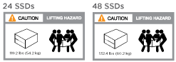
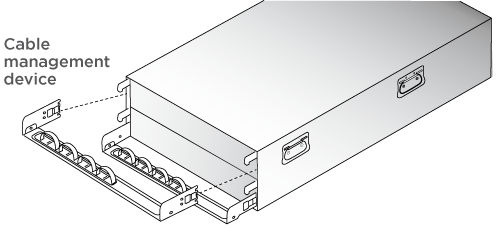
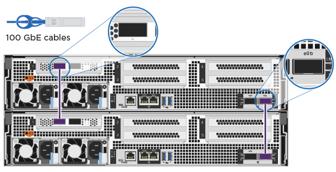
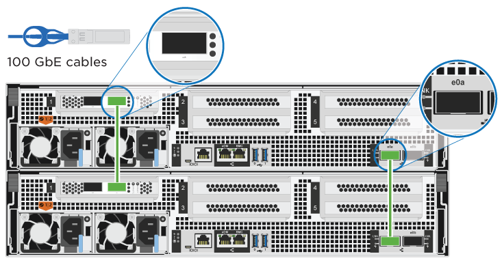
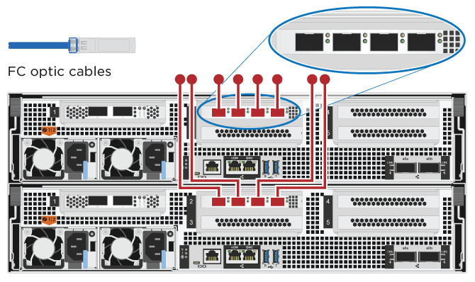
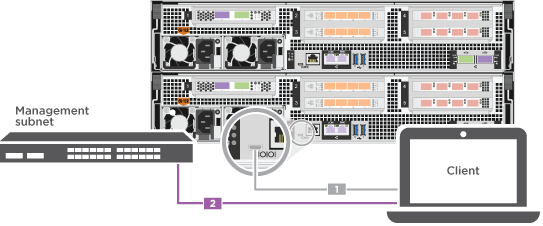

= Procedura dettagliata - ASA C800
:allow-uri-read: 
:icons: font
:imagesdir: ../media/

[role="lead"]
Questa sezione fornisce istruzioni dettagliate dettagliate per l'installazione di un sistema ASA C800.

== Fase 1: Preparazione per l'installazione

Per installare il sistema ASA C800, è necessario creare un account e registrare il sistema. È inoltre necessario inventariare il numero e il tipo di cavi appropriati per il sistema e raccogliere informazioni di rete specifiche.

È necessario disporre dell'accesso a link:https://hwu.netapp.com["NetApp Hardware Universe"^] (HWU) per informazioni sui requisiti del sito e ulteriori informazioni sul sistema configurato. È possibile anche avere accesso a link:http://mysupport.netapp.com/documentation/productlibrary/index.html?productID=62286["Note di rilascio per la versione di ONTAP in uso"^] per ulteriori informazioni su questo sistema.

.Di cosa hai bisogno
Devi fornire quanto segue presso la tua sede:

* Spazio rack per il sistema storage
+
** 4U in una configurazione ha per la piattaforma
** 2U TB per ogni shelf storage NS224

* Cacciavite Phillips n. 2
* Cavi di rete aggiuntivi per collegare il sistema allo switch di rete e al laptop o alla console mediante un browser Web
+
.. Disimballare il contenuto di tutte le confezioni.
.. Annotare il numero di serie del sistema dai controller.
+
image::../media/drw_ssn_label.png[Esempio di numero di serie del sistema]

.Fasi
. Configurazione dell'account:
+
.. Accedi al tuo account esistente o crea un account.
.. Registrati (link:https://mysupport.netapp.com/eservice/registerSNoAction.do?moduleName=RegisterMyProduct["Registrazione del prodotto NetApp"^]) del sistema.

. Scaricare e installare link:https://mysupport.netapp.com/site/tools/tool-eula/activeiq-configadvisor["Download NetApp: Config Advisor"^] sul computer portatile.
. Fare un inventario e prendere nota del numero e dei tipi di cavi ricevuti.
+
La seguente tabella identifica i tipi di cavi che potrebbero essere ricevuti. Se si riceve un cavo non elencato nella tabella, consultare link:https://hwu.netapp.com["NetApp Hardware Universe"^] individuare il cavo e identificarne l'utilizzo.

+
[cols="1,2,1,2"]
|===
| Tipo di connettore | Codice e lunghezza del ricambio | Tipo di cavo... | Per... 

 a| 
Cavo da 100 GbE
 a| 
X66211A-05 (112-00595), 0,5 m.
 a| 
image:../media/oie_cable100_gbe_qsfp28.png["Connettore 100 GbE QSFP28"]
 a| 
Interconnessione HA

 a| 
X66211A-05 (112-00595), 0,5 m;

X66211-1 (112-00573), 1 m.
 a| 
Rete di interconnessione del cluster

 a| 
X66211-2 (112-00574), 2 m;

X66211-5 (112-00576), 5 m.
 a| 
Storage, dati

 a| 
Cavo da 10 GbE
 a| 
X6566B-3-R6 (112-00300), 3 m;

X6566B-5-R6 (112-00301), 5 m.
 a| 
Dati

 a| 
Cavo da 25 GbE
 a| 
X66240A-2 (112-00598), 2 m;

X66240A-5 (112-00600), 5 m.
 a| 
Dati

 a| 
RJ-45 (in base all'ordine)
 a| 
Non applicabile
 a| 
image:../media/oie_cable_rj45.png["Connettore del cavo RJ-45"]
 a| 
Gestione

 a| 
Fibre Channel
 a| 
X66250-2 (112-00342) 2 m;

X66250-5 (112-00344) 5 m;

X66250-15 (112-00346) 15 m;

X66250-30 (112-00347) 30 m.
 a| 
image:../media/oie_cable_fc_optical.png["Cavo ottico Fibre Channel OIE"]
 a| 

 a| 
Cavo per console micro-USB
 a| 
Non applicabile
 a| 
image:../media/oie_cable_micro_usb.png["Connettore micro USB"]
 a| 
Connessione della console durante l'installazione del software

 a| 
Cavi di alimentazione
 a| 
Non applicabile
 a| 
image:../media/oie_cable_power.png["Cavi di alimentazione"]
 a| 
Accensione del sistema

|===
. Scaricare e completare il link:https://library.netapp.com/ecm/ecm_download_file/ECMLP2839002["Foglio di lavoro per la configurazione del cluster"^].

== Fase 2: Installare l'hardware

È necessario installare il sistema in un rack a 4 montanti o in un cabinet di sistema NetApp, a seconda dei casi.

.Fasi
. Installare i kit di guide, secondo necessità.
+
link:../platform-supplemental/superrail-install.html["Installazione di SuperRail in un rack a quattro montanti"]

. Installare e fissare il sistema seguendo le istruzioni fornite con il kit di guide.
+

NOTE: È necessario essere consapevoli dei problemi di sicurezza associati al peso del sistema.

+

. Collegare i dispositivi di gestione dei cavi (come illustrato).
+

. Posizionare il pannello anteriore del sistema.

== Fase 3: Controller dei cavi

È necessario il cablaggio per il cluster della piattaforma utilizzando il metodo cluster senza switch a due nodi o il metodo di rete di interconnessione del cluster. È disponibile un cablaggio opzionale per le reti host Fibre Channel o iSCSI o per lo storage direct-attached. Questo cablaggio non è esclusivo; è possibile utilizzare il cavo per una rete host e uno storage.

=== Cablaggio richiesto: Collegare i controller a un cluster

Collegare i controller a un cluster utilizzando il metodo cluster senza switch a due nodi o la rete di interconnessione del cluster.

==== Opzione 1: Collegare un cluster senza switch a due nodi

Le porte di rete di gestione sui controller sono collegate agli switch. Le porte di interconnessione ha e di interconnessione cluster sono cablate su entrambi i controller.

.Prima di iniziare
Per informazioni sulla connessione del sistema agli switch, rivolgersi all'amministratore di rete.

Verificare che la freccia dell'illustrazione sia orientata correttamente con la linguetta di estrazione del connettore del cavo.

image::../media/oie_cable_pull_tab_up.png[Connettore per cavo con linguetta di estrazione sulla parte superiore]

NOTE: Quando si inserisce il connettore, si dovrebbe avvertire uno scatto in posizione; se non si sente uno scatto, rimuoverlo, ruotarlo e riprovare.

.Fasi
. Utilizzare l'animazione o i passaggi in tabella per completare il cablaggio tra i controller e gli switch:
+
.Animazione - collegare un cluster senza switch a due nodi
video::edc42447-f721-4cbe-b080-ab0c0123a139[panopto]
+
[cols="10,90"]
|===
| Fase | Eseguire su ciascun modulo controller 

 a| 
image:../media/icon_square_1_dark_purple.png["Numero di didascalia 1"]
 a| 
Collegare le porte di interconnessione ha:

** da e0b a e0b
** da e1b a e1b

 a| 
image:../media/icon_square_2_green.png["Numero di didascalia 2"]
 a| 
Collegare via cavo le porte di interconnessione del cluster:

** da e0a e0a
** da e1a a e1a

 a| 
image:../media/icon_square_3_purple.png["Passaggio 3"]
 a| 
Collegare le porte di gestione agli switch della rete di gestione    image:../media/drw_affa800_mgmt_cabling.png["Immagine che mostra la posizione delle porte di gestione sul retro del sistema"]

 a| 
image:../media/oie_legend_icon_attn_symbol.png["Simbolo di attenzione"]
 a| 
NON collegare i cavi di alimentazione a questo punto.

|===
. Per eseguire il cablaggio opzionale, vedere:
+
** <<Opzione 1: Collegamento via cavo a una rete host Fibre Channel>>
** <<Opzione 2: Collegamento via cavo a una rete host 10 GbE>>
** <<Opzione 3: Collegare i controller a un singolo shelf di dischi>>
** <<Opzione 4: Collegare i controller a due shelf di dischi>>

. Per completare la configurazione del sistema, vedere link:install-detailed-guide.html#step-4-complete-system-setup-and-configuration["Fase 4: Completare l'installazione e la configurazione del sistema"].

==== Opzione 2: Cavo a del cluster con switch

Le porte di rete di gestione e interconnessione cluster dei controller sono collegate agli switch, mentre le porte di interconnessione ha sono cablate su entrambi i controller.

.Prima di iniziare
Per informazioni sulla connessione del sistema agli switch, rivolgersi all'amministratore di rete.

Verificare che la freccia dell'illustrazione sia orientata correttamente con la linguetta di estrazione del connettore del cavo.

image::../media/oie_cable_pull_tab_up.png[Connettore per cavo con linguetta di estrazione sulla parte superiore]

NOTE: Quando si inserisce il connettore, si dovrebbe avvertire uno scatto in posizione; se non si sente uno scatto, rimuoverlo, ruotarlo e riprovare.

.Fasi
. Utilizzare l'animazione o i passaggi in tabella per completare il cablaggio tra i controller e gli switch:
+
.Animazione - cavo a cluster con switch
video::49e48140-4c5a-4395-a7d7-ab0c0123a10e[panopto]
+
[cols="10,90"]
|===
| Fase | Eseguire su ciascun modulo controller 

 a| 
image:../media/icon_square_1_dark_purple.png["Numero di didascalia 1"]
 a| 
Collegare le porte di interconnessione ha:

** da e0b a e0b
** da e1b a e1b

 a| 
image:../media/icon_square_2_green.png["Numero di didascalia 2"]
 a| 
Collegare le porte di interconnessione del cluster agli switch di interconnessione del cluster 100 GbE.
** e0a
** e1a
image:../media/drw_affa800_switched_clust_cabling.png["Cablaggio di interconnessione in cluster"]

 a| 
image:../media/icon_square_3_purple.png["Passaggio 3"]
 a| 
Collegare le porte di gestione agli switch della rete di gestione    image:../media/drw_affa800_mgmt_cabling.png["Immagine che mostra la posizione delle porte di gestione sul retro del sistema"]

 a| 
image:../media/oie_legend_icon_attn_symbol.png["Simbolo di attenzione"]
 a| 
NON collegare i cavi di alimentazione a questo punto.

|===
. Per eseguire il cablaggio opzionale, vedere:
+
** <<Opzione 1: Collegamento via cavo a una rete host Fibre Channel>>
** <<Opzione 2: Collegamento via cavo a una rete host 10 GbE>>
** <<Opzione 3: Collegare i controller a un singolo shelf di dischi>>
** <<Opzione 4: Collegare i controller a due shelf di dischi>>

. Per completare la configurazione del sistema, vedere link:install-detailed-guide.html#step-4-complete-system-setup-and-configuration["Fase 4: Completare l'installazione e la configurazione del sistema"].

=== Cablaggio opzionale: Opzioni dipendenti dalla configurazione dei cavi

Si dispone di un cablaggio opzionale dipendente dalla configurazione per le reti host Fibre Channel o iSCSI o lo storage direct-attached. Questo cablaggio non è esclusivo; è possibile disporre di un cablaggio a una rete host e a uno storage.

==== Opzione 1: Collegamento via cavo a una rete host Fibre Channel

Le porte Fibre Channel dei controller sono collegate agli switch di rete host Fibre Channel.

.Prima di iniziare
Per informazioni sulla connessione del sistema agli switch, rivolgersi all'amministratore di rete.

Verificare che la freccia dell'illustrazione sia orientata correttamente con la linguetta di estrazione del connettore del cavo.

image::../media/oie_cable_pull_tab_up.png[Connettore per cavo con linguetta di estrazione sulla parte superiore]

NOTE: Quando si inserisce il connettore, si dovrebbe avvertire uno scatto in posizione; se non si sente uno scatto, rimuoverlo, ruotarlo e riprovare.

[cols="10,90"]
|===
| Fase | Eseguire su ciascun modulo controller 

 a| 
1
 a| 
Collegare le porte da 2a a 2d agli switch host FC.

 a| 
2
 a| 
Per eseguire altri cablaggi opzionali, scegliere tra:

* <<Opzione 3: Collegare i controller a un singolo shelf di dischi>>
* <<Opzione 4: Collegare i controller a due shelf di dischi>>

 a| 
3
 a| 
Per completare la configurazione del sistema, vedere link:install-detailed-guide.html#step-4-complete-system-setup-and-configuration["Fase 4: Completare l'installazione e la configurazione del sistema"].

|===

==== Opzione 2: Collegamento via cavo a una rete host 10 GbE

Le porte 10 GbE sui controller sono collegate agli switch di rete host 10 GbE.

.Prima di iniziare
Per informazioni sulla connessione del sistema agli switch, rivolgersi all'amministratore di rete.

Verificare che la freccia dell'illustrazione sia orientata correttamente con la linguetta di estrazione del connettore del cavo.

image::../media/oie_cable_pull_tab_up.png[Connettore per cavo con linguetta di estrazione sulla parte superiore]

NOTE: Quando si inserisce il connettore, si dovrebbe avvertire uno scatto in posizione; se non si sente uno scatto, rimuoverlo, ruotarlo e riprovare.

[cols="10,90"]
|===
| Fase | Eseguire su ciascun modulo controller 

 a| 
1
 a| 
Collegare le porte da e4a a e4d agli switch di rete host da 10 GbE.image:../media/drw_affa800_10gbe_host_cabling.png["Cablaggio di rete host"]

 a| 
2
 a| 
Per eseguire altri cablaggi opzionali, scegliere tra:

* <<Opzione 3: Collegare i controller a un singolo shelf di dischi>>
* <<Opzione 4: Collegare i controller a due shelf di dischi>>

 a| 
3
 a| 
Per completare la configurazione del sistema, vedere link:install-detailed-guide.html#step-4-complete-system-setup-and-configuration["Fase 4: Completare l'installazione e la configurazione del sistema"].

|===

==== Opzione 3: Collegare i controller a un singolo shelf di dischi

È necessario collegare ciascun controller ai moduli NSM sullo shelf di dischi NS224.

.Prima di iniziare
Verificare che la freccia dell'illustrazione sia orientata correttamente con la linguetta di estrazione del connettore del cavo.

image::../media/oie_cable_pull_tab_up.png[Connettore per cavo con linguetta di estrazione sulla parte superiore]

NOTE: Quando si inserisce il connettore, si dovrebbe avvertire uno scatto in posizione; se non si sente uno scatto, rimuoverlo, ruotarlo e riprovare.

Utilizzare l'animazione o le fasi tabulate per collegare i controller a un singolo shelf:

.Animazione - collegare i controller a un singolo shelf di dischi
video::09dade4f-00bd-4d41-97d7-ab0c0123a0b4[panopto]
[cols="10,90"]
|===
| Fase | Eseguire su ciascun modulo controller 

 a| 
image:../media/icon_square_1_blue.png["Numero di didascalia 1"]
 a| 
Collegare il controller del cavo A allo shelf:    image:../media/drw_affa800_1shelf_cabling_a.png["Collegare i controller a un singolo shelf"]

 a| 
image:../media/icon_square_2_yellow.png["Numero di didascalia 2"]
 a| 
Collegare il controller del cavo B allo shelf:    image:../media/drw_affa800_1shelf_cabling_b.png["Collegare il controller B a un unico ripiano"]

|===
Per completare la configurazione del sistema, vedere link:install-detailed-guide.html#step-4-complete-system-setup-and-configuration["Fase 4: Completare l'installazione e la configurazione del sistema"].

==== Opzione 4: Collegare i controller a due shelf di dischi

È necessario collegare ciascun controller ai moduli NSM su entrambi gli shelf di dischi NS224.

.Prima di iniziare
Verificare che la freccia dell'illustrazione sia orientata correttamente con la linguetta di estrazione del connettore del cavo.

image::../media/oie_cable_pull_tab_up.png[Connettore per cavo con linguetta di estrazione sulla parte superiore]

NOTE: Quando si inserisce il connettore, si dovrebbe avvertire uno scatto in posizione; se non si sente uno scatto, rimuoverlo, ruotarlo e riprovare.

Utilizzare l'animazione o i passaggi tabulati per collegare i controller a due shelf di dischi:

.Animazione - collegare i controller a due shelf di dischi
video::fe50ac38-9375-4e6b-85af-ab0c0123a0e0[panopto]
[cols="10,90"]
|===
| Fase | Eseguire su ciascun modulo controller 

 a| 
image:../media/icon_square_1_blue.png["Numero di didascalia 1"]
 a| 
Collegare il controller dei cavi A agli shelf:    image:../media/drw_affa800_2shelf_cabling_a.png["Collegare il controller A a due ripiani"]

 a| 
image:../media/icon_square_2_yellow.png["Numero di didascalia 2"]
 a| 
Collegare il controller dei cavi B agli shelf:    image:../media/drw_affa800_2shelf_cabling_b.png["Collegare il controller B a due ripiani"]

|===
Per completare la configurazione del sistema, vedere link:install-detailed-guide.html#step-4-complete-system-setup-and-configuration["Fase 4: Completare l'installazione e la configurazione del sistema"].

== Fase 4: Completare l'installazione e la configurazione del sistema

Completare l'installazione e la configurazione del sistema utilizzando il rilevamento del cluster solo con una connessione allo switch e al laptop oppure collegandosi direttamente a un controller del sistema e quindi allo switch di gestione.

=== Opzione 1: Completare la configurazione e la configurazione del sistema se è attivato il rilevamento della rete

Se sul laptop è attivata la funzione di rilevamento della rete, è possibile completare l'installazione e la configurazione del sistema utilizzando la funzione di rilevamento automatico del cluster.

.Fasi
. Collegare i cavi di alimentazione agli alimentatori del controller, quindi collegarli a fonti di alimentazione su diversi circuiti.
+
Il sistema inizia l'avvio. L'avvio iniziale può richiedere fino a otto minuti.

. Assicurarsi che il rilevamento della rete sia attivato sul laptop.
+
Per ulteriori informazioni, consultare la guida in linea del portatile.

. Utilizzare l'animazione per collegare il laptop allo switch di gestione:
+
.Animazione - collegare il laptop allo switch di gestione
video::d61f983e-f911-4b76-8b3a-ab1b0066909b[panopto]
. Selezionare un'icona ONTAP elencata per scoprire:
+
image::../media/drw_autodiscovery_controler_select.png[Selezionare un'icona ONTAP]

+
.. Aprire file Explorer.
.. Fare clic su *Network* nel riquadro sinistro.
.. Fare clic con il pulsante destro del mouse e selezionare *refresh*.
.. Fare doppio clic sull'icona ONTAP e accettare i certificati visualizzati sullo schermo.
+

NOTE: XXXXX è il numero di serie del sistema per il nodo di destinazione.

+
Viene visualizzato Gestione sistema.

. Utilizzare la configurazione guidata di System Manager per configurare il sistema utilizzando i dati raccolti in link:https://library.netapp.com/ecm/ecm_download_file/ECMLP2862613["Guida alla configurazione di ONTAP"^].
. Verificare lo stato del sistema eseguendo Config Advisor.
. Una volta completata la configurazione iniziale, visitare il sito Web https://docs.netapp.com/us-en/ontap/index.html["Documentazione di ONTAP 9"^] per informazioni sulla configurazione di funzioni aggiuntive in ONTAP.

=== Opzione 2: Completare la configurazione e la configurazione del sistema se il rilevamento della rete non è attivato

Se il rilevamento della rete non è abilitato sul laptop, è necessario completare la configurazione e la configurazione utilizzando questa attività.

.Fasi
. Cablare e configurare il laptop o la console:
+
.. Impostare la porta della console del portatile o della console su 115,200 baud con N-8-1.
+

NOTE: Per informazioni su come configurare la porta della console, consultare la guida in linea del portatile o della console.

.. Collegare il cavo della console al computer portatile o alla console e la porta della console sul controller utilizzando il cavo della console fornito con il sistema.
+
image::../media/drw_console_connect_affa800.png[Collegamento alla porta della console]

.. Collegare il laptop o la console allo switch sulla subnet di gestione.
+

.. Assegnare un indirizzo TCP/IP al portatile o alla console, utilizzando un indirizzo presente nella subnet di gestione.

. Collegare i cavi di alimentazione agli alimentatori del controller, quindi collegarli a fonti di alimentazione su diversi circuiti.
+
Il sistema inizia l'avvio. L'avvio iniziale può richiedere fino a otto minuti.

. Assegnare un indirizzo IP di gestione del nodo iniziale a uno dei nodi.
+
[cols="1,2"]
|===
| Se la rete di gestione dispone di DHCP... | Quindi... 

 a| 
Configurato
 a| 
Registrare l'indirizzo IP assegnato ai nuovi controller.

 a| 
Non configurato
 a| 
.. Aprire una sessione della console utilizzando putty, un server terminal o un server equivalente per l'ambiente in uso.
+

NOTE: Se non si sa come configurare PuTTY, consultare la guida in linea del portatile o della console.

.. Inserire l'indirizzo IP di gestione quando richiesto dallo script.

|===
. Utilizzando System Manager sul laptop o sulla console, configurare il cluster:
+
.. Puntare il browser sull'indirizzo IP di gestione del nodo.
+

NOTE: Il formato dell'indirizzo è +https://x.x.x.x+.

.. Configurare il sistema utilizzando i dati raccolti in link:https://library.netapp.com/ecm/ecm_download_file/ECMLP2862613["Guida alla configurazione di ONTAP"^].

. Verificare lo stato del sistema eseguendo Config Advisor.
. Una volta completata la configurazione iniziale, visitare il sito Web https://docs.netapp.com/us-en/ontap/index.html["Documentazione di ONTAP 9"^] per informazioni sulla configurazione di funzioni aggiuntive in ONTAP.

