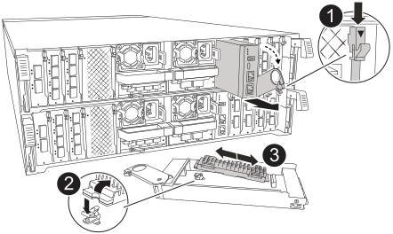

= Sostituire i supporti di avvio - ASA A70 e ASA A90
:allow-uri-read: 
:icons: font
:imagesdir: ../media/

[role="lead"]
Il supporto di avvio del sistema ASA A70 o ASA A90 memorizza i dati di configurazione e il firmware essenziali. Il processo di sostituzione prevede la rimozione del modulo di gestione del sistema, la rimozione dei supporti di avvio danneggiati, l'installazione dei supporti di avvio sostitutivi nel modulo di gestione del sistema, quindi la reinstallazione del modulo di gestione del sistema.

Il supporto di avvio si trova all'interno del modulo di gestione del sistema ed è accessibile rimuovendo il modulo dal sistema.

.Fasi
. Prima di procedere, verificare che la NVRAM sia stata completata. Quando il LED sul modulo NV è spento, il NVRAM viene rimosso. Se il LED lampeggia, attendere l'arresto del lampeggiamento. Se il lampeggiamento continua per più di 5 minuti, contattare il supporto tecnico per assistenza.
+
image::../media/drw_a1K-70-90_nvram-led_ieops-1463.svg[Grafico della posizione dei LED di stato e di attenzione NVRAM]

+
[cols="1,4"]
|===

 a| 
image:../media/icon_round_1.png["Numero di didascalia 1"]
 a| 
LED di stato NVRAM

 a| 
image:../media/icon_round_2.png["Numero di didascalia 2"]
 a| 
LED di attenzione NVRAM

|===
+
** Se il LED NV è spento, passare alla fase successiva.
** Se il LED NV lampeggia, attendere l'arresto del lampeggio. Se il lampeggiamento continua per più di 5 minuti, contattare il supporto tecnico per assistenza.

. Andare sul retro del telaio. Se non si è già collegati a terra, mettere a terra l'utente.
. Scollegare gli alimentatori del controller.
+

NOTE: Se il sistema è alimentato a corrente continua, scollegare il blocco di alimentazione dalle PSU.

+
.. Rimuovere tutti i cavi collegati al modulo di gestione del sistema. Assicurarsi di etichettare il punto in cui sono stati collegati i cavi, in modo da poterli collegare alle porte corrette quando si reinstalla il modulo.
.. Ruotare il vassoio di gestione dei cavi verso il basso tirando i pulsanti su entrambi i lati all'interno del vassoio di gestione dei cavi, quindi ruotare il vassoio verso il basso.
.. Premere il pulsante della camma di gestione del sistema. La leva della camma si allontana dal telaio.
.. Ruotare la leva della camma completamente verso il basso e rimuovere il modulo di gestione del sistema dal modulo controller.
.. Posizionare il modulo di gestione del sistema su un tappetino antistatico, in modo che il supporto di avvio sia accessibile.

. Rimuovere il supporto di avvio dal modulo di gestione:
+

+
[cols="1,4"]
|===

 a| 
image::../media/icon_round_1.png[Numero di didascalia 1]
 a| 
Dispositivo di chiusura della camma del modulo di gestione del sistema

 a| 
image::../media/icon_round_2.png[Numero di didascalia 2]
 a| 
Pulsante di blocco dei supporti di avvio

 a| 
image::../media/icon_round_3.png[Numero di didascalia 3]
 a| 
Supporto di boot

|===
+
.. Premere il pulsante di bloccaggio blu.
.. Ruotare il supporto di avvio verso l'alto, farlo scorrere fuori dallo zoccolo e metterlo da parte.

. Installare il supporto di avvio sostitutivo nel modulo di gestione del sistema:
+
.. Allineare i bordi del supporto di avvio con l'alloggiamento dello zoccolo, quindi spingerlo delicatamente a squadra nello zoccolo.
.. Ruotare il supporto di avvio verso il basso verso il pulsante di bloccaggio.
.. Premere il pulsante di bloccaggio, ruotare completamente il supporto di avvio e rilasciare il pulsante di bloccaggio.

. Reinstallare il modulo di gestione del sistema:
+
.. Ruotare il vassoio di gestione dei cavi verso l'alto fino alla posizione di chiusura.
.. Eseguire il richiamo del modulo Gestione del sistema.

. Collegare i cavi di alimentazione agli alimentatori. Il controller si riavvia non appena viene ripristinata l'alimentazione.
+

NOTE: Se si dispone di alimentatori CC, ricollegare il blocco di alimentazione agli alimentatori.

. Interrompere il processo di avvio premendo Ctrl-C per interrompere il PROCESSO al prompt DEL CARICATORE.

.Cosa succederà
Dopo aver sostituito fisicamente i supporti di avvio danneggiati, link:bootmedia-recovery-image-boot-bmr.html["Ripristinare l'immagine ONTAP dal nodo partner"].
