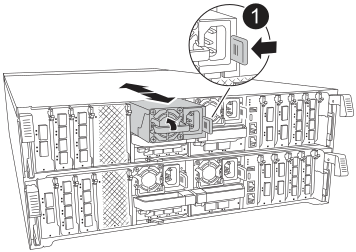

= Sostituire la centralina - ASA A70 e ASA A90
:allow-uri-read: 
:icons: font
:imagesdir: ../media/

[role="lead"]
Sostituire il controller nel sistema ASA A70 o ASA A90 quando un guasto hardware lo richiede. Questo processo prevede la rimozione del controller danneggiato, lo spostamento dei componenti nel controller sostitutivo, l'installazione del controller sostitutivo e il riavvio del sistema.

== Fase 1: Rimuovere il modulo controller

È necessario rimuovere il modulo controller dal telaio quando si sostituisce il modulo controller o un componente all'interno del modulo controller.

. Assicurarsi che tutte le unità nello chassis siano saldamente posizionate contro il midplane, utilizzando i pollici per spingere ciascuna unità fino a quando non si avverte un arresto positivo.
+
image::../media/drw_a800_drive_seated_IEOPS-960.svg[Azionamenti dei dischi del sedile]

. Verificare che il LED di stato della NVRAM color ambra situato nello slot 4/5 sul retro del modulo controller danneggiato sia spento. Cercare l'icona NV.
+
image::../media/drw_a1K-70-90_nvram-led_ieops-1463.svg[Grafico della posizione dei LED di stato e di attenzione NVRAM]

+
[cols="1,4"]
|===

 a| 
image:../media/icon_round_1.png["Numero di didascalia 1"]
 a| 
LED di stato NVRAM

 a| 
image:../media/icon_round_2.png["Numero di didascalia 2"]
 a| 
LED di attenzione NVRAM

|===
+
** Se il LED NV è spento, passare alla fase successiva.
** Se il LED NV lampeggia, attendere l'arresto del lampeggio. Se il lampeggiamento continua per più di 5 minuti, contattare il supporto tecnico per assistenza.

. Se non si è già collegati a terra, mettere a terra l'utente.
. Scollegare i cavi di alimentazione del modulo controller dagli alimentatori del modulo controller (PSU).
+

NOTE: Se il sistema è alimentato a corrente continua, scollegare il blocco di alimentazione dalle PSU.

. Scollegare i cavi di sistema e i moduli SFP e QSFP (se necessario) dal modulo controller, tenendo traccia della posizione in cui sono stati collegati i cavi.
+
Lasciare i cavi nel dispositivo di gestione dei cavi in modo che quando si reinstalla il dispositivo di gestione dei cavi, i cavi siano organizzati.

. Rimuovere il dispositivo di gestione dei cavi dal modulo controller.
. Premere verso il basso entrambi i fermi di bloccaggio, quindi ruotare entrambi i fermi verso il basso contemporaneamente.
+
Il modulo controller si sposta leggermente fuori dallo chassis.

+
image::../media/drw_a70-90_pcm_remove_replace_ieops-1365.svg[Immagine di rimozione della centralina]

+
[cols="1,4"]
|===

 a| 
image:../media/icon_round_1.png["Numero di didascalia 1"]
 a| 
Fermo di bloccaggio

 a| 
image:../media/icon_round_2.png["Numero di didascalia 2"]
 a| 
Perno di bloccaggio

|===
. Estrarre il modulo controller dal telaio e collocarlo su una superficie piana e stabile.
+
Assicurarsi di sostenere la parte inferiore del modulo controller mentre lo si sposta fuori dallo chassis.

== Fase 2: Spostare gli alimentatori

Spostare gli alimentatori sul controller sostitutivo.

. Ruotare la maniglia della camma in modo che possa essere utilizzata per estrarre l'alimentatore dal modulo controller premendo la linguetta di bloccaggio.
+

CAUTION: L'alimentazione è in corto. Utilizzare sempre due mani per sostenerlo durante la rimozione dal modulo controller in modo che non si sposti improvvisamente dal modulo controller e non causi lesioni.

+

+
[cols="1,4"]
|===

 a| 
image::../media/icon_round_1.png[Numero di didascalia 1]
| Linguetta di bloccaggio PSU in terracotta 

 a| 
image::../media/icon_round_2.png[Numero di didascalia 2]
 a| 
Alimentatore

|===
. Spostare l'alimentatore sul nuovo modulo controller, quindi installarlo.
. Con entrambe le mani, sostenere e allineare i bordi dell'alimentatore con l'apertura nel modulo controller, quindi spingere delicatamente l'alimentatore nel modulo controller fino a quando la linguetta di blocco non scatta in posizione.
+
Gli alimentatori si innestano correttamente solo con il connettore interno e si bloccano in un modo.

+

NOTE: Per evitare di danneggiare il connettore interno, non esercitare una forza eccessiva quando si inserisce l'alimentatore nel sistema.

== Fase 3: Spostare le ventole

Spostare i moduli ventole nel modulo controller sostitutivo.

. Rimuovere il modulo della ventola stringendo le linguette di bloccaggio sul lato del modulo della ventola, quindi sollevare il modulo della ventola per estrarlo dal modulo del controller.
+
image::../media/drw_a70-90_fan_remove_replace_ieops-1366.svg[Rimuovere le ventole]

+
[cols="1,4"]
|===

 a| 
image::../media/icon_round_1.png[Numero di didascalia 1]
 a| 
Linguette di bloccaggio della ventola

 a| 
image::../media/icon_round_2.png[Numero di didascalia 2]
 a| 
Modulo della ventola

|===
. Spostare il modulo della ventola sul modulo controller sostitutivo, quindi installare il modulo della ventola allineandone i bordi con l'apertura nel modulo controller, quindi far scorrere il modulo della ventola nel modulo controller fino a quando i fermi di blocco non scattano in posizione.
. Ripetere questa procedura per i moduli ventola rimanenti.

== Fase 4: Spostare la batteria NV

Spostare la batteria NV nel modulo controller sostitutivo.

. Aprire il coperchio del condotto dell'aria al centro del modulo centralina e individuare la batteria NV.
+
image::../media/drw_a70-90_remove_replace_nvmembat_ieops-1369.svg[Spostare la batteria NV]

+
[cols="1,4"]
|===

 a| 
image::../media/icon_round_1.png[Numero di didascalia 1]
| Condotto dell'aria della batteria NV 

 a| 
image::../media/icon_round_2.png[Numero di didascalia 2]
 a| 
Spina batteria NV

|===
+
*Attenzione:* il LED del modulo NV lampeggia mentre il contenuto viene scaricato sulla memoria flash quando si arresta il sistema. Una volta completata la destage, il LED si spegne.

. Sollevare la batteria per accedere alla spina della batteria.
. Premere il fermaglio sulla parte anteriore della spina della batteria per sganciare la spina dalla presa, quindi scollegare il cavo della batteria dalla presa.
. Estrarre la batteria dal condotto dell'aria e dal modulo della centralina.
. Spostare il gruppo batterie sul modulo controller sostitutivo, quindi installarlo nel modulo controller sostitutivo:
+
.. Aprire il condotto dell'aria della batteria NV nel modulo centralina di ricambio.
.. Inserire la spina della batteria nella presa e assicurarsi che la spina si blocchi in posizione.
.. Inserire la batteria nello slot e premere con decisione verso il basso per assicurarsi che sia bloccata in posizione.
.. Chiudere il condotto dell'aria della batteria NV.

== Fase 5: Spostare i DIMM di sistema

Spostare i moduli DIMM nel modulo controller sostitutivo.

. Aprire il condotto dell'aria della centralina sulla parte superiore della centralina.
+
.. Inserire le dita nelle cavità alle estremità più lontane del condotto dell'aria.
.. Sollevare il condotto dell'aria e ruotarlo verso l'alto fino in fondo.

. Individuare i DIMM di sistema sulla scheda madre, utilizzando la mappa DIMM sulla parte superiore del condotto dell'aria.
+
Le posizioni dei DIMM, in base al modello, sono elencate nella tabella seguente:

+
[cols="1,4"]
|===

| Modello | Posizione dell'alloggiamento DIMM 

 a| 
FAS70
| 3, 10, 19, 26 

 a| 
FAS90
| 3, 7, 10, 14, 19, 23, 26, 30 
|===
+
image::../media/drw_a70_90_dimm_ieops-1513.svg[Mappa DIMM]

+
[cols="1,4"]
|===

 a| 
image::../media/icon_round_1.png[Numero di didascalia 1]
| DIMM di sistema 
|===
. Prendere nota dell'orientamento del DIMM nello zoccolo in modo da poter inserire il DIMM nel modulo controller sostitutivo con l'orientamento corretto.
. Estrarre il modulo DIMM dal relativo slot spingendo lentamente verso l'esterno le due linguette di espulsione dei moduli DIMM su entrambi i lati del modulo, quindi estrarre il modulo DIMM dallo slot.
+

NOTE: Tenere il modulo DIMM per i bordi in modo da evitare di esercitare pressione sui componenti della scheda a circuiti stampati del modulo DIMM.

. Individuare lo slot sul modulo controller sostitutivo in cui si sta installando il DIMM.
. Inserire il DIMM nello slot.
+
Il DIMM si inserisce saldamente nello slot, ma dovrebbe essere inserito facilmente. In caso contrario, riallineare il DIMM con lo slot e reinserirlo.

+

NOTE: Esaminare visivamente il DIMM per verificare che sia allineato in modo uniforme e inserito completamente nello slot.

. Spingere con cautela, ma con decisione, il bordo superiore del DIMM fino a quando le linguette dell'espulsore non scattano in posizione sulle tacche alle estremità del DIMM.
. Ripetere questa procedura per i DIMM rimanenti.
. Chiudere il condotto dell'aria della centralina.

== Fase 6: Spostare i moduli i/O.

Spostare i moduli di i/o nel modulo controller sostitutivo.

image::../media/drw_a70_90_io_remove_replace_ieops-1532.svg[Rimuovere il modulo di i/O.]

[cols="1,4"]
|===

 a| 
image::../media/icon_round_1.png[Numero di didascalia 1]
| Leva camma modulo i/O. 
|===
. Scollegare eventuali cavi dal modulo i/o di destinazione.
+
Assicurarsi di etichettare i cavi in modo da conoscerne la provenienza.

. Ruotare il ARM di gestione dei cavi verso il basso tirando i pulsanti all'interno del ARM di gestione dei cavi e ruotandolo verso il basso.
. Rimuovere i moduli i/o dal modulo controller:
+
.. Premere il pulsante del dispositivo di chiusura a camma del modulo i/o di destinazione.
.. Ruotare il dispositivo di chiusura della camma verso il basso fino in fondo. Per i moduli orizzontali, ruotare la camma allontanandola dal modulo fino in fondo.
.. Rimuovere il modulo dal modulo controller agganciando il dito nell'apertura della leva a camme ed estraendo il modulo dal modulo controller.
+
Assicurarsi di tenere traccia dello slot in cui si trovava il modulo i/O.

.. Installare il modulo i/o sostitutivo nel modulo controller sostitutivo facendo scorrere delicatamente il modulo i/o nello slot fino a quando il dispositivo di chiusura della camma i/o non inizia a innestarsi con il perno della camma i/o, quindi spingere il dispositivo di chiusura della camma i/o completamente verso l'alto per bloccare il modulo in posizione.

. Ripetere questa procedura per spostare i moduli i/o rimanenti, ad eccezione dei moduli negli slot 6 e 7, nel modulo controller sostitutivo.
+

NOTE: Per spostare i moduli di i/o dagli slot 6 e 7, è necessario spostare il supporto contenente questi moduli di i/o dal modulo controller danneggiato al modulo controller sostitutivo.

. Spostare il supporto contenente i moduli di i/o negli slot 6 e 7 nel modulo controller sostitutivo:
+
.. Premere il pulsante sulla maniglia più a destra sulla maniglia del supporto. ..far scorrere il supporto fuori dal modulo controller danneggiato inserendolo nel modulo controller sostitutivo nella stessa posizione in cui si trovava nel modulo controller danneggiato.
.. Spingere delicatamente il supporto fino in fondo nel modulo controller sostitutivo finché non si blocca in posizione.

== Fase 7: Spostare il modulo Gestione del sistema

Spostare il modulo di gestione del sistema nel modulo controller sostitutivo.

image::../media/drw_70-90_sys-mgmt_remove_ieops-1817.svg[Spostare il modulo di gestione del sistema]

[cols="1,4"]
|===

 a| 
image::../media/icon_round_1.png[Numero di didascalia 1]
 a| 
Dispositivo di chiusura della camma del modulo di gestione del sistema

|===
. Rimuovere il modulo di gestione del sistema dal modulo del controller danneggiato:
+
.. Premere il pulsante della camma di gestione del sistema.
.. Ruotare la leva della camma completamente verso il basso.
.. Avvolgere il dito nella leva della camma ed estrarre il modulo dal sistema.

. Installare il modulo di gestione del sistema nel modulo controller sostitutivo nello stesso slot in cui si trovava sul modulo controller danneggiato:
+
.. Allineare i bordi del modulo di gestione del sistema con l'apertura del sistema e spingerlo delicatamente nel modulo controller.
.. Far scorrere delicatamente il modulo nello slot fino a quando il dispositivo di chiusura della camma non inizia a innestarsi con il perno della camma di i/o, quindi ruotare il dispositivo di chiusura della camma completamente verso l'alto per bloccare il modulo in posizione.

== Fase 8: Spostare il modulo NVRAM

Spostare il modulo NVRAM sul modulo controller sostitutivo.

image::../media/drw_a70-90_nvram12_remove_replace_ieops-1370.svg[Rimuovere il modulo NVRAM12 e i DIMM]

[cols="1,4"]
|===

 a| 
image:../media/icon_round_1.png["Numero di didascalia 1"]
 a| 
Pulsante di bloccaggio della camma

 a| 
image:../media/icon_round_2.png["Numero di didascalia 2"]
 a| 
Linguetta di blocco DIMM

|===
. Rimuovere il modulo NVRAM dal modulo controller danneggiato:
+
.. Premere il pulsante del dispositivo di chiusura a camma.
+
Il pulsante CAM si allontana dal telaio.

.. Ruotare il dispositivo di chiusura della camma fino in fondo.
.. Rimuovere il modulo NVRAM dal contenitore agganciando il dito nell'apertura della leva della camma ed estraendo il modulo dal contenitore.

. Installare il modulo NVRAM nello slot 4/5 del modulo controller sostitutivo:
+
.. Allineare il modulo con i bordi dell'apertura del telaio nello slot 4/5.
.. Far scorrere delicatamente il modulo nell'alloggiamento fino in fondo, quindi spingere il dispositivo di chiusura della camma completamente verso l'alto per bloccare il modulo in posizione.

== Fase 9: Installare il modulo controller

Reinstallare il modulo controller e riavviarlo.

. Assicurarsi che il condotto dell'aria sia completamente chiuso ruotandolo verso il basso fino in fondo.
+
Deve essere a filo con la lamiera del modulo controller.

. Allineare l'estremità del modulo controller con l'apertura dello chassis, quindi spingere delicatamente il modulo controller a metà nel sistema.
+

NOTE: Non inserire completamente il modulo controller nel telaio fino a quando non viene richiesto.

. Reinstallare il ARM di gestione dei cavi, se rimosso, ma non ricollegare alcun cavo al controller sostitutivo.
. Collegare il cavo console alla porta console del modulo controller sostitutivo e ricollegarlo al computer portatile in modo che riceva i messaggi della console al riavvio. Il controller sostitutivo riceve alimentazione dal controller integro e inizia a riavviarsi non appena viene inserito completamente nello chassis.
. Completare la reinstallazione del modulo controller:
+
.. Spingere con decisione il modulo controller nello chassis fino a quando non raggiunge la scheda intermedia e non è completamente inserito.
+
I fermi di bloccaggio si sollevano quando il modulo controller è completamente inserito.

+

NOTE: Non esercitare una forza eccessiva quando si fa scorrere il modulo controller nel telaio per evitare di danneggiare i connettori.

.. Ruotare i fermi di bloccaggio verso l'alto in posizione bloccata.

+

NOTE: Il controller viene avviato al prompt Loader non appena è completamente inserito.

. Dal prompt Loader, immettere `show date` per visualizzare la data e l'ora sulla centralina sostitutiva. Data e ora sono in GMT.
+

NOTE: L'ora visualizzata è l'ora locale non sempre GMT e viene visualizzata in modalità 24hr.

. Impostare l'ora corrente in GMT con il `set time hh:mm:ss` comando. Potete ottenere il GMT corrente dal nodo partner il comando `date -u`.
. Possibilità di recuperare il sistema storage secondo necessità.
+
Se sono stati rimossi i ricetrasmettitori (QSFP o SFP), ricordarsi di reinstallarli se si utilizzano cavi in fibra ottica.

. Collegare i cavi di alimentazione agli alimentatori.
+

NOTE: Se si dispone di alimentatori CC, ricollegare il blocco di alimentazione agli alimentatori dopo che il modulo controller è stato inserito completamente nel telaio.

