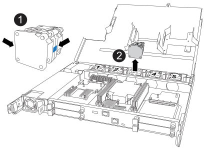

= Sostituire la centralina - ASA A20, ASA A30 e ASA A50
:allow-uri-read: 
:icons: font
:imagesdir: ../media/

[role="lead"]
Per sostituire il controller, è necessario rimuovere il controller danneggiato, spostare i componenti FRU dal controller danneggiato al controller sostitutivo, installare il controller sostitutivo nel telaio, impostare l'ora e la data, quindi riordinarlo.

== Fase 1: Rimuovere il controller

È necessario rimuovere il controller dal telaio quando si sostituisce il controller o un componente all'interno del controller.

.Prima di iniziare
Tutti gli altri componenti del sistema di stoccaggio devono funzionare correttamente; in caso contrario, è necessario contattare https://mysupport.netapp.com/site/global/dashboard["Supporto NetApp"] prima di continuare con questa procedura.

.Fasi
. Sul controller danneggiato, assicurarsi che il LED NV sia spento.
+
Quando il LED NV è spento, la decolorazione è completa ed è possibile rimuovere la centralina guasta in tutta sicurezza.

+

NOTE: Se il LED NV lampeggia (verde), è in corso la procedura di destage. È necessario attendere lo spegnimento del LED NV. Tuttavia, se il lampeggiamento continua per più di cinque minuti, contattare https://mysupport.netapp.com/site/global/dashboard["Supporto NetApp"] prima di continuare con questa procedura.

+
Il LED NV si trova accanto all'icona NV sulla centralina.

+
image::../media/drw_g_nvmem_led_ieops-1839.svg[Posizione del LED di stato NV]

[cols="1,4"]
|===

 a| 
image::../media/icon_round_1.png[Numero di didascalia 1]
 a| 
Icona NV e LED sul controller

|===
. Se non si è già collegati a terra, mettere a terra l'utente.
. Scollegare l'alimentazione dal controller danneggiato:
+

NOTE: Gli alimentatori non sono dotati di interruttore di alimentazione.

+
[cols="1,2"]
|===
| Se si scollega... | Quindi... 

 a| 
ALIMENTATORE CA
 a| 
.. Aprire il fermo del cavo di alimentazione.
.. Scollegare il cavo di alimentazione dall'alimentatore e metterlo da parte.

 a| 
ALIMENTATORE CC
 a| 
.. Svitare le due viti ad alette sul connettore del cavo di alimentazione CC D-SUB.
.. Scollegare il cavo di alimentazione dall'alimentatore e metterlo da parte.

|===
. Scollegare tutti i cavi dal controller danneggiato.
+
Tenere traccia del punto in cui sono stati collegati i cavi.

. Rimuovere la centralina danneggiata:
+
L'illustrazione seguente mostra il funzionamento delle maniglie del controller (dal lato sinistro del controller) durante la rimozione di un controller:

+
image::../media/drw_g_and_t_handles_remove_ieops-1837.svg[funzionamento della maniglia del controller per rimuovere un controller]

+
[cols="1,4"]
|===

 a| 
image::../media/icon_round_1.png[Numero di didascalia 1]
 a| 
Su entrambe le estremità del controller, spingere le linguette di bloccaggio verticali verso l'esterno per rilasciare le maniglie.

 a| 
image::../media/icon_round_2.png[Numero di didascalia 2]
 a| 
** Tirare le maniglie verso di sé per sganciare il controller dalla scheda di collegamento interna.
+
Mentre si tira, le maniglie si estendono fuori dal controller e poi si sente una certa resistenza, continuare a tirare.

** Far scorrere il controller fuori dallo chassis sostenendo la parte inferiore del controller e posizionarlo su una superficie piana e stabile.

 a| 
image::../media/icon_round_3.png[Numero di didascalia 3]
 a| 
Se necessario, ruotare le maniglie in posizione verticale (accanto alle linguette) per spostarle in modo che non siano di intralcio.

|===
. Aprire il coperchio del controller ruotando la vite a testa zigrinata in senso antiorario per allentarla, quindi aprire il coperchio.

== Fase 2: Spostare l'alimentatore

Spostare l'alimentatore (PSU) sul controller sostitutivo.

. Spostare l'alimentatore dal controller danneggiato:
+
Assicurarsi che la maniglia del controller lato sinistro sia in posizione verticale per consentire l'accesso all'alimentatore.

[role="tabbed-block"]
====
.Opzione 1: Spostare un alimentatore CA
--
Per spostare un alimentatore CA, completare i seguenti passaggi.

.Fasi
. Rimuovere l'alimentatore CA dal controller danneggiato:
+
image::../media/drw_g_t_psu_replace_ieops-1899.svg[Sostituire l'alimentatore CA]

+
[cols="1,4"]
|===

 a| 
image::../media/icon_round_1.png[Numero di didascalia 1]
 a| 
Ruotare la maniglia dell'alimentatore verso l'alto, portandola in posizione orizzontale, quindi afferrarla.

 a| 
image::../media/icon_round_2.png[Numero di didascalia 2]
 a| 
Con il pollice, premere la linguetta blu per rilasciare l'alimentatore dal controller.

 a| 
image::../media/icon_round_3.png[Numero di didascalia 3]
 a| 
Estrarre l'alimentatore dal controller mentre si utilizza l'altra mano per sostenere il suo peso.

CAUTION: L'alimentatore è in corto. Utilizzare sempre due mani per sostenerlo quando lo si rimuove dal controller in modo che non si sposti improvvisamente dal controller e possa causare lesioni.

|===
. Inserire l'alimentatore nel controller sostitutivo:
+
.. Con entrambe le mani, sostenere e allineare i bordi dell'alimentatore con l'apertura nel controller.
.. Spingere delicatamente l'alimentatore nel controller finché la linguetta di bloccaggio non scatta in posizione.
+
Una PSU si innesta correttamente solo con il connettore interno e si blocca in posizione in un modo.

+

NOTE: Per evitare di danneggiare il connettore interno, non esercitare una forza eccessiva quando si fa scorrere l'alimentatore nel controller.

.. Ruotare la maniglia verso il basso, in modo che non sia di intralcio alle normali operazioni.

--
.Opzione 2: Spostare un alimentatore CC
--
Per spostare un alimentatore CC, attenersi alla seguente procedura.

.Fasi
. Rimuovere l'alimentatore CC dal controller danneggiato:
+
.. Ruotare la maniglia verso l'alto, in posizione orizzontale, quindi afferrarla.
.. Con il pollice, premere la linguetta in terracotta per rilasciare il meccanismo di bloccaggio.
.. Estrarre l'alimentatore dal controller mentre si utilizza l'altra mano per sostenere il suo peso.
+

NOTE: L'alimentatore è in corto. Utilizzare sempre due mani per sostenerlo durante la rimozione dal controller in modo che non ruoti liberamente dal controller e possa causare lesioni.

+
image::../media/drw_dcpsu_remove-replace-generic_IEOPS-788.svg[Rimuovere un alimentatore CC]

+
[cols="1,4"]
|===

 a| 
image::../media/icon_round_1.png[Numero di didascalia 1]
 a| 
Viti ad alette

 a| 
image::../media/icon_round_2.png[Numero di didascalia 2]
 a| 
Connettore del cavo di alimentazione CC D-SUB PSU

 a| 
image::../media/icon_round_3.png[Numero di didascalia 3]
 a| 
Maniglia dell'alimentatore

 a| 
image::../media/icon_round_4.png[Numero di didascalia 4]
 a| 
Linguetta di bloccaggio PSU in terracotta

|===
. Inserire l'alimentatore nel controller sostitutivo:
+
.. Con entrambe le mani, sostenere e allineare i bordi dell'alimentatore con l'apertura nel controller.
.. Far scorrere delicatamente l'alimentatore nel controller finché la linguetta di bloccaggio non scatta in posizione.
+
Un alimentatore deve essere correttamente collegato al connettore interno e al meccanismo di bloccaggio. Ripetere questa procedura se si ritiene che l'alimentatore non sia inserito correttamente.

+

NOTE: Per evitare di danneggiare il connettore interno, non esercitare una forza eccessiva quando si fa scorrere l'alimentatore nel controller.

.. Ruotare la maniglia verso il basso, in modo che non sia di intralcio alle normali operazioni.

--
====

== Fase 3: Spostare le ventole

Spostare le ventole sul controller sostitutivo.

. Rimuovere una delle ventole dal controller danneggiato:
+

+
[cols="1,4"]
|===

 a| 
image::../media/icon_round_1.png[Numero di didascalia 1]
| Tenere entrambi i lati della ventola in corrispondenza dei punti di contatto blu. 

 a| 
image::../media/icon_round_2.png[Numero di didascalia 2]
| Tirare la ventola verso l'alto ed estrarla dalla presa. 
|===
. Inserire la ventola nel controller sostitutivo allineandola all'interno delle guide, quindi spingere verso il basso finché il connettore della ventola non è completamente inserito nello zoccolo.
. Ripetere questi passi per le ventole rimanenti.

== Fase 4: Spostare la batteria NV

Spostare la batteria NV sulla centralina di ricambio.

. Rimuovere la batteria NV dalla centralina guasta:
+
image::../media/drw_g_nv_battery_replace_ieops-1864.svg[Sostituire la batteria NV]

+
[cols="1,4"]
|===

 a| 
image::../media/icon_round_1.png[Numero di didascalia 1]
 a| 
Sollevare la batteria NV ed estrarla dal relativo vano.

 a| 
image::../media/icon_round_2.png[Numero di didascalia 2]
 a| 
Rimuovere il cablaggio dal relativo fermo.

 a| 
image::../media/icon_round_3.png[Numero di didascalia 3]
 a| 
.. Premere e tenere premuta la linguetta sul connettore.
.. Tirare il connettore verso l'alto ed estrarlo dalla presa.
+
Mentre si tira verso l'alto, far oscillare delicatamente il connettore da un'estremità all'altra (in senso longitudinale) per sganciarlo.

|===
. Installare la batteria NV nella centralina di ricambio:
+
.. Inserire il connettore del cablaggio nella relativa presa.
.. Disporre il cablaggio lungo il lato dell'alimentatore, nel relativo fermo, quindi attraverso il canale davanti al vano batteria NV.
.. Posizionare la batteria NV nel vano.
+
La batteria NV deve essere posizionata a filo nel relativo vano.

== Fase 5: Spostare i DIMM di sistema

Spostare i moduli DIMM nel controller sostitutivo.

Se si dispone di moduli DIMM vuoti, non è necessario spostarli, il controller sostitutivo dovrebbe essere fornito con essi installati.

. Rimuovere uno dei moduli DIMM dal controller danneggiato:
+
image::../media/drw_g_dimm_ieops-1873.svg[DIMM sostituire]

+
[cols="1,4"]
|===

 a| 
image::../media/icon_round_1.png[Numero di didascalia 1]
 a| 
Numerazione e posizioni degli slot DIMM.

NOTE: A seconda del modello del sistema di storage, si avranno due o quattro DIMM.

 a| 
image::../media/icon_round_2.png[Numero di didascalia 1]
 a| 
** Prendere nota dell'orientamento del DIMM nello zoccolo in modo da poter inserire il DIMM nel controller sostitutivo con l'orientamento corretto.
** Espellere il DIMM separando lentamente le due linguette dell'estrattore DIMM su entrambe le estremità dell'alloggiamento DIMM.

IMPORTANT: Tenere il modulo DIMM per gli angoli o i bordi per evitare di esercitare pressione sui componenti della scheda a circuiti stampati del modulo DIMM.

 a| 
image::../media/icon_round_3.png[Numero di didascalia 3]
 a| 
Sollevare il DIMM ed estrarlo dall'alloggiamento.

Le linguette dell'espulsore rimangono in posizione aperta.

|===
. Installare il modulo DIMM nel controller sostitutivo:
+
.. Assicurarsi che le linguette dell'estrattore DIMM sul connettore siano in posizione aperta.
.. Tenere il modulo DIMM dagli angoli, quindi inserirlo perpendicolarmente nell'alloggiamento.
+
La tacca sulla parte inferiore del DIMM, tra i pin, deve allinearsi con la linguetta nello slot.

+
Una volta inserito correttamente, il DIMM si inserisce facilmente ma si inserisce saldamente nello slot. In caso contrario, reinserire il DIMM.

.. Controllare visivamente il DIMM per assicurarsi che sia allineato uniformemente e inserito completamente nell'alloggiamento.
.. Spingere con cautela, ma con decisione, il bordo superiore del modulo DIMM fino a quando le linguette di espulsione non scattano in posizione sulle tacche di entrambe le estremità del modulo DIMM.

. Ripetere questa procedura per i DIMM rimanenti.

== Fase 6: Spostare il supporto di avvio

Spostare il supporto di avvio sul controller sostitutivo.

. Rimuovere i supporti di avvio dal controller danneggiato:
+
image::../media/drw_g_boot_media_replace_ieops-1872.svg[I supporti di avvio sostituiscono l'immagine]

+
[cols="1,4"]
|===

 a| 
image::../media/icon_round_1.png[Numero di didascalia 1]
 a| 
Posizione dei supporti di avvio

 a| 
image::../media/icon_round_2.png[Numero di didascalia 2]
 a| 
Premere la linguetta blu per rilasciare l'estremità destra del supporto di avvio.

 a| 
image::../media/icon_round_3.png[Numero di didascalia 3]
 a| 
Sollevare leggermente l'estremità destra del supporto di avvio per ottenere una buona presa lungo i lati del supporto di avvio.

 a| 
image::../media/icon_round_4.png[Numero di didascalia 4]
 a| 
Estrarre delicatamente l'estremità sinistra del supporto di avvio dal relativo alloggiamento.

|===
. Installare il supporto di avvio nel controller sostitutivo:
+
.. Far scorrere l'estremità del supporto di avvio nel relativo alloggiamento.
.. All'estremità opposta del supporto di avvio, premere e tenere premuta la linguetta blu (in posizione aperta), spingere delicatamente verso il basso l'estremità del supporto di avvio fino a quando non si arresta, quindi rilasciare la linguetta per bloccare il supporto di avvio in posizione.

== Fase 7: Spostare i moduli i/O.

Spostare i moduli di i/o ed eventuali moduli di chiusura di i/o sul controller sostitutivo.

. Scollegare il cablaggio da uno dei moduli di i/O.
+
Accertarsi di etichettare i cavi in modo da sapere da dove provengono.

. Rimuovere il modulo i/o dal controller danneggiato:
+
Assicurarsi di tenere traccia dello slot in cui si trovava il modulo i/O.

+
Se si rimuove il modulo i/o nello slot 4, assicurarsi che la maniglia del controller lato destro sia in posizione verticale per consentire l'accesso al modulo i/O.

+
image::../media/drw_g_io_module_replace_ieops-1900.svg[Rimuovere il modulo di i/O.]

+
[cols="1,4"]
|===

 a| 
image::../media/icon_round_1.png[Numero di didascalia 1]
 a| 
Ruotare la vite a testa zigrinata del modulo i/o in senso antiorario per allentarla.

 a| 
image::../media/icon_round_2.png[Numero di didascalia 2]
 a| 
Estrarre il modulo i/o dal controller utilizzando la linguetta dell'etichetta della porta a sinistra e la vite a testa zigrinata.

|===
. Installare il modulo i/o nel controller sostitutivo:
+
.. Allineare il modulo i/o con i bordi dello slot.
.. Spingere delicatamente il modulo i/o fino in fondo nello slot, assicurandosi di inserirlo correttamente nel connettore.
+
È possibile utilizzare la linguetta a sinistra e la vite a testa zigrinata per inserire il modulo i/O.

.. Ruotare la vite a testa zigrinata in senso orario per serrare.

. Ripetere questa procedura per spostare i moduli di i/o rimanenti ed eventuali moduli di i/o al controller di ricambio.

== Fase 8: Installare il controller

Reinstallare il controller nel telaio e riavviarlo.

.A proposito di questa attività
L'illustrazione seguente mostra il funzionamento delle maniglie del controller (dal lato sinistro di un controller) durante la reinstallazione del controller e può essere utilizzata come riferimento per le altre fasi di reinstallazione del controller.

image::../media/drw_g_and_t_handles_reinstall_ieops-1838.svg[funzionamento della maniglia della centralina per installare una centralina]

[cols="1,4"]
|===

 a| 
image::../media/icon_round_1.png[Numero di didascalia 1]
 a| 
Se le maniglie del controller sono state ruotate in posizione verticale (accanto alle linguette) per spostarle in modo che non siano di intralcio durante la manutenzione del controller, ruotarle in posizione orizzontale.

 a| 
image::../media/icon_round_2.png[Numero di didascalia 2]
 a| 
Spingere le maniglie per reinserire a metà il controller nel telaio, quindi, quando richiesto, premere fino a quando il controller non è completamente inserito.

 a| 
image::../media/icon_round_3.png[Numero di didascalia 3]
 a| 
Ruotare le maniglie in posizione verticale e bloccarle in posizione con le linguette di bloccaggio.

|===
.Fasi
. Chiudere il coperchio del controller e ruotare la vite a testa zigrinata in senso orario fino a serrarla.
. Inserire a metà il controller nel telaio.
+
Allineare la parte posteriore del controller con l'apertura nel telaio, quindi spingere delicatamente il controller utilizzando le maniglie.

+

NOTE: Non inserire completamente il controller nel telaio fino a quando non viene richiesto.

. Collegare il cavo della console alla porta della console sul controller e al computer portatile in modo che il computer portatile riceva i messaggi della console al riavvio del controller.
. Posizionare completamente la centralina nel telaio:
+
.. Premere con decisione le maniglie fino a quando il controller non incontra la scheda di collegamento interna e non è completamente inserito.
+

NOTE: Non esercitare una forza eccessiva quando si fa scorrere il controller nel telaio, poiché potrebbe danneggiare i connettori.

.. Ruotare le maniglie del controller verso l'alto e bloccarle in posizione con le linguette.
+

NOTE: Il controller inizia ad avviarsi non appena è completamente inserito nel telaio.

. Portare il controller al prompt Loader premendo CTRL-C per interrompere L'AUTOBOOT.
. Impostare la data e l'ora sul controller:
+
Assicurarsi di essere al prompt Loader del controller.

+
.. Visualizzare la data e l'ora sul controller:
+
`show date`

+

NOTE: L'ora e la data predefinite sono in GMT. È possibile visualizzare l'ora locale e la modalità 24hr.

.. Impostare l'ora corrente in GMT:
+
`set time hh:mm:ss`

+
Puoi ottenere il GMT corrente dal nodo sano:

+
`date -u`

.. Impostare la data corrente in GMT:
+
`set date mm/dd/yyyy`

+
Puoi ottenere il GMT corrente dal nodo sano: +
`date -u`

. Se necessario, è possibile recuperare il controller.
. Ricollegare il cavo di alimentazione all'alimentatore (PSU).
+
Una volta ripristinata l'alimentazione all'alimentatore, il LED di stato deve essere verde.

+
[cols="1,2"]
|===
| Se si sta ricollegando... | Quindi... 

 a| 
ALIMENTATORE CA
 a| 
.. Collegare il cavo di alimentazione all'alimentatore.
.. Fissare il cavo di alimentazione con il fermo del cavo di alimentazione.

 a| 
ALIMENTATORE CC
 a| 
.. Collegare il connettore del cavo di alimentazione CC D-SUB all'alimentatore.
.. Serrare le due viti ad alette per fissare il connettore del cavo di alimentazione CC D-SUB all'alimentatore.

|===

