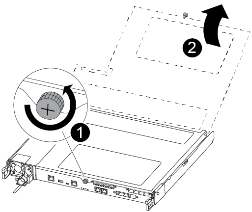
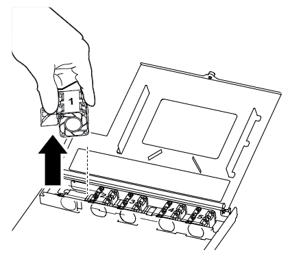

= Sostituire una ventola - ASA A250
:allow-uri-read: 
:icons: font
:imagesdir: ../media/

[role="lead"]
Per sostituire una ventola, rimuovere il modulo della ventola guasto e sostituirlo con un nuovo modulo della ventola.

== Fase 1: Spegnere il controller compromesso

Per spegnere il controller compromesso, è necessario determinare lo stato del controller e, se necessario, assumere il controllo del controller in modo che il controller integro continui a servire i dati provenienti dallo storage del controller compromesso.

.A proposito di questa attività
* Se si utilizza NetApp Storage Encryption, è necessario reimpostare il MSID seguendo le istruzioni riportate in link:https://docs.netapp.com/us-en/ontap/encryption-at-rest/return-seds-unprotected-mode-task.html["Ripristino dei SED in modalità non protetta"].
* Se si dispone di un sistema SAN, è necessario controllare i messaggi di evento  `cluster kernel-service show`) Per blade SCSI del controller deteriorati. Il `cluster kernel-service show` command visualizza il nome del nodo, lo stato del quorum di quel nodo, lo stato di disponibilità di quel nodo e lo stato operativo di quel nodo.
+
Ogni processo SCSI-blade deve essere in quorum con gli altri nodi del cluster. Eventuali problemi devono essere risolti prima di procedere con la sostituzione.

* Se si dispone di un cluster con più di due nodi, questo deve trovarsi in quorum. Se il cluster non è in quorum o un controller integro mostra false per idoneità e salute, è necessario correggere il problema prima di spegnere il controller compromesso; vedere link:https://docs.netapp.com/us-en/ontap/system-admin/synchronize-node-cluster-task.html?q=Quorum["Sincronizzare un nodo con il cluster"^].

.Fasi
. Se AutoSupport è attivato, eliminare la creazione automatica del caso richiamando un messaggio AutoSupport: `system node autosupport invoke -node * -type all -message MAINT=number_of_hours_downh`
+
Il seguente messaggio AutoSupport elimina la creazione automatica del caso per due ore: `cluster1:> system node autosupport invoke -node * -type all -message MAINT=2h`

. Disattivare il giveback automatico dalla console del controller integro: `storage failover modify –node local -auto-giveback false`
+

NOTE: Quando viene visualizzato _Vuoi disattivare il giveback automatico?_, inserisci `y`.

. Portare la centralina danneggiata al prompt DEL CARICATORE:
+
[cols="1,2"]
|===
| Se il controller non utilizzato visualizza... | Quindi... 

 a| 
Il prompt DEL CARICATORE
 a| 
Passare alla fase successiva.

 a| 
In attesa di un giveback...
 a| 
Premere Ctrl-C, quindi rispondere `y` quando richiesto.

 a| 
Prompt di sistema o prompt della password
 a| 
Assumere il controllo o arrestare il controller compromesso dal controller integro: `storage failover takeover -ofnode _impaired_node_name_`

Quando il controller non utilizzato visualizza Waiting for giveback... (in attesa di giveback...), premere Ctrl-C e rispondere `y`.

|===

== Fase 2: Rimuovere il modulo controller

È necessario rimuovere il modulo controller dallo chassis quando si sostituisce un componente all'interno del modulo controller.

Assicurarsi di etichettare i cavi in modo da conoscerne la provenienza.

. Se non si è già collegati a terra, mettere a terra l'utente.
. Scollegare gli alimentatori del modulo controller dalla fonte di alimentazione.
. Rilasciare i fermi dei cavi di alimentazione, quindi scollegare i cavi dagli alimentatori.
. Inserire l'indice nel meccanismo di blocco su entrambi i lati del modulo controller, premere la leva con il pollice ed estrarre delicatamente il controller dal telaio.
+

NOTE: In caso di difficoltà nella rimozione del modulo controller, posizionare le dita di riferimento attraverso i fori all'interno (incrociando le braccia).

+
image::../media/drw_a250_pcm_remove_install.png[installazione rimozione pcm drw a250]

+
[cols="1,4"]
|===

 a| 
image:../media/legend_icon_01.png["Numero di didascalia 1"]
 a| 
Leva

 a| 
image:../media/legend_icon_02.png["Numero di didascalia 2"]
 a| 
Meccanismo di blocco

|===
. Con entrambe le mani, afferrare i lati del modulo controller ed estrarlo delicatamente dallo chassis e posizionare il modulo su una superficie piana e stabile.
. Ruotare la vite a testa zigrinata sulla parte anteriore del modulo controller in senso antiorario e aprire il coperchio del modulo controller.
+

+
[cols="1,4"]
|===

 a| 
image:../media/legend_icon_01.png["Numero di didascalia 1"]
| Vite a testa zigrinata 

 a| 
image:../media/legend_icon_02.png["Numero di didascalia 2"]
 a| 
Coperchio del modulo controller

|===

== Fase 3: Sostituire una ventola

Per sostituire una ventola, rimuovere il modulo della ventola guasto e sostituirlo con un nuovo modulo della ventola.

Per sostituire una ventola, fare riferimento al video seguente o alla tabella:

.Animazione - sostituire una ventola
video::ccfa6665-2c2b-4571-ae79-ac5b015c19fc[panopto]
. Identificare il modulo della ventola da sostituire controllando i messaggi di errore della console o individuando il LED acceso del modulo della ventola sulla scheda madre.
. Rimuovere il modulo della ventola pizzicando il lato del modulo della ventola, quindi sollevandolo per estrarlo dal modulo del controller.
+

+
[cols="1,4"]
|===

 a| 
image:../media/legend_icon_01.png["Numero di didascalia 1"]
| Modulo della ventola 
|===
. Allineare i bordi del modulo della ventola di ricambio con l'apertura nel modulo del controller, quindi far scorrere il modulo della ventola di ricambio nel modulo del controller.

== Fase 4: Reinstallare il modulo controller

Dopo aver sostituito un componente all'interno del modulo controller, è necessario reinstallare il modulo controller nello chassis del sistema e avviarlo.

. Chiudere il coperchio del modulo controller e serrare la vite a testa zigrinata.
+
image::../media/drw_a250_close_controller_module_cover.png[drw a250 chiudere il coperchio del modulo controller]

+
[cols="1,4"]
|===

 a| 
image:../media/legend_icon_01.png["Numero di didascalia 1"]
| Coperchio del modulo controller 

 a| 
image:../media/legend_icon_02.png["Numero di didascalia 2"]
 a| 
Vite a testa zigrinata

|===
. Inserire il modulo controller nel telaio:
+
.. Assicurarsi che i bracci del meccanismo di chiusura siano bloccati in posizione completamente estesa.
.. Con entrambe le mani, allineare e far scorrere delicatamente il modulo controller nei bracci del meccanismo di chiusura fino a quando non si arresta.
.. Posizionare le dita di riferimento attraverso i fori per le dita dall'interno del meccanismo di blocco.
.. Premere i pollici verso il basso sulle linguette arancioni sulla parte superiore del meccanismo di blocco e spingere delicatamente il modulo controller oltre il fermo.
.. Rilasciare i pollici dalla parte superiore dei meccanismi di blocco e continuare a spingere fino a quando i meccanismi di blocco non scattano in posizione.
+
Il modulo controller inizia ad avviarsi non appena viene inserito completamente nello chassis. Prepararsi ad interrompere il processo di avvio.

+
Il modulo controller deve essere inserito completamente e a filo con i bordi dello chassis.

. Ricable il sistema, come necessario.
. Riportare il controller al funzionamento normale restituendo lo storage: `storage failover giveback -ofnode _impaired_node_name_`
. Se il giveback automatico è stato disattivato, riabilitarlo: `storage failover modify -node local -auto-giveback true`

== Fase 5: Restituire il componente guasto a NetApp

Restituire la parte guasta a NetApp, come descritto nelle istruzioni RMA fornite con il kit. Vedere https://mysupport.netapp.com/site/info/rma["Parti restituita  sostituzioni"] per ulteriori informazioni.
