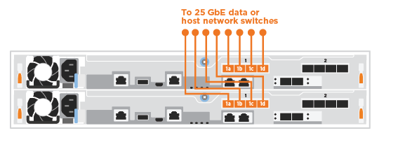

= Fasi dettagliate - ASA A250
:allow-uri-read: 
:icons: font
:imagesdir: ../media/

[role="lead"]
Questa pagina fornisce istruzioni dettagliate per l'installazione di un sistema ASA A250.

== Fase 1: Preparazione per l'installazione

Per installare il sistema, è necessario creare un account e registrare il sistema. È inoltre necessario inventariare il numero e il tipo di cavi appropriati per il sistema e raccogliere informazioni di rete specifiche.

NOTE: I clienti con requisiti di alimentazione specifici devono controllare HWU per le opzioni di configurazione.

.Prima di iniziare
* Assicurarsi di disporre dell'accesso a link:https://hwu.netapp.com["NetApp Hardware Universe"^] (HWU) per informazioni sui requisiti del sito.
* Assicurarsi di disporre dell'accesso a link:http://mysupport.netapp.com/documentation/productlibrary/index.html?productID=62286["Note di rilascio per la versione di ONTAP in uso"^] per ulteriori informazioni su questo sistema.
* Devi fornire quanto segue presso la tua sede:
+
** Spazio rack per il sistema storage
** Cacciavite Phillips n. 2
** Cavi di rete aggiuntivi per collegare il sistema allo switch di rete e al laptop o alla console mediante un browser Web

.Fasi
. Disimballare il contenuto di tutte le confezioni.
. Annotare il numero di serie del sistema dai controller.
+
image::../media/drw_ssn_label.png[Esempio del numero di serie del sistema che mostra la posizione del numero]

. Configurazione dell'account:
+
.. Accedi al tuo account esistente o crea un account.
.. link:https://mysupport.netapp.com/eservice/registerSNoAction.do?moduleName=RegisterMyProduct["Registrati"^] il tuo sistema.

. Scaricare e installare link:https://mysupport.netapp.com/site/tools/tool-eula/activeiq-configadvisor["Download NetApp: Config Advisor"^] sul computer portatile.
. Fare un inventario e prendere nota del numero e dei tipi di cavi ricevuti.
+
La seguente tabella identifica i tipi di cavi che potrebbero essere ricevuti. Se si riceve un cavo non elencato nella tabella, consultare link:https://hwu.netapp.com["NetApp Hardware Universe"^] individuare il cavo e identificarne l'utilizzo.

+
[cols="1,2,1,2"]
|===
| Tipo di cavo... | Codice e lunghezza del ricambio | Tipo di connettore | Per... 

 a| 
Cavo da 25 GbE
 a| 
X66240A-05 (112-00595), 0,5 m;

X66240-2 (112-00573), 2 m
 a| 
image:../media/oie_cable100_gbe_qsfp28.png[""]
 a| 
Rete di interconnessione del cluster

 a| 
X66240A-2 (112-00598), 2 m;

X66240A-5 (112-00600), 5 m.
 a| 
Dati

 a| 
Cavo da 100 GbE
 a| 
X66211-2 (112-00574), 2 m;

X66211-5 (112-00576), 5 m.
 a| 
Storage

 a| 
RJ-45 (in base all'ordine)
 a| 
Non applicabile
 a| 
image:../media/oie_cable_rj45.png[""]
 a| 
Rete di gestione (BMC e porta chiave) e dati Ethernet (e0a e e0b)

 a| 
Fibre Channel
 a| 
X66250-2 (112-00342) 2 m;

X66250-5 (112-00344) 5 m;

X66250-15 (112-00346) 15 m;

X66250-30 (112-00347) 30 m.
 a| 
image:../media/oie_cable_fc_optical.png[""]
 a| 

 a| 
Cavo per console micro-USB
 a| 
Non applicabile
 a| 
image:../media/oie_cable_micro_usb.png["Immagine che mostra un connettore micro USB"]
 a| 
Connessione della console durante l'installazione del software

 a| 
Cavi di alimentazione
 a| 
Non applicabile
 a| 
image:../media/oie_cable_power.png[""]
 a| 
Accensione del sistema

|===
. Esaminare link:https://library.netapp.com/ecm/ecm_download_file/ECMLP2862613["Guida alla configurazione di ONTAP"^] e raccogliere le informazioni richieste elencate nella guida.

== Fase 2: Installare l'hardware

È necessario installare il sistema in un rack a 4 montanti o in un cabinet di sistema NetApp, a seconda dei casi.

.Fasi
. Installare i kit di guide, secondo necessità.
. Installare e fissare il sistema seguendo le istruzioni fornite con il kit di guide.
+

NOTE: È necessario essere consapevoli dei problemi di sicurezza associati al peso del sistema.

+
image::../media/drw_affa250_weight_caution.png[drw affa250 attenzione sul peso]

. Identificare e gestire i cavi perché questo sistema non dispone di un dispositivo di gestione dei cavi.
. Posizionare il pannello anteriore del sistema.

== Fase 3: Collegare i controller al cluster

Collegare i controller a un cluster utilizzando il metodo cluster senza switch a due nodi o il metodo di rete di interconnessione del cluster.

[role="tabbed-block"]
====
.Opzione 1: Cluster senza switch a due nodi
--
Le porte di gestione, Fibre Channel e di rete dati o host sui moduli controller sono collegate agli switch. Le porte di interconnessione del cluster sono cablate su entrambi i moduli controller.

.Prima di iniziare
* Per informazioni sulla connessione del sistema agli switch, rivolgersi all'amministratore di rete.
* Verificare che la freccia dell'illustrazione sia orientata correttamente con la linguetta di estrazione del connettore del cavo.
+
image::../media/oie_cable_pull_tab_down.png[linguetta di estrazione del cavo oie verso il basso]

+

NOTE: Quando si inserisce il connettore, si dovrebbe avvertire uno scatto in posizione; se non si sente uno scatto, rimuoverlo, ruotarlo e riprovare.

.A proposito di questa attività
Utilizzare l'animazione o i passaggi in tabella per completare il cablaggio tra i controller e gli switch. Eseguire le operazioni su ciascun controller.

.Animazione - cluster senza switch a due nodi via cavo
video::beec3966-0a01-473c-a5de-ac68017fbf29[panopto]
.Fasi
. Utilizzare il cavo di interconnessione del cluster da 25 GbE per collegare le porte di interconnessione del cluster e0c a e0c e e0d a e0d.
+
image:../media/oie_cable_sfp_gbe_copper.png[""]:

+
image:../media/drw_affa250_tnsc_cabling.png[""]

. Collegare le porte chiave agli switch della rete di gestione con i cavi RJ45.
+
image::../media/drw_affa250_mgmt_cabling.png[cablaggio di 250 mgmt drw affa250]

IMPORTANT: NON collegare i cavi di alimentazione a questo punto.

--
.Opzione 2: Cluster con switch
--
Tutte le porte dei controller sono collegate a switch; interconnessione cluster, gestione, Fibre Channel e switch di rete host o dati.

.Prima di iniziare
* Per informazioni sulla connessione del sistema agli switch, rivolgersi all'amministratore di rete.
* Verificare che la freccia dell'illustrazione sia orientata correttamente con la linguetta di estrazione del connettore del cavo.
+
image::../media/oie_cable_pull_tab_down.png[linguetta di estrazione del cavo oie verso il basso]

+

NOTE: Quando si inserisce il connettore, si dovrebbe avvertire uno scatto in posizione; se non si sente uno scatto, rimuoverlo, ruotarlo e riprovare.

.A proposito di questa attività
Utilizzare l'animazione o i passaggi per completare il cablaggio tra i controller e gli switch. Eseguire le operazioni su ciascun controller.

.Animazione - cluster con switch via cavo
video::bf6759dc-4cbf-488e-982e-ac68017fbef8[panopto]
.Fasi
. Collegare le porte di interconnessione del cluster e0c e e0d agli switch di interconnessione del cluster 25 GbE.
+
image:../media/drw_affa250_switched_clust_cabling.png[""]

. Collegare le porte chiave agli switch della rete di gestione con i cavi RJ45.
+
image::../media/drw_affa250_mgmt_cabling.png[cablaggio di 250 mgmt drw affa250]

--
====

== Fase 4: Collegamento via cavo alla rete host o allo storage (opzionale)

Si dispone di un cablaggio opzionale dipendente dalla configurazione per le reti host Fibre Channel o iSCSI o lo storage direct-attached. Questo cablaggio non è esclusivo; è possibile disporre di un cablaggio a una rete host e a uno storage.

[role="tabbed-block"]
====
.Opzione 1: Cavo alla rete host Fibre Channel
--
Le porte Fibre Channel dei controller sono collegate agli switch di rete host Fibre Channel.

.Prima di iniziare
* Per informazioni sulla connessione del sistema agli switch, rivolgersi all'amministratore di rete.
* Verificare che la freccia dell'illustrazione sia orientata correttamente con la linguetta di estrazione del connettore del cavo.
+
image::../media/oie_cable_pull_tab_up.png[linguetta di estrazione del cavo oie verso l'alto]

+

NOTE: Quando si inserisce il connettore, si dovrebbe avvertire uno scatto in posizione; se non si sente uno scatto, rimuoverlo, ruotarlo e riprovare.

.A proposito di questa attività
Eseguire la seguente procedura su ciascun modulo controller.

.Fasi
. Collegare le porte da 2a a 2d agli switch host FC.
+
image:../media/drw_affa250_fc_host_cabling.png[""]

--
.Opzione 2: Collegamento via cavo a una rete host o dati da 25 GbE
--
Le porte da 25 GbE sui controller sono collegate a switch di rete host o dati da 25 GbE.

.Prima di iniziare
* Per informazioni sulla connessione del sistema agli switch, rivolgersi all'amministratore di rete.
* Verificare che la freccia dell'illustrazione sia orientata correttamente con la linguetta di estrazione del connettore del cavo.
+
image::../media/oie_cable_pull_tab_up.png[linguetta di estrazione del cavo oie verso l'alto]

+

NOTE: Quando si inserisce il connettore, si dovrebbe avvertire uno scatto in posizione; se non si sente uno scatto, rimuoverlo, ruotarlo e riprovare.

.A proposito di questa attività
Eseguire la seguente procedura su ciascun modulo controller.

.Fasi
. Collegare le porte da e4a a e4d agli switch di rete host da 10 GbE.
+

--
.Opzione 3: Collegare i controller al singolo shelf di dischi
--
Collegare ciascun controller ai moduli NSM sullo shelf di dischi NS224.

.Prima di iniziare
Verificare che la freccia dell'illustrazione sia orientata correttamente con la linguetta di estrazione del connettore del cavo.

image::../media/oie_cable_pull_tab_up.png[linguetta di estrazione del cavo oie verso l'alto]

NOTE: Quando si inserisce il connettore, si dovrebbe avvertire uno scatto in posizione; se non si sente uno scatto, rimuoverlo, ruotarlo e riprovare.

.A proposito di questa attività
Utilizzare l'animazione o i passaggi in tabella per completare il cablaggio tra i controller e il singolo shelf. Eseguire le operazioni su ciascun modulo controller.

.Animazione - collegare i controller a un singolo NS224
video::3f92e625-a19c-4d10-9028-ac68017fbf57[panopto]
.Fasi
. Collegare il controller a allo shelf.
+
image:../media/drw_affa250_1shelf_cabling_a.png[""]

. Collegare il controller B allo shelf.
+
image:../media/drw_affa250_1shelf_cabling_b.png[""]

--
====

== Fase 5: Completare la configurazione del sistema

Completare l'installazione e la configurazione del sistema utilizzando il rilevamento del cluster solo con una connessione allo switch e al laptop oppure collegandosi direttamente a un controller del sistema e quindi allo switch di gestione.

[role="tabbed-block"]
====
.Opzione 1: Se la funzione di rilevamento della rete è attivata
--
Se sul laptop è attivata la funzione di rilevamento della rete, è possibile completare l'installazione e la configurazione del sistema utilizzando la funzione di rilevamento automatico del cluster.

.Fasi
. Collegare i cavi di alimentazione agli alimentatori del controller, quindi collegarli a fonti di alimentazione su diversi circuiti.
+
Il sistema inizia l'avvio. L'avvio iniziale può richiedere fino a otto minuti.

. Assicurarsi che il rilevamento della rete sia attivato sul laptop.
+
Per ulteriori informazioni, consultare la guida in linea del portatile.

. Utilizzare l'animazione per collegare il laptop allo switch di gestione:
+
.Animazione - collegare il laptop allo switch di gestione
video::d61f983e-f911-4b76-8b3a-ab1b0066909b[panopto]
. Selezionare un'icona ONTAP elencata per scoprire:
+
image::../media/drw_autodiscovery_controler_select.png[selezione del controllo di rilevamento automatico drw]

+
.. Aprire file Explorer.
.. Fare clic su *Network* nel riquadro sinistro.
.. Fare clic con il pulsante destro del mouse e selezionare *refresh*.
.. Fare doppio clic sull'icona ONTAP e accettare i certificati visualizzati sullo schermo.
+

NOTE: XXXXX è il numero di serie del sistema per il nodo di destinazione.

+
Viene visualizzato Gestione sistema.

. Utilizzare la configurazione guidata di System Manager per configurare il sistema utilizzando i dati raccolti in link:https://library.netapp.com/ecm/ecm_download_file/ECMLP2862613["Guida alla configurazione di ONTAP"^].
. Verificare lo stato del sistema eseguendo Config Advisor.
. Una volta completata la configurazione iniziale, passare alla link:https://www.netapp.com/data-management/oncommand-system-documentation/["ONTAP  risorse di documentazione per il gestore di sistema ONTAP"^] Pagina per informazioni sulla configurazione di funzioni aggiuntive in ONTAP.

--
.Opzione 2: Se il rilevamento di rete non è attivato
--
Se il rilevamento della rete non è abilitato sul laptop, è necessario completare la configurazione e la configurazione utilizzando questa attività.

.Fasi
. Cablare e configurare il laptop o la console:
+
.. Impostare la porta della console del portatile o della console su 115,200 baud con N-8-1.
+

NOTE: Per informazioni su come configurare la porta della console, consultare la guida in linea del portatile o della console.

.. Collegare il laptop o la console allo switch sulla subnet di gestione.
+
image::../media/drw_console_client_mgmt_subnet_affa250.png[subnet affa250 di gestione del client della console drw]

.. Assegnare un indirizzo TCP/IP al portatile o alla console, utilizzando un indirizzo presente nella subnet di gestione.

. Collegare i cavi di alimentazione agli alimentatori del controller, quindi collegarli a fonti di alimentazione su diversi circuiti.
+
Il sistema inizia l'avvio. L'avvio iniziale può richiedere fino a otto minuti.

. Assegnare un indirizzo IP di gestione del nodo iniziale a uno dei nodi.
+
[cols="1,2"]
|===
| Se la rete di gestione dispone di DHCP... | Quindi... 

 a| 
Configurato
 a| 
Registrare l'indirizzo IP assegnato ai nuovi controller.

 a| 
Non configurato
 a| 
.. Aprire una sessione della console utilizzando putty, un server terminal o un server equivalente per l'ambiente in uso.
+

NOTE: Se non si sa come configurare PuTTY, consultare la guida in linea del portatile o della console.

.. Inserire l'indirizzo IP di gestione quando richiesto dallo script.

|===
. Utilizzando System Manager sul laptop o sulla console, configurare il cluster:
+
.. Puntare il browser sull'indirizzo IP di gestione del nodo.
+

NOTE: Il formato dell'indirizzo è +https://x.x.x.x+.

.. Configurare il sistema utilizzando i dati raccolti in link:https://library.netapp.com/ecm/ecm_download_file/ECMLP2862613["Guida alla configurazione di ONTAP"^].

. Verificare lo stato del sistema eseguendo Config Advisor.
. Una volta completata la configurazione iniziale, passare alla link:https://www.netapp.com/data-management/oncommand-system-documentation/["ONTAP  risorse di documentazione per il gestore di sistema ONTAP"^] Pagina per informazioni sulla configurazione di funzioni aggiuntive in ONTAP.

--
====