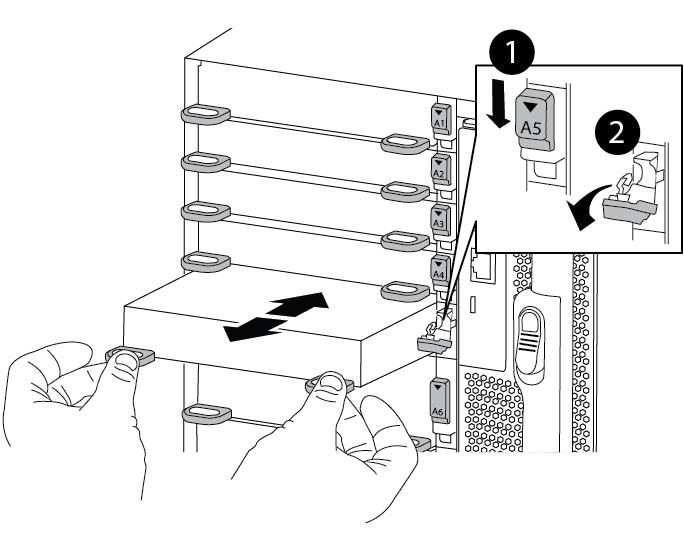

= Aggiunta di un modulo i/o - ASA A900
:allow-uri-read: 
:icons: font
:imagesdir: ../media/

[role="lead"]
È possibile aggiungere un modulo i/o al sistema aggiungendo un nuovo nodulo i/o in un sistema con slot vuoti oppure sostituendo un modulo i/o con uno nuovo in un sistema completamente popolato.

.Prima di iniziare
* Controllare https://hwu.netapp.com/["NetApp Hardware Universe"^] Per assicurarsi che il nuovo modulo i/o sia compatibile con il sistema e la versione di ONTAP in uso.
* Se sono disponibili più slot, controllare le priorità degli slot in https://hwu.netapp.com/["NetApp Hardware Universe"^] E utilizza il miglior modulo di i/O.
* Per aggiungere senza interruzioni un modulo i/o, è necessario sostituire il controller di destinazione, rimuovere il coperchio di chiusura dello slot nello slot di destinazione o rimuovere un modulo i/o esistente, aggiungere il modulo i/o nuovo o sostitutivo e restituire il controller di destinazione.
* Assicurarsi che tutti gli altri componenti funzionino correttamente.

== Opzione 1: Aggiungere il modulo i/o a un sistema con slot aperti

È possibile aggiungere un modulo i/o in uno slot vuoto nel sistema.

== Fase 1: Spegnere il nodo compromesso

Arrestare o sostituire il controller compromesso utilizzando una delle seguenti opzioni.

[role="tabbed-block"]
====
.Opzione 1: La maggior parte dei sistemi
--
Per spegnere il controller compromesso, è necessario determinare lo stato del controller e, se necessario, assumere il controllo del controller in modo che il controller integro continui a servire i dati provenienti dallo storage del controller compromesso.

.A proposito di questa attività
Se si dispone di un cluster con più di due nodi, questo deve trovarsi in quorum. Se il cluster non è in quorum o un controller integro mostra false per idoneità e salute, è necessario correggere il problema prima di spegnere il controller compromesso; vedere link:https://docs.netapp.com/us-en/ontap/system-admin/synchronize-node-cluster-task.html?q=Quorum["Sincronizzare un nodo con il cluster"^].

.Fasi
. Se AutoSupport è attivato, sospendere la creazione automatica dei casi richiamando un comando di messaggio AutoSupport: `system node autosupport invoke -node * -type all -message MAINT=number_of_hours_downh`
+
Il seguente comando AutoSupport sopprime la creazione automatica dei casi per due ore: `cluster1:*> system node autosupport invoke -node * -type all -message MAINT=2h`

. Disattivare il giveback automatico dalla console del controller integro: `storage failover modify –node local -auto-giveback false`
. Portare la centralina danneggiata al prompt DEL CARICATORE:
+
[cols="1,2"]
|===
| Se il controller non utilizzato visualizza... | Quindi... 

 a| 
Il prompt DEL CARICATORE
 a| 
Passare alla fase successiva.

 a| 
`Waiting for giveback...`
 a| 
Premere Ctrl-C, quindi rispondere `y` quando richiesto.

 a| 
Prompt di sistema o prompt della password (inserire la password di sistema)
 a| 
Arrestare o rilevare il controller danneggiato dal controller integro: `storage failover takeover -ofnode _impaired_node_name_`

Quando il controller non utilizzato visualizza Waiting for giveback... (in attesa di giveback...), premere Ctrl-C e rispondere `y`.

|===

--
.Opzione 2: Controller in un MetroCluster
--

NOTE: Non utilizzare questa procedura se il sistema si trova in una configurazione MetroCluster a due nodi.

Per spegnere il controller compromesso, è necessario determinare lo stato del controller e, se necessario, assumere il controllo del controller in modo che il controller integro continui a servire i dati provenienti dallo storage del controller compromesso.

* Se si dispone di un cluster con più di due nodi, questo deve trovarsi in quorum. Se il cluster non è in quorum o un controller integro mostra false per idoneità e salute, è necessario correggere il problema prima di spegnere il controller compromesso; vedere link:https://docs.netapp.com/us-en/ontap/system-admin/synchronize-node-cluster-task.html?q=Quorum["Sincronizzare un nodo con il cluster"^].
* Se si dispone di una configurazione MetroCluster, è necessario confermare che lo stato di configurazione MetroCluster è configurato e che i nodi sono in uno stato abilitato e normale (`metrocluster node show`).

.Fasi
. Se AutoSupport è attivato, sospendere la creazione automatica dei casi richiamando un comando AutoSupport: `system node autosupport invoke -node * -type all -message MAINT=number_of_hours_downh`
+
Il seguente comando AutoSupport sopprime la creazione automatica dei casi per due ore: `cluster1:*> system node autosupport invoke -node * -type all -message MAINT=2h`

. Disattivare il giveback automatico dalla console del controller integro: `storage failover modify –node local -auto-giveback false`
. Portare la centralina danneggiata al prompt DEL CARICATORE:
+
[cols="1,2"]
|===
| Se il controller non utilizzato visualizza... | Quindi... 

 a| 
Il prompt DEL CARICATORE
 a| 
Passare alla fase successiva.

 a| 
In attesa di un giveback...
 a| 
Premere Ctrl-C, quindi rispondere `y` quando richiesto.

 a| 
Prompt di sistema o prompt della password (inserire la password di sistema)
 a| 
Arrestare o rilevare il controller danneggiato dal controller integro: `storage failover takeover -ofnode _impaired_node_name_`

Quando il controller non utilizzato visualizza Waiting for giveback... (in attesa di giveback...), premere Ctrl-C e rispondere `y`.

|===

--
====

== Fase 2: Aggiunta di moduli i/O.

. Se non si è già collegati a terra, mettere a terra l'utente.
. Rimuovere l'otturatore dello slot di destinazione:
+
.. Premere il dispositivo di chiusura a camma con lettere e numeri.
.. Ruotare il fermo della camma verso il basso fino a portarlo in posizione aperta.
.. Staccare l'otturatore.

. Installare il modulo i/o:
+
.. Allineare il modulo i/o con i bordi dello slot.
.. Far scorrere il modulo i/o nello slot fino a quando il dispositivo di chiusura della camma i/o con lettere e numeri inizia a innestarsi nel perno della camma i/O.
.. Spingere il fermo della i/o Cam completamente verso l'alto per bloccare il modulo in posizione.

. Se il modulo i/o sostitutivo è una scheda NIC, collegare il modulo agli switch dati.
+

NOTE: Assicurarsi che tutti gli slot i/o inutilizzati siano dotati di spazi vuoti per evitare possibili problemi di temperatura.

. Riavviare il controller dal prompt DEL CARICATORE: _Bye_
+

NOTE: In questo modo, le schede PCIe e gli altri componenti vengono reinizializzati e il nodo viene riavviato.

. Restituire il controller dal controller partner. `storage failover giveback -ofnode target_node_name`
. Abilitare il giveback automatico se è stato disattivato: `storage failover modify -node local -auto-giveback true`
. Se si utilizzano gli slot 3 e/o 7 per il collegamento in rete, utilizzare `storage port modify -node __<node name>__ -port __<port name>__ -mode network` comando per convertire lo slot per l'utilizzo in rete.
. Ripetere questi passi per il controller B.
. Se è stato installato un modulo i/o di storage, installare e collegare i ripiani NS224, come descritto in https://docs.netapp.com/us-en/ontap-systems/ns224/hot-add-shelf-overview.html["Workflow con aggiunta a caldo"^].

== Opzione 2: Aggiunta di un modulo i/o in un sistema senza slot aperti

Se il sistema è completamente popolato, è possibile modificare un modulo i/o in uno slot i/o rimuovendo un modulo i/o esistente e sostituirlo con un modulo i/o diverso.

. Se:
+
[cols="1,2"]
|===
| Sostituzione di un... | Quindi... 

 a| 
Modulo i/o NIC con lo stesso numero di porte
 a| 
I LIF migrano automaticamente quando il modulo controller viene spento.

 a| 
Modulo i/o NIC con meno porte
 a| 
Riassegnare in modo permanente i file LIF interessati a una porta home diversa. Vedere https://docs.netapp.com/ontap-9/topic/com.netapp.doc.onc-sm-help-960/GUID-208BB0B8-3F84-466D-9F4F-6E1542A2BE7D.html["Migrazione di una LIF"^] Per informazioni sull'utilizzo di System Manager per spostare in modo permanente i file LIF.

 a| 
Modulo i/o NIC con modulo i/o storage
 a| 
Utilizzare System Manager per migrare in modo permanente i file LIF su diverse porte home, come descritto in https://docs.netapp.com/ontap-9/topic/com.netapp.doc.onc-sm-help-960/GUID-208BB0B8-3F84-466D-9F4F-6E1542A2BE7D.html["Migrazione di una LIF"^].

|===

== Fase 1: Spegnere il nodo compromesso

Arrestare o sostituire il controller compromesso utilizzando una delle seguenti opzioni.

[role="tabbed-block"]
====
.Opzione 1: La maggior parte dei sistemi
--
Per spegnere il controller compromesso, è necessario determinare lo stato del controller e, se necessario, assumere il controllo del controller in modo che il controller integro continui a servire i dati provenienti dallo storage del controller compromesso.

.A proposito di questa attività
Se si dispone di un cluster con più di due nodi, questo deve trovarsi in quorum. Se il cluster non è in quorum o un controller integro mostra false per idoneità e salute, è necessario correggere il problema prima di spegnere il controller compromesso; vedere link:https://docs.netapp.com/us-en/ontap/system-admin/synchronize-node-cluster-task.html?q=Quorum["Sincronizzare un nodo con il cluster"^].

.Fasi
. Se AutoSupport è attivato, sospendere la creazione automatica dei casi richiamando un comando di messaggio AutoSupport: `system node autosupport invoke -node * -type all -message MAINT=number_of_hours_downh`
+
Il seguente comando AutoSupport sopprime la creazione automatica dei casi per due ore: `cluster1:*> system node autosupport invoke -node * -type all -message MAINT=2h`

. Disattivare il giveback automatico dalla console del controller integro: `storage failover modify –node local -auto-giveback false`
. Portare la centralina danneggiata al prompt DEL CARICATORE:
+
[cols="1,2"]
|===
| Se il controller non utilizzato visualizza... | Quindi... 

 a| 
Il prompt DEL CARICATORE
 a| 
Passare alla fase successiva.

 a| 
`Waiting for giveback...`
 a| 
Premere Ctrl-C, quindi rispondere `y` quando richiesto.

 a| 
Prompt di sistema o prompt della password (inserire la password di sistema)
 a| 
Arrestare o rilevare il controller danneggiato dal controller integro: `storage failover takeover -ofnode _impaired_node_name_`

Quando il controller non utilizzato visualizza Waiting for giveback... (in attesa di giveback...), premere Ctrl-C e rispondere `y`.

|===

--
.Opzione 2: Controller in un MetroCluster
--

NOTE: Non utilizzare questa procedura se il sistema si trova in una configurazione MetroCluster a due nodi.

Per spegnere il controller compromesso, è necessario determinare lo stato del controller e, se necessario, assumere il controllo del controller in modo che il controller integro continui a servire i dati provenienti dallo storage del controller compromesso.

* Se si dispone di un cluster con più di due nodi, questo deve trovarsi in quorum. Se il cluster non è in quorum o un controller integro mostra false per idoneità e salute, è necessario correggere il problema prima di spegnere il controller compromesso; vedere link:https://docs.netapp.com/us-en/ontap/system-admin/synchronize-node-cluster-task.html?q=Quorum["Sincronizzare un nodo con il cluster"^].
* Se si dispone di una configurazione MetroCluster, è necessario confermare che lo stato di configurazione MetroCluster è configurato e che i nodi sono in uno stato abilitato e normale (`metrocluster node show`).

.Fasi
. Se AutoSupport è attivato, sospendere la creazione automatica dei casi richiamando un comando AutoSupport: `system node autosupport invoke -node * -type all -message MAINT=number_of_hours_downh`
+
Il seguente comando AutoSupport sopprime la creazione automatica dei casi per due ore: `cluster1:*> system node autosupport invoke -node * -type all -message MAINT=2h`

. Disattivare il giveback automatico dalla console del controller integro: `storage failover modify –node local -auto-giveback false`
. Portare la centralina danneggiata al prompt DEL CARICATORE:
+
[cols="1,2"]
|===
| Se il controller non utilizzato visualizza... | Quindi... 

 a| 
Il prompt DEL CARICATORE
 a| 
Passare alla fase successiva.

 a| 
In attesa di un giveback...
 a| 
Premere Ctrl-C, quindi rispondere `y` quando richiesto.

 a| 
Prompt di sistema o prompt della password (inserire la password di sistema)
 a| 
Arrestare o rilevare il controller danneggiato dal controller integro: `storage failover takeover -ofnode _impaired_node_name_`

Quando il controller non utilizzato visualizza Waiting for giveback... (in attesa di giveback...), premere Ctrl-C e rispondere `y`.

|===

--
====

== Fase 2: Sostituire i moduli i/O.

. Se non si è già collegati a terra, mettere a terra l'utente.
. Scollegare eventuali cavi dal modulo i/o di destinazione.
. Rimuovere il modulo i/o di destinazione dallo chassis:
+
.. Premere il dispositivo di chiusura a camma con lettere e numeri.
+
Il dispositivo di chiusura a camma si allontana dal telaio.

.. Ruotare il fermo della camma verso il basso fino a portarlo in posizione orizzontale.
+
Il modulo i/o si disinnesta dallo chassis e si sposta di circa 1/2 pollici fuori dallo slot i/O.

.. Rimuovere il modulo i/o dallo chassis tirando le linguette sui lati del lato anteriore del modulo.
+
Assicurarsi di tenere traccia dello slot in cui si trovava il modulo i/O.

+
.Animazione - Rimozione o sostituzione di un modulo i/O.
video::3a5b1f6e-15ec-40b4-bb2a-adf9016af7b6[panopto]
+

+
[cols="10,90"]
|===

 a| 
image::../media/legend_icon_01.svg[icona legenda 01]
 a| 
Latch i/o Cam intestato e numerato

 a| 
image:../media/legend_icon_02.svg["larghezza=20 px"]
 a| 
Fermo i/o Cam completamente sbloccato

|===

. Installare il modulo i/o nello slot di destinazione:
+
.. Allineare il modulo i/o con i bordi dello slot.
.. Far scorrere il modulo i/o nello slot fino a quando il dispositivo di chiusura della camma i/o con lettere e numeri inizia a innestarsi nel perno della camma i/O.
.. Spingere il fermo della i/o Cam completamente verso l'alto per bloccare il modulo in posizione.

. Ripetere la procedura di rimozione e installazione per sostituire i moduli aggiuntivi per il controller A.
. Se il modulo i/o sostitutivo è una scheda NIC, collegare il modulo o i moduli agli switch dati.
. Riavviare il controller dal prompt DEL CARICATORE:
+
.. Controllare la versione di BMC sul controller: `system service-processor show`
.. Se necessario, aggiornare il firmware BMC: `system service-processor image update`
.. Riavviare il nodo: `bye`
+

NOTE: In questo modo, le schede PCIe e gli altri componenti vengono reinizializzati e il nodo viene riavviato.

+

NOTE: Se si verifica un problema durante il riavvio, vedere https://mysupport.netapp.com/site/bugs-online/product/ONTAP/BURT/1494308["BURT 1494308 - lo spegnimento dell'ambiente potrebbe essere attivato durante la sostituzione del modulo i/O."]

. Restituire il controller dal controller partner. `storage failover giveback -ofnode target_node_name`
. Abilitare il giveback automatico se è stato disattivato: `storage failover modify -node local -auto-giveback true`
. Se hai aggiunto:
+
[cols="1,2"]
|===
| Se il modulo i/o è un... | Quindi... 

 a| 
Modulo NIC negli slot 3 o 7,
 a| 
Utilizzare `storage port modify -node *_<node name>__ -port *_<port name>__ -mode network` comando per ciascuna porta.

 a| 
Modulo storage
 a| 
Installare e collegare i ripiani NS224, come descritto in https://docs.netapp.com/us-en/ontap-systems/ns224/hot-add-shelf-overview.html["Workflow con aggiunta a caldo"^].

|===
. Ripetere questi passi per il controller B.

