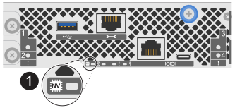

= Sostituire il telaio - AFF C30 e AFF C60
:allow-uri-read: 
:icons: font
:imagesdir: ../media/

[role="lead"]
Sostituire lo chassis del sistema AFF C30 o AFF C60 quando un guasto hardware lo richiede. Il processo di sostituzione prevede la rimozione dei controller e degli alimentatori, la rimozione delle unità, l'installazione del telaio sostitutivo e la reinstallazione dei componenti del telaio.

== Fase 1: Rimuovere il controller

È necessario rimuovere il controller dal telaio quando si sostituisce il controller o un componente all'interno del controller.

.Prima di iniziare
Tutti gli altri componenti del sistema di stoccaggio devono funzionare correttamente; in caso contrario, è necessario contattare https://mysupport.netapp.com/site/global/dashboard["Supporto NetApp"] prima di continuare con questa procedura.

.Fasi
. Sul controller danneggiato, assicurarsi che il LED NV sia spento.
+
Quando il LED NV è spento, la decolorazione è completa ed è possibile rimuovere la centralina guasta in tutta sicurezza.

+

NOTE: Se il LED NV lampeggia (verde), è in corso la procedura di destage. È necessario attendere lo spegnimento del LED NV. Tuttavia, se il lampeggiamento continua per più di cinque minuti, contattare https://mysupport.netapp.com/site/global/dashboard["Supporto NetApp"] prima di continuare con questa procedura.

+
Il LED NV si trova accanto all'icona NV sulla centralina.

+

[cols="1,4"]
|===

 a| 
image::../media/icon_round_1.png[Numero di didascalia 1]
 a| 
Icona NV e LED sul controller

|===
. Se non si è già collegati a terra, mettere a terra l'utente.
. Scollegare l'alimentazione dal controller danneggiato:
+

NOTE: Gli alimentatori non sono dotati di interruttore di alimentazione.

+
[cols="1,2"]
|===
| Se si scollega... | Quindi... 

 a| 
ALIMENTATORE CA
 a| 
.. Aprire il fermo del cavo di alimentazione.
.. Scollegare il cavo di alimentazione dall'alimentatore e metterlo da parte.

 a| 
ALIMENTATORE CC
 a| 
.. Svitare le due viti ad alette sul connettore del cavo di alimentazione CC D-SUB.
.. Scollegare il cavo di alimentazione dall'alimentatore e metterlo da parte.

|===
. Scollegare tutti i cavi dal controller danneggiato.
+
Tenere traccia del punto in cui sono stati collegati i cavi.

. Rimuovere la centralina danneggiata:
+
L'illustrazione seguente mostra il funzionamento delle maniglie del controller (dal lato sinistro del controller) durante la rimozione di un controller:

+
image::../media/drw_g_and_t_handles_remove_ieops-1837.svg[funzionamento della maniglia del controller per rimuovere un controller]

+
[cols="1,4"]
|===

 a| 
image::../media/icon_round_1.png[Numero di didascalia 1]
 a| 
Su entrambe le estremità del controller, spingere le linguette di bloccaggio verticali verso l'esterno per rilasciare le maniglie.

 a| 
image::../media/icon_round_2.png[Numero di didascalia 2]
 a| 
** Tirare le maniglie verso di sé per sganciare il controller dalla scheda di collegamento interna.
+
Mentre si tira, le maniglie si estendono fuori dal controller e poi si sente una certa resistenza, continuare a tirare.

** Far scorrere il controller fuori dallo chassis sostenendo la parte inferiore del controller e posizionarlo su una superficie piana e stabile.

 a| 
image::../media/icon_round_3.png[Numero di didascalia 3]
 a| 
Se necessario, ruotare le maniglie in posizione verticale (accanto alle linguette) per spostarle in modo che non siano di intralcio.

|===
. Ripetere questi passi per l'altra centralina nel telaio.

== Fase 2: Rimuovere le unità dal telaio danneggiato

È necessario rimuovere tutte le unità e gli eventuali alloggiamenti delle unità dallo chassis danneggiato in modo che, successivamente, nella procedura, sia possibile installarle nello chassis sostitutivo.

. Rimuovere delicatamente il frontalino dalla parte anteriore del sistema di archiviazione.
. Rimuovere le unità e gli eventuali alloggiamenti:
+

NOTE: Tenere traccia dell'alloggiamento da cui è stato rimosso ciascun disco e ciascun disco vuoto perché devono essere installati negli stessi alloggiamenti delle unità nello chassis sostitutivo.

+
image::../media/drw_nvme_drive_replace_ieops-1904.svg[Rimuovere l'unità NVMe]

+
[cols="1,4"]
|===

 a| 
image::../media/icon_round_1.png[Numero di didascalia 1]
 a| 
Premere il pulsante di rilascio sulla superficie dell'unità per aprire la maniglia della camma.

 a| 
image::../media/icon_round_2.png[Numero di didascalia 2]
 a| 
Ruotare la maniglia della camma verso il basso per disinnestare la trasmissione dalla piastra intermedia.

 a| 
image::../media/icon_round_3.png[Numero di didascalia 3]
 a| 
Estrarre l'unità dall'alloggiamento utilizzando la maniglia della camma e sostenendo l'unità con l'altra mano.

Quando si rimuove un disco, utilizzare sempre due mani per sostenerne il peso.

NOTE: Poiché i dischi sono fragili, ridurre al minimo la manipolazione per evitare di danneggiarli.

|===
. Mettere da parte le unità su un carrello o un tavolo privo di elettricità statica.

== Fase 3: Sostituire lo chassis dall'interno del rack dell'apparecchiatura o dell'armadio del sistema

Rimuovere lo chassis danneggiato dal rack dell'apparecchiatura o dall'armadietto del sistema, installare lo chassis di ricambio, installare le unità, gli eventuali alloggiamenti delle unità, quindi installare il pannello.

. Rimuovere le viti dai punti di montaggio del telaio danneggiati.
+
Mettere da parte le viti per utilizzarle successivamente in questa procedura.

+

NOTE: Se il sistema di archiviazione viene fornito in un cabinet del sistema NetApp, è necessario rimuovere le viti aggiuntive sul retro dello chassis prima di poter rimuovere lo chassis.

. Con l'aiuto di due persone o di un sollevatore, rimuovere il telaio danneggiato dal rack dell'apparecchiatura o dall'armadio del sistema facendolo scorrere fuori dalle guide, quindi metterlo da parte.
. Con l'aiuto di due persone, installare il telaio di ricambio nel rack dell'apparecchiatura o nell'armadio del sistema facendolo scorrere sulle guide.
. Fissare la parte anteriore dello chassis sostitutivo al rack dell'apparecchiatura o all'armadietto del sistema utilizzando le viti rimosse dallo chassis danneggiato.

== Fase 4: Installare i controller

Installare i controller nel telaio sostitutivo e riavviarli.

.A proposito di questa attività
L'illustrazione seguente mostra il funzionamento delle maniglie del controller (dal lato sinistro di un controller) durante l'installazione di un controller e può essere utilizzata come riferimento per le altre fasi di installazione del controller.

image::../media/drw_g_and_t_handles_reinstall_ieops-1838.svg[funzionamento della maniglia della centralina per installare una centralina]

[cols="1,4"]
|===

 a| 
image::../media/icon_round_1.png[Numero di didascalia 1]
 a| 
Se le maniglie del controller sono state ruotate in posizione verticale (accanto alle linguette) per spostarle in modo che non siano di intralcio, ruotarle in basso in posizione orizzontale.

 a| 
image::../media/icon_round_2.png[Numero di didascalia 2]
 a| 
Spingere le maniglie per reinserire il controller nel telaio e premere fino a quando il controller non è completamente inserito.

 a| 
image::../media/icon_round_3.png[Numero di didascalia 3]
 a| 
Ruotare le maniglie in posizione verticale e bloccarle in posizione con le linguette di bloccaggio.

|===
. Inserire uno dei controller nello chassis:
+
.. Allineare la parte posteriore del controller con l'apertura nel telaio.
.. Premere con decisione le maniglie fino a quando il controller non incontra la scheda di collegamento interna e non è completamente inserito nel telaio.
+

NOTE: Non esercitare una forza eccessiva quando si fa scorrere il controller nel telaio, poiché potrebbe danneggiare i connettori.

.. Ruotare le maniglie del controller verso l'alto e bloccarle in posizione con le linguette.

. Se necessario, è possibile recuperare il controller, ad eccezione dei cavi di alimentazione.
. Ripetere questi passi per installare il secondo controller nel telaio.
. Installare le unità e gli eventuali alloggiamenti delle unità rimossi dallo chassis danneggiato nello chassis sostitutivo:
+

NOTE: Le unità e gli alloggiamenti delle unità devono essere installati negli stessi alloggiamenti dello chassis sostitutivo.

+
.. Con la maniglia della camma in posizione aperta, utilizzare entrambe le mani per inserire l'unità.
.. Premere delicatamente fino a quando l'unità non si arresta.
.. Chiudere la maniglia della camma in modo che l'unità sia completamente alloggiata nel piano interno e che la maniglia scatti in posizione.
+
Chiudere lentamente la maniglia della camma in modo che sia allineata correttamente con la superficie dell'unità.

.. Ripetere la procedura per le unità rimanenti.

. Installare il frontalino.
. Ricollegare i cavi di alimentazione agli alimentatori (PSU) nei controller.
+
Una volta ripristinata l'alimentazione a un alimentatore, il LED di stato dovrebbe essere verde.

+

NOTE: I controller iniziano ad avviarsi non appena l'alimentazione viene ripristinata.

+
[cols="1,2"]
|===
| Se si sta ricollegando... | Quindi... 

 a| 
ALIMENTATORE CA
 a| 
.. Collegare il cavo di alimentazione all'alimentatore.
.. Fissare il cavo di alimentazione con il fermo del cavo di alimentazione.

 a| 
ALIMENTATORE CC
 a| 
.. Collegare il connettore del cavo di alimentazione CC D-SUB all'alimentatore.
.. Serrare le due viti ad alette per fissare il connettore del cavo di alimentazione CC D-SUB all'alimentatore.

|===
. Se i controller si avviano al prompt di Loader, riavviare i controller:
+
`boot_ontap`

. Riattiva AutoSupport:
+
`system node autosupport invoke -node * -type all -message MAINT=END`

.Quali sono le prossime novità?
Dopo aver sostituito il telaio AFF C30 o AFF C60 danneggiato e aver reinstallato i componenti al suo interno, è necessario link:chassis-replace-complete-system-restore-rma.html["completare la sostituzione del telaio"].
