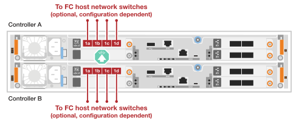

= Collegare l'hardware - AFF C30 e AFF C60
:allow-uri-read: 
:icons: font
:imagesdir: ../media/

[role="lead"]
Dopo aver installato l'hardware del sistema di storage AFF C30 o AFF C60, collegare i controller alla rete e agli shelf.

.Prima di iniziare
Contattare l'amministratore di rete per informazioni sulla connessione del sistema di archiviazione agli switch di rete.

.A proposito di questa attività
* Le procedure di cablaggio cluster/ha e rete host mostrano le configurazioni comuni. Tenete presente che il cablaggio specifico dipende dai componenti ordinati per il vostro sistema di storage. Per informazioni dettagliate sulla configurazione e la priorità degli slot, vedere link:https://hwu.netapp.com["NetApp Hardware Universe"^].
* Le immagini dei cavi hanno icone a freccia che mostrano l'orientamento corretto (verso l'alto o verso il basso) della linguetta di estrazione del connettore del cavo quando si inserisce un connettore in una porta.
+
Quando si inserisce il connettore, si dovrebbe avvertire uno scatto in posizione; se non si sente uno scatto, rimuoverlo, capovolgere e riprovare.

+
image:../media/drw_cable_pull_tab_direction_ieops-1699.svg["Direzione della linguetta di estrazione del cavo"]

* Se si effettua il cablaggio a uno switch ottico, inserire il ricetrasmettitore ottico nella porta del controller prima di collegare il cavo alla porta dello switch.

== Fase 1: Collegare i collegamenti cluster/ha

Collegare i controller al cluster ONTAP. Questa procedura varia in base al modello del sistema di storage in uso e alla configurazione del modulo i/O.

[role="tabbed-block"]
====
.Cablaggio cluster senza switch
--
Collegare i controller l'uno all'altro per creare connessioni del cluster ONTAP.

.AFF A30 o A50 con due moduli i/o 100GbE a 2 porte
[%collapsible]
=====
Le porte del modulo i/o negli slot 2 e 4 sono porte 40/100GbE.??? Questo vale solo per 30-50, se sì lasciare le 2 note dove sono, ma se si applica a tutti i 3, quindi spostare il nuovo paragrafo sotto la sezione testo principale.????

.Fasi
. Collegare le connessioni di interconnessione cluster/ha:
+

NOTE: Il traffico di cluster Interconnect e quello di ha condividono le stesse porte fisiche.

+
.. Porta E2A Del controller del cavo A alla porta E2A del controller B.
.. Porta e4a Del controller del cavo A alla porta e4a del controller B.
+

NOTE: Le porte E2B e e4b sui moduli di i/o negli slot 2 e 4 non sono utilizzate e disponibili per connettività front-end (rete host), se necessario.

+
*Cavi di interconnessione cluster/ha*

+
image::../media/oie_cable_25Gb_Ethernet_SFP28_IEOPS-1069.svg[Cavo ha del cluster]

+
image::../media/drw_isi_a30-50_switchless_2p_100gbe_2card_cabling_ieops-2011.svg[Diagramma di cablaggio del cluster senza switch a due nodi utilizzando due moduli io 100GbE]

=====
.AFF A30 o A50 con un modulo i/o 100GbE a 2 porte
[%collapsible]
=====
Le porte del modulo i/o negli slot 2 e 4 sono porte 40/100GbE.???

.Fasi
. Collegare le connessioni di interconnessione cluster/ha:
+

NOTE: Il traffico di cluster Interconnect e quello di ha condividono le stesse porte fisiche.

+
.. Porta e4a Del controller del cavo A alla porta e4a del controller B.
.. Porta e4b Del controller del cavo A alla porta e4b del controller B.
+
*Cavi di interconnessione cluster/ha*

+
image::../media/oie_cable_25Gb_Ethernet_SFP28_IEOPS-1069.svg[Cavo ha del cluster]

+
image::../media/drw_isi_a30-50_switchless_2p_100gbe_1card_cabling_ieops-1925.svg[Diagramma di cablaggio del cluster senza switch a due nodi con un modulo io 100GbE]

=====
.AFF A20 con un modulo i/o 10/25GbE a 2 porte
[%collapsible]
=====
Aggiungi esempio

+ image:../media/oie_cable_sfp_gbe_copper.png["Connettore GbE SFP in rame"]

+

=====
--
.Cablaggio del cluster con switch
--
Collegare i controller agli switch di rete cluster per creare connessioni cluster ONTAP.

.AFF A30 o A50 con due moduli i/o 100GbE a 2 porte
[%collapsible]
=====
Aggiungi esempio

Nota aggiuntiva: Le porte 40/100GbE E2B e e4b sui moduli i/o negli slot 2 e 4 sono inutilizzate e disponibili per la connettività front-end, se necessario.

=====
.AFF A30 o A50 con un modulo i/o 100GbE a 2 porte
[%collapsible]
=====
.Fasi
. Collegare i controller agli switch di rete cluster:
+

NOTE: Il traffico di cluster Interconnect e quello di ha condividono le stesse porte fisiche.

+
.. Porta del controller via cavo A e4a e porta del controller B e4a allo switch di rete del cluster A.
.. Cavo Controller A porta e4b e Controller B porta e4b allo switch di rete cluster B.
+
*Cavi di interconnessione cluster/ha*

+
image::../media/oie_cable100_gbe_qsfp28.png[Cavo da 100 GB]

+
image::../media/drw_isi_a30-50_2p_100gbe_1card_switched_cabling_ieops-1926.svg[Connessioni cluster via cavo alla rete cluster]

=====
.AFF A20 con un modulo i/o 10/25GbE a 2 porte
[%collapsible]
=====
Aggiungi esempio

=====
--
====

== Fase 2: Collegare i cavi delle connessioni di rete host

Collegare i controller alla rete host. Questa procedura varia in base al modello del sistema di storage in uso e alla configurazione del modulo i/O. La connettività host è 40/100 GbE.???

.AFF A30 o A50 con due moduli i/o 100GbE a 2 porte
[%collapsible]
====
Testo

====
.AFF A30 o A50 con un modulo i/o 100GbE a 2 porte
[%collapsible]
====
. Collegare via cavo le connessioni di rete host.
+
I seguenti passaggi secondari sono esempi di cablaggio di rete host opzionale. Se necessario, consultare link:https://hwu.netapp.com["NetApp Hardware Universe"^] per la configurazione specifica del sistema di storage.

+
.. Opzionale: Cavo per switch di rete host 40/100GbE.
+
Porte dei cavi E2A, E2B, e2c e e2d su ciascun controller agli switch di rete host Ethernet.

+
*Cavi 40/100 GbE*

+
image::../media/oie_cable_sfp_gbe_copper.png[Cavo da 40/100 GB]

+
image::../media/drw_isi_a30-50_host_2p_40-100gbe_1card_cabling_ieops-1923.svg[Collegare gli switch di rete host ethernet 40/100GbE]

.. Opzionale: Cavo per switch di rete host FC.
+
Collegare le porte dei cavi 1a, 1b, 1c e 1d su ciascun controller agli switch di rete host FC.

+
*Cavi FC da 64 GB/s*

+
image::../media/oie_cable_sfp_gbe_copper.png[Cavo fc da 64 GB]

+

====
.AFF A20 con un modulo 100GbE a 2 porte
[%collapsible]
====
aggiungi testo

====

== Fase 3: Collegare i collegamenti della rete di gestione

Collegare i controller alla rete di gestione.

. Collegare le porte di gestione (chiave inglese) di ciascun controller agli switch di rete di gestione.
+
*CAVI RJ-45 1000BASE-T.

+
image::../media/oie_cable_rj45.png[Cavi RJ-45]

+
image::../media/drw_isi_g_wrench_cabling_ieops-1928.svg[Connettersi alla rete di gestione]

IMPORTANT: Non collegare ancora i cavi di alimentazione.

== Fase 4: Collegare i collegamenti dei ripiani

Questa procedura mostra come collegare i controller a uno shelf NS224.

.A proposito di questa attività
* Per conoscere il numero massimo di ripiani supportati per il sistema di storage e per tutte le opzioni di cablaggio, ad esempio ottico e switch-attached, vedere link:https://hwu.netapp.com["NetApp Hardware Universe"^].
* È possibile collegare ciascun controller a ciascun modulo NSM100B sullo shelf NS224 utilizzando i cavi di archiviazione forniti con il sistema di archiviazione, che possono essere del tipo di cavo seguente:
+
*Cavi in rame 100 GbE QSFP28*

+
image::../media/oie_cable100_gbe_qsfp28.png[Cavo in rame da 100 GbE QSFP28]

* La grafica mostra il cablaggio del controller A in blu e il cablaggio del controller B in giallo.

.Fasi
. Collegare il controller del cavo A allo shelf:
+
.. Porta e3a Del controller del cavo A alla porta NSM A E1a.
.. Porta del controller del cavo A E3B alla porta NSM B e1b.
+
image:../media/drw_isi_g_1_ns224_controller_a_cabling_ieops-1945.svg["Porte e3a e E3B del controller A cablate su uno shelf NS224"]

. Collegare il controller del cavo B allo shelf:
+
.. Dalla porta e3a del controller del cavo B alla porta E1a NSM B.
.. Porta E3B del controller del cavo B alla porta NSM A e1b.
+
image:../media/drw_isi_g_1_ns224_controller_b_cabling_ieops-1946.svg["Porte e3a e E3B del controller B collegate a uno shelf NS224"]

.Quali sono le prossime novità?
Dopo aver collegato l'hardware al sistema di storage, si link:install-power-hardware.html["accendere il sistema di archiviazione"].
