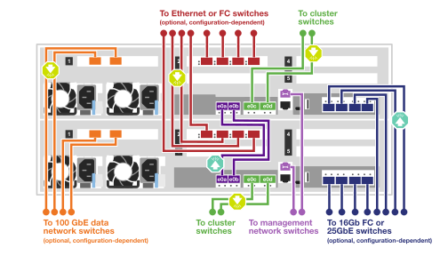
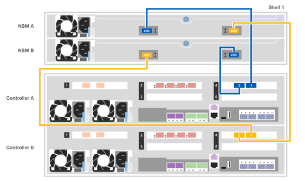

= Guida dettagliata - AFF C400
:allow-uri-read: 
:icons: font
:imagesdir: ../media/

[role="lead"]
Questa guida fornisce istruzioni dettagliate e dettagliate per l'installazione di un sistema NetApp tipico. Utilizzare questa guida per ottenere istruzioni di installazione più dettagliate.

Se si dispone di una configurazione MetroCluster, utilizzare il contenuto dell'installazione di MetroCluster.

https://docs.netapp.com/us-en/ontap-metrocluster/index.html["Documentazione MetroCluster"^]

== Fase 1: Preparazione per l'installazione

Per installare il sistema, è necessario creare un account, registrare il sistema e ottenere le chiavi di licenza. È inoltre necessario inventariare il numero e il tipo di cavi appropriati per il sistema e raccogliere informazioni di rete specifiche.

.Prima di iniziare
* È necessario accedere a Hardware Universe per ottenere informazioni sui requisiti del sito e ulteriori informazioni sul sistema configurato. Per ulteriori informazioni su questo sistema, è possibile accedere alle Note di rilascio della versione di ONTAP in uso.
+
https://hwu.netapp.com["NetApp Hardware Universe"]

+
http://mysupport.netapp.com/documentation/productlibrary/index.html?productID=62286["Trova le Note di rilascio relative alla tua versione di ONTAP 9"]

* Devi fornire quanto segue presso la tua sede:
+
** Spazio rack per il sistema storage
** Cacciavite Phillips n. 2
** Cavi di rete aggiuntivi per collegare il sistema allo switch di rete e al laptop o alla console mediante un browser Web

.Fasi
. Disimballare il contenuto di tutte le confezioni.
. Annotare il numero di serie del sistema dai controller.
+
image::../media/drw_ssn_label.png[Esempio del numero di serie del sistema che mostra la posizione del numero]

. Fare un inventario e prendere nota del numero e dei tipi di cavi ricevuti.
+
La seguente tabella identifica i tipi di cavi che potrebbero essere ricevuti. Se si riceve un cavo non elencato nella tabella, consultare la Hardware Universe per individuare il cavo e identificarne l'utilizzo.

+
https://hwu.netapp.com["NetApp Hardware Universe"]

+
[cols="1,2,1,2"]
|===
| Tipo di cavo... | Codice e lunghezza del ricambio | Tipo di connettore | Per... 

 a| 
Cavo da 100 GbE (QSFP28)
 a| 
X66211A-05 (112-00595), 0,5 m.

X66211A-1 (112-00573), 1 m.

X66211A-2 (112-00574), 2 m

X66211A-5 (112-00574), 5 m.
 a| 
image:../media/oie_cable100_gbe_qsfp28.png[""]
 a| 
Storage, interconnessione cluster/ha e dati Ethernet (in base all'ordine)

 a| 
Cavo da 25 GbE (SFP28)
 a| 
X66240-2 (112-00598), 2 m

X66240-5 (112-00639), 5 m.
 a| 
image:../media/oie_cable_sfp_gbe_copper.png[""]
 a| 
Connessione di rete GbE (in base all'ordine)

 a| 
FC da 32 GB (SFP+ Op)
 a| 
X66250-2 (112-00342), 2 m

X66250-5 (112-00344), 5 m.

X66250-15 (112-00346), 15 m.
 a| 
image:../media/oie_cable_sfp_gbe_copper.png[""]
 a| 
Connessione di rete FC

 a| 
Cavi ottici
 a| 
X66250-2-N-C (112-00342)
 a| 
image:../media/oie_cable_fiber_lc_connector.png["Immagine che mostra un connettore LC in fibra ottica"]
 a| 
Cavi FC da 16 GB o 25 GbE per schede mezzanine (in base all'ordine)

 a| 
RJ-45 (in base all'ordine)
 a| 
X6585-R6 (112-00291), 3 m.

X6562-R6 (112-00196), 5 m.
 a| 
image:../media/oie_cable_rj45.png[""]
 a| 
Rete di gestione

 a| 
Cavo per console micro-USB
 a| 
Non applicabile
 a| 
image:../media/oie_cable_micro_usb.png["Immagine che mostra un connettore micro USB"]
 a| 
Connessione alla console utilizzata durante l'installazione del software se il laptop o la console non supportano il rilevamento della rete.

 a| 
Cavi di alimentazione
 a| 
Non applicabile
 a| 
image:../media/oie_cable_power.png[""]
 a| 
Accensione del sistema

|===
. Consultare la _Guida alla configurazione di NetApp ONTAP_ e raccogliere le informazioni richieste elencate in tale guida.
+
https://library.netapp.com/ecm/ecm_download_file/ECMLP2862613["Guida alla configurazione di ONTAP"]

== Fase 2: Installare l'hardware

È necessario installare il sistema in un rack a 4 montanti o in un cabinet di sistema NetApp, a seconda dei casi.

. Installare i kit di guide, secondo necessità.
. Installare e fissare il sistema seguendo le istruzioni fornite con il kit di guide.
+

NOTE: È necessario essere consapevoli dei problemi di sicurezza associati al peso del sistema.

+
image::../media/drw_katana_lifting_restriction_icon.png[icona di limitazione del sollevamento drw katana]

. Collegare i dispositivi di gestione dei cavi al retro dei controller (come illustrato).
+
image::../media/drw_c400_cable_tray_IEOPS-1208.svg[Vassoio per cavi drw C400 IEOPS 1208]

. Posizionare il pannello anteriore del sistema.

== Fase 3: Collegare i controller alla rete

È possibile collegare i controller alla rete utilizzando il metodo cluster senza switch a due nodi o il metodo cluster con switch.

.A proposito di questa attività
* Se le etichette delle porte sulla scheda non sono visibili, è possibile identificare le porte controllando l'orientamento di installazione della scheda (per C400, lo zoccolo del connettore PCIe si trova sul lato sinistro dello slot della scheda), quindi cercare la scheda in base al numero di parte in NetApp Hardware Universe, che mostra un grafico del pannello con le etichette delle porte. È possibile trovare il numero di parte della scheda utilizzando il comando sysconfig -a o nella lista di imballaggio del sistema.
* Se si sta cablando una configurazione IP MetroCluster, le porte e0a/e0b sono disponibili per l'hosting dei file LIF dei dati (di solito in IPSpace predefinito).

[role="tabbed-block"]
====
.Opzione 1: Collegare un cluster senza switch a due nodi
--
Le porte ha e l'interconnessione cluster di un modulo controller sono cablate al relativo modulo controller partner. Le porte dati opzionali, le schede NIC opzionali e le porte di gestione dei moduli controller sono collegate agli switch.

.Prima di iniziare
Per informazioni sulla connessione del sistema agli switch, contattare l'amministratore di rete.

.A proposito di questa attività
Verificare la direzione delle linguette dei cavi quando si inseriscono i cavi nelle porte. Le linguette dei cavi sono rivolte verso l'alto per tutte le porte integrate e verso il basso per le schede di espansione (NIC).

image::../media/oie_cable_pull_tab_up.png[linguetta di estrazione del cavo oie verso l'alto]

image::../media/oie_cable_pull_tab_down.png[linguetta di estrazione del cavo oie verso il basso]

NOTE: Quando si inserisce il connettore, si dovrebbe avvertire uno scatto in posizione; se non si sente uno scatto, rimuoverlo, ruotarlo e riprovare.

.Fasi
. Utilizzare l'illustrazione per completare il cablaggio tra i controller e gli switch:
+

. Passare a. <<Fase 4: Collegare i controller dei cavi agli shelf di dischi>> per istruzioni sul cablaggio dello shelf di dischi.

--
.Opzione 2: Cavo a del cluster con switch
--
L'interconnessione del cluster del modulo controller e le porte ha sono cablate al cluster/switch ha. Le porte dati opzionali, le schede NIC opzionali, le schede mezzanine e le porte di gestione sono collegate agli switch.

.Prima di iniziare
Per informazioni sulla connessione del sistema agli switch, contattare l'amministratore di rete.

.A proposito di questa attività
Verificare la direzione delle linguette dei cavi quando si inseriscono i cavi nelle porte. Le linguette dei cavi sono rivolte verso l'alto per tutte le porte integrate e verso il basso per le schede di espansione (NIC).

image::../media/oie_cable_pull_tab_up.png[linguetta di estrazione del cavo oie verso l'alto]

image::../media/oie_cable_pull_tab_down.png[linguetta di estrazione del cavo oie verso il basso]

NOTE: Quando si inserisce il connettore, si dovrebbe avvertire uno scatto in posizione; se non si sente uno scatto, rimuoverlo, ruotarlo e riprovare.

.Fasi
. Utilizzare l'illustrazione per completare il cablaggio tra i controller e gli switch:
+

. Passare a. <<Fase 4: Collegare i controller dei cavi agli shelf di dischi>> per istruzioni sul cablaggio dello shelf di dischi.

--
====

== Fase 4: Collegare i controller dei cavi agli shelf di dischi

Le seguenti opzioni mostrano come collegare uno o due shelf di dischi NS224 al sistema.

=== Opzione 1: Collegare i controller a un singolo shelf di dischi

È necessario collegare ciascun controller ai moduli NSM sullo shelf di dischi NS224.

.A proposito di questa attività
Verificare che la freccia dell'illustrazione sia orientata correttamente con la linguetta di estrazione del connettore del cavo. La linguetta di estrazione del cavo per NS224 è rivolta verso l'alto.

image::../media/oie_cable_pull_tab_up.png[linguetta di estrazione del cavo oie verso l'alto]

NOTE: Quando si inserisce il connettore, si dovrebbe avvertire uno scatto in posizione; se non si sente uno scatto, rimuoverlo, ruotarlo e riprovare.

.Fasi
. Utilizzare la seguente illustrazione per collegare i controller a un singolo shelf di dischi.
+

. Passare a. <<Fase 5: Completare l'installazione e la configurazione del sistema>> per completare l'installazione e la configurazione del sistema.

=== Opzione 2: Collegare i controller a due shelf di dischi

È necessario collegare ciascun controller ai moduli NSM su entrambi gli shelf di dischi NS224.

.A proposito di questa attività
Verificare che la freccia dell'illustrazione sia orientata correttamente con la linguetta di estrazione del connettore del cavo. La linguetta di estrazione del cavo per NS224 è rivolta verso l'alto.

image::../media/oie_cable_pull_tab_up.png[linguetta di estrazione del cavo oie verso l'alto]

NOTE: Quando si inserisce il connettore, si dovrebbe avvertire uno scatto in posizione; se non si sente uno scatto, rimuoverlo, ruotarlo e riprovare.

.Fasi
. Utilizzare la seguente illustrazione per collegare i controller a due shelf di dischi.
+
image::../media/drw_c400_two_ns224_shelves_IEOPS-1192.svg[Drw C400 due ns224 ripiani IEOPS 1192]

. Passare a. <<Fase 5: Completare l'installazione e la configurazione del sistema>> per completare l'installazione e la configurazione del sistema.

== Fase 5: Completare l'installazione e la configurazione del sistema

È possibile completare l'installazione e la configurazione del sistema utilizzando il rilevamento del cluster solo con una connessione allo switch e al laptop oppure collegandosi direttamente a un controller del sistema e quindi allo switch di gestione.

=== Opzione 1: Completamento della configurazione e della configurazione del sistema se è attivato il rilevamento della rete

Se sul laptop è attivata la funzione di rilevamento della rete, è possibile completare l'installazione e la configurazione del sistema utilizzando la funzione di rilevamento automatico del cluster.

. Utilizzare la seguente animazione per accendere e impostare gli ID degli shelf per uno o più shelf di dischi:
+
Per gli shelf di dischi NS224, gli shelf ID sono preimpostati su 00 e 01. Se si desidera modificare gli ID dello shelf, utilizzare l'estremità raddrizzata di una graffetta o una penna a sfera a punta stretta per accedere al pulsante ID dello shelf dietro la mascherina.

+
.Animazione - impostazione degli ID dello shelf di dischi
video::c500e747-30f8-4763-9065-afbf00008e7f[panopto]
. Collegare i cavi di alimentazione agli alimentatori del controller, quindi collegarli a fonti di alimentazione su diversi circuiti.
. Assicurarsi che il rilevamento della rete sia attivato sul laptop.
+
Per ulteriori informazioni, consultare la guida in linea del portatile.

. Collegare il laptop allo switch di gestione.

image::../media/dwr_laptop_to_switch_only.svg[solo da portatile a switch dwr]

. Selezionare un'icona ONTAP elencata per scoprire:
+
image::../media/drw_autodiscovery_controler_select.png[selezione del controllo di rilevamento automatico drw]

+
.. Aprire file Explorer.
.. Fare clic su Network (rete) nel riquadro sinistro.
.. Fare clic con il pulsante destro del mouse e selezionare Aggiorna.
.. Fare doppio clic sull'icona ONTAP e accettare i certificati visualizzati sullo schermo.
+

NOTE: XXXXX è il numero di serie del sistema per il nodo di destinazione.

+
Viene visualizzato Gestione sistema.

. Utilizza la configurazione guidata di System Manager per configurare il tuo sistema utilizzando i dati raccolti nella _Guida alla configurazione di NetApp ONTAP_.
+
https://library.netapp.com/ecm/ecm_download_file/ECMLP2862613["Guida alla configurazione di ONTAP"]

. Configura il tuo account e scarica Active IQ Config Advisor:
+
.. Accedi al tuo account esistente o crea un account.
+
https://mysupport.netapp.com/site/user/registration["Registrazione del supporto NetApp"]

.. Registrare il sistema.
+
https://mysupport.netapp.com/site/systems/register["Registrazione del prodotto NetApp"]

.. Scarica Active IQ Config Advisor.
+
https://mysupport.netapp.com/site/tools["Download NetApp: Config Advisor"]

. Verificare lo stato del sistema eseguendo Config Advisor.
. Una volta completata la configurazione iniziale, passare alla https://www.netapp.com/data-management/oncommand-system-documentation/["ONTAP  risorse di documentazione per il gestore di sistema ONTAP"] Pagina per informazioni sulla configurazione di funzioni aggiuntive in ONTAP.

=== Opzione 2: Completamento della configurazione e della configurazione del sistema se il rilevamento della rete non è attivato

Se il rilevamento della rete non è abilitato sul laptop, è necessario completare la configurazione e la configurazione utilizzando questa attività.

. Cablare e configurare il laptop o la console:
+
.. Impostare la porta della console del portatile o della console su 115,200 baud con N-8-1.
+

NOTE: Per informazioni su come configurare la porta della console, consultare la guida in linea del portatile o della console.

.. Collegare il cavo della console al laptop o alla console utilizzando il cavo della console fornito con il sistema, quindi collegare il laptop allo switch di gestione sulla subnet di gestione .
.. Assegnare un indirizzo TCP/IP al portatile o alla console, utilizzando un indirizzo presente nella subnet di gestione.

. Utilizzare la seguente animazione per accendere e impostare gli ID degli shelf per uno o più shelf di dischi:
+
Per gli shelf di dischi NS224, gli shelf ID sono preimpostati su 00 e 01. Se si desidera modificare gli ID dello shelf, utilizzare l'estremità raddrizzata di una graffetta o una penna a sfera a punta stretta per accedere al pulsante ID dello shelf dietro la mascherina.

+
.Animazione - impostazione degli ID dello shelf di dischi
video::c500e747-30f8-4763-9065-afbf00008e7f[panopto]
. Collegare i cavi di alimentazione agli alimentatori del controller, quindi collegarli a fonti di alimentazione su diversi circuiti.
+

NOTE: L'avvio iniziale può richiedere fino a otto minuti.

. Assegnare un indirizzo IP di gestione del nodo iniziale a uno dei nodi.
+
[cols="1,2"]
|===
| Se la rete di gestione dispone di DHCP... | Quindi... 

 a| 
Configurato
 a| 
Registrare l'indirizzo IP assegnato ai nuovi controller.

 a| 
Non configurato
 a| 
.. Aprire una sessione della console utilizzando putty, un server terminal o un server equivalente per l'ambiente in uso.
+

NOTE: Se non si sa come configurare PuTTY, consultare la guida in linea del portatile o della console.

.. Inserire l'indirizzo IP di gestione quando richiesto dallo script.

|===
. Utilizzando System Manager sul laptop o sulla console, configurare il cluster:
+
.. Puntare il browser sull'indirizzo IP di gestione del nodo.
+

NOTE: Il formato dell'indirizzo è +https://x.x.x.x.+

.. Configurare il sistema utilizzando i dati raccolti nella _Guida alla configurazione di NetApp ONTAP_.
+
https://library.netapp.com/ecm/ecm_download_file/ECMLP2862613["Guida alla configurazione di ONTAP"]

. Configura il tuo account e scarica Active IQ Config Advisor:
+
.. Accedi al tuo account esistente o crea un account.
+
https://mysupport.netapp.com/site/user/registration["Registrazione del supporto NetApp"]

.. Registrare il sistema.
+
https://mysupport.netapp.com/site/systems/register["Registrazione del prodotto NetApp"]

.. Scarica Active IQ Config Advisor.
+
https://mysupport.netapp.com/site/tools["Download NetApp: Config Advisor"]

. Verificare lo stato del sistema eseguendo Config Advisor.
. Una volta completata la configurazione iniziale, passare alla https://www.netapp.com/data-management/oncommand-system-documentation/["ONTAP  risorse di documentazione per il gestore di sistema ONTAP"] Pagina per informazioni sulla configurazione di funzioni aggiuntive in ONTAP.

