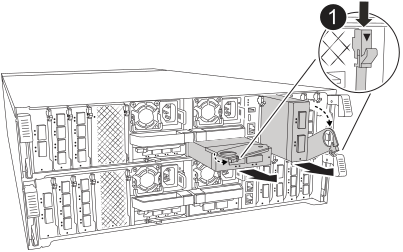

= Sostituire un modulo i/o - AFF C80
:allow-uri-read: 
:icons: font
:imagesdir: ../media/

[role="lead"]
Sostituire un modulo i/o nel sistema AFF C80 quando il modulo si guasta o richiede un aggiornamento per supportare prestazioni più elevate o funzioni aggiuntive. Il processo di sostituzione prevede lo spegnimento del controller, la sostituzione del modulo i/o guasto, il riavvio del controller e la restituzione del componente guasto a NetApp.

Per sostituire un modulo i/o, individuarlo all'interno del modulo controller e seguire la sequenza specifica di passi.

.Fasi
. Se non si è già collegati a terra, mettere a terra l'utente.
. Scollegare eventuali cavi dal modulo i/o di destinazione.
+
Accertarsi di etichettare i cavi in modo da sapere da dove provengono.

. Ruotare il vassoio di gestione dei cavi verso il basso tirando i pulsanti all'interno del vassoio di gestione dei cavi e ruotandolo verso il basso.
. Rimuovere il modulo i/o dal modulo controller:
+

NOTE: La figura seguente mostra la rimozione di un modulo i/o orizzontale e verticale. In genere, si rimuoverà un solo modulo i/O.

+

+
[cols="1,4"]
|===

 a| 
image:../media/icon_round_1.png["Numero di didascalia 1"]
 a| 
Pulsante di bloccaggio della camma

|===
+
.. Premere il pulsante del dispositivo di chiusura a camma.
.. Ruotare il dispositivo di chiusura della camma allontanandolo completamente dal modulo.
.. Rimuovere il modulo dal modulo controller agganciando il dito nell'apertura della leva a camme ed estraendo il modulo dal modulo controller.
+
Assicurarsi di tenere traccia dello slot in cui si trovava il modulo i/O.

. Mettere da parte il modulo i/O.
. Installare il modulo i/o sostitutivo nello slot di destinazione:
+
.. Allineare il modulo i/o con i bordi dello slot.
.. Far scorrere delicatamente il modulo nello slot fino in fondo nel modulo controller, quindi ruotare il dispositivo di chiusura della camma completamente verso l'alto per bloccare il modulo in posizione.

. Collegare il modulo i/O.
. Ripetere i passi di rimozione e installazione per sostituire i moduli aggiuntivi per la centralina.
. Ruotare il vassoio di gestione dei cavi in posizione di blocco.

