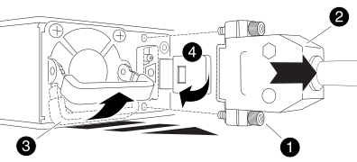

= Sostituire un alimentatore - AFF C800
:allow-uri-read: 
:icons: font
:imagesdir: ../media/

[role="lead"]
La sostituzione di un alimentatore comporta lo scollegamento dell'alimentatore di destinazione dalla fonte di alimentazione, lo scollegamento del cavo di alimentazione, la rimozione dell'alimentatore precedente e l'installazione dell'alimentatore sostitutivo, quindi il ricollegamento alla fonte di alimentazione.

* Le PSU sono ridondanti e sostituibili a caldo.
* Questa procedura è stata scritta per la sostituzione di una PSU alla volta.
+

NOTE: Si consiglia di sostituire l'alimentatore entro due minuti dalla rimozione dallo chassis. Il sistema continua a funzionare, ma ONTAP invia messaggi alla console relativi all'alimentatore danneggiato fino alla sostituzione dell'alimentatore.

* Le PSU sono ad intervallo automatico.
+

IMPORTANT: Non combinare PSU con diversi indici di efficienza. Sostituire sempre come per come.

Utilizzare la procedura appropriata per il tipo di alimentatore in uso: CA o CC.

[role="tabbed-block"]
====
.Opzione 1: Sostituire un alimentatore CA
--
Per sostituire l'alimentatore, fare riferimento al seguente video o alla procedura:

. Se non si è già collegati a terra, mettere a terra l'utente.
. Identificare la PSU che si desidera sostituire, in base ai messaggi di errore della console o tramite il LED di errore rosso sull'alimentatore.
. Scollegare l'alimentatore:
+
.. Aprire il fermo del cavo di alimentazione, quindi scollegare il cavo di alimentazione dall'alimentatore.
.. Scollegare il cavo di alimentazione dalla fonte di alimentazione.

. Ruotare la maniglia della camma in modo che possa essere utilizzata per estrarre l'alimentatore dal modulo controller premendo la linguetta di bloccaggio.
+

CAUTION: L'alimentatore è in corto. Utilizzare sempre due mani per sostenerlo durante la rimozione dal modulo controller in modo che non si sposti improvvisamente dal modulo controller e non causi lesioni.

+
image::../media/drw_a800_replace_psu.png[drw a800 sostituire l'alimentatore]

+
|===

 a| 
image:../media/legend_icon_01.png[""]
| Linguetta blu di bloccaggio dell'alimentatore 

 a| 
image:../media/legend_icon_02.png[""]
 a| 
Alimentatore

|===
. Con entrambe le mani, sostenere e allineare i bordi dell'alimentatore con l'apertura nel modulo controller, quindi spingere delicatamente l'alimentatore nel modulo controller fino a quando la linguetta di bloccaggio non scatta in posizione.
+
Le PSU si innestano correttamente solo con il connettore interno e si bloccano in un modo.

+

NOTE: Per evitare di danneggiare il connettore interno, non esercitare una forza eccessiva quando si inserisce l'alimentatore nel sistema.

. Ricollegare il cablaggio dell'alimentatore:
+
.. Ricollegare il cavo di alimentazione all'alimentatore e alla fonte di alimentazione.
.. Fissare il cavo di alimentazione all'alimentatore utilizzando il fermo del cavo di alimentazione.

+
Una volta ripristinata l'alimentazione all'alimentatore, il LED di stato deve essere verde.

. Restituire la parte guasta a NetApp, come descritto nelle istruzioni RMA fornite con il kit. Vedere https://mysupport.netapp.com/site/info/rma["Parti restituita  sostituzioni"^] per ulteriori informazioni.

--
.Opzione 2: Sostituire un alimentatore CC
--
Per sostituire un alimentatore CC, attenersi alla seguente procedura.

. Se non si è già collegati a terra, mettere a terra l'utente.
. Identificare la PSU che si desidera sostituire, in base ai messaggi di errore della console o tramite il LED di errore rosso sull'alimentatore.
. Scollegare l'alimentatore:
+
.. Svitare le due viti a testa zigrinata sul connettore del cavo di alimentazione CC D-SUB.
+
L'illustrazione e la tabella nel passaggio 4 mostrano le due viti ad alette (elemento n. 1) e il connettore del cavo di alimentazione CC D-SUB (elemento n. 2).

.. Scollegare il connettore del cavo di alimentazione CC D-SUB dall'alimentatore e metterlo da parte.

. Rimuovere l'alimentatore:
+
.. Ruotare la maniglia verso l'alto, in posizione orizzontale, quindi afferrarla.
.. Con il pollice, premere la linguetta blu per rilasciare il meccanismo di bloccaggio.
.. Estrarre l'alimentatore dal modulo controller, tenendo l'altra mano per sostenerne il peso.
+

NOTE: L'alimentatore è in corto. Utilizzare sempre due mani per sostenerlo quando lo si rimuove dal modulo controller in modo che non ruoti liberamente dal modulo controller e non causi lesioni.

+

+
[cols="1,3"]
|===

 a| 
image:../media/legend_icon_01.svg["larghezza = 10 px"]
 a| 
Viti ad alette

 a| 
image:../media/legend_icon_02.svg["larghezza = 10 px"]
 a| 
Connettore del cavo di alimentazione CC D-SUB

 a| 
image:../media/legend_icon_03.svg["larghezza = 10 px"]
 a| 
Maniglia PSU

 a| 
image:../media/legend_icon_04.svg["larghezza = 10 px"]
 a| 
Linguetta blu di bloccaggio PSU

|===

. Installare l'alimentatore sostitutivo:
+
.. Con entrambe le mani, sostenere e allineare i bordi dell'alimentatore con l'apertura del modulo controller.
.. Spingere delicatamente l'alimentatore nel modulo controller fino a quando il meccanismo di blocco non scatta in posizione.
+
Un alimentatore deve essere correttamente collegato al connettore interno e al meccanismo di bloccaggio. Ripetere questa procedura se si ritiene che l'alimentatore non sia inserito correttamente.

+

NOTE: Non esercitare una forza eccessiva per evitare di danneggiare il connettore interno.

.. Ruotare la maniglia verso il basso, in modo che non sia di intralcio alle normali operazioni.

. Ricollegare il cavo di alimentazione CC D-SUB:
+
Una volta ripristinata l'alimentazione all'alimentatore, il LED di stato deve essere verde.

+
.. Collegare il connettore del cavo di alimentazione CC D-SUB all'alimentatore.
.. Serrare le due viti a testa zigrinata per fissare il connettore del cavo di alimentazione CC D-SUB all'alimentatore.

. Restituire la parte guasta a NetApp, come descritto nelle istruzioni RMA fornite con il kit. Vedere https://mysupport.netapp.com/site/info/rma["Parti restituita  sostituzioni"^] per ulteriori informazioni.

--
====