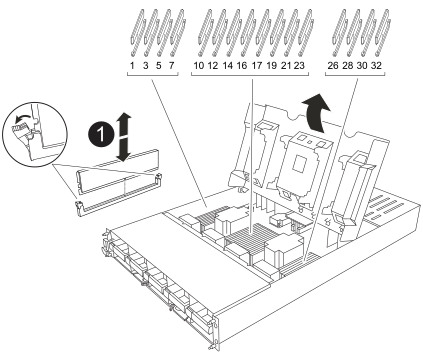

= Sostituire la centralina - FAS70 e FAS90
:allow-uri-read: 
:icons: font
:imagesdir: ../media/

[role="lead"]
Sostituire il controller nel sistema FAS70 o FAS90 quando un guasto hardware lo richiede. Il processo di sostituzione prevede la rimozione del controller danneggiato, lo spostamento dei componenti nel controller sostitutivo, l'installazione del controller sostitutivo e il riavvio.

== Fase 1: Rimuovere il modulo controller

È necessario rimuovere il modulo controller dal contenitore quando si sostituisce il modulo controller o un componente all'interno del modulo controller.

.Fasi
. Controllare il LED di stato NVRAM situato nello slot 4/5 del sistema. Sul pannello anteriore del modulo controller è presente anche un LED NVRAM. Cercare l'icona NV:
+
image::../media/drw_a1K-70-90_nvram-led_ieops-1463.svg[Grafico della posizione dei LED di stato e di attenzione NVRAM]

+
[cols="1,4"]
|===

 a| 
image:../media/icon_round_1.png["Numero di didascalia 1"]
 a| 
LED di stato NVRAM

 a| 
image:../media/icon_round_2.png["Numero di didascalia 2"]
 a| 
LED di attenzione NVRAM

|===
+
** Se il LED NV è spento, passare alla fase successiva.
** Se il LED NV lampeggia, attendere l'arresto del lampeggio. Se il lampeggiamento continua per più di 5 minuti, contattare il supporto tecnico per assistenza.

. Se non si è già collegati a terra, mettere a terra l'utente.
. Sulla parte anteriore dell'unità, agganciare le dita nei fori delle camme di bloccaggio, premere le linguette sulle leve a camma e ruotare delicatamente, ma con decisione, entrambi i fermi verso di sé contemporaneamente.
+
Il modulo controller si sposta leggermente all'esterno del contenitore.

+
image::../media/drw_a1k_pcm_remove_replace_ieops-1375.svg[Immagine di rimozione della centralina]

+
[cols="1,4"]
|===

 a| 
image:../media/icon_round_1.png["Numero di didascalia 1"]
| Blocco dei fermi della camma 
|===
. Estrarre il modulo controller dal contenitore e collocarlo su una superficie piana e stabile.
+
Assicurarsi di sostenere la parte inferiore del modulo controller mentre lo si estrae dal contenitore.

== Fase 2: Spostare le ventole

È necessario rimuovere i cinque moduli ventola dal modulo controller danneggiato al modulo controller sostitutivo.

.Fasi
. Se non si è già collegati a terra, mettere a terra l'utente.
. Rimuovere il pannello (se necessario) con due mani, afferrando le aperture su ciascun lato del pannello, quindi tirandolo verso di sé fino a quando non si sgancia dai perni sferici sul telaio.
. Premere il pulsante di blocco grigio sul modulo della ventola ed estrarre il modulo della ventola dal telaio, assicurandosi di sostenerlo con la mano libera.
+

NOTE: I moduli della ventola sono corti. Sostenere sempre la parte inferiore del modulo della ventola con la mano libera in modo che non cada improvvisamente dal telaio e non causi lesioni.

+
image::../media/drw_a1k_fan_remove_replace_ieops-1376.svg[Ventola rimuovere AFF A1K]

+
[cols="1,4"]
|===

 a| 
image::../media/icon_round_1.png[Numero di didascalia 1]
 a| 
Pulsante di bloccaggio nero

|===
. Montare la ventola nel modulo controller sostitutivo:
+
.. Allineare i bordi dell'alloggiamento della ventola con l'apertura nella parte anteriore del modulo controller sostitutivo.
.. Far scorrere delicatamente il modulo della ventola completamente nel modulo controller sostitutivo finché non si blocca in posizione.

. Ripetere i passaggi precedenti per i restanti moduli della ventola.

== Fase 3: Spostare la batteria NV

Spostare la batteria NV sulla centralina di ricambio.

.Fasi
. Aprire il coperchio del condotto dell'aria della batteria NV e individuare la batteria NV.
+
image::../media/drw_a1k_remove_replace_nvmembat_ieops-1379.svg[Rimuovere la batteria NV AFF A1K]

+
[cols="1,4"]
|===

 a| 
image::../media/icon_round_1.png[Numero di didascalia 1]
| Coperchio del condotto dell'aria della batteria NV 

 a| 
image::../media/icon_round_2.png[Numero di didascalia 2]
 a| 
Spina della batteria NV

 a| 
image::../media/icon_round_3.png[Numero di didascalia 3]
 a| 
Batteria NV

|===
. Sollevare la batteria per accedere alla spina della batteria.
. Premere il fermaglio sulla parte anteriore della spina della batteria per sganciare la spina dalla presa, quindi scollegare il cavo della batteria dalla presa.
. Estrarre la batteria dal condotto dell'aria e dal modulo della centralina.
. Spostare il gruppo batterie sul modulo della centralina di ricambio e installarlo nel condotto dell'aria della batteria NV:
+
.. Aprire il condotto dell'aria della batteria NV nel modulo centralina di ricambio.
.. Inserire la spina della batteria nella presa e assicurarsi che la spina si blocchi in posizione.
.. Inserire la batteria nello slot e premere con decisione verso il basso per assicurarsi che sia bloccata in posizione.
.. Chiudere il coperchio del condotto dell'aria.

== Fase 4: Spostare i DIMM di sistema

Spostare i moduli DIMM nel modulo controller sostitutivo.

.Fasi
. Aprire il condotto dell'aria della scheda madre e individuare i moduli DIMM.
+

+
[cols="1,4"]
|===

 a| 
image::../media/icon_round_1.png[Numero di didascalia 1]
 a| 
DIMM di sistema

|===
. Prendere nota dell'orientamento del DIMM nello zoccolo in modo da poter inserire il DIMM nel modulo controller sostitutivo con l'orientamento corretto.
. Estrarre il modulo DIMM dal relativo slot spingendo lentamente verso l'esterno le due linguette di espulsione dei moduli DIMM su entrambi i lati del modulo, quindi estrarre il modulo DIMM dallo slot.
+

NOTE: Tenere il modulo DIMM per i bordi in modo da evitare di esercitare pressione sui componenti della scheda a circuiti stampati del modulo DIMM.

. Individuare lo slot in cui si sta installando il modulo DIMM nel modulo controller sostitutivo.
. Inserire il DIMM nello slot.
+
Il DIMM si inserisce saldamente nello slot, ma dovrebbe essere inserito facilmente. In caso contrario, riallineare il DIMM con lo slot e reinserirlo.

+

NOTE: Esaminare visivamente il DIMM per verificare che sia allineato in modo uniforme e inserito completamente nello slot.

. Spingere con cautela, ma con decisione, il bordo superiore del DIMM fino a quando le linguette dell'espulsore non scattano in posizione sulle tacche alle estremità del DIMM.
. Ripetere questa procedura per i DIMM rimanenti. Chiudere il condotto dell'aria della scheda madre.

== Fase 5: Installare il modulo controller

Reinstallare il modulo controller e avviarlo.

. Assicurarsi che il condotto dell'aria sia completamente chiuso ruotandolo verso il basso fino in fondo.
+
Deve essere a filo con la lamiera del modulo controller.

. Allineare l'estremità del modulo controller con l'apertura nel contenitore, quindi far scorrere il modulo controller nel telaio con le leve ruotate lontano dalla parte anteriore del sistema.
. Una volta che il modulo controller non riesce a farlo scorrere ulteriormente, ruotare le maniglie della camma verso l'interno fino a quando non si bloccano sotto le ventole
+

NOTE: Non esercitare una forza eccessiva quando si fa scorrere il modulo controller nel contenitore per evitare di danneggiare i connettori.

+

NOTE: Il controller viene avviato al prompt Loader non appena è completamente inserito.

. Dal prompt Loader, immettere `show date` per visualizzare la data e l'ora sulla centralina sostitutiva. Data e ora sono in GMT.
+

NOTE: L'ora visualizzata è l'ora locale non sempre GMT e viene visualizzata in modalità 24hr.

. Imposta l'ora corrente in GMT con `set time hh:mm:ss` comando.  È possibile ottenere l'ora GMT corrente dal nodo partner con il comando `date -u`.
. Possibilità di recuperare il sistema storage secondo necessità.
+
Se sono stati rimossi i ricetrasmettitori (QSFP o SFP), ricordarsi di reinstallarli se si utilizzano cavi in fibra ottica.

.Quali sono le prossime novità?
Dopo aver sostituito il controller FAS70 o FAS90 danneggiato, è necessario link:controller-replace-system-config-restore-and-verify.html["ripristinare la configurazione del sistema"].
