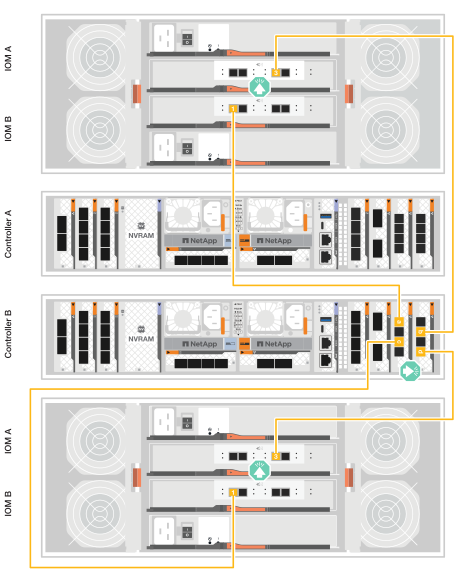

= Collegare la bulloneria - FAS70 e FAS90
:allow-uri-read: 
:icons: font
:imagesdir: ../media/

[role="lead"]
Dopo aver installato l'hardware rack per il sistema di storage FAS70 o FAS90, installare i cavi di rete per i controller e collegare i cavi tra i controller e gli shelf di storage.

.Prima di iniziare
Contattare l'amministratore di rete per informazioni sulla connessione del sistema di archiviazione agli switch.

.A proposito di questa attività
* Queste procedure mostrano le configurazioni comuni. Il cablaggio specifico dipende dai componenti ordinati per il sistema di storage in uso. Per informazioni dettagliate sulla configurazione e la priorità degli slot, vedere link:https://hwu.netapp.com["NetApp Hardware Universe"^].
* Gli slot i/o dei controller FAS70 e FAS90 sono numerati da 1 a 11.
+
image::../media/drw_a1K_back_slots_labeled_ieops-2162.svg[Numerazione degli slot sui controller FAS70 e FAS90]

* Le immagini dei cavi hanno icone a freccia che mostrano l'orientamento corretto (verso l'alto o verso il basso) della linguetta di estrazione del connettore del cavo quando si inserisce un connettore in una porta.
+
Quando si inserisce il connettore, si dovrebbe avvertire uno scatto in posizione; se non si sente uno scatto, rimuoverlo, capovolgere e riprovare.

+
image::../media/drw_cable_pull_tab_direction_ieops-1699.svg[Esempio di orientamento della linguetta di estrazione del cavo]

* Se si effettua il cablaggio a uno switch ottico, inserire il ricetrasmettitore ottico nella porta del controller prima di collegare il cavo alla porta dello switch.

== Fase 1: Collegare i controller di archiviazione alla rete

Collegare i controller al cluster ONTAP. Questa procedura varia in base al modello del sistema di storage in uso e alla configurazione del modulo i/O.

NOTE: Il traffico di cluster Interconnect e quello di ha condividono le stesse porte fisiche.

[role="tabbed-block"]
====
.Cablaggio cluster senza switch
--
Utilizzare il cavo di interconnessione Cluster/ha per collegare le porte da E1a a E1a e le porte da e7a a e7a.

.Fasi
. Collegare la porta E1a del controller A alla porta E1a del controller B.
. Collegare la porta e7a del controller A alla porta e7a del controller B.
+
*Cavi di interconnessione cluster/ha*

+
image::../media/oie_cable_25Gb_Ethernet_SFP28_IEOPS-1069.svg[Cavo ha del cluster]

+
image::../media/drw_a1k_tnsc_cluster_cabling_ieops-1648.svg[Schema di cablaggio del cluster senza switch a due nodi]

--
.Cablaggio del cluster con switch
--
Utilizzare il cavo 100 GbE per collegare le porte da E1a a E1a e le porte da e7a a e7a.

.Fasi
. Collegare la porta E1a sul controller A e la porta E1a sul controller B allo switch di rete del cluster A.
. Collegare la porta e7a sul controller A e la porta e7a sul controller B allo switch di rete del cluster B.
+
*Cavo 100 GbE*

+
image::../media/oie_cable100_gbe_qsfp28.png[Cavo da 100 GB]

+
image::../media/drw_a1k_switched_cluster_cabling_ieops-1652.svg[Connessioni cluster via cavo alla rete cluster]

--
====

== Fase 2: Collegare i cavi delle connessioni di rete host

Collegare le porte del modulo Ethernet alla rete host.

Di seguito sono riportati alcuni esempi tipici di cablaggio della rete host. Per informazioni sulla configurazione specifica del sistema, vedere link:https://hwu.netapp.com["NetApp Hardware Universe"^] .

.Fasi
. Collegare le porte e9a e e9b allo switch di rete dati Ethernet.
+

NOTE: Per ottenere le massime performance di sistema per il traffico cluster e ha, non utilizzare le porte e1b e e7b per le connessioni di rete host. Utilizzare una scheda host separata per ottimizzare le prestazioni.

+
*Cavo 100 GbE*

+
image::../media/oie_cable_sfp_gbe_copper.png[100GB cavo Ethernet]

+
image::../media/drw_a1k_network_cabling1_ieops-1649.svg[Cavo alla rete Ethernet 100GB]

. Collegare gli switch di rete host 10/25 GbE.
+
*4 porte, 10/25 GbE host*

+
image::../media/oie_cable_sfp_gbe_copper.png[Cavo Ethernet 10/25GB]

+
image::../media/drw_a1k_network_cabling2_ieops-1650.svg[Cavo alla rete Ethernet 10/25GB]

== Fase 3: Collegare i collegamenti della rete di gestione

Utilizzare i cavi 1000BASE-T RJ-45 per collegare le porte di gestione (chiave inglese) di ciascun controller agli switch di rete di gestione.

image::../media/oie_cable_rj45.png[Cavi RJ-45]

*CAVI RJ-45 1000BASE-T.

image::../media/drw_a1k_management_connection_ieops-1651.svg[Connettersi alla rete di gestione]

IMPORTANT: Non collegare ancora i cavi di alimentazione.

== Fase 4: Collegare i collegamenti dei ripiani

Le seguenti procedure di cablaggio mostrano come collegare i controller a uno shelf di archiviazione. Scegliere una delle seguenti opzioni di cablaggio che corrisponda alla propria configurazione.

Per il numero massimo di ripiani supportati per il sistema di storage e per tutte le opzioni di cablaggio, vedere link:https://hwu.netapp.com["NetApp Hardware Universe"^].

Per ulteriori istruzioni sul cablaggio degli shelf SAS, vedere link:https://docs.netapp.com/us-en/ontap-systems/sas3/install-cabling-rules.html["Regole e concetti di cablaggio SAS - shelf con moduli IOM12/IOM12B"].

.A proposito di questa attività
I sistemi di archiviazione FAS70 e FAS90 supportano gli scaffali DS212C, DS224C, DS460C e NS224 con il modulo NSM100 o NSM100B.

Le principali differenze tra i moduli NS224 sono:

* I moduli shelf NSM100 utilizzano le porte integrate e0a ed e0b.
* I moduli shelf NSM100B utilizzano le porte e1a ed e1b nello slot 1.

Il seguente esempio di cablaggio NS224 mostra i moduli NSM100 negli scaffali NS224 quando si fa riferimento alle porte dei moduli sugli scaffali.

[role="tabbed-block"]
====
.Opzione 1: Uno shelf storage NS224
--
Collegare ciascun controller ai moduli NSM sullo shelf NS224. La grafica mostra il cablaggio del controller A in blu e il cablaggio del controller B in giallo.

*Cavi in rame 100 GbE QSFP28*

image::../media/oie_cable100_gbe_qsfp28.png[Cavo in rame da 100 GbE QSFP28]

.Fasi
. Sul controller A, collegare le seguenti porte:
+
.. Collegare la porta e11a alla porta NSM A e0a.
.. Collegare la porta e11b alla porta NSM B e0b.
+
image:../media/drw_a1k_1shelf_cabling_a_ieops-1703.svg["Controller A e11a e e11b su un singolo shelf NS224"]

. Sul controller B, collegare le seguenti porte:
+
.. Collegare la porta e11a alla porta NSM B e0a.
.. Collegare la porta e11b alla porta NSM A e0b.

+
image:../media/drw_a1k_1shelf_cabling_b_ieops-1704.svg["Collegare le porte B del controller e11a e e11b a un singolo shelf NS224"]

--
.Opzione 2: Due shelf storage NS224
--
Collegare ciascun controller ai moduli NSM su entrambi i ripiani NS224. La grafica mostra il cablaggio del controller A in blu e il cablaggio del controller B in giallo.

*Cavi in rame 100 GbE QSFP28*

image::../media/oie_cable100_gbe_qsfp28.png[Cavo in rame da 100 GbE QSFP28]

.Fasi
. Sul controller A, collegare le seguenti porte:
+
.. Collegare la porta e11a alla porta e0a NSM A dello shelf 1.
.. Collegare la porta e11b alla porta NSM B e0b dello shelf 2.
.. Collegare la porta E10A alla porta e0a NSM A dello shelf 2.
.. Collegare la porta e10b alla porta e0b NSM A dello shelf 1.

+
image:../media/drw_a1k_2shelf_cabling_a_ieops-1705.svg["Collegare le porte e11a e11b E10A e e10b del controller A a due shelf NS224"]

. Sul controller B, collegare le seguenti porte:
+
.. Collegare la porta e11a alla porta NSM B e0a dello shelf 1.
.. Collegare la porta e11b alla porta e0b NSM A dello shelf 2.
.. Collegare la porta E10A alla porta NSM B e0a dello shelf 2.
.. Collegare la porta e10b alla porta e0b NSM A dello shelf 1.

+
image:../media/drw_a1k_2shelf_cabling_b_ieops-1706.svg["Collegare le porte e11a e11b E10A e e10b del controller B a due ripiani NS224"]

--
.Opzione 3: Due shelf DS460C
--
Collegare ciascun controller ai moduli IOM su entrambi i ripiani DS460C. La grafica mostra il cablaggio del controller A in blu e il cablaggio del controller B in giallo.

*Cavo mini-SAS HD*

image::../media/oie_cable_mini_sas_hd_to_mini_sas_hd.png[Cavo mini-SAS HD]

.Fasi
. Sul controller A, collegare i seguenti collegamenti:
+
.. Collegare la porta E10A alla porta 1 IOM A dello shelf 1.
.. Collegare la porta e10c alla porta 1 IOM A dello shelf 2
.. Collegare la porta e11b alla porta 3 IOM B dello shelf 1.
.. Collegare la porta e11d alla porta 3 IOM B dello shelf 2.

+
image:../media/drw_fas70-90_twoshelf_ds460c_cabling_controller1_ieops-1918.svg["Collegare le porte E10A e10c e e11b e e11d del controller a due shelf DS460C"]

. Sul controller B, collegare i seguenti collegamenti:
+
.. Collegare la porta E10A alla porta 1 IOM B dello shelf 1.
.. Collegare la porta e10c alla porta 1 IOM B dello shelf 2.
.. Collegare la porta e11b alla porta 3 IOM A dello shelf 1.
.. Collegare la porta e11d alla porta 3 IOM A dello shelf 2.

+

--
====
.Quali sono le prossime novità?
Dopo aver collegato l'hardware per il sistema FAS70 o FAS90, si link:install-power-hardware.html["Accendere il sistema di archiviazione FAS70 o FAS90"].
