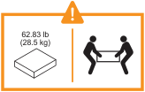
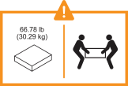

= Esamina i requisiti per l'installazione del tuo sistema storage FAS70 o FAS90
:allow-uri-read: 
:icons: font
:imagesdir: ../media/

[role="lead"]
Esaminare l'attrezzatura necessaria e le precauzioni di sollevamento per il sistema di storage FAS70 o FAS90 e i ripiani di stoccaggio.

[[equipment-needed-for-install]]
== Attrezzatura necessaria per l'installazione

Per installare il sistema di storage sono necessari i seguenti strumenti e attrezzature.

* Accesso a un browser Web per configurare il sistema di archiviazione
* Cinturino da scariche elettrostatiche (ESD)
* Torcia
* Computer portatile o console con connessione USB/seriale
* Cacciavite Phillips n. 2

[[lifting-precautions]]
== Precauzioni per il sollevamento

I sistemi e gli shelf di storage sono pesanti. Prestare attenzione durante il sollevamento e lo spostamento di questi elementi.

[[storage-system-weight]]
=== Peso del sistema di storage

Prendere le precauzioni necessarie durante lo spostamento o il sollevamento del sistema di stoccaggio.

Un sistema di stoccaggio FAS70 o FAS90 può pesare fino a 28,5 kg (62,83 lb). Per sollevare l'impianto, utilizzare due persone o un sollevatore idraulico.

[[shelf-weight]]
=== Peso del ripiano

Prendere le precauzioni necessarie quando si sposta o si solleva il ripiano.

Un ripiano NS224 può pesare fino a 30,29 kg (66,78 lb). Per sollevare il ripiano, utilizzare due persone o un sollevatore idraulico. Tenere tutti i componenti nel ripiano (anteriore e posteriore) per evitare di sbilanciare il peso del ripiano.

Un ripiano DS460C può pesare fino a 260,4 libbre (118,1 kg). Per sollevare il ripiano storage, potresti aver bisogno di fino a cinque persone o di un sollevatore idraulico. Tieni tutti i componenti all'interno del ripiano storage (sia davanti che dietro) per evitare di sbilanciare il peso del ripiano.

image::../media/drw_ds460c_weight_warning_ieops-1932.svg[DS460C attenzione al sollevamento]

.Informazioni correlate
* https://library.netapp.com/ecm/ecm_download_file/ECMP12475945["Informazioni sulla sicurezza e avvisi normativi"^]

.Quali sono le prossime novità?
Dopo aver esaminato i requisiti hardware, si link:install-prepare.html["Preparazione per l'installazione del sistema di storage FAS70 o FAS90"].
