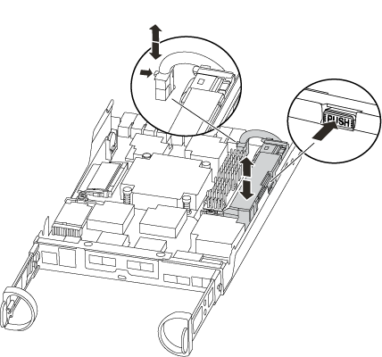
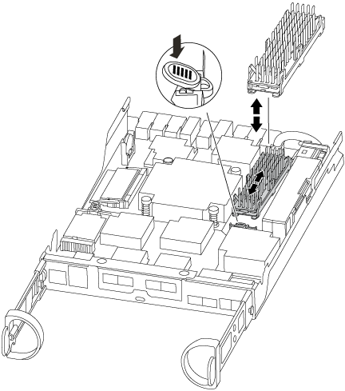

= Sostituire l'hardware del modulo controller - FAS2600
:allow-uri-read: 
:icons: font
:imagesdir: ../media/

[role="lead"]
Per sostituire il modulo controller, è necessario rimuovere il controller guasto, spostare i componenti FRU nel modulo controller sostitutivo, installare il modulo controller sostitutivo nel telaio e avviare il sistema in modalità manutenzione.

link:https://youtu.be/fF7G5uLxtPw["Video sulla sostituzione del controller AFF FAS2600"]

== Fase 1: Rimuovere il modulo controller

Per sostituire il modulo controller, è necessario prima rimuovere il vecchio modulo controller dal telaio.

.Fasi
. Se non si è già collegati a terra, mettere a terra l'utente.
. Allentare il gancio e la fascetta che fissano i cavi al dispositivo di gestione dei cavi, quindi scollegare i cavi di sistema e gli SFP (se necessario) dal modulo controller, tenendo traccia del punto in cui sono stati collegati i cavi.
+
Lasciare i cavi nel dispositivo di gestione dei cavi in modo che quando si reinstalla il dispositivo di gestione dei cavi, i cavi siano organizzati.

. Rimuovere e mettere da parte i dispositivi di gestione dei cavi dai lati sinistro e destro del modulo controller.
+
image::../media/drw_25xx_cable_management_arm.png[ARM di gestione dei cavi drw 25xx]

. Se i moduli SFP sono stati lasciati nel sistema dopo aver rimosso i cavi, spostarli nel nuovo modulo controller.
. Premere il dispositivo di chiusura sulla maniglia della camma fino al rilascio, aprire completamente la maniglia della camma per rilasciare il modulo controller dalla scheda intermedia, quindi estrarre il modulo controller dallo chassis con due mani.
+
image::../media/drw_2240_x_opening_cam_latch.png[drw 2240 x apertura del fermo a camma]

. Capovolgere il modulo controller e posizionarlo su una superficie piana e stabile.
. Aprire il coperchio facendo scorrere le linguette blu per sganciarlo, quindi ruotare il coperchio verso l'alto e aprirlo.
+
image::../media/drw_2600_opening_pcm_cover.png[drw 2600 apertura del coperchio del pcm]

== Fase 2: Spostare il supporto di avvio

Individuare il supporto di avvio e seguire le istruzioni per rimuoverlo dal vecchio modulo controller e inserirlo nel nuovo modulo controller.

.Fasi
. Individuare il supporto di avvio utilizzando la seguente illustrazione o la mappa FRU sul modulo controller:
+
image::../media/drw_2600_boot_media_repl_animated_gif.png[drw 2600 boot media repl animated gif]

. Premere il pulsante blu sull'alloggiamento del supporto di avvio per rilasciare il supporto di avvio dall'alloggiamento, quindi estrarlo delicatamente dalla presa del supporto di avvio.
+

NOTE: Non attorcigliare o tirare il supporto di avvio verso l'alto, in quanto potrebbe danneggiare la presa o il supporto di avvio.

. Spostare il supporto di avvio nel nuovo modulo controller, allineare i bordi del supporto di avvio con l'alloggiamento dello zoccolo, quindi spingerlo delicatamente nello zoccolo.
. Verificare che il supporto di avvio sia inserito correttamente e completamente nella presa.
+
Se necessario, rimuovere il supporto di avvio e reinserirlo nella presa.

. Premere il supporto di avvio verso il basso per inserire il pulsante di blocco sull'alloggiamento del supporto di avvio.

== Fase 3: Spostare la batteria NVMEM

Per spostare la batteria NVMEM dal vecchio modulo controller al nuovo modulo controller, è necessario eseguire una sequenza specifica di passaggi.

.Fasi
. Controllare il LED NVMEM:
+
** Se il sistema si trova in una configurazione ha, passare alla fase successiva.
** Se il sistema si trova in una configurazione standalone, spegnere completamente il modulo controller, quindi controllare il LED NVRAM identificato dall'icona NV.
+
image::../media/drw_hw_nvram_icon.png[icona nvram drw hw]

+

NOTE: Il LED NVRAM lampeggia durante il trasferimento dei contenuti nella memoria flash quando si arresta il sistema. Una volta completata la destage, il LED si spegne.

+
*** In caso di interruzione dell'alimentazione senza un arresto completo, il LED NVMEM lampeggia fino al completamento della destage, quindi il LED si spegne.
*** Se il LED è acceso e l'alimentazione è accesa, i dati non scritti vengono memorizzati su NVMEM.
+
Questo si verifica in genere durante un arresto non controllato dopo l'avvio di ONTAP.

. Individuare la batteria NVMEM nel modulo del controller.
+

. Individuare la spina della batteria e premere il fermaglio sulla parte anteriore della spina per sganciarla dalla presa, quindi scollegare il cavo della batteria dalla presa.
. Afferrare la batteria e premere la linguetta di bloccaggio blu contrassegnata CON PUSH, quindi estrarre la batteria dal supporto e dal modulo del controller.
. Spostare la batteria nel modulo controller sostitutivo.
. Far passare il cavo della batteria intorno alla canalina per cavi sul lato del supporto.
. Posizionare la batteria allineando le nervature della chiave del supporto della batteria alle tacche "`V`" sulla parete laterale in lamiera.
. Far scorrere la batteria verso il basso lungo la parete laterale in lamiera fino a quando le linguette di supporto sulla parete laterale non si agganciano agli slot della batteria e il dispositivo di chiusura della batteria si aggancia e scatta nell'apertura sulla parete laterale.

== Fase 4: Spostamento dei DIMM

Per spostare i DIMM, seguire le istruzioni per individuarli e spostarli dal vecchio modulo controller al modulo controller sostitutivo.

Il nuovo modulo controller deve essere pronto in modo da poter spostare i DIMM direttamente dal modulo controller guasto agli slot corrispondenti del modulo controller sostitutivo.

.Fasi
. Individuare i DIMM sul modulo controller.
. Prendere nota dell'orientamento del DIMM nello zoccolo in modo da poter inserire il DIMM nel modulo controller sostitutivo con l'orientamento corretto.
. Estrarre il modulo DIMM dal relativo slot spingendo lentamente verso l'esterno le due linguette di espulsione dei moduli DIMM su entrambi i lati del modulo, quindi estrarre il modulo DIMM dallo slot.
+

NOTE: Tenere il modulo DIMM per i bordi in modo da evitare di esercitare pressione sui componenti della scheda a circuiti stampati del modulo DIMM.

+
Il numero e la posizione dei DIMM di sistema dipendono dal modello del sistema.

+
La seguente illustrazione mostra la posizione dei DIMM di sistema:

+
image::../media/drw_2600_dimms.png[drw 2600 dimm]

. Ripetere questa procedura per rimuovere altri DIMM secondo necessità.
. Verificare che la batteria NVMEM non sia collegata al nuovo modulo controller.
. Individuare lo slot in cui si desidera installare il DIMM.
. Assicurarsi che le linguette di espulsione del modulo DIMM sul connettore siano aperte, quindi inserire il modulo DIMM correttamente nello slot.
+
Il DIMM si inserisce saldamente nello slot, ma dovrebbe essere inserito facilmente. In caso contrario, riallineare il DIMM con lo slot e reinserirlo.

+

NOTE: Esaminare visivamente il DIMM per verificare che sia allineato in modo uniforme e inserito completamente nello slot.

. Ripetere questa procedura per i DIMM rimanenti.
. Individuare la presa della spina della batteria NVMEM, quindi premere il fermaglio sulla parte anteriore della spina del cavo della batteria per inserirla nella presa.
+
Assicurarsi che la spina si blocchi sul modulo controller.

== Fase 5: Spostare il modulo di caching

Per spostare un modulo di caching denominato scheda M.2 PCIe sull'etichetta del controller, individuarlo e spostarlo dal vecchio controller al controller sostitutivo e seguire la sequenza di passaggi specifica.

Il nuovo modulo controller deve essere pronto in modo da poter spostare il modulo di caching direttamente dal vecchio modulo controller allo slot corrispondente del nuovo. Tutti gli altri componenti del sistema di storage devono funzionare correttamente; in caso contrario, contattare il supporto tecnico.

.Fasi
. Individuare il modulo di caching sul retro del modulo controller e rimuoverlo.
+
.. Premere la linguetta di rilascio.
.. Rimuovere il dissipatore di calore.

+

. Estrarre delicatamente il modulo di caching dall'alloggiamento.
. Spostare il modulo di caching nel nuovo modulo controller, quindi allineare i bordi del modulo di caching con l'alloggiamento dello zoccolo e spingerlo delicatamente nello zoccolo.
. Verificare che il modulo di caching sia posizionato correttamente e completamente nel socket.
+
Se necessario, rimuovere il modulo di caching e reinserirlo nel socket.

. Riposizionare e spingere il dissipatore di calore verso il basso per inserire il pulsante di blocco sull'alloggiamento del modulo di caching.
. Chiudere il coperchio del modulo controller, se necessario.

== Fase 6: Installare il controller

Dopo aver installato i componenti del vecchio modulo controller nel nuovo modulo controller, è necessario installare il nuovo modulo controller nel telaio del sistema e avviare il sistema operativo.

Per le coppie ha con due moduli controller nello stesso chassis, la sequenza in cui si installa il modulo controller è particolarmente importante perché tenta di riavviarsi non appena lo si installa completamente nello chassis.

NOTE: Il sistema potrebbe aggiornare il firmware di sistema all'avvio. Non interrompere questo processo. La procedura richiede di interrompere il processo di avvio, che in genere può essere eseguito in qualsiasi momento dopo la richiesta. Tuttavia, se il sistema aggiorna il firmware del sistema all'avvio, è necessario attendere il completamento dell'aggiornamento prima di interrompere il processo di avvio.

.Fasi
. Se non si è già collegati a terra, mettere a terra l'utente.
. Se non è già stato fatto, riposizionare il coperchio sul modulo controller.
. Allineare l'estremità del modulo controller con l'apertura dello chassis, quindi spingere delicatamente il modulo controller a metà nel sistema.
+

NOTE: Non inserire completamente il modulo controller nel telaio fino a quando non viene richiesto.

. Cablare solo le porte di gestione e console, in modo da poter accedere al sistema per eseguire le attività descritte nelle sezioni seguenti.
+

NOTE: I cavi rimanenti verranno collegati al modulo controller più avanti in questa procedura.

. Completare la reinstallazione del modulo controller:
+
[cols="1,2"]
|===
| Se il sistema è in... | Quindi, eseguire questa procedura... 

 a| 
Una coppia ha
 a| 
Il modulo controller inizia ad avviarsi non appena viene inserito completamente nello chassis. Prepararsi ad interrompere il processo di avvio.

.. Con la maniglia della camma in posizione aperta, spingere con decisione il modulo controller fino a quando non raggiunge la scheda intermedia e non è completamente inserito, quindi chiudere la maniglia della camma in posizione di blocco.
+

NOTE: Non esercitare una forza eccessiva quando si fa scorrere il modulo controller nel telaio per evitare di danneggiare i connettori.

+
Il controller inizia ad avviarsi non appena viene inserito nello chassis.

.. Se non è già stato fatto, reinstallare il dispositivo di gestione dei cavi.
.. Collegare i cavi al dispositivo di gestione dei cavi con il gancio e la fascetta.
.. Quando viene visualizzato il messaggio `Press Ctrl-C for Boot Menu`, premere `Ctrl-C` per interrompere il processo di avvio.
+

NOTE: Se il prompt non viene visualizzato e il modulo controller viene avviato in ONTAP, immettere `halt`, Quindi, al prompt DEL CARICATORE, immettere `boot_ontap`, premere `Ctrl-C` Quando richiesto, quindi avviare in modalità manutenzione.

.. Selezionare l'opzione per avviare la modalità di manutenzione dal menu visualizzato.

 a| 
Una configurazione standalone
 a| 
.. Con la maniglia della camma in posizione aperta, spingere con decisione il modulo controller fino a quando non raggiunge la scheda intermedia e non è completamente inserito, quindi chiudere la maniglia della camma in posizione di blocco.
+

NOTE: Non esercitare una forza eccessiva quando si fa scorrere il modulo controller nel telaio per evitare di danneggiare i connettori.

.. Se non è già stato fatto, reinstallare il dispositivo di gestione dei cavi.
.. Collegare i cavi al dispositivo di gestione dei cavi con il gancio e la fascetta.
.. Ricollegare i cavi di alimentazione agli alimentatori e alle fonti di alimentazione, accendere l'alimentazione per avviare il processo di avvio, quindi premere `Ctrl-C` dopo aver visualizzato `Press Ctrl-C for Boot Menu` messaggio.
+

NOTE: Se il prompt non viene visualizzato e il modulo controller viene avviato in ONTAP, immettere `halt`, Quindi, al prompt DEL CARICATORE, immettere `boot_ontap`, premere `Ctrl-C` Quando richiesto, quindi avviare in modalità manutenzione.

.. Dal menu di avvio, selezionare l'opzione per la modalità di manutenzione.

|===
+
*Importante:* durante il processo di avvio, potrebbero essere visualizzate le seguenti istruzioni:

+
** Viene visualizzato un messaggio di avviso che indica una mancata corrispondenza dell'ID di sistema e chiede di ignorare l'ID di sistema.
** Un avviso che avvisa che quando si accede alla modalità di manutenzione in una configurazione ha, è necessario assicurarsi che il controller integro rimanga inattivo. Puoi rispondere in tutta sicurezza `y` a questi prompt.

