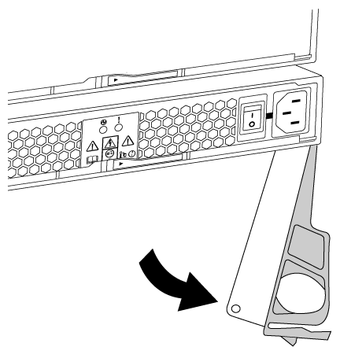

= Sostituisci a caldo un alimentatore nel sistema FAS2600
:allow-uri-read: 
:icons: font
:imagesdir: ../media/

[role="lead"]
Sostituisci a caldo un alimentatore nel tuo sistema FAS2600 spegnendo, scollegando e rimuovendo il vecchio alimentatore, poi installando, collegando e accendendo il nuovo alimentatore.

Se altri componenti del sistema non funzionano correttamente, contatta il supporto tecnico.

* Gli alimentatori sono ridondanti e sostituibili a caldo.
* Questa procedura è stata scritta per la sostituzione di un alimentatore alla volta.
+

NOTE: Il sistema di raffreddamento è integrato con l'alimentatore, quindi devi sostituire l'alimentatore entro due minuti dalla rimozione per evitare il surriscaldamento dovuto alla riduzione del flusso d'aria. Poiché lo chassis offre una configurazione di raffreddamento condivisa per i due nodi HA, un ritardo superiore a due minuti spegne tutti i moduli controller nello chassis. Se entrambi i moduli controller si spengono, assicurati che entrambi gli alimentatori siano inseriti, spegnili entrambi per 30 secondi e poi riaccendili.

* Il numero di alimentatori nel sistema dipende dal modello.
* Gli alimentatori sono a portata automatica.

link:https://youtu.be/1xWZfXpXMNE["Video sulla sostituzione dell'alimentatore AFF FAS2600"^]

. Identificare l'alimentatore che si desidera sostituire, in base ai messaggi di errore della console o tramite i LED degli alimentatori.
. Se non si è già collegati a terra, mettere a terra l'utente.
. Spegnere l'alimentatore e scollegare i cavi di alimentazione:
+
.. Spegnere l'interruttore di alimentazione dell'alimentatore.
.. Aprire il fermo del cavo di alimentazione, quindi scollegare il cavo di alimentazione dall'alimentatore.
.. Scollegare il cavo di alimentazione dalla fonte di alimentazione.

. Premere il fermo sulla maniglia della camma dell'alimentatore, quindi aprire la maniglia della camma per rilasciare completamente l'alimentatore dal piano intermedio.
+

. Utilizzare la maniglia della camma per estrarre l'alimentatore dal sistema.
+

CAUTION: Quando si rimuove un alimentatore, utilizzare sempre due mani per sostenerne il peso.

. Assicurarsi che l'interruttore on/off del nuovo alimentatore sia in posizione off.
. Con entrambe le mani, sostenere e allineare i bordi dell'alimentatore con l'apertura nello chassis del sistema, quindi spingere delicatamente l'alimentatore nello chassis utilizzando la maniglia della camma.
+
Gli alimentatori sono dotati di chiavi e possono essere installati in un solo modo.

+

NOTE: Non esercitare una forza eccessiva quando si inserisce l'alimentatore nel sistema. Il connettore potrebbe danneggiarsi.

. Chiudere la maniglia della camma in modo che il fermo scatti in posizione di blocco e l'alimentatore sia inserito completamente.
. Ricollegare il cablaggio dell'alimentatore:
+
.. Ricollegare il cavo di alimentazione all'alimentatore e alla fonte di alimentazione.
.. Fissare il cavo di alimentazione all'alimentatore utilizzando il fermo del cavo di alimentazione.

+
Dopo che l'alimentazione è stata ripristinata all'alimentatore, il LED di stato dovrebbe essere verde.

. Accendere il nuovo alimentatore, quindi verificare il funzionamento dei LED di attività dell'alimentatore.
+
I LED dell'alimentatore sono accesi quando l'alimentatore è in linea.

. Restituire la parte guasta a NetApp, come descritto nelle istruzioni RMA fornite con il kit. Vedere la https://mysupport.netapp.com/site/info/rma["Restituzione e sostituzione delle parti"^] pagina per ulteriori informazioni.

