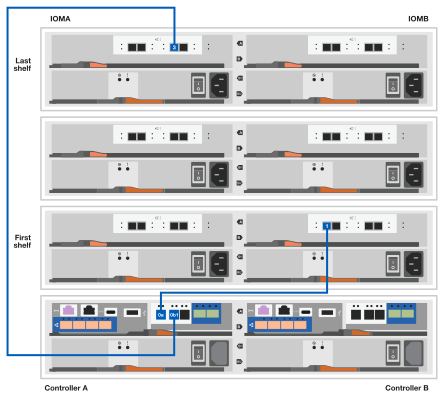

= Fasi dettagliate - FAS2800
:allow-uri-read: 
:icons: font
:imagesdir: ../media/

[role="lead"]
Questa procedura fornisce istruzioni dettagliate per l'installazione di un tipico sistema di storage NetApp. Utilizzare questa procedura se si desidera ottenere istruzioni di installazione più dettagliate.

== Fase 1: Preparazione per l'installazione

.Prima di iniziare
Devi fornire quanto segue presso la tua sede:

* Spazio rack per il sistema di archiviazione in un rack per telecomunicazioni o in un cabinet di sistema.
+
** 2U per il sistema di storage
** 2U o 4U per ogni shelf di dischi del sistema

* Cacciavite Phillips n. 2
* Cavi di rete aggiuntivi per collegare il sistema di storage allo switch di rete e al portatile o alla console con un browser Web
* Computer portatile o console con connessione RJ-45 e accesso a un browser Web
+
** Accesso a https://hwu.netapp.com["NetApp Hardware Universe"] per informazioni sui requisiti del sito e ulteriori informazioni sul sistema di archiviazione configurato.
** È possibile anche avere accesso a http://mysupport.netapp.com/documentation/productlibrary/index.html?productID=62286["Note di rilascio per la versione di ONTAP 9 in uso"] Per la versione di ONTAP in uso per ulteriori informazioni su questo sistema di storage.

.Fasi
. Disimballare tutte le confezioni e fare l'inventario del contenuto.
+

IMPORTANT: I clienti con requisiti di alimentazione specifici devono verificare https://hwu.netapp.com["NetApp Hardware Universe"] per le relative opzioni di configurazione.

. Accedere a. https://docs.netapp.com/us-en/ontap/task_configure_ontap.html#assign-a-node-management-ip-address["Configurare ONTAP su un nuovo cluster con Gestione di sistema"^]
+
.. Rivedere i requisiti della procedura amd.
.. Raccogliere informazioni sul proprio sistema di storage completando la https://docs.netapp.com/us-en/ontap/task_configure_ontap.html["Foglio di lavoro di installazione^ (è necessario l'URL del foglio di lavoro)"].
.. Registrare il numero di serie del sistema storage dalle unità di controllo.
+
image::../media/drw_ssn_label.svg[Esempio del numero di serie del sistema che mostra la posizione del numero]

La seguente tabella identifica i tipi di cavi che potrebbero essere ricevuti. Se si riceve un cavo non elencato nella tabella, consultare https://hwu.netapp.com["NetApp Hardware Universe"] individuare il cavo e identificarne l'utilizzo.

[cols="1,2,1,2"]
|===
| Tipo di cavo... | Codice e lunghezza del ricambio | Tipo di connettore | Per... 

 a| 
10 GbE, cavo SFP28 (in base all'ordine)
 a| 
X6566B-05-R6, .5,

X6566B-2-R6, 2 m
 a| 
image::../media/oie_cable_sfp_gbe_copper.svg[cavo oie sfp gbe rame]
 a| 
Cavo di rete

 a| 
Ethernet da 25 GB, SFP28
 a| 
X66240A-05, 0,5 m.

X66240-2, 2 m

X66240A-5, 5 m.
 a| 
image::../media/oie_cable_25Gb_Ethernet_SFP28_IEOPS-1069.svg[Cavo oie 25GB Ethernet SFP28 IEOPS 1069]
 a| 
Cavo di rete

 a| 
Fibre Channel da 32 GB,
SFP+ (destinazione/iniziatore)
 a| 
X66250-2, 2 m

X66250-5, 5 m.

X66250-15, 15 m.
 a| 
image::../media/oie_cable_sfp_gbe_copper.svg[cavo oie sfp gbe rame]
 a| 
Rete FC

 a| 
Cat 6, RJ-45 (in base all'ordine)
 a| 
X6561-R6

X6562-R6
 a| 
image::../media/oie_cable_rj45.svg[cavo oie rj45]
 a| 
Rete di gestione e dati Ethernet

 a| 
Storage
 a| 
X66030A, 0,5 m

X66031A, 1 m.

X66032A, 2 m
 a| 
image::../media/oie_cable_mini_sas_hd_to_mini_sas_hd.svg[cavo oie da mini sas hd a mini sas hd]
 a| 
Storage

 a| 
Cavo console USB-C.
 a| 
Nessuna etichetta con il numero di parte
 a| 
image::../media/oie_cable_micro_usb.svg[cavo oie micro usb]
 a| 
Connessione della console durante la configurazione del software su computer portatili/console non Windows o Mac

 a| 
Cavi di alimentazione
 a| 
Nessuna etichetta con il numero di parte
 a| 
image::../media/oie_cable_power.svg[cavo di alimentazione dell'oie]
 a| 
Accensione del sistema storage

 a| 
Cavo FC opzionale
 a| 
Cavo FC opzionale
 a| 
image::../media/oie_cable_fiber_lc_connector.svg[connettore lc in fibra ottica per cavo oie]
 a| 
Cavo di rete FC aggiuntivo

|===

== Fase 2: Installare l'hardware

Installare il sistema di storage in un rack per telecomunicazioni o in un cabinet del sistema di storage NetApp, a seconda dei casi.

.Fasi
. Installare i kit di guide, secondo necessità.
. Installare e fissare il sistema di archiviazione attenendosi alle istruzioni fornite con il kit guide.
+

NOTE: È necessario essere consapevoli dei problemi di sicurezza associati al peso del sistema di stoccaggio.

+
image::../media/oie_fas2800_weight_caution_IEOPS-1070.svg[Avvertenza peso oie fas2800 IEOPS 1070]

. Collegare i dispositivi di gestione dei cavi (come illustrato).
+
image::../media/drw_cable_management_arm_install.svg[installazione di ARM per la gestione dei cavi drw]

. Posizionare il frontalino sulla parte anteriore del sistema di archiviazione.

== Fase 3: Collegare i controller alla rete

Collegare i controller alla rete come cluster senza switch a due nodi o come cluster con switch.

La tabella seguente identifica il tipo di cavo con il numero di didascalia e il colore del cavo nelle illustrazioni sia per il cluster senza switch a due nodi che per il cluster con switch.

[cols="20%,80%"]
|===
| Cablaggio | Tipo di connessione 

 a| 
image::../media/oie_legend_icon_1_lg.svg[icona legenda oie 1 lg]
 a| 
Interconnessione del cluster

 a| 
image::../media/oie_legend_icon_2_lp.svg[icona legenda oie 2 lp]
 a| 
Switch di rete di gestione

 a| 
image::../media/oie_legend_icon_3_o.svg[icona legenda oie 3 o]
 a| 
Switch di rete host

|===
.Prima di iniziare
* Contattare l'amministratore di rete per informazioni sulla connessione del sistema di archiviazione agli switch.
* Verificare l'orientamento corretto della linguetta di estrazione del connettore del cavo nella freccia dell'illustrazione.
+
** Quando si inserisce il connettore, si dovrebbe avvertire uno scatto in posizione; se non si sente uno scatto, rimuoverlo, capovolgere la testa del cavo e riprovare.
** Se si effettua il collegamento a uno switch ottico, inserire il modulo SFP nella porta del controller prima di collegarlo alla porta.

image::../media/oie_cable_pull_tab_down.svg[linguetta di estrazione del cavo oie verso il basso]

[role="tabbed-block"]
====
.Opzione 1: Collegare un cluster senza switch a due nodi
--
Collegare le connessioni di rete e le porte di interconnessione del cluster per un cluster senza switch a due nodi.

.A proposito di questa attività
Utilizzare l'animazione o le istruzioni dettagliate per completare il cablaggio tra le centraline e gli interruttori.

.Animazione - cablaggio di un cluster senza switch a due nodi
video::90577508-fa79-46cf-b18a-afe8016325af[panopto]
.Fasi
. Collegare le porte di interconnessione del cluster da e0a e0a e da e0b a e0b con il cavo di interconnessione del cluster:
+
image::../media/oie_cable_25Gb_Ethernet_SFP28_IEOPS-1069.svg[Cavo oie 25GB Ethernet SFP28 IEOPS 1069]

+
*Cavi di interconnessione cluster*

+
image::../media/drw_2800_tnsc_cluster_cabling_IEOPS-892.svg[Drw 2800 tnsc - cablaggio cluster IEOPS 892]

. Collegare le porte e0M agli switch della rete di gestione con i cavi RJ45:
+
image::../media/oie_cable_rj45.svg[cavo oie rj45]

+
*Cavi RJ45*

+
image::../media/drw_2800_management_connection_IEOPS-1077.svg[Connessione di gestione drw 2800 IEOPS 1077]

. Collegare le porte della scheda mezzanine alla rete host.
+
image::../media/drw_2800_network_cabling_IEOPS-894.svg[Cablaggio di rete drw 2800 IEOPS 894]

+
.. Se si dispone di una rete dati Ethernet a 4 porte, collegare le porte e1a tramite e1d alla rete dati Ethernet.
+
*** 4 porte, Ethernet 10 GB, SFP28
+
image::../media/oie_cable_sfp_gbe_copper.svg[cavo oie sfp gbe rame]

+
image::../media/oie_cable_25Gb_Ethernet_SFP28_IEOPS-1069.svg[Cavo oie 25GB Ethernet SFP28 IEOPS 1069]

*** 4 PORTE, 10GBASE-T, RJ45
+
image::../media/oie_cable_rj45.svg[cavo oie rj45]

.. Se si dispone di una rete dati Fibre Channel a 4 porte, collegare le porte da 1a a 1d per la rete FC.
+
*** 4 porte, 32 GB Fibre Channel, SFP+ (solo destinazione)
+
image::../media/oie_cable_sfp_gbe_copper.svg[cavo oie sfp gbe rame]

*** 4 porte, 32 GB Fibre Channel, SFP+ (iniziatore/destinazione)
+
image::../media/oie_cable_sfp_gbe_copper.svg[cavo oie sfp gbe rame]

.. Se si dispone di una scheda 2+2 (2 porte con connessioni Ethernet e 2 porte con connessioni Fibre Channel), collegare le porte e1a e e1b alla rete dati FC e le porte e1c e e1d alla rete dati Ethernet.
+
*** 2 porte, 10 GB Ethernet (SFP28) + 2 porte 32 GB FC (SFP+)
+
image::../media/oie_cable_sfp_gbe_copper.svg[cavo oie sfp gbe rame]

+
image::../media/oie_cable_sfp_gbe_copper.svg[cavo oie sfp gbe rame]

IMPORTANT: NON collegare i cavi di alimentazione.

--
.Opzione 2: Cavo a del cluster con switch
--
Collegare le connessioni di rete e le porte di interconnessione del cluster per un cluster con switch.

.A proposito di questa attività
Utilizzare l'animazione o le istruzioni dettagliate per completare il cablaggio tra le centraline e gli interruttori.

.Animazione - cablaggio del cluster con switch
video::6553a3db-57dd-4247-b34a-afe8016315d4[panopto]
.Fasi
. Collegare le porte di interconnessione del cluster da e0a e0a e da e0b a e0b con il cavo di interconnessione del cluster:
+
image::../media/oie_cable_25Gb_Ethernet_SFP28_IEOPS-1069.svg[Cavo oie 25GB Ethernet SFP28 IEOPS 1069]

+
image::../media/drw_2800_switched_cluster_cabling_IEOPS-893.svg[Drw 2800 cablaggio cluster commutato IEOPS 893]

. Collegare le porte e0M agli switch della rete di gestione con i cavi RJ45:
+
image::../media/oie_cable_rj45.svg[cavo oie rj45]

+
image::../media/drw_2800_management_connection_IEOPS-1077.svg[Connessione di gestione drw 2800 IEOPS 1077]

. Collegare le porte della scheda mezzanine alla rete host.
+
image::../media/drw_2800_network_cabling_IEOPS-894.svg[Cablaggio di rete drw 2800 IEOPS 894]

+
.. Se si dispone di una rete dati Ethernet a 4 porte, collegare le porte e1a tramite e1d alla rete dati Ethernet.
+
*** 4 porte, Ethernet 10 GB, SFP28
+
image::../media/oie_cable_sfp_gbe_copper.svg[cavo oie sfp gbe rame]

+
image::../media/oie_cable_25Gb_Ethernet_SFP28_IEOPS-1069.svg[Cavo oie 25GB Ethernet SFP28 IEOPS 1069]

*** 4 PORTE, 10GBASE-T, RJ45
+
image::../media/oie_cable_rj45.svg[cavo oie rj45]

.. Se si dispone di una rete dati Fibre Channel a 4 porte, collegare le porte da 1a a 1d per la rete FC.
+
*** 4 porte, 32 GB Fibre Channel, SFP+ (solo destinazione)
+
image::../media/oie_cable_sfp_gbe_copper.svg[cavo oie sfp gbe rame]

*** 4 porte, 32 GB Fibre Channel, SFP+ (iniziatore/destinazione)
+
image::../media/oie_cable_sfp_gbe_copper.svg[cavo oie sfp gbe rame]

.. Se si dispone di una scheda 2+2 (2 porte con connessioni Ethernet e 2 porte con connessioni Fibre Channel), collegare le porte e1a e e1b alla rete dati FC e le porte e1c e e1d alla rete dati Ethernet.
+
*** 2 porte, 10 GB Ethernet (SFP28) + 2 porte 32 GB FC (SFP+)
+
image::../media/oie_cable_sfp_gbe_copper.svg[cavo oie sfp gbe rame]

+
image::../media/oie_cable_sfp_gbe_copper.svg[cavo oie sfp gbe rame]

IMPORTANT: NON collegare i cavi di alimentazione.

--
====

== Fase 4: Collegare i controller dei cavi agli shelf di dischi

Collegare i controller allo storage esterno.

La tabella seguente identifica il tipo di cavo con il numero di didascalia e il colore del cavo nelle illustrazioni per il cablaggio degli shelf di dischi al sistema di storage.

NOTE: L'esempio utilizza DS224C. Il cablaggio è simile agli altri shelf di dischi supportati. Per ulteriori informazioni, vedere link:../sas3/install-new-system.html["Installazione e shelf per l'installazione di un nuovo sistema - shelf con moduli IOM12/IOM12B"] .

[cols="20%,80%"]
|===
| Cablaggio | Tipo di connessione 

 a| 
image::../media/oie_legend_icon_1_lo.svg[icona legenda oie 1 lo]
 a| 
Cablaggio da shelf a shelf

 a| 
image::../media/oie_legend_icon_2_mb.svg[icona legenda oie 2 mb]
 a| 
Dal controller A agli shelf di dischi

 a| 
image::../media/oie_legend_icon_3_t.svg[icona legenda oie 3 t]
 a| 
Dal controller B agli shelf di dischi

|===
Verificare che la freccia dell'illustrazione sia orientata correttamente con la linguetta di estrazione del connettore del cavo.

image::../media/oie_cable_pull_tab_down.svg[linguetta di estrazione del cavo oie verso il basso]

.A proposito di questa attività
Utilizzare l'animazione o le istruzioni dettagliate per completare il cablaggio tra i controller e i ripiani delle unità.

IMPORTANT: Non utilizzare la porta 0b2 su FAS2800. Questa porta SAS non viene utilizzata da ONTAP ed è sempre disattivata. Per ulteriori informazioni, vedere link:../sas3/install-new-system.html["Installare uno shelf in un nuovo sistema storage"^] .

.Animazione - cablaggio dello shelf del disco
video::b2a7549d-8141-47dc-9e20-afe8016f4386[panopto]
.Fasi
. Cablare le porte shelf-to-shelf.
+
.. Dalla porta 1 su IOM A alla porta 3 sull'IOM A sullo shelf direttamente sotto.
.. Porta 1 su IOM B alla porta 3 sull'IOM B sullo shelf direttamente sotto.
+
image::../media/oie_cable_mini_sas_hd_to_mini_sas_hd.svg[cavo oie da mini sas hd a mini sas hd]

+
*Cavi da mini-SAS HD a mini-SAS HD*

+
image::../media/drw_2800_shelf-to-shelf_cabling_IEOPS-895.svg[Cablaggio da shelf a shelf drw 2800 IEOPS 895]

. Collegare il controller a agli shelf di dischi.
+
.. Porta del controller A da 0a a IOM B porta 1 sul primo shelf di dischi nello stack.
.. Controller A port 0b1 to IOM A port 3 on the last drive shelf in the stack.
+
image::../media/oie_cable_mini_sas_hd_to_mini_sas_hd.svg[cavo oie da mini sas hd a mini sas hd]

+
*Cavi da mini-SAS HD a mini-SAS HD*

+

. Collegare il controller B agli shelf di dischi.
+
.. Porta del controller B 0a alla porta IOM A 1 sul primo shelf di dischi nello stack.
.. Dalla porta del controller B 0b1 alla porta IOM B 3 sull'ultimo shelf di dischi nello stack.
+
image::../media/oie_cable_mini_sas_hd_to_mini_sas_hd.svg[cavo oie da mini sas hd a mini sas hd]

+
*Cavi da mini-SAS HD a mini-SAS HD*

+
image::../media/dwr-2800_controller2-to shelves_IEOPS-897.svg[dwr 2800 controller2 a shelf IEOPS 897]

== Fase 5: Completare la configurazione e la configurazione del sistema di archiviazione

Completare l'installazione e la configurazione del sistema di storage utilizzando l'opzione 1: Se la funzione di rilevamento della rete è attivata o l'opzione 2: Se la funzione di rilevamento della rete non è attivata.

[role="tabbed-block"]
====
.Opzione 1: Se la funzione di rilevamento della rete è attivata
--
Se sul portatile è abilitata la funzione di rilevamento della rete, completare la configurazione e la configurazione del sistema storage utilizzando la funzione di rilevamento automatico del cluster.

.Fasi
. Utilizzare l'animazione seguente per attivare l'alimentazione degli scaffali e impostare gli ID degli scaffali.
+
.Animazione - impostazione degli ID dello shelf di dischi
video::c600f366-4d30-481a-89d9-ab1b0066589b[panopto]
. Accendere i controller
+
.. Collegare i cavi di alimentazione agli alimentatori del controller, quindi collegarli a fonti di alimentazione su diversi circuiti.
.. Accendere gli interruttori di alimentazione su entrambi i nodi.
+

NOTE: L'avvio iniziale può richiedere fino a otto minuti.

+
image::../media/dwr_2800_turn_on_power_IEOPS-898.svg[dwr 2800 accendere l'alimentazione IEOPS 898]

. Assicurarsi che il rilevamento della rete sia attivato sul laptop.
+
Per ulteriori informazioni, consultare la guida in linea del portatile.

. Collegare il laptop allo switch di gestione.
. Utilizza l'immagine o le procedure per rilevare il nodo del sistema storage da configurare:
+
image::../media/drw_autodiscovery_controler_select.svg[selezione del controllo di rilevamento automatico drw]

+
.. Aprire file Explorer.
.. Fare clic su Network (rete) nel riquadro sinistro.
.. Fare clic con il pulsante destro del mouse e selezionare Aggiorna.
.. Fare doppio clic sull'icona ONTAP e accettare i certificati visualizzati sullo schermo.
+

NOTE: XXXXX è il numero di serie del sistema storage per il nodo di destinazione.

+
Viene visualizzato Gestione sistema.

. Utilizzare la configurazione guidata di System Manager per configurare il sistema storage utilizzando i dati raccolti in <<Fase 1: Preparazione per l'installazione>>.
. Crea un account o accedi al tuo account.
+
.. Fare clic su https://mysupport.netapp.com["mysupport.netapp.com"]
.. Fai clic su _Crea account_ se devi creare un account o accedere al tuo account.

. Scaricare e installare https://mysupport.netapp.com/site/tools["Active IQ Config Advisor"]
+
.. Verifica dello stato di salute del tuo sistema storage eseguendo Active IQ Config Advisor.

. Registrare il sistema all'indirizzo https://mysupport.netapp.com/site/systems/register[].
. Una volta completata la configurazione iniziale, passare alla https://www.netapp.com/support-and-training/documentation/["Risorse NetApp ONTAP"] Pagina per informazioni sulla configurazione di funzioni aggiuntive in ONTAP.

--
.Opzione 2: Se il rilevamento di rete non è attivato
--
Se il rilevamento della rete non è abilitato sul laptop, completare manualmente la configurazione e la configurazione.

.Fasi
. Cablare e configurare il laptop o la console:
+
.. Impostare la porta della console del portatile o della console su 115,200 baud con N-8-1.
+

NOTE: Per informazioni su come configurare la porta della console, consultare la guida in linea del portatile o della console.

.. Collegare il cavo della console al computer portatile o alla console e collegare la porta della console sul controller utilizzando il cavo della console fornito con il sistema di archiviazione, quindi collegare il computer portatile o la console allo switch sulla subnet di gestione.
+
image::../media/drw_2800_laptop_to_switch_to_controller_IEOPS-1084.svg[Drw 2800 laptop per passare al controller IEOPS 1084]

.. Assegnare un indirizzo TCP/IP al portatile o alla console, utilizzando un indirizzo presente nella subnet di gestione.

. Utilizzare la seguente animazione per impostare uno o più ID shelf di dischi:
+
.Animazione - impostazione degli ID dello shelf di dischi
video::c600f366-4d30-481a-89d9-ab1b0066589b[panopto]
. Collegare i cavi di alimentazione agli alimentatori del controller, quindi collegarli a fonti di alimentazione su diversi circuiti.
. Accendere gli interruttori di alimentazione su entrambi i nodi.
+
image::../media/dwr_2800_turn_on_power_IEOPS-898.svg[dwr 2800 accendere l'alimentazione IEOPS 898]

+

NOTE: L'avvio iniziale può richiedere fino a otto minuti.

. Assegnare un indirizzo IP di gestione del nodo iniziale a uno dei nodi.
+
[cols="20%,80%"]
|===
| Se la rete di gestione dispone di DHCP... | Quindi... 

 a| 
Configurato
 a| 
Registrare l'indirizzo IP assegnato ai nuovi controller.

 a| 
Non configurato
 a| 
.. Aprire una sessione della console utilizzando putty, un server terminal o un server equivalente per l'ambiente in uso.
+

NOTE: Se non si sa come configurare PuTTY, consultare la guida in linea del portatile o della console.

.. Inserire l'indirizzo IP di gestione quando richiesto dallo script.

|===
. Utilizzando System Manager sul laptop o sulla console, configurare il cluster:
+
.. Puntare il browser sull'indirizzo IP di gestione del nodo.
+

NOTE: Il formato dell'indirizzo è +https://x.x.x.x.+

.. Configurare il sistema di archiviazione utilizzando i dati raccolti in <<Fase 1: Preparazione per l'installazione>>..

. Crea un account o accedi al tuo account.
+
.. Fare clic su https://mysupport.netapp.com["mysupport.netapp.com"]
.. Fai clic su _Crea account_ se devi creare un account o accedere al tuo account.

. Scaricare e installare https://mysupport.netapp.com/site/tools["Active IQ Config Advisor"]
+
.. Verifica dello stato di salute del tuo sistema storage eseguendo Active IQ Config Advisor.

. Registrare il sistema all'indirizzo https://mysupport.netapp.com/site/systems/register[].
. Una volta completata la configurazione iniziale, passare alla https://www.netapp.com/support-and-training/documentation/["Risorse NetApp ONTAP"] Pagina per informazioni sulla configurazione di funzioni aggiuntive in ONTAP.

--
====