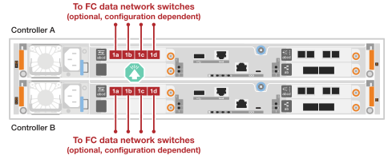

= Collegare la bulloneria - FAS50
:allow-uri-read: 
:icons: font
:imagesdir: ../media/

[role="lead"]
Dopo aver installato l'hardware del sistema di storage FAS50, collegare i controller alla rete e agli shelf.

.Prima di iniziare
Contattare l'amministratore di rete per informazioni sulla connessione del sistema di archiviazione agli switch di rete.

.A proposito di questa attività
* Le procedure di cablaggio cluster/ha e rete host mostrano le configurazioni comuni.
+
Se la configurazione non viene visualizzata qui, visitare il sito Web link:https://hwu.netapp.com["NetApp Hardware Universe"^] per informazioni complete sulla configurazione e sulla priorità degli slot per collegare il sistema di storage.

* Le immagini dei cavi hanno icone a freccia che mostrano l'orientamento corretto (verso l'alto o verso il basso) della linguetta di estrazione del connettore del cavo quando si inserisce un connettore in una porta.
+
Quando si inserisce il connettore, si dovrebbe avvertire uno scatto in posizione; se non si sente uno scatto, rimuoverlo, capovolgere e riprovare.

+
image:../media/drw_cable_pull_tab_direction_ieops-1699.svg["Direzione della linguetta di estrazione del cavo"]

* Se si effettua il cablaggio a uno switch ottico, inserire il ricetrasmettitore ottico nella porta del controller prima di collegare il cavo alla porta dello switch.

== Fase 1: Collegare i collegamenti cluster/ha

Collegare i controller per creare connessioni del cluster ONTAP.

[role="tabbed-block"]
====
.Cablaggio cluster senza switch
--
.FAS50 con un modulo i/o 40/100 GbE a 2 porte
[%collapsible]
=====
.Fasi
. Collegare le connessioni di interconnessione cluster/ha:
+

NOTE: Il traffico di cluster Interconnect e il traffico ha condividono le stesse porte fisiche (sul modulo i/o nello slot 4). Le porte sono 40/100 GbE.

+
.. Porta e4a Del controller del cavo A alla porta e4a del controller B.
.. Porta e4b Del controller del cavo A alla porta e4b del controller B.
+
*100 cavi di interconnessione cluster/ha GbE*

+
image::../media/oie_cable100_gbe_qsfp28.png[Cavo ha 100 GbE cluster]

+
image::../media/drw_isi_fas50_switchless_2p_100gbe_cabling_ieops-1937.svg[diagramma di cablaggio del cluster senza switch fas50 utilizzando un modulo io 100gbe]

=====
--
.Cablaggio del cluster con switch
--
.FAS50 con un modulo i/o 40/100 GbE a 2 porte
[%collapsible]
=====
. Collegare i controller agli switch di rete cluster:
+

NOTE: Il traffico di cluster Interconnect e il traffico ha condividono le stesse porte fisiche (sul modulo i/o nello slot 4). Le porte sono 40/100 GbE.

+
.. Collegare il controller via cavo A alla porta e4a dello switch di rete cluster A.
.. Collegare la porta e4b del controller A allo switch di rete del cluster B.
.. Porta e4a del controller del cavo B allo switch di rete del cluster A.
.. Collegare la porta e4b del controller B allo switch di rete del cluster B.
+
*40/100 cavi di interconnessione cluster/ha GbE*

+
image::../media/oie_cable100_gbe_qsfp28.png[Cavo ha 40/100 GbE cluster]

+
image:../media/drw_isi_fas50_2p_100gbe_switched_cluster_cabling_ieops-1936.svg["diagramma di cablaggio del cluster con fas50 switch utilizzando un modulo io 100gbe"]

=====
--
====

== Fase 2: Collegare i cavi delle connessioni di rete host

Collegare i controller alla rete host Ethernet o FC.

[role="tabbed-block"]
====
.Cablaggio host Ethernet
--
.FAS50 con un modulo i/o 10/25 GbE a 4 porte
[%collapsible]
=====
.Fasi
. Su ciascun controller, collegare le porte E2A, E2B, e2c e e2d agli switch di rete host Ethernet.
+
*Cavi 10/25 GbE*

+
image:../media/oie_cable_sfp_gbe_copper.png["Connettore GbE SFP in rame, larghezza=100px"]

+

=====
--
.Cablaggio host FC
--
.FAS50 con un modulo i/o FC a 4 porte da 64 GB/s.
[%collapsible]
=====
.Fasi
. Su ciascun controller, collegare le porte 1a, 1b, 1c e 1d agli switch di rete host FC.
+
*Cavi FC da 64 GB/s*

+
image:../media/oie_cable_sfp_gbe_copper.png["Cavo fc da 64 GB, larghezza=100px"]

+

=====
--
====

== Fase 3: Collegare i collegamenti della rete di gestione

Collegare i controller alla rete di gestione.

. Collegare le porte di gestione (chiave inglese) di ciascun controller agli switch di rete di gestione.
+
*CAVI RJ-45 1000BASE-T.

+
image::../media/oie_cable_rj45.png[Cavi RJ-45]

+
image::../media/drw_isi_fas50_wrench_cabling_ieops-1938.svg[Connettersi alla rete di gestione]

IMPORTANT: Non collegare ancora i cavi di alimentazione.

== Fase 4: Collegare i collegamenti dei ripiani

Le seguenti procedure mostrano come collegare i controller a uno o due ripiani DS460C.

.A proposito di questa attività
* Gli esempi di cablaggio mostrano shelf DS460C; tuttavia, sono supportati shelf SAS aggiuntivi, vedere link:https://hwu.netapp.com["NetApp Hardware Universe"^].
+
Il cablaggio per altri shelf SAS supportati è simile. Vedere link:../sas3/install-new-system.html["Ripiani di installazione e cavi per un'installazione di nuovo sistema"^]. È anche possibile fare riferimento a link:../sas3/overview-cabling-rules-examples.html["Panoramica su aree, fogli di lavoro ed esempi di cablaggio SAS"^].

* Per il numero massimo di ripiani supportati per il sistema di storage e per tutte le opzioni di cablaggio, ad esempio ottico e switch-attached, vedere link:https://hwu.netapp.com["NetApp Hardware Universe"^].
* La grafica mostra il cablaggio del controller A in blu e il cablaggio del controller B in giallo.
* Si utilizzano i cavi di archiviazione forniti con il sistema di archiviazione, che possono essere il seguente tipo di cavo:
+
*Cavo mini-SAS HD*

+
image::../media/oie_cable_mini_sas_hd_to_mini_sas_hd.svg[Cavo mini-SAS HD]

[role="tabbed-block"]
====
.Opzione 1: Uno shelf DS460C
--
Collegare ciascun controller a ciascun modulo IOM12 sullo shelf DS460C.

.Fasi
. Collegare il controller del cavo A allo shelf:
+
.. Collegare la porta 3a del controller A alla porta IOMA 1.
.. Porta 3D Del controller del cavo A alla porta IOMB 3.
+

. Collegare il controller del cavo B allo shelf:
+
.. Porta del controller del cavo B 3a alla porta IOMB 1.
.. Collegare la porta 3D del controller del cavo B alla porta IOMA 3.
+
image:../media/drw_isi_fas50_1_ds460c_controller_b_cabling_ieops-2169.svg["Porte 3a e 3D del controller B collegate a uno shelf DS460C"]

--
.Opzione 2: Due shelf DS460C
--
Collegare ogni controller ai moduli IOM12 su entrambi gli shelf DS460C.

. Collegare i collegamenti da shelf a shelf:
+
.. Shelf di cavi 1 porta IOMA 3 a porta IOMA 2 1.
.. Ripiano per cavi 1 porta IOMB 3 a ripiano 2 porta IOMB 1.
+
image:../media/drw_isi_fas50_2_ds460c_shelf_to_shelf_ieops-2172.svg["connessioni da shelf per cavi a shelf"]

. Collegare il controller dei cavi A agli shelf:
+
.. Collegare il controller via cavo alla porta A 3a e alla porta IOMA 1 1.
.. Cavo controller A porta 3D a shelf 2 porta IOMB 3.
+
image:../media/drw_isi_fas50_2_ds460c_controller_a_cabling_ieops-2170.svg["Porte 3a e 3D del controller A collegate a due shelf DS460C"]

. Collegare il controller dei cavi B agli shelf:
+
.. Cavo controller B porta 3a a shelf 1 porta IOMB 1.
.. Cavo controller B porta 3D a shelf 2 porta IOMA 3.
+
image:../media/drw_isi_fas50_2_ds460c_controller_b_cabling_ieops-2171.svg["Porte 3a e 3D del controller B collegate a due ripiani DS460C"]

--
====
.Quali sono le prossime novità?
Dopo aver collegato l'hardware al sistema di storage, si link:install-power-hardware.html["accendere il sistema di archiviazione"].
