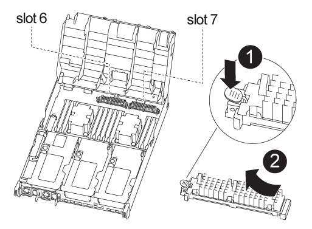

= Sostituire il modulo di caching - FAS8300 e FAS8700
:allow-uri-read: 
:icons: font
:imagesdir: ../media/

[role="lead"]
È necessario sostituire il modulo di caching nel modulo controller quando il sistema registra un singolo messaggio ASUP (AutoSupport) che indica che il modulo è offline; in caso contrario, le prestazioni si sono degradate.

* È necessario sostituire il componente guasto con un componente FRU sostitutivo ricevuto dal provider.

== Fase 1: Spegnere il controller compromesso

È possibile arrestare o sostituire il controller compromesso utilizzando procedure diverse, a seconda della configurazione hardware del sistema di storage.

[role="tabbed-block"]
====
.Opzione 1: La maggior parte delle configurazioni
--
Per spegnere il controller compromesso, è necessario determinare lo stato del controller e, se necessario, assumere il controllo del controller in modo che il controller integro continui a servire i dati provenienti dallo storage del controller compromesso.

.A proposito di queste attività
Se si dispone di un cluster con più di due nodi, questo deve trovarsi in quorum. Se il cluster non è in quorum o un controller integro mostra false per idoneità e salute, è necessario correggere il problema prima di spegnere il controller compromesso.

link:https://docs.netapp.com/us-en/ontap/system-admin/synchronize-node-cluster-task.html?q=Quorum["Sincronizzare un nodo con il cluster"^]

Si consiglia di cancellare il contenuto del modulo di caching prima di sostituirlo.

.Fasi
. Anche se i dati sul modulo di caching sono crittografati, è possibile cancellare i dati dal modulo di caching compromesso e verificare che il modulo di caching non abbia dati:
+
.. Cancellare i dati sul modulo di caching: `system controller flash-cache secure-erase run -node _node name_ localhost -device-id _device_number_`
+

NOTE: Eseguire `system controller flash-cache show` Comando se non si conosce l'ID del dispositivo flashcache.

.. Verificare che i dati siano stati cancellati dal modulo di caching: `system controller flash-cache secure-erase show`

. Se AutoSupport è attivato, eliminare la creazione automatica del caso richiamando un messaggio AutoSupport: `system node autosupport invoke -node * -type all -message MAINT=_number_of_hours_down_h`
+
Il seguente messaggio AutoSupport elimina la creazione automatica del caso per due ore: `cluster1:*> system node autosupport invoke -node * -type all -message MAINT=2h`

. Disattivare il giveback automatico dalla console del controller integro: `storage failover modify –node local -auto-giveback false`
. Portare la centralina danneggiata al prompt DEL CARICATORE:
+
[cols="1,2"]
|===
| Se il controller non utilizzato visualizza... | Quindi... 

 a| 
Il prompt DEL CARICATORE
 a| 
Passare alla fase successiva.

 a| 
In attesa di un giveback...
 a| 
Premere Ctrl-C, quindi rispondere `y`.

 a| 
Prompt di sistema o prompt della password (inserire la password di sistema)
 a| 
Assumere il controllo o arrestare il controller compromesso: `storage failover takeover -ofnode _impaired_node_name_` Quando il controller non utilizzato visualizza Waiting for giveback... (in attesa di giveback...), premere Ctrl-C e rispondere `y`.

|===

--
.Opzione 2: Controller in un MetroCluster a due nodi
--
Per spegnere il controller compromesso, è necessario determinare lo stato del controller e, se necessario, sostituirlo in modo che il controller integro continui a servire i dati provenienti dallo storage del controller compromesso.

.A proposito di questa attività
* Se si utilizza NetApp Storage Encryption, è necessario reimpostare il MSID seguendo le istruzioni riportate nella sezione "Restituisci un'unità FIPS o SED in modalità non protetta" di link:https://docs.netapp.com/us-en/ontap/encryption-at-rest/return-seds-unprotected-mode-task.html["Panoramica di NetApp Encryption con CLI"^].
* Al termine di questa procedura, è necessario lasciare accesi gli alimentatori per alimentare il controller integro.

.Fasi
. Controllare lo stato MetroCluster per determinare se il controller compromesso è passato automaticamente al controller integro: `metrocluster show`
. A seconda che si sia verificato uno switchover automatico, procedere come indicato nella seguente tabella:
+
[cols="1,2"]
|===
| Se il controller è compromesso... | Quindi... 

 a| 
Si è attivata automaticamente
 a| 
Passare alla fase successiva.

 a| 
Non si è attivato automaticamente
 a| 
Eseguire un'operazione di switchover pianificata dal controller integro: `metrocluster switchover`

 a| 
Non è stato attivato automaticamente, si è tentato di eseguire lo switchover con `metrocluster switchover` e lo switchover è stato vetoed
 a| 
Esaminare i messaggi di veto e, se possibile, risolvere il problema e riprovare. Se non si riesce a risolvere il problema, contattare il supporto tecnico.

|===
. Risincronizzare gli aggregati di dati eseguendo `metrocluster heal -phase aggregates` dal cluster esistente.
+
[listing]
----
controller_A_1::> metrocluster heal -phase aggregates
[Job 130] Job succeeded: Heal Aggregates is successful.
----
+
Se la riparazione è vetoed, si ha la possibilità di riemettere il `metrocluster heal` con il `-override-vetoes` parametro. Se si utilizza questo parametro opzionale, il sistema sovrascrive qualsiasi veto soft che impedisca l'operazione di riparazione.

. Verificare che l'operazione sia stata completata utilizzando il comando MetroCluster Operation show.
+
[listing]
----
controller_A_1::> metrocluster operation show
    Operation: heal-aggregates
      State: successful
Start Time: 7/25/2016 18:45:55
   End Time: 7/25/2016 18:45:56
     Errors: -
----
. Controllare lo stato degli aggregati utilizzando `storage aggregate show` comando.
+
[listing]
----
controller_A_1::> storage aggregate show
Aggregate     Size Available Used% State   #Vols  Nodes            RAID Status
--------- -------- --------- ----- ------- ------ ---------------- ------------
...
aggr_b2    227.1GB   227.1GB    0% online       0 mcc1-a2          raid_dp, mirrored, normal...
----
. Riparare gli aggregati root utilizzando `metrocluster heal -phase root-aggregates` comando.
+
[listing]
----
mcc1A::> metrocluster heal -phase root-aggregates
[Job 137] Job succeeded: Heal Root Aggregates is successful
----
+
Se la riparazione è vetoed, si ha la possibilità di riemettere il `metrocluster heal` comando con il parametro -override-vetoes. Se si utilizza questo parametro opzionale, il sistema sovrascrive qualsiasi veto soft che impedisca l'operazione di riparazione.

. Verificare che l'operazione di riparazione sia completa utilizzando `metrocluster operation show` sul cluster di destinazione:
+
[listing]
----

mcc1A::> metrocluster operation show
  Operation: heal-root-aggregates
      State: successful
 Start Time: 7/29/2016 20:54:41
   End Time: 7/29/2016 20:54:42
     Errors: -
----
. Sul modulo controller guasto, scollegare gli alimentatori.

--
====

== Fase 2: Rimuovere il modulo controller

Per accedere ai componenti all'interno del modulo controller, è necessario rimuovere il modulo controller dallo chassis.

Per rimuovere il modulo controller dal telaio, è possibile utilizzare l'animazione, l'illustrazione o i passaggi scritti riportati di seguito.

.Animazione - rimuovere il modulo controller
video::75b6fa91-96b9-4323-b156-aae10007c9a5[panopto]
image::../media/drw_A400_Remove_controller.png[Drw A400 rimuovere il controller]

.Fasi
. Se non si è già collegati a terra, mettere a terra l'utente.
. Rilasciare i fermi dei cavi di alimentazione, quindi scollegare i cavi dagli alimentatori.
. Allentare il gancio e la fascetta che fissano i cavi al dispositivo di gestione dei cavi, quindi scollegare i cavi di sistema e gli SFP (se necessario) dal modulo controller, tenendo traccia del punto in cui sono stati collegati i cavi.
+
Lasciare i cavi nel dispositivo di gestione dei cavi in modo che quando si reinstalla il dispositivo di gestione dei cavi, i cavi siano organizzati.

. Rimuovere il dispositivo di gestione dei cavi dal modulo controller e metterlo da parte.
. Premere verso il basso entrambi i fermi di bloccaggio, quindi ruotare entrambi i fermi verso il basso contemporaneamente.
+
Il modulo controller si sposta leggermente fuori dallo chassis.

. Estrarre il modulo controller dal telaio.
+
Assicurarsi di sostenere la parte inferiore del modulo controller mentre lo si sposta fuori dallo chassis.

. Posizionare il modulo controller su una superficie piana e stabile.

== Fase 3: Sostituire un modulo di caching

Per sostituire un modulo di caching, indicato come Flash cache sull'etichetta del controller, individuare lo slot all'interno del controller e seguire la sequenza di passaggi specifica. Consultare la mappa FRU sul modulo controller per la posizione di Flash cache.

Il sistema storage deve soddisfare determinati criteri a seconda della situazione:

* Deve disporre del sistema operativo appropriato per il modulo di caching che si sta installando.
* Deve supportare la capacità di caching.
* Sebbene il contenuto del modulo di caching sia crittografato, è consigliabile cancellare il contenuto del modulo prima di sostituirlo. Per ulteriori informazioni, consultare https://mysupport.netapp.com/info/web/ECMP1132988.html["Dichiarazione di volatilità"] Per il tuo sistema sul sito di supporto NetApp.
+

NOTE: Per visualizzare la _Dichiarazione di volatilità_ del sistema, è necessario accedere al sito di supporto NetApp.

* Tutti gli altri componenti del sistema di storage devono funzionare correttamente; in caso contrario, contattare il supporto tecnico.

Per sostituire un modulo di caching, è possibile utilizzare la seguente animazione, illustrazione o procedura scritta.

.Animazione - sostituire il modulo di caching
video::d5f75ac5-b4f3-4b49-984b-aad9012f0c8e[panopto]

.Fasi
. Se non si è già collegati a terra, mettere a terra l'utente.
. Aprire il condotto dell'aria:
+
.. Premere le linguette di bloccaggio sui lati del condotto dell'aria verso il centro del modulo controller.
.. Far scorrere il condotto dell'aria verso la parte posteriore del modulo controller, quindi ruotarlo verso l'alto fino a portarlo in posizione completamente aperta.

. Utilizzando la mappa FRU sul modulo controller, individuare il modulo di caching guasto e rimuoverlo:
+
A seconda della configurazione, il modulo controller potrebbe contenere zero, uno o due moduli di caching. Utilizzare la mappa FRU all'interno del modulo controller per individuare il modulo di caching.

+
.. Premere la linguetta blu di rilascio.
+
L'estremità del modulo di caching si libera dalla scheda release.

.. Ruotare il modulo di caching verso l'alto ed estrarlo dal socket.

. Installare il modulo di caching sostitutivo:
+
.. Allineare i bordi del modulo di caching sostitutivo con il socket e inserirlo delicatamente nel socket.
.. Ruotare il modulo di caching verso il basso verso la scheda madre.
.. Posizionando il dito all'estremità del modulo di caching tramite il pulsante blu, premere con decisione verso il basso l'estremità del modulo di caching, quindi sollevare il pulsante di blocco per bloccare il modulo di caching in posizione.

. Chiudere il condotto dell'aria:
+
.. Ruotare il condotto dell'aria verso il basso fino al modulo controller.
.. Far scorrere il condotto dell'aria verso i montanti per bloccarlo in posizione.

== Fase 4: Installare il modulo controller

Dopo aver sostituito il componente nel modulo controller, è necessario reinstallare il modulo controller nel telaio.

Per installare il modulo controller nel telaio, è possibile utilizzare l'animazione, l'illustrazione o i passaggi scritti riportati di seguito.

.Animazione - Installazione del modulo controller
video::9249fdb8-1522-437d-9280-aae10007c97b[panopto]
image::../media/drw_A400_Install_controller_source.png[Drw A400 installare la sorgente del controller]

.Fasi
. In caso contrario, chiudere il condotto dell'aria.
. Allineare l'estremità del modulo controller con l'apertura dello chassis, quindi spingere delicatamente il modulo controller a metà nel sistema.
+

NOTE: Non inserire completamente il modulo controller nel telaio fino a quando non viene richiesto.

. Cablare solo le porte di gestione e console, in modo da poter accedere al sistema per eseguire le attività descritte nelle sezioni seguenti.
+

NOTE: I cavi rimanenti verranno collegati al modulo controller più avanti in questa procedura.

. Completare l'installazione del modulo controller:
+
.. Collegare il cavo di alimentazione all'alimentatore, reinstallare il collare di bloccaggio del cavo di alimentazione, quindi collegare l'alimentatore alla fonte di alimentazione.
.. Utilizzando i fermi di bloccaggio, spingere con decisione il modulo controller nel telaio fino a quando i fermi di bloccaggio non iniziano a sollevarsi.
+

NOTE: Non esercitare una forza eccessiva quando si fa scorrere il modulo controller nel telaio per evitare di danneggiare i connettori.

.. Inserire completamente il modulo controller nel telaio ruotando i fermi di bloccaggio verso l'alto, inclinandoli in modo da liberare i perni di bloccaggio, spingere delicatamente il controller fino in fondo, quindi abbassare i fermi di bloccaggio in posizione di blocco.
+
Il modulo controller inizia ad avviarsi non appena viene inserito completamente nello chassis.

.. Se non è già stato fatto, reinstallare il dispositivo di gestione dei cavi.
.. Interrompere il normale processo di avvio e avviare IL CARICATORE premendo `Ctrl-C`.
+

NOTE: Se il sistema si arresta nel menu di avvio, selezionare l'opzione per avviare IL CARICATORE.

.. Al prompt DEL CARICATORE, immettere `bye` Per reinizializzare le schede PCIe e altri componenti.

== Fase 5: Ripristinare il funzionamento del modulo controller

È necessario recuperare il sistema, restituire il modulo controller e riabilitare il giveback automatico.

.Fasi
. Ricable il sistema, come necessario.
+
Se sono stati rimossi i convertitori multimediali (QSFP o SFP), ricordarsi di reinstallarli se si utilizzano cavi in fibra ottica.

. Riportare il controller al funzionamento normale restituendo lo storage: `storage failover giveback -ofnode _impaired_node_name_`
. Se il giveback automatico è stato disattivato, riabilitarlo: `storage failover modify -node local -auto-giveback true`

== Fase 7: Switch back aggregates in una configurazione MetroCluster a due nodi

Una volta completata la sostituzione dell'unità FRU in una configurazione MetroCluster a due nodi, è possibile eseguire l'operazione di switchback dell'unità MetroCluster. In questo modo, la configurazione torna al suo normale stato operativo, con le macchine virtuali dello storage di origine sincronizzata (SVM) sul sito precedentemente compromesso ora attive e che forniscono i dati dai pool di dischi locali.

Questa attività si applica solo alle configurazioni MetroCluster a due nodi.

.Fasi
. Verificare che tutti i nodi si trovino in `enabled` stato: `metrocluster node show`
+
[listing]
----
cluster_B::>  metrocluster node show

DR                           Configuration  DR
Group Cluster Node           State          Mirroring Mode
----- ------- -------------- -------------- --------- --------------------
1     cluster_A
              controller_A_1 configured     enabled   heal roots completed
      cluster_B
              controller_B_1 configured     enabled   waiting for switchback recovery
2 entries were displayed.
----
. Verificare che la risincronizzazione sia completa su tutte le SVM: `metrocluster vserver show`
. Verificare che tutte le migrazioni LIF automatiche eseguite dalle operazioni di riparazione siano state completate correttamente: `metrocluster check lif show`
. Eseguire lo switchback utilizzando `metrocluster switchback` comando da qualsiasi nodo del cluster esistente.
. Verificare che l'operazione di switchback sia stata completata: `metrocluster show`
+
L'operazione di switchback è ancora in esecuzione quando un cluster si trova in `waiting-for-switchback` stato:

+
[listing]
----
cluster_B::> metrocluster show
Cluster              Configuration State    Mode
--------------------	------------------- 	---------
 Local: cluster_B configured       	switchover
Remote: cluster_A configured       	waiting-for-switchback
----
+
L'operazione di switchback è completa quando i cluster si trovano in `normal` stato:

+
[listing]
----
cluster_B::> metrocluster show
Cluster              Configuration State    Mode
--------------------	------------------- 	---------
 Local: cluster_B configured      		normal
Remote: cluster_A configured      		normal
----
+
Se il completamento di uno switchback richiede molto tempo, è possibile verificare lo stato delle linee di base in corso utilizzando `metrocluster config-replication resync-status show` comando.

. Ripristinare le configurazioni SnapMirror o SnapVault.

== Fase 8: Completare il processo di sostituzione

Restituire la parte guasta a NetApp, come descritto nelle istruzioni RMA fornite con il kit. Vedere https://mysupport.netapp.com/site/info/rma["Parti restituita  sostituzioni"] per ulteriori informazioni.
