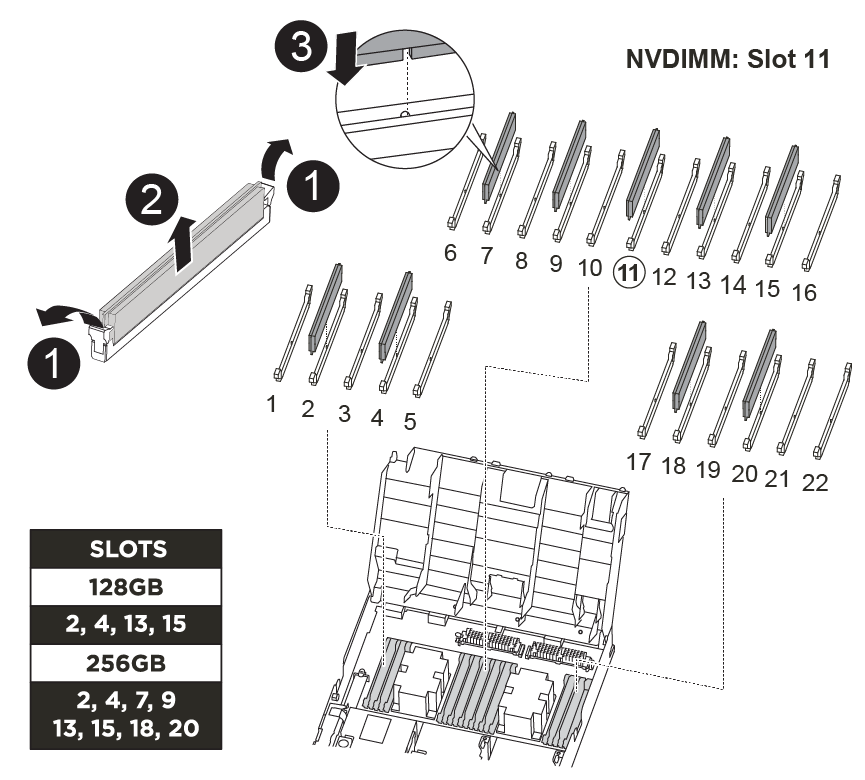

= Sostituire l'hardware del modulo controller - FAS8300 e FAS8700
:allow-uri-read: 
:icons: font
:imagesdir: ../media/

[role="lead"]
Per sostituire l'hardware del modulo controller, è necessario rimuovere il controller guasto, spostare i componenti FRU nel modulo controller sostitutivo, installare il modulo controller sostitutivo nel telaio e avviare il sistema in modalità manutenzione.

NOTE: Il modulo controller Ver2 dispone di un solo socket per modulo di caching (slot 6) nel FAS8300. FAS8700 non dispone di un modulo controller ver2. La funzionalità del modulo di caching non è influenzata dalla rimozione del socket.

== Fase 1: Rimuovere il modulo controller

Per accedere ai componenti all'interno del modulo controller, è necessario rimuovere il modulo controller dallo chassis.

Per rimuovere il modulo controller dal telaio, è possibile utilizzare l'animazione, l'illustrazione o i passaggi scritti riportati di seguito.

.Animazione - rimuovere il modulo controller
video::75b6fa91-96b9-4323-b156-aae10007c9a5[panopto]
. Se non si è già collegati a terra, mettere a terra l'utente.
. Rilasciare i fermi dei cavi di alimentazione, quindi scollegare i cavi dagli alimentatori.
. Allentare il gancio e la fascetta che fissano i cavi al dispositivo di gestione dei cavi, quindi scollegare i cavi di sistema e gli SFP (se necessario) dal modulo controller, tenendo traccia del punto in cui sono stati collegati i cavi.
+
Lasciare i cavi nel dispositivo di gestione dei cavi in modo che quando si reinstalla il dispositivo di gestione dei cavi, i cavi siano organizzati.

. Rimuovere il dispositivo di gestione dei cavi dal modulo controller e metterlo da parte.
. Premere verso il basso entrambi i fermi di bloccaggio, quindi ruotare entrambi i fermi verso il basso contemporaneamente.
+
image::../media/drw_A400_Remove_controller.png[Drw A400 rimuovere il controller]

+
Il modulo controller si sposta leggermente fuori dallo chassis.

. Estrarre il modulo controller dal telaio.
+
Assicurarsi di sostenere la parte inferiore del modulo controller mentre lo si sposta fuori dallo chassis.

. Posizionare il modulo controller su una superficie piana e stabile.
. Sul modulo controller sostitutivo, aprire il condotto dell'aria e rimuovere i montanti vuoti dal modulo controller utilizzando l'animazione, l'illustrazione o i passaggi scritti:
+
https://netapp.hosted.panopto.com/Panopto/Pages/Viewer.aspx?id=49053752-e813-4c15-a917-ab190147fa6e["Rimozione dei riser vuoti dal modulo controller sostitutivo"]

image::../media/drw_8300_empty_riser_remove.png[drw 8300 rimozione del riser vuoto]

. Premere le linguette di bloccaggio sui lati del condotto dell'aria verso il centro del modulo controller.
. Far scorrere il condotto dell'aria verso la parte posteriore del modulo controller, quindi ruotarlo verso l'alto fino a portarlo in posizione completamente aperta.
. Ruotare il fermo di bloccaggio del riser sul lato sinistro del riser 1 verso l'alto e verso il condotto dell'aria, sollevare il riser e metterlo da parte.
. Ripetere la fase precedente per i riser rimanenti.

== Fase 2: Spostare gli alimentatori

Quando si sostituisce un modulo controller, è necessario spostare l'alimentatore dal modulo controller guasto al modulo controller sostitutivo.

Per spostare gli alimentatori nel modulo controller sostitutivo, è possibile utilizzare l'animazione, l'illustrazione o i passaggi scritti riportati di seguito.

.Animazione - spostare gli alimentatori
video::92060115-1967-475b-b517-aad9012f130c[panopto]
image::../media/drw_A400_psu.png[psu drw A400]

. Rimuovere l'alimentatore:
+
.. Ruotare la maniglia della camma in modo che possa essere utilizzata per estrarre l'alimentatore dallo chassis.
.. Premere la linguetta blu di blocco per rilasciare l'alimentatore dallo chassis.
.. Con entrambe le mani, estrarre l'alimentatore dal telaio e metterlo da parte.

. Spostare l'alimentatore sul nuovo modulo controller, quindi installarlo.
. Con entrambe le mani, sostenere e allineare i bordi dell'alimentatore con l'apertura nel modulo controller, quindi spingere delicatamente l'alimentatore nel modulo controller fino a quando la linguetta di blocco non scatta in posizione.
+
Gli alimentatori si innestano correttamente solo con il connettore interno e si bloccano in un modo.

+

NOTE: Per evitare di danneggiare il connettore interno, non esercitare una forza eccessiva quando si inserisce l'alimentatore nel sistema.

. Ripetere i passi precedenti per tutti gli alimentatori rimanenti.

== Fase 3: Spostare la batteria NVDIMM

Per spostare la batteria NVDIMM dal modulo controller guasto al modulo controller sostitutivo, è necessario eseguire una sequenza specifica di operazioni.

Per spostare la batteria NVDIMM dal modulo del controller guasto al modulo del controller sostitutivo, è possibile utilizzare l'animazione, l'illustrazione o la procedura scritta riportate di seguito.

.Animazione - spostare la batteria NVDIMM
video::94d115b2-b02a-4234-805c-aad9012f204c[panopto]
. Aprire il condotto dell'aria:
+
.. Premere le linguette di bloccaggio sui lati del condotto dell'aria verso il centro del modulo controller.
.. Far scorrere il condotto dell'aria verso la parte posteriore del modulo controller, quindi ruotarlo verso l'alto fino a portarlo in posizione completamente aperta.

. Individuare la batteria NVDIMM nel modulo del controller.

image::../media/drw_A400_nvdimm-batt.png[Batteria nvdimm drw A400]

. Individuare la spina della batteria e premere il fermaglio sulla parte anteriore della spina per sganciarla dalla presa, quindi scollegare il cavo della batteria dalla presa.
. Afferrare la batteria e premere la linguetta di bloccaggio blu contrassegnata CON PUSH, quindi estrarre la batteria dal supporto e dal modulo del controller.
. Spostare la batteria nel modulo controller sostitutivo.
. Allineare il modulo batteria con l'apertura della batteria, quindi spingere delicatamente la batteria nello slot fino a bloccarla in posizione.
+

NOTE: Non ricollegare il cavo della batteria alla scheda madre fino a quando non viene richiesto.

== Fase 4: Spostare il supporto di avvio

Individuare il supporto di avvio, quindi seguire le istruzioni per rimuoverlo dal modulo controller compromesso e inserirlo nel modulo controller sostitutivo.

È possibile utilizzare l'animazione, l'illustrazione o i passaggi scritti riportati di seguito per spostare il supporto di avvio dal modulo controller compromesso al modulo controller sostitutivo.

.Animazione - spostare il supporto di avvio
video::2a14099c-85de-4a84-867c-aad9012efac8[panopto]
image::../media/drw_A400_Replace-boot_media.png[Drw A400 sostituire il supporto di avvio]

. Individuare e rimuovere il supporto di avvio dal modulo controller:
+
.. Premere il tasto blu alla fine del supporto di avvio fino a quando il labbro sul supporto di avvio non scompare dal pulsante blu.
.. Ruotare il supporto di avvio verso l'alto ed estrarre delicatamente il supporto di avvio dalla presa.

. Spostare il supporto di avvio nel nuovo modulo controller, allineare i bordi del supporto di avvio con l'alloggiamento dello zoccolo, quindi spingerlo delicatamente nello zoccolo.
. Verificare che il supporto di avvio sia inserito correttamente e completamente nella presa.
+
Se necessario, rimuovere il supporto di avvio e reinserirlo nella presa.

. Bloccare il supporto di avvio in posizione:
+
.. Ruotare il supporto di avvio verso il basso verso la scheda madre.
.. Premere il pulsante di bloccaggio blu in modo che si trovi in posizione aperta.
.. Posizionando le dita alla fine del supporto di avvio tramite il pulsante blu, premere con decisione verso il basso l'estremità del supporto di avvio per inserire il pulsante di blocco blu.

== Fase 5: Spostare i riser PCIe e la scheda mezzanine

Nell'ambito del processo di sostituzione del controller, è necessario spostare i riser PCIe e la scheda mezzanine dal modulo controller compromesso al modulo controller sostitutivo.

È possibile utilizzare le seguenti animazioni, illustrazioni, la mappa FUR sul sistema o i passaggi scritti per spostare i riser PCIe e la scheda mezzanine dal modulo controller danneggiato al modulo controller sostitutivo.

NOTE: Non è necessario rimuovere le schede PCIe dai riser. Trasferire i riser, con le schede PCIe ancora installate, al modulo controller sostitutivo.

Spostamento dei riser PCIe 1 e 2 (riser sinistro e centrale):

.Animazione - spostamento dei riser PCI 1 e 2
video::f4ee1d4d-6029-4fe6-a063-aad9012f170b[panopto]
image::../media/drw_A400_Replace-PCIe-cards.png[Drw A400 sostituire le schede PCIe]

Spostamento della scheda mezzanine e del riser 3 (riser destro):

.Animazione - spostare la scheda mezzanine e il riser 3
video::b0c3b575-3434-4e00-a421-aad9012f2e9e[panopto]
image::../media/drw_A400_Replace-mezz-card.png[Drw A400 sostituire la scheda di memoria]

. Spostare i riser PCIe uno e due dal modulo controller guasto al modulo controller sostitutivo:
+
.. Rimuovere eventuali moduli SFP o QSFP presenti nelle schede PCIe.
.. Ruotare il fermo di bloccaggio del riser sul lato sinistro del riser verso l'alto e verso il condotto dell'aria.
+
Il riser si solleva leggermente dal modulo controller.

.. Sollevare il riser, quindi spostarlo nel modulo controller sostitutivo.
.. Allineare il riser con i piedini sul lato dello zoccolo del riser, abbassare il riser sui piedini, spingere il riser perpendicolarmente nello zoccolo della scheda madre, quindi ruotare il dispositivo di chiusura a filo con la lamiera del riser.
.. Ripetere questo passaggio per il riser numero 2.

. Rimuovere il riser numero 3, rimuovere la scheda mezzanine e installarle entrambe nel modulo controller sostitutivo:
+
.. Rimuovere eventuali moduli SFP o QSFP presenti nelle schede PCIe.
.. Ruotare il fermo di bloccaggio del riser sul lato sinistro del riser verso l'alto e verso il condotto dell'aria.
+
Il riser si solleva leggermente dal modulo controller.

.. Sollevare il riser, quindi metterlo da parte su una superficie piana e stabile.
.. Allentare le viti a testa zigrinata sulla scheda mezzanine, quindi sollevare la scheda direttamente dallo zoccolo e spostarla nel modulo controller sostitutivo.
.. Installare il mezzanino nel controller sostitutivo e fissarlo con le viti a testa zigrinata.
.. Installare il terzo riser nel modulo controller sostitutivo.

== Fase 6: Spostare i moduli di caching

Quando si sostituisce un modulo controller, è necessario spostare i moduli di caching dai moduli controller non adeguati al modulo controller sostitutivo.

NOTE: Il modulo controller Ver2 dispone di un solo socket per modulo di caching nel modello FAS8300. FAS8700 non dispone di un modulo controller ver2. La funzionalità del modulo di caching non è influenzata dalla rimozione del socket.

Per spostare i moduli di caching nel nuovo modulo controller, è possibile utilizzare la seguente animazione, illustrazione o procedura scritta.

.Animazione - spostare i moduli di caching
video::d6a43902-0e78-40c3-a2bd-aad9012f5b94[panopto]
image::../media/drw_A400_Replace-flashcache.png[Drw A400 Sostituisci flashcache]

. Se non si è già collegati a terra, mettere a terra l'utente.
. Spostare i moduli di caching dal modulo controller compromesso al modulo controller sostitutivo:
+
.. Premere la linguetta blu di rilascio all'estremità del modulo di caching, ruotare il modulo verso l'alto, quindi rimuovere il modulo dallo zoccolo.
.. Spostare il modulo di caching nello stesso socket del modulo controller sostitutivo.
.. Allineare i bordi del modulo di caching con il socket e inserire delicatamente il modulo fino in fondo nel socket.
.. Ruotare il modulo di caching verso il basso verso la scheda madre.
.. Posizionando il dito all'estremità del modulo di caching tramite il pulsante blu, premere con decisione verso il basso l'estremità del modulo di caching, quindi sollevare il pulsante di blocco per bloccare il modulo di caching in posizione.

== Fase 7: Spostare i DIMM

È necessario individuare i DIMM e spostarli dal modulo controller guasto al modulo controller sostitutivo.

Il nuovo modulo controller deve essere pronto in modo da poter spostare i DIMM direttamente dal modulo controller guasto agli slot corrispondenti del modulo controller sostitutivo.

È possibile utilizzare l'animazione, l'illustrazione o i passaggi scritti riportati di seguito per spostare i moduli DIMM dal modulo del controller guasto al modulo del controller sostitutivo.

.Animazione - spostare i DIMM
video::717b52fa-f236-4f3d-b07d-aad9012f51a3[panopto]

. Individuare i DIMM sul modulo controller.
. Prendere nota dell'orientamento del DIMM nello zoccolo in modo da poter inserire il DIMM nel modulo controller sostitutivo con l'orientamento corretto.
. Verificare che la batteria NVDIMM non sia collegata al nuovo modulo controller.
. Spostare i DIMM dal modulo controller guasto al modulo controller sostitutivo:
+

NOTE: Assicurarsi di installare ciascun DIMM nello stesso slot occupato nel modulo controller guasto.

+
.. Estrarre il modulo DIMM dal relativo slot spingendo lentamente le linguette di espulsione dei moduli DIMM su entrambi i lati del modulo, quindi estrarre il modulo DIMM dallo slot.
+

NOTE: Tenere il modulo DIMM per i bordi in modo da evitare di esercitare pressione sui componenti della scheda a circuiti stampati del modulo DIMM.

.. Individuare lo slot DIMM corrispondente sul modulo controller sostitutivo.
.. Assicurarsi che le linguette di espulsione del DIMM sullo zoccolo DIMM siano aperte, quindi inserire il DIMM correttamente nello zoccolo.
+
I DIMM si inseriscono saldamente nello zoccolo, ma devono essere inseriti facilmente. In caso contrario, riallineare il DIMM con lo zoccolo e reinserirlo.

.. Esaminare visivamente il modulo DIMM per verificare che sia allineato in modo uniforme e inserito completamente nello zoccolo.
.. Ripetere questi passaggi secondari per i DIMM rimanenti.

. Collegare la batteria NVDIMM alla scheda madre.
+
Assicurarsi che la spina si blocchi sul modulo controller.

== Fase 8: Installare il modulo controller

Dopo aver spostato tutti i componenti dal modulo controller guasto al modulo controller sostitutivo, è necessario installare il modulo controller sostitutivo nel telaio e avviarlo in modalità manutenzione.

Per installare il modulo controller sostitutivo nel telaio, è possibile utilizzare l'animazione, l'illustrazione o i passaggi scritti riportati di seguito.

.Animazione - Installazione del modulo controller
video::9249fdb8-1522-437d-9280-aae10007c97b[panopto]
image::../media/drw_A400_Install_controller_source.png[Drw A400 installare la sorgente del controller]

. In caso contrario, chiudere il condotto dell'aria.
. Allineare l'estremità del modulo controller con l'apertura dello chassis, quindi spingere delicatamente il modulo controller a metà nel sistema.
+

NOTE: Non inserire completamente il modulo controller nel telaio fino a quando non viene richiesto.

. Cablare solo le porte di gestione e console, in modo da poter accedere al sistema per eseguire le attività descritte nelle sezioni seguenti.
+

NOTE: I cavi rimanenti verranno collegati al modulo controller più avanti in questa procedura.

. Completare l'installazione del modulo controller:
+
.. Collegare il cavo di alimentazione all'alimentatore, reinstallare il collare di bloccaggio del cavo di alimentazione, quindi collegare l'alimentatore alla fonte di alimentazione.
.. Utilizzando i fermi di bloccaggio, spingere con decisione il modulo controller nel telaio fino a quando i fermi di bloccaggio non iniziano a sollevarsi.
+

NOTE: Non esercitare una forza eccessiva quando si fa scorrere il modulo controller nel telaio per evitare di danneggiare i connettori.

.. Inserire completamente il modulo controller nel telaio ruotando i fermi di bloccaggio verso l'alto, inclinandoli in modo da liberare i perni di bloccaggio, spingere delicatamente il controller fino in fondo, quindi abbassare i fermi di bloccaggio in posizione di blocco.
+
Il modulo controller inizia ad avviarsi non appena viene inserito completamente nello chassis. Prepararsi ad interrompere il processo di avvio.

.. Se non è già stato fatto, reinstallare il dispositivo di gestione dei cavi.
.. Interrompere il normale processo di avvio e avviare IL CARICATORE premendo `Ctrl-C`.
+

NOTE: Se il sistema si arresta nel menu di avvio, selezionare l'opzione per avviare IL CARICATORE.

.. Al prompt DEL CARICATORE, immettere `bye` Per reinizializzare le schede PCIe e altri componenti.
.. Interrompere il processo di avvio e avviare il CARICATORE premendo `Ctrl-C`.
+
Se il sistema si arresta nel menu di avvio, selezionare l'opzione per avviare IL CARICATORE.

