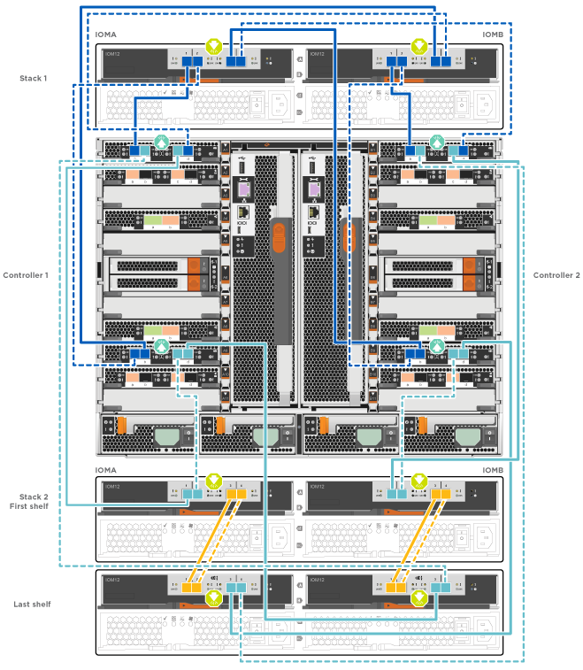

= Guida dettagliata - AFF A700 e FAS9000
:allow-uri-read: 
:icons: font
:imagesdir: ../media/

[role="lead"]
Questa guida fornisce istruzioni dettagliate e dettagliate per l'installazione di un sistema NetApp tipico. Utilizzare questa guida per ottenere istruzioni di installazione più dettagliate.

== Fase 1: Preparazione per l'installazione

Per installare il sistema, è necessario creare un account sul NetApp Support Site, registrare il sistema e ottenere le chiavi di licenza. È inoltre necessario inventariare il numero e il tipo di cavi appropriati per il sistema e raccogliere informazioni di rete specifiche.

.Prima di iniziare
È necessario accedere a Hardware Universe per ottenere informazioni sui requisiti del sito e ulteriori informazioni sul sistema configurato. Per ulteriori informazioni su questo sistema, è possibile accedere alle Note di rilascio della versione di ONTAP in uso.

https://hwu.netapp.com["NetApp Hardware Universe"]

http://mysupport.netapp.com/documentation/productlibrary/index.html?productID=62286["Trova le Note di rilascio relative alla tua versione di ONTAP 9"]

Devi fornire quanto segue presso la tua sede:

* Spazio rack per il sistema storage
* Cacciavite Phillips n. 2
* Cavi di rete aggiuntivi per collegare il sistema allo switch di rete e al laptop o alla console mediante un browser Web

.Fasi
. Disimballare il contenuto di tutte le confezioni.
. Annotare il numero di serie del sistema dai controller.
+
image::../media/drw_ssn_label.png[etichetta drw sn]

. Fare un inventario e prendere nota del numero e dei tipi di cavi ricevuti.
+
La seguente tabella identifica i tipi di cavi che potrebbero essere ricevuti. Se si riceve un cavo non elencato nella tabella, consultare la Hardware Universe per individuare il cavo e identificarne l'utilizzo.

+
https://hwu.netapp.com["NetApp Hardware Universe"]

+
[cols="1,2,1,2"]
|===
| Tipo di cavo... | Codice e lunghezza del ricambio | Tipo di connettore | Per... 

 a| 
Cavo di rete da 10 GbE
 a| 
X6566B-2-R6, (112-00299), 2 m.

X6566B-3-R6, 112-00300, 3 m.

X6566B-5-R6 , 112-00301, 5 m.
 a| 
image:../media/oie_cable_sfp_gbe_copper.png[""]
 a| 
Cavo di rete

 a| 
Cavo di rete da 40 GbE

Interconnessione cluster 40 GbE
 a| 
X66100-1,112-00542, 1 m.

X66100-3,112-00543, 3 m.
 a| 
image:../media/oie_cable100_gbe_qsfp28.png[""]
 a| 
Rete 40 GbE

Interconnessione del cluster

 a| 
Cavo di rete da 100 GbE

Cavo di storage da 100 GbE
 a| 
X66211A-05 (112-00595), 0,5 m.

X66211A-1 (112-00573), 1 m.

X66211A-2 (112-00574), 2 m

X66211A-5 (112-00574), 5 m.
 a| 
image:../media/oie_cable100_gbe_qsfp28.png[""]
 a| 
Cavo di rete

Cavo di storage

NOTE: Questo cavo è valido solo per AFF A700.

 a| 
Cavi di rete ottica (in base all'ordine)
 a| 
X6553-R6 (112-00188), 2 m

X6536-R6 (112-00090), 5 m.
 a| 
image:../media/oie_cable_fiber_lc_connector.png[""]
 a| 
Rete host FC

 a| 
Cat 6, RJ-45 (in base all'ordine)
 a| 
Codici X6585-R6 (112-00291), 3 m.

X6562-R6 (112-00196), 5 m.
 a| 
image:../media/oie_cable_rj45.png[""]
 a| 
Rete di gestione e dati Ethernet

 a| 
Storage
 a| 
X66031A (112-00436), 1 m.

X66032A (112-00437), 2 m

X66033A (112-00438), 3 m.
 a| 
image:../media/oie_cable_mini_sas_hd_to_mini_sas_hd.png[""]
 a| 
Storage

 a| 
Cavo per console micro-USB
 a| 
Non applicabile
 a| 
image:../media/oie_cable_micro_usb.png[""]
 a| 
Connessione della console durante la configurazione del software su computer portatili/console non Windows o Mac

 a| 
Cavi di alimentazione
 a| 
Non applicabile
 a| 
image:../media/oie_cable_power.png[""]
 a| 
Accensione del sistema

|===
. Consulta la _Guida alla confidenziazione di NetApp ONTAP_ e raccogli le informazioni richieste elencate in tale guida.
+
https://library.netapp.com/ecm/ecm_download_file/ECMLP2862613["Guida alla configurazione di ONTAP"]

== Fase 2: Installare l'hardware

È necessario installare il sistema in un rack a 4 montanti o in un cabinet di sistema NetApp, a seconda dei casi.

.Fasi
. Installare i kit di guide, secondo necessità.
. Installare e fissare il sistema seguendo le istruzioni fornite con il kit di guide.
+

NOTE: È necessario essere consapevoli dei problemi di sicurezza associati al peso del sistema.

+
image::../media/drw_9000_lifting_icon.png[drw 9000 icona di sollevamento]

NOTE: L'etichetta a sinistra indica uno chassis vuoto, mentre l'etichetta a destra indica un sistema completamente popolato.

. Collegare i dispositivi di gestione dei cavi (come illustrato).
+
image::../media/drw_9000_cable_management_arms.png[drw 9000 bracci di gestione dei cavi]

. Posizionare il pannello anteriore del sistema.

== Fase 3: Collegare i controller alla rete

È possibile collegare i controller alla rete utilizzando il metodo cluster senza switch a due nodi o la rete di interconnessione del cluster.

=== Opzione 1: Cluster senza switch a due nodi

La rete di gestione, la rete dati e le porte di gestione dei controller sono collegate agli switch. Le porte di interconnessione del cluster sono cablate su entrambi i controller.

Per informazioni sulla connessione del sistema agli switch, contattare l'amministratore di rete.

Verificare la direzione delle linguette dei cavi quando si inseriscono i cavi nelle porte. Le linguette di estrazione dei cavi sono rivolte verso l'alto per tutte le porte dei moduli di rete.

image::../media/oie_cable_pull_tab_up.png[linguetta di estrazione del cavo oie verso l'alto]

NOTE: Quando si inserisce il connettore, si dovrebbe avvertire uno scatto in posizione; se non si sente uno scatto, rimuoverlo, ruotarlo e riprovare.

.Fasi
. Utilizzare l'animazione o l'illustrazione per completare il cablaggio tra i controller e gli switch:
+
.Animazione - collegare un cluster senza switch a due nodi
video::7a55b98a-e8b8-41d5-821f-ac5b0032ead0[panopto]

image::../media/drw_9000_TNSC_composite_cabling.png[Cablaggio composito TNSC drw 9000]

. Passare a. <<Fase 4: Collegare i controller dei cavi agli shelf di dischi>> per istruzioni sul cablaggio dello shelf di dischi.

=== Opzione 2: Cluster con switch

La rete di gestione, la rete dati e le porte di gestione dei controller sono collegate agli switch. L'interconnessione del cluster e le porte ha sono cablate al cluster/switch ha.

Per informazioni sulla connessione del sistema agli switch, contattare l'amministratore di rete.

Verificare la direzione delle linguette dei cavi quando si inseriscono i cavi nelle porte. Le linguette di estrazione dei cavi sono rivolte verso l'alto per tutte le porte dei moduli di rete.

image::../media/oie_cable_pull_tab_up.png[linguetta di estrazione del cavo oie verso l'alto]

NOTE: Quando si inserisce il connettore, si dovrebbe avvertire uno scatto in posizione; se non si sente uno scatto, rimuoverlo, ruotarlo e riprovare.

.Fasi
. Utilizzare l'animazione o l'illustrazione per completare il cablaggio tra i controller e gli switch:
+
.Animazione - cablaggio del cluster con switch
video::6381b3f1-4ce5-4805-bd0a-ac5b0032f51d[panopto]

image:../media/drw_9000_switched_cluster_cabling.png[""]

. Passare a. <<Fase 4: Collegare i controller dei cavi agli shelf di dischi>> per istruzioni sul cablaggio dello shelf di dischi.

== Fase 4: Collegare i controller dei cavi agli shelf di dischi

È possibile collegare il nuovo sistema agli shelf DS212C, DS224C o NS224, a seconda che si tratti di un sistema AFF o FAS.

=== Opzione 1: Collegare i controller agli shelf di dischi DS212C o DS224C

È necessario collegare i collegamenti shelf-to-shelf, quindi collegare entrambi i controller agli shelf di dischi DS212C o DS224C.

I cavi vengono inseriti nello shelf con le linguette rivolte verso il basso, mentre l'altra estremità del cavo viene inserita nei moduli di storage del controller con le linguette rivolte verso l'alto.

image::../media/oie_cable_pull_tab_down.png[linguetta di estrazione del cavo oie verso il basso]

image::../media/oie_cable_pull_tab_up.png[linguetta di estrazione del cavo oie verso l'alto]

.Fasi
. Utilizzare le seguenti animazioni o illustrazioni per collegare gli shelf di dischi ai controller.
+

NOTE: Gli esempi utilizzano shelf DS224C. Il cablaggio è simile agli altri shelf di dischi SAS supportati.

+
** Cablaggio degli shelf SAS in FAS9000, AFF A700, ASA AFF A700, ONTAP 9.7 e versioni precedenti:

+
.Animazione - cavo storage SAS - ONTAP 9.7 e versioni precedenti
video::a312e09e-df56-47b3-9b5e-ab2300477f67[panopto]
+

+
** Cablaggio degli shelf SAS in FAS9000, AFF A700, ASA AFF A700, ONTAP 9.8 e versioni successive:

+
.Animazione - cavo storage SAS - ONTAP 9.8 e versioni successive
video::61d23302-9526-4a2b-9335-ac5b0032eafd[panopto]
+
image:../media/SAS_storage_ONTAP_9.8_and_later.png[""]

+

NOTE: Se si dispone di più shelf di dischi, consultare la _Guida all'installazione e al cablaggio_ per il tipo di shelf di dischi.

+
https://docs.netapp.com/us-en/ontap-systems/sas3/install-new-system.html["Installazione e shelf per cavi per un'installazione di un nuovo sistema - shelf con moduli IOM12"]

+
image:../media/Cable_shelves_new_system_IOM12_shelves.png[""]

. Passare a. <<Fase 5: Completare l'installazione e la configurazione del sistema>> per completare l'installazione e la configurazione del sistema.

=== Opzione 2: Collegare i controller a un singolo shelf di dischi NS224 solo nei sistemi AFF A700 e ASA AFF A700 con ONTAP 9.8 e versioni successive

È necessario collegare ciascun controller ai moduli NSM sullo shelf di dischi NS224 su un AFF A700 o ASA AFF A700 con sistema ONTAP 9.8 o successivo.

* Questa attività è valida solo per AFF A700 e ASA AFF A700 con ONTAP 9.8 o versione successiva.
* I sistemi devono avere almeno un modulo X91148A installato negli slot 3 e/o 7 per ciascun controller. L'animazione o le illustrazioni mostrano questo modulo installato in entrambi gli slot 3 e 7.
* Verificare che la freccia dell'illustrazione sia orientata correttamente con la linguetta di estrazione del connettore del cavo. La linguetta di estrazione dei cavi per i moduli di storage è rivolta verso l'alto, mentre le linguette di estrazione sugli scaffali sono rivolte verso il basso.
+
image::../media/oie_cable_pull_tab_up.png[linguetta di estrazione del cavo oie verso l'alto]

+
image::../media/oie_cable_pull_tab_down.png[linguetta di estrazione del cavo oie verso il basso]

+

NOTE: Quando si inserisce il connettore, si dovrebbe avvertire uno scatto in posizione; se non si sente uno scatto, rimuoverlo, ruotarlo e riprovare.

.Fasi
. Utilizzare l'animazione o le illustrazioni seguenti per collegare i controller con due moduli storage X91148A a un singolo shelf di dischi NS224 oppure utilizzare il diagramma per collegare i controller con un modulo storage X91148A a un singolo shelf di dischi NS224.
+
.Animazione - collegare un singolo shelf NS224 - ONTAP 9.8 e versioni successive
video::6520eb01-87b3-4520-9109-ac5b0032ea4e[panopto]
+
image::../media/drw_ns224_a700_1shelf.png[drw ns224 a700 1 shelf]

+
image::../media/single_NS224_shelf.png[Singolo shelf NS224]

. Passare a. <<Fase 5: Completare l'installazione e la configurazione del sistema>> per completare l'installazione e la configurazione del sistema.

=== Opzione 3: Collegare i controller a due shelf di dischi NS224 solo nei sistemi AFF A700 e ASA AFF A700 con ONTAP 9.8 e versioni successive

È necessario collegare ciascun controller ai moduli NSM sugli shelf di dischi NS224 su un AFF A700 o ASA AFF A700 con sistema ONTAP 9.8 o successivo.

* Questa attività è valida solo per AFF A700 e ASA AFF A700 con ONTAP 9.8 o versione successiva.
* I sistemi devono avere due moduli X91148A, per controller, installati negli slot 3 e 7.
* Verificare che la freccia dell'illustrazione sia orientata correttamente con la linguetta di estrazione del connettore del cavo. La linguetta di estrazione dei cavi per i moduli di storage è rivolta verso l'alto, mentre le linguette di estrazione sugli scaffali sono rivolte verso il basso.
+
image::../media/oie_cable_pull_tab_up.png[linguetta di estrazione del cavo oie verso l'alto]

+
image::../media/oie_cable_pull_tab_down.png[linguetta di estrazione del cavo oie verso il basso]

+

NOTE: Quando si inserisce il connettore, si dovrebbe avvertire uno scatto in posizione; se non si sente uno scatto, rimuoverlo, ruotarlo e riprovare.

.Fasi
. Utilizzare l'animazione o le illustrazioni seguenti per collegare i controller a due shelf di dischi NS224.
+
.Animazione - cavo due shelf NS224 - ONTAP 9.8 e versioni successive
video::34098e39-73ad-45de-9af7-ac5b0032ea9a[panopto]
+
image::../media/drw_ns224_a700_2shelves.png[drw ns224 a700 2 shelf]

+
image::../media/two_NS224_shelves.png[Due shelf NS224]

. Passare a. <<Fase 5: Completare l'installazione e la configurazione del sistema>> per completare l'installazione e la configurazione del sistema.

== Fase 5: Completare l'installazione e la configurazione del sistema

È possibile completare l'installazione e la configurazione del sistema utilizzando il rilevamento del cluster solo con una connessione allo switch e al laptop oppure collegandosi direttamente a un controller del sistema e quindi allo switch di gestione.

=== Opzione 1: Completamento della configurazione e della configurazione del sistema se è attivato il rilevamento della rete

Se sul laptop è attivata la funzione di rilevamento della rete, è possibile completare l'installazione e la configurazione del sistema utilizzando la funzione di rilevamento automatico del cluster.

.Fasi
. Utilizzare la seguente animazione per impostare uno o più ID shelf di dischi:
+
Se il sistema dispone di shelf di dischi NS224, gli shelf sono preimpostati su shelf ID 00 e 01. Se si desidera modificare gli ID dello shelf, è necessario creare uno strumento da inserire nel foro in cui si trova il pulsante.

+
.Animazione - impostare gli ID degli shelf di dischi SAS o NVMe
video::95a29da1-faa3-4ceb-8a0b-ac7600675aa6[panopto]
. Collegare i cavi di alimentazione agli alimentatori del controller, quindi collegarli a fonti di alimentazione su diversi circuiti.
. Accendere gli interruttori di alimentazione su entrambi i nodi.
+
.Animazione - consente di accendere i controller
video::bb04eb23-aa0c-4821-a87d-ab2300477f8b[panopto]
+

NOTE: L'avvio iniziale può richiedere fino a otto minuti.

. Assicurarsi che il rilevamento della rete sia attivato sul laptop.
+
Per ulteriori informazioni, consultare la guida in linea del portatile.

. Utilizzare la seguente animazione per collegare il laptop allo switch di gestione.
+
.Animazione - collegare il laptop allo switch di gestione
video::d61f983e-f911-4b76-8b3a-ab1b0066909b[panopto]
. Selezionare un'icona ONTAP elencata per scoprire:
+
image::../media/drw_autodiscovery_controler_select.png[selezione del controllo di rilevamento automatico drw]

+
.. Aprire file Explorer.
.. Fare clic su Network (rete) nel riquadro sinistro.
.. Fare clic con il pulsante destro del mouse e selezionare Aggiorna.
.. Fare doppio clic sull'icona ONTAP e accettare i certificati visualizzati sullo schermo.
+

NOTE: XXXXX è il numero di serie del sistema per il nodo di destinazione.

+
Viene visualizzato Gestione sistema.

. Utilizza la configurazione guidata di System Manager per configurare il tuo sistema utilizzando i dati raccolti nella _Guida alla configurazione di NetApp ONTAP_.
+
https://library.netapp.com/ecm/ecm_download_file/ECMLP2862613["Guida alla configurazione di ONTAP"]

. Configura il tuo account e scarica Active IQ Config Advisor:
+
.. Accedi al tuo account esistente o crea un account.
+
https://mysupport.netapp.com/eservice/public/now.do["Registrazione del supporto NetApp"]

.. Registrare il sistema.
+
https://mysupport.netapp.com/eservice/registerSNoAction.do?moduleName=RegisterMyProduct["Registrazione del prodotto NetApp"]

.. Scarica Active IQ Config Advisor.
+
https://mysupport.netapp.com/site/tools/tool-eula/activeiq-configadvisor["Download NetApp: Config Advisor"]

. Verificare lo stato del sistema eseguendo Config Advisor.
. Una volta completata la configurazione iniziale, passare alla https://www.netapp.com/data-management/oncommand-system-documentation/["ONTAP  risorse di documentazione per il gestore di sistema ONTAP"] Pagina per informazioni sulla configurazione di funzioni aggiuntive in ONTAP.

=== Opzione 2: Completamento della configurazione e della configurazione del sistema se il rilevamento della rete non è attivato

Se il rilevamento della rete non è abilitato sul laptop, è necessario completare la configurazione e la configurazione utilizzando questa attività.

.Fasi
. Cablare e configurare il laptop o la console:
+
.. Impostare la porta della console del portatile o della console su 115,200 baud con N-8-1.
+

NOTE: Per informazioni su come configurare la porta della console, consultare la guida in linea del portatile o della console.

.. Collegare il cavo della console al laptop o alla console utilizzando il cavo della console fornito con il sistema, quindi collegare il laptop allo switch di gestione sulla subnet di gestione .
+
image::../media/drw_9000_cable_console_switch_controller.png[controller switch console a cavo drw 9000]

.. Assegnare un indirizzo TCP/IP al portatile o alla console, utilizzando un indirizzo presente nella subnet di gestione.

. Utilizzare la seguente animazione per impostare uno o più ID shelf di dischi:
+
Se il sistema dispone di shelf di dischi NS224, gli shelf sono preimpostati su shelf ID 00 e 01. Se si desidera modificare gli ID dello shelf, è necessario creare uno strumento da inserire nel foro in cui si trova il pulsante.

+
.Animazione - impostare gli ID degli shelf di dischi SAS o NVMe
video::95a29da1-faa3-4ceb-8a0b-ac7600675aa6[panopto]
. Collegare i cavi di alimentazione agli alimentatori del controller, quindi collegarli a fonti di alimentazione su diversi circuiti.
. Accendere gli interruttori di alimentazione su entrambi i nodi.
+
.Animazione - consente di accendere i controller
video::bb04eb23-aa0c-4821-a87d-ab2300477f8b[panopto]
+

NOTE: L'avvio iniziale può richiedere fino a otto minuti.

. Assegnare un indirizzo IP di gestione del nodo iniziale a uno dei nodi.
+
[cols="1,3"]
|===
| Se la rete di gestione dispone di DHCP... | Quindi... 

 a| 
Configurato
 a| 
Registrare l'indirizzo IP assegnato ai nuovi controller.

 a| 
Non configurato
 a| 
.. Aprire una sessione della console utilizzando putty, un server terminal o un server equivalente per l'ambiente in uso.
+

NOTE: Se non si sa come configurare PuTTY, consultare la guida in linea del portatile o della console.

.. Inserire l'indirizzo IP di gestione quando richiesto dallo script.

|===
. Utilizzando System Manager sul laptop o sulla console, configurare il cluster:
+
.. Puntare il browser sull'indirizzo IP di gestione del nodo.
+

NOTE: Il formato dell'indirizzo è +https://x.x.x.x.+

.. Configurare il sistema utilizzando i dati raccolti nella _Guida alla configurazione di NetApp ONTAP_.
+
https://library.netapp.com/ecm/ecm_download_file/ECMLP2862613["Guida alla configurazione di ONTAP"]

. Configura il tuo account e scarica Active IQ Config Advisor:
+
.. Accedi al tuo account esistente o crea un account.
+
https://mysupport.netapp.com/eservice/public/now.do["Registrazione del supporto NetApp"]

.. Registrare il sistema.
+
https://mysupport.netapp.com/eservice/registerSNoAction.do?moduleName=RegisterMyProduct["Registrazione del prodotto NetApp"]

.. Scarica Active IQ Config Advisor.
+
https://mysupport.netapp.com/site/tools/tool-eula/activeiq-configadvisor["Download NetApp: Config Advisor"]

. Verificare lo stato del sistema eseguendo Config Advisor.
. Una volta completata la configurazione iniziale, passare alla https://www.netapp.com/data-management/oncommand-system-documentation/["ONTAP  risorse di documentazione per il gestore di sistema ONTAP"] Pagina per informazioni sulla configurazione di funzioni aggiuntive in ONTAP.

